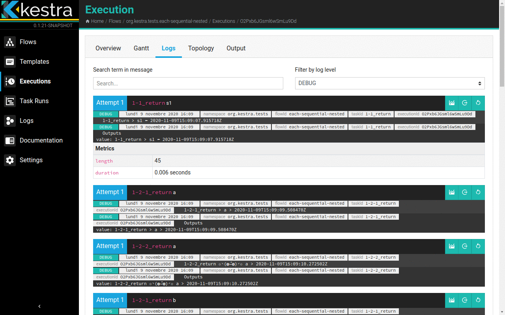

# Kestra documentation

  

> Kestra is an orchestration & scheduler platform that helps you to build, run, schedule, and monitor complex pipelines.

## Documentation
* The official Kestra documentation can be found under: [kestra.io](https://kestra.io)
* This plugin documentation can be found under: [https://kestra.io/plugins/plugins-crypto/](https://kestra.io/plugins/plugins-crypto/)

## License
Apache 2.0 © [Nigh Tech](https://nigh.tech)
