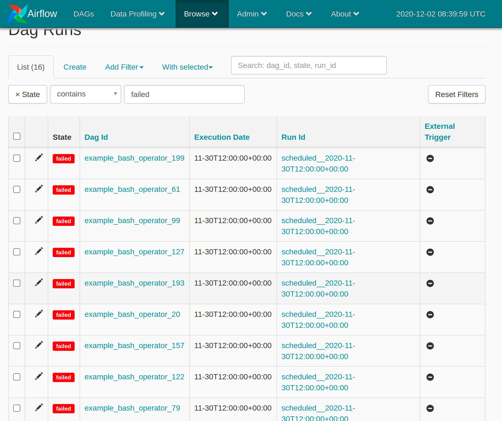

Airflow is defined for now as a clear winner for open source orchestration tools. So like everyone, reading medium on the web, we are thinking this tool is mature and will resolve all the constraint we have to schedule, orchestrate & monitor our dags. 

We tried to use it as our main orchestrator for our data pipelines and this technical blog aims to describe all the issue we met using Airflow. Based on the frustration using this one, we really think that a better tool is needed are can be done, it leads us to create & open source Kestra !

Without any order, here is the major points that we have discovered, and we want to share them with you :

---


[[toc]]


## Workflow as code, not so good idea ! 
Airflow dag are defined as python code ! First look seems to be a good idea but in the fact it can be a very dangerous pattern. Lets me explain with a real use case. 

```python
from airflow import DAG
from airflow.operators.bash_operator import BashOperator
from datetime import timedelta
from airflow.utils.dates import days_ago
import time

def get_command(arg):
    time.sleep(3)
    return f"echo '{arg}'"

default_args = {
    'owner': 'airflow',
    'depends_on_past': False,
    'start_date': days_ago(2)
}

with DAG(
        'sleep',
        default_args=default_args,
        schedule_interval=timedelta(days=1),
) as dag:
    task_1 = BashOperator(
        task_id='first_task',
        bash_command=get_command("1"),
    )

    task_2 = BashOperator(
        task_id='second_task',
        bash_command=get_command("2"),
    )

task_1 >> task_2
```

You have a really simple & working dag. 
Now, let's replace the function `get_bash_print` with a heavy computing task (like fetching database, ...) :

```python
def get_bash_print(arg):
    time.sleep(5)
    return f"Hello from a {arg}"
```

Still working, but in this case, the whole airflow instance is in danger. Airflow evaluate dag a **lot of time in all services** (webserver, worker, scheduler, ...). The Airflow scheduler goal is to find new dags & tasks, any dags with heavy compute can blocked the whole scheduler and prevents any dags & tasks to be submitted.

To understand, run `airflow list_dags -r`, this command will expose the parsing time for all the dag, that will be done **every x seconds** on webserver, scheduler and before **any task** on workers:

```
-------------------------------------------------------------------
DagBag loading stats for /usr/local/airflow/dags
-------------------------------------------------------------------
Number of DAGs: 2
Total task number: 4
DagBag parsing time: 10.130541999999993
-------------------------------------------------------------------------------------------------------+--------------------+---------+----------+------------------------------------------------------------------------------
file                                                                                                   | duration           | dag_num | task_num | dags                                                                         
-------------------------------------------------------------------------------------------------------+--------------------+---------+----------+------------------------------------------------------------------------------
/sleep.py                                                                                              | 10.018332000000001 |       1 |        2 | ['sleep']                                                                    
/bash.py                                                                                               | 0.002396           |       1 |        2 | ['bash']
-------------------------------------------------------------------------------------------------------+--------------------+---------+----------+------------------------------------------------------------------------------
```
As you can see, each evaluation of our 2 dags will take 10s. 

Let see the impact on our cluster : 

Let's do a simple experience by creating the same dag and remove the `time.sleep` and trigger it from the ui dag. Then look at this taskrun : 

As you can see, there is a huge gap between tasks! And it's only because the `sleep` dag exists on the current cluster, even if the `bash` dag is fast, it will be slow down by others dags. 

You got it ? Yeah, you have successfully slow down your Airflow **whole cluster**. Worst, imagine that this task will fetch any external service, you could **overload & crash** this service, since Airflow scan **everytime all dags** even if the dag is not running. 

Imagine an Airflow as self-service for a large company, a simple dag could break **the whole platform**.
You can mitigate this using a strong dag review process (to be sure that no heavy compute are done outside an Operator).Still, it's possible, it will not scale well on a shared large cluster used by a lots of independent teams.


::: tip Conclusion
This is why Kestra have chosen a declarative language for its workflow engine, since all flows are isolated and serialized preventing any code injection.
You can scale to thousands of flows, not matter how there are configured, there will be no impact on your cluster since flows are only evaluated at runtime.
:::

## Realtime baby ! 
Airflow is not built with realtime in mind, the ui is a static, server side generated app. When using airflow, UI you have to hit **F5 often to refresh** screen data. If you want to know if the dag is running, hit F5 is the only solution. Even worst for logs, some logs backed by external storage will not be available before the end the task ! 

## Events based & API First
Airflow was born with a simple concept, schedule a dag from a cron expression. Everything else looks like a patch instead of being Airflow core design.


### API not so first 
There is an [expirimental API](https://airflow.apache.org/docs/stable/rest-api-ref.html) but clearly insufficient for a real world.
For example, the [Trigger dag API](https://airflow.apache.org/docs/stable/rest-api-ref.html#post--api-experimental-dags--DAG_ID--dag_runs) can be used passing some args, but theses args are not declared explicitly (the concept of [Inputs](../docs/developer-guide/inputs) in Kestra) ! The api lacks some parameters controls and let dagrun with missing parameters to be trigger and that will just fail. In Kestra, [inputs](../docs/developer-guide/inputs) are validated, and the execution will not be created if missing one.  


In other hand, Kestra was built with a strong API, everything can be done with API, create a flow, execute it, ... That let you integrate Kestra the way you want to use it in your company. 

### What Events ?
Airflow have a mandatory dag options `start_date` & `schedule_interval`! Meaning that all is thinking like a crontab with a start date. 
But wait, in real life, we don't want to schedule a flow, we want to start when an external event occurs (like a new file on a storage for example). 

Airflow is not the right tool for this use case! Kestra handle it with **optional** [trigger](../docs/concepts/flows.md#triggers) that allow you handle events (time or anything else) that will start an execution and tou will be able to follow it. 

## Stable ? ...
Let me give some insight. So we start by testing a simple use case that will represent our real usage from our data pipeline: Doing lots of different dags that would simply call external API, you understand me ELT here.

In order to prove the stability of Airflow, we simply simulate some kind of real workflow, 200 dags with each 15/20 tasks with external api, simulate here with a `sleep 1`. We run the test at the same time, what we expect to have on daily basis at least. 
We use [example_bash_operator](https://airflow.apache.org/docs/stable/_modules/airflow/example_dags/example_bash_operator.html) and just change the range from 5 to 15 and activate all the task at the same time. 

We will not comment on the execution times which took longer than expected, the worst are : 

Yes this is **failed task** ! How can a scheduler can failed tasks with `sleep 1` !

How can I monitor my daily flows if I can get failed tasks **only due to the scheduler**! 


## Scalability, hum hum ...

From airflow documentation :
> Scalable: Airflow has a modular architecture and uses a message queue to orchestrate an arbitrary number of workers. Airflow is ready to scale to infinity.

### Save my CPU
At first, we have believed the marketing baseline, but the road was not so happy. 
When we start the [bench](#stable--) below, this one used the whole 16 cores of the servers I was using just for doing sleep tasks. 

In fact, Airflow is a python software that handle scalability with [Celery executor](https://airflow.apache.org/docs/stable/executor/celery.html). Celery will fork many airflow process, not sharing anything. 
When I start a dag, the scheduler will scan every x seconds all the dags, worker for every task will scan all the dags on the cluster, this will use a lots of CPU for large cluster instance, and this will be worst & worst as long as you add new dags / tasks. 
It's [by design](https://stackoverflow.com/a/49905571/1590168), Airflow must be used for long running tasks, not for lots of small / short tasks.


### Where is the SPOF ? 
Airflow will not scale to infinity since a lot's of components in their architecture are not scalable by design: 
- Database (MySQL or Postgres): are not horizontal scalable, only vertical (raise CPU & mem) since mono server.
- Queue (Redis): Aiflow use a queue that is not scalable and mono servers also
- Airflow Scheduler: handle all the task in the cluster can only have **one** instance on the cluster, if not there will be multiple task run for the same execution.


## Dynamic workflows !
Still from Airflow documentation :
> Dynamic: Airflow pipelines are configuration as code (Python), allowing for dynamic pipeline generation. This allows for writing code that instantiates pipelines dynamically.
> 
> Extensible: Easily define your own operators, executors and extend the library so that it fits the level of abstraction that suits your environment.
> 
> Elegant: Airflow pipelines are lean and explicit. Parameterizing your scripts is built into the core of Airflow using the powerful Jinja templating engine


Task in dags are set up using [dependencies](https://airflow.apache.org/docs/stable/tutorial.html#setting-up-dependencies). 
You can use 
- Magic operator `>>`, `<<` or their more verbose api `t1.set_downstream([t2, t3])` and `t1.set_downstream(t2)`. These operators allow you to define complex workflow, handling sequential and parallel tasks, fine !
- [Branch operator](https://airflow.apache.org/docs/stable/_api/airflow/operators/branch_operator/index.html#module-airflow.operators.branch_operator) in order to choose tasks depending on previous tasks.
- Error handling using `on_failure_callback` for example.
- [Sensors](https://airflow.apache.org/docs/stable/_api/airflow/operators/sensors/index.html) in order to wait for something. 

Since all these allow you to define complex workflow, Airflow lack of some major features in my opinion !

### First one are dynamic tasks.
I mean create as many tasks depending on previous tasks like [Each](/plugins/core/tasks/flows/org.kestra.core.tasks.flows.EachSequential). 
In Airflow, this is impossible, some people try to [trigger others](https://github.com/mastak/airflow_multi_dagrun) dags to emulate this (like or [Flow](/plugins/core/tasks/flows/org.kestra.core.tasks.flows.Flow)), but this will complexify the monitoring of your flow. 
We will need to follow 2 dags in order to understand what is the issue, the main flow is success and the child are not, really complicated ! 

### Second are sensors. 
In airflow, you can in the middle of a dag wait for a resource, so If you need a file on a server, the dags will start, the sensors task will wait for the file (keeping the flow running), and restart.

In Kestra, we have reversed the way it works, [Scheduler](../docs/architecture#scheduler) will wait for the file and will launch a new execution when the condition are match. By this way, we don't have long running dags that are just doing nothing. 
Also in Airflow, Sensors are blocking a worker thread waiting. In Kestra, Scheduler have a dedicated thread pool (and scalable also) for handling all time waiting, no scalabilty issue here ! 

### Task outputs vs XCom 
In Airflow, there is no real notion of output for task (mean value that can be used for next task). Xcom are the way for Airflow to respond to thIs problems.
But in the fact, there is major drawback with XCom : 
- **TODO Control this** XCom are not isolated for current execution, they can be overwritten by the concurrent execution of the same dag.
- XCom are stored in the database (MySQL or Postgres) so you can't store big data between tasks. 
- No file here, you can't exchange file between tasks (except with hack, see below) !


### Where are my files ? 
Airflow have no notion of files at the heart ! Meaning that if you want to download a file on a task and upload it anywhere on the second tasks, we need to send a viable path to the second one. 

In the practice, this can be done with a path on a local filesystem, this work, but what about isolation between flow & scalability (cluster of airflow worker), this does't work. There is still hack to make it work (like Google Composer that use a Cloud Storage Fuse filesystem backup with Google Cloud Storage for example), but in Kestra, we have put the file at the heart with an [Internal Storage](../docs/architecture#storage) that will allow any task to output files like any others outputs (string, int, ...)


## Entreprise not so ready ! 

### Please keep my revision !
In Airflow, there is no notion of dag version, when you changed your dag, the old execution are changed and if you remove a task, the complete task will disappear for **all previous** executions.
No way to understand what is going with previous dags when you update it.

Kestra have this in mind and keep all the revision for all flows, and let you watch previous at the state they are, and you watch the diff between revisions, ...


### Where is the RBAC ?
Airflow by default have no login, you can enable a lots of [auths]() to secure your webserver. but still no RBAC, I mean this team can handle this list of dag!
This is a [RBAC](http://airflow.apache.org/docs/stable/security.html?highlight=ldap#rbac-ui-security) options, that will allow to specify for each users what [dag role](http://airflow.apache.org/docs/stable/security.html?highlight=ldap#dag-level-role) they have. 

You understand, Users > Dags, where is the group here ? Who want to handle the security user by user ? In a large company, this is **just** impossible! 


