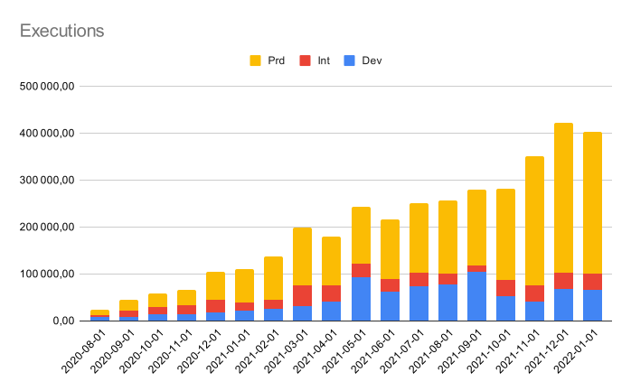
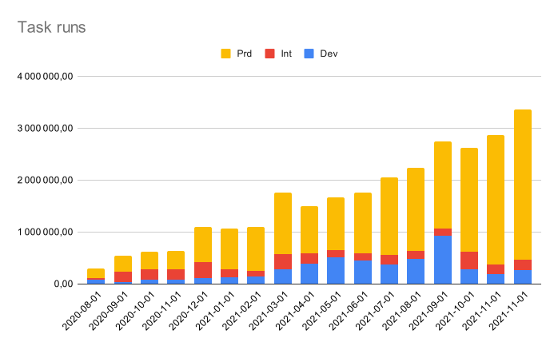
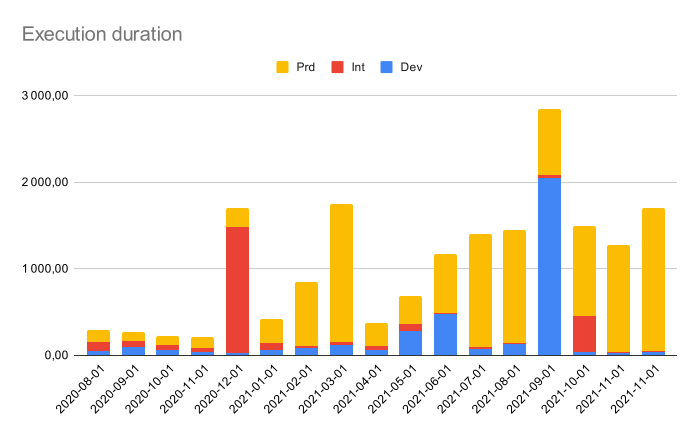

[Adeo](https://www.adeo.com) is the leading French company in the international DIY and home improvement market; it’s also one of the world’s top three companies in the industry, and is going from strength to strength.
[Leroy Merlin](https://www.leroymerlin.fr/) is the leading brand of the Adeo Group and helps residents around the world with all their home improvement projects — from renovations and extensions to decoration and repairs. With more than 450 stores across the globe and 140 in France, Leroy Merlin France has strong data values and a need to deliver on their KPI to their 80,000+ employees to drive their expansion.

In this article, we will explore the past, present, and future of their data platform with DataSource, KPIs, dashboard, and more.


## Before the Cloud: The On-premise Choice
Leroy Merlin, has historically used the following stacks in order to manage their data pipelines:
* Teradata for the data warehouse
* VectorWise as database for API
* Stambia as ELT
* Dollar U and Automic Workload Automation as an orchestrator and scheduler.
* Custom development for the transfer of data

These methods were at one time commonplace, but today seem outdated. They have seen this gap during the last year that seems to be larger with the cloud adoption:
- Vectorwise and Teradata are not serverless and need to be scaled manually
- Stambia doesn't have a lot of native connectors for the cloud. It therefore wasn’t able to schedule tasks and required additional tools to enable us to get the job done.
- Dollar U and AWA is led by Adeo (the group). You need to go to the internal ticket service in order to have an orchestration job and then wait for other people to handle it — this can take up to a few days if not more. Moreover, the monitoring of the pipeline is conducted by a variety of tools that don't talk to each other, which further complicates matters.

Some issues are due to organization separation between the business unit and the group (Adeo); but most of them are due to cloud and the fact that the tools just aren’t ready for it.


## Going to the Cloud
In 2019, Leroy Merlin and Adeo decided to move from an on-premise server to a cloud-based system. They needed a solution in order to handle all the previous use cases and find a new way to work, all with an ambitious objective: being a full cloud operation by 2022!

They decided to create a new team with that goal in mind and took an empty page and built a full solution for the migration process. They needed to define each component of the future data platform (from storage, pipeline, source code, etc.), build the platform, and demonstrate how to use it for all data engineers (approximately fifty people).

Adeo and Leroy Merlin have a strong partnership, so the storage choice was to be Google BigQuery. In the near future, Leroy Merlin will go to the DataOps lifecycle — going live doesn’t have to be a painful, manual process. Second decision: everything needed to be hosted on GitHub and have a strong CI/CD in order to go to production. Terraform was the obvious choice here due to the large ecosystem and native integration with BigQuery and other GCP resources.

Next, they needed to decide on how to transfer the data, load it in BigQuery, and transform and aggregate the data. For the transport layer and load, no obvious choice had presented itself. So, they decided to build a custom solution (based on the GCP (Google Cloud Platform) service), and for the orchestration: a lot of people were using Airflow, so why not use such a popular system? What’s more, GCP even has a fully managed orchestration service: Cloud composer.

## On the Cloud After Few Months
Leroy Merlin decided to start every new project on the cloud directly before starting the migration on existing projects. The first projects are coming, the build is done, and more projects are in production — now they can start the process of concluding past projects.

### Transfer of Data
Whilst not entirely successful, the process revealed some points that helped them find their direction; the following findings were particularly helpful:
- The transfer layer must be over https: every system can send a https request in order to send the data — even the legacy one with old systems.
- The data must be validated: we can't accept irrelevant data on the data warehouse. The format is an Avro schema which will validate before loading in order to parse primitive data — you also have the option to carry out an additional check.

**One major flaw:** The custom tools were made in Python and needed to be installed on the system that will send the data. Since Python has a complicated lifecycle, there are systems that just can't install Python 3, leaving only one option: develop multiple versions of the tools to target all systems — which would be unmaintainable.


### Orchestration
The choice of Airflow seems to be a good one as it gives us the ability to handle a lot of complex workflows with a simple Python code. So, the custom transfer tools will trigger Airflow DAG after the load on BigQuery. Airflow will handle all the other cases: transform/aggregate/reverse ETL, and so on.

But **it failed at Leroy Merlin**. First, the implementation by Google: Google Cloud Composer had various limitations and was quickly rejected. So Leroy Merlin decide to install their own Airflow on Kubernetes Clusters. This appears to have been a better option; more control, more stability. However, we still have a lot of issues:

- After a simple benchmark of a thousand tasks with only sleep 1, we’ve seen failed tasks. Sleep 1 tasks should never have failed and forced us to question the product. How were we to monitor our DAGs if we had failed tasks simply due to the orchestrator?
- The workflow as a Python code was clearly not a good choice — one DAG produced by a team member introduced some code out code evaluated by Airflow worker. This led to codes being executed every five seconds by every Airflow component and slowed down the cluster (we see with this example that we can't let users build DAGs by themselves without a strong code review as 1 DAG can crash the whole cluster).
- The CPU usage of an airflow cluster was really high, even when the tasks were only called API (BigQuery API in our case) — If the waiting tasks are causing high CPU usage, how will it cope with more CPU-intensive tasks?
- The airflow API at this time was experimental, and we needed to trigger the flow externally. This API had no control on the passed parameter.
- Sensors are a mechanism on Airflow that simply wait for something to happen (a file, DAG, etc.). Every sensor will eat one worker slot, and we planned to have several so we needed to add even more workers to handle the load.
Airflow didn't allow us to pass large data between tasks (XCOM are here, but only for small amount of data). This is a poor design, that resulted in the need to have to multiply the destinations for one source (ex: `BigQueryToGCSOperator`, `BigQueryToMySqlOperator`, `BigQueryToBigQueryOperator`, ...). - It will not scale to develop many operators.
- RBAC on Airflow is very limited and only available to users that own a DAG and presented challenges for group working. In a team, we need to have multiple people on the same resources.
- ...

Even when we persevered with it, the performance level was not there; Airflow failed on the first project; the **duration of the flow is twenty times longer** than the same flow with Stambia and the analysis is showing that this duration will increase over time and will not scale to the number of DAGs and executions wanted.


::: warning Decision
By this time, Terraform and BigQuery had demonstrated their strengths and, Airflow, custom transfer and load tools were rejected. Leroy Merlin needed to find another option, and no solution had presented itself
:::

## Kestra to the Rescue
In a meantime, Ludovic has started working on Kestra and decided to show his work to Leroy Merlin, who showed a lot of interest and decided to test the solution for a few months. Since some features were missing at this point, they also decided to contribute on the open source project and some plugins.

### Simplifying the Adoption Process with Custom Plugins

They also moved with great speed to develop a Kestra plugin to help simplify the ingestion process called `DataPlatformIngest`. Removing the burden of loading data, the plugins:
- cold archive the incoming data to Google Cloud Storage Bucket
- validate the data technically with an Avro schema; they don't want bad incoming data and want to be sure that the dat is at least typed (integer, date, etc.)
- versioning the data (if the schema is breaking change)
- append technical column (loaded data, execution ID) in order to have a full lineage on the data warehouse
- load the data in a temporary table
- apply some quality with rejection on records based on business rules (upper/lower bound, validate key with referential, deduplication, etc.)
- load the data in ODS (Operational Data Store) — that is the image of the data from incoming system

The transfer of the data is in https directly to Kestra API in order to free any dependencies. The operational system used most frequently is a simple `curl` [command](https://kestra.io/docs/developer-guide/inputs/#send-inputs-programmatically) in order to trigger ingestion or develop a simple http client reaching Kestra API.

This single task handles all the complexities of loading data — it will create ten to twenty tasks:
```yaml
id: lock
namespace: fr.leroymerlin.services.product.orchestrator

inputs:
  - type: FILE
    name: shedlock
tasks:
  - id: 01_ingest_ods_shedlock
    type: com.leroymerlin.dataplatform.dcp.tasks.DataPlatformIngest
    avroOptions:
      dateFormat: yyyy-MM-dd
      datetimeFormat: yyyy-MM-dd' 'HH:mm:ss
      nullValues:
        - \N
        - "1900-01-00 00:00:00"
      schema: |-
        {
            "type": "record",
            "name": "shedlock",
            "namespace": "org.kestra",
            "fields": [
                { "name": "name", "type": "string" },
                { "name": "lock_until", "type": [ "null", { "type": "long", "logicalType": "timestamp-millis"} ] },
                { "name": "locked_at", "type": [ "null", { "type": "long", "logicalType": "timestamp-millis"} ] },
                { "name": "locked_by", "type": [ "null", "string" ] }
            ]
        }
    csvOptions:
      fieldSeparator: "|"
    dataset: instala
    fileType: CSV
    from: "{{ inputs.shedlock }}"
    table: shedlock
    version: 1
```

### Adoption by the Team
At Leroy Merlin, there are over eighty data engineers and data scientists. They will need to learn how to use Kestra; but since it was based on a simple declarative language (based on YAML), this process was quick and people were able to use it within a few hours.

Also, as there is a rich UI, the deployment process was really easy at the beginning — just save on the UI, and you’re good to go!

Subsequently, Leroy Merlin started using Terraform in order to deploy every cloud resource; they also deploy Kestra resources using [terraform providers](/docs/terraform/). They reach a full DataOps lifecycle, all deployment is atomic with a git push and a strong CI/CD applying resources from terraform.

::: success Reach a fast time to market
Before this DataOps lifecycle The deployment involved a number of teams: transfer team that moved the files between systems, the orchestration team which triggers the job after the transfer, the data team that will develop the load of the data in addition to a manual operation in order to create a resource on the data warehouse. All these operations needed to synchronize with the internal ticket that is now in service.

Thanks to Kestra, they moved **a full autonomy** and **reduced the time to market** from **days to only a few hours**
:::

### Go Production
After few months, **Kestra was confirmed** and was deployed to a production environment in May 2020. They also decided to move to the Enterprise Edition of Kestra in August 2020 as they need to have fine-grained security, role-based access control and single sign-on.

The usage grew exponentially over the coming months, and the kind of usage is becoming increasingly varied: (start flow based on [file detection from buckets](/plugins/plugin-gcp/triggers/gcs/io.kestra.plugin.gcp.gcs.Trigger), sync data warehouse directly from operation [postgres database](/plugins/plugin-jdbc-postgres/tasks/l/io.kestra.plugin.jdbc.postgresql.CopyOut), develop simple python program to [fetch API from a partner](/plugins/core/tasks/scripts/io.kestra.core.tasks.scripts.Python), start long-running data science process [over Kubernetes](/plugins/plugin-kubernetes/tasks/io.kestra.plugin.kubernetes.PodCreate), [fetch data from Google Drive](/plugins/plugin-googleworkspace/tasks/sheets/io.kestra.plugin.googleworkspace.sheets.Read) and write result back to [Google Sheets](/plugins/plugin-googleworkspace/tasks/drive/io.kestra.plugin.googleworkspace.drive.Create.html), and so on.).

Here are some numbers that show the current usage for January 2022 ( for production environment only):
- **4 clusters** one for every environment
- **200+ users / developers**
- **2000+ flows** in production
- **400,000+ executions** every month
- **3,000,000+ tasks** every month
- **Equivalent of 2,300 days of task processing time** every month (yeah, that’s the equivalent of seventy-five days of task processing every single day)





<div class="clearfix" />

### Some Testimonials
Leroy Merlin has supported the development of Kestra. As with any software, its young age could be a source of frustration for users. They needed to handle some missing features, report some bugs, suffer some time from instability. But what was astounding was the realization that the **pain is less than the gain**, and we have a lot of good reports on software internal notation tools, it's a solution that users really love and uphold. Here are some testimonials:

> Tool responds perfectly to the need. Very easy to use; it manages all the complexity behind to offer a saving of time and enormous cost.

>  Kestra is a tool that is very easy to use with constant improvement in functionality. It covers almost all data pipeline setup needs.

> Kestra is very easy to learn, with a large number of functionalities covering a large number of use cases (scheduled workflows, API calls, triggers, flow synchronization, data and file transfers, etc.). The Web interface facilitates the monitoring of flows and the consultation of logs. New features are added very regularly, often in response to needs. Kestra is evolving rapidly.

> After suffering with Airflow to schedule different treatments, Kestra's arrival was more than saving. The ecosystem of plugins is evolving rapidly and greatly facilitates integration with different bricks, especially on GCP (BQ, GCS, Cloud SQL, etc.) A tool that deserves to be known more.

## Conclusion

Leroy Merlin was a great help to Kestra by supporting it in its infancy; but we really think it was a win-win partnership. Kestra is a tool that allowed Leroy Merlin to successfully conduct its cloud migration and embrace the DataOps development design.

From the Leroy Merlin manager, the true revolution is:

> Kestra is the first tool that allowed us to develop without installation, use your browser and start to build a true business use case within few hours. Since the learning curve is easy, you can easily onboard new teammates due to its descriptive language. And, moreover, it handles all parts of the data pipeline: the transport, load, transform, data modeling, data quality and monitoring of all our data pipeline. Since the tool offers strong role-based access and security on the Enterprise Edition, we are safe to share IR in Software as a Service to all applications allowing us to also embrace the Data Mesh pattern.
