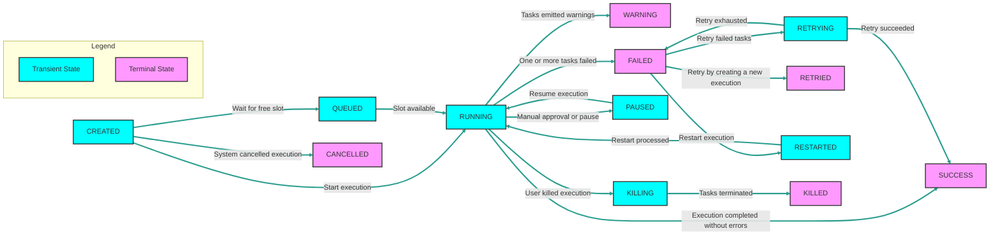
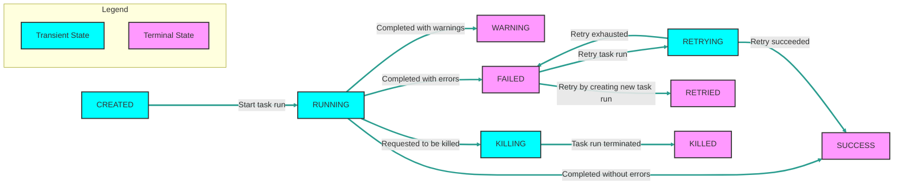

States control the status of your workflow execution.

    <iframe src="https://www.youtube.com/embed/h5AigXBAs6Y?si=ftaD1zM24b7BDUMo" title="YouTube video player" frameborder="0" allow="accelerometer; autoplay; clipboard-write; encrypted-media; gyroscope; picture-in-picture; web-share" referrerpolicy="strict-origin-when-cross-origin" allowfullscreen></iframe>

## Overview

Execution is a single run of a flow in a specific state. Each state represents a particular point in the workflow in which Kestra's orchestration system determines what happens next based on the control flow logic defined in the flow.

You can read more about executions [here](./03.execution.md).

## Execution States

Each Kestra execution can transition through several states during its lifecycle. The following diagram illustrates the possible states an execution can be in:

Here is a brief description of each state:
1. **CREATED**: The execution has been created but not yet started. This transient state indicates that the execution is waiting to be processed, and it should usually quickly transition to the `RUNNING`, `CANCELLED` or `QUEUED` state. If you see executions stuck in this state, it may indicate a problem with the system.
2. **QUEUED**: The execution is waiting for a free slot to start running. This transient state is only used when the flow has [concurrency](./14.concurrency.md) limits and all available slots are taken.
3. **RUNNING**: The execution is currently in progress. This transient state continues until all task runs are completed.
4. **SUCCESS**: The execution has completed successfully. This terminal state indicates that the execution has completed successfully and all tasks have finished without errors (or were allowed to fail).
5. **WARNING**: This terminal state is used when the execution has completed successfully, but one or more tasks have emitted warnings.
6. **FAILED**: This state indicates that one or more tasks have failed and will not be retried. If there is an `errors` branch defined in the flow, the error `tasks` will be executed before permanently ending the execution, e.g. to send an alert about failure. Without any additional orchestration action, this state is usually considered as a terminal state. However, when the flow has a [flow-level retry policy](./12.retries.md#flow-level-retries) set to the `RETRY_FAILED_TASK` behavior, the execution will transition to the `RETRYING` state.
7. **RETRYING**: This transient state indicates that the execution is currently [retrying](./12.retries.md) one or more failed task runs. After all retry attempts are exhausted, the execution will transition to the terminal `SUCCESS`, `WARNING` or `FAILED` state.
8. **RETRIED**: This terminal state indicates that the execution has been retried according to the [flow-level retry policy](./12.retries.md#flow-level-retries) set to the `CREATE_NEW_EXECUTION` behavior. This means that the original execution (which failed and has been retried) is marked as `RETRIED`, and a new execution is created to run the flow again.
9. **PAUSED**: This transient state indicates that the execution is awaiting manual approval or has been paused for a fixed duration before continuing the execution. Note that there is no `RESUMING` or `RESUMED` states as the execution will transition directly from the `PAUSED` to a `RUNNING` state as soon as the paused execution is resumed.
10. **RESTARTED**: This transient state is equivalent to the `CREATED` state, but for a failed execution that has been restarted e.g. from the UI. Such execution will transition to the `RUNNING` state as soon as the restarted execution is processed.
11. **CANCELLED**: This terminal state indicates that the execution has been automatically cancelled by the system, usually because the `concurrency` limit was reached and the [concurrency](./14.concurrency.md) `behavior` was set to `CANCEL` in order to cancel all executions that exceed the concurrency limit.
12. **KILLING**: This transient state indicates that the user has issued a command to kill the execution, e.g. via a task or by clicking on the `Kill` button in the UI. The system is in the process of terminating (aka _killing_) the task runs associated with the execution which are still in progress. As soon as all task runs are terminated, the execution will transition to the `KILLED` state.
13. **KILLED**: This terminal state indicates that the execution has been killed upon request by the user. No more tasks will be able to run, and the execution is considered terminated.

::collapse{title="Mermaid source code for the Execution States diagram"}

::

## What is the difference between the `CANCELLED` and `KILLED` states?

1. The `CANCELLED` state is used when the **system** automatically cancels an execution due to the `concurrency` limit being reached.
2. The `KILLING` state is used when the **user** manually kills an execution and the system is in the process of terminating the task runs associated with the execution.
3. The `KILLED` state is used when the execution has been killed upon request by the **user**.

## How are task run states different from execution states?

Task run states represent the status of a single task run within an execution.

Each task runs can be set to one of the following states:
1. **CREATED**: The task run has been created but not yet started.
2. **RUNNING**: The task run is currently in progress.
3. **SUCCESS**: The task run has completed successfully.
4. **WARNING**: The task run has completed successfully but with warnings.
5. **FAILED**: The task run has failed.
6. **RETRYING**: The task run is currently being retried.
7. **RETRIED**: The task run has been retried.
8. **KILLING**: The task run is in the process of being killed.
9. **KILLED**: The task run has been killed upon request by the user.

Note how there is no `QUEUED`, `CANCELLED`, `PAUSED` or `RESTARTED` states for task runs.

::collapse{title="Mermaid source code for the Task Run States diagram"}

::