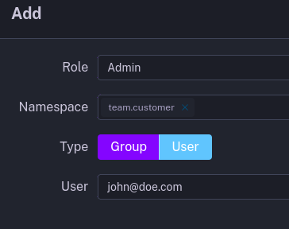
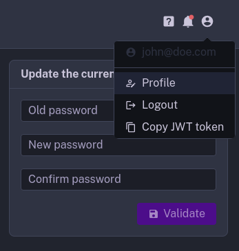

This page describes how to manage access and permissions to your instance.

## Overview

Kestra Enterprise supports Role-Based Access Control (RBAC), allowing you to manage access to workflows and resources by
assigning Roles to Users, Groups and Service Accounts.

The image below shows the relationship between Users, Groups, Service Accounts, Roles, and Bindings (visible on the
Access page in the UI).


## Roles and Bindings

A Role is a collection of permissions that can be assigned to Users, Service Accounts or Groups.\
Theses permissions are defined by a combination of a **Permission** (e.g. `FLOWS`) and an **Action** (
e.g. `CREATE`).

::collapse{title="More informations"}

The **Role** itself does not grant any permissions to anyone.\
Through the **Access* UI page, you will be able to attach a Role to a User,
Service Account or Group, and that will create a **Binding**.
This Binding will grant the permissions defined by that Role to the User, Service Account, or Group.

A Binding can be optionally limited to a specific namespaces.
When a Binding is tied to a namespace, it also automatically grants permissions to all child namespaces.\
For example,
a Role attached to the `prod` namespace will automatically grant access to `prod.engineering` namespace as well.

In short, Roles encapsulate permission boundaries that can be attached to users, service accounts or groups across
tenants and namespaces.

::

### Permissions

A Permission is a resource that can be accessed by a user or group. The following permissions are currently
supported:\
`FLOWS`, `BLUEPRINTS`, `TEMPLATES`, `NAMESPACES`, `EXECUTIONS`, `USERS`, `GROUPS`, `ROLES`, `BINDINGS`, `AUDITLOGS`, `SECRETS`, `IMPERSONATE`, `SETTINGS`, `WORKERS`.

### Actions

An Action is a specific operation that can be performed on a Permission. The currently supported Actions
are:\
`CREATE`, `READ`, `UPDATE`, `DELETE`.

### Currently supported Roles

Kestra currently creates only an **Admin** role by default. That role grants full access to **all resources**.

Apart from that, you can create additional Roles with custom permissions.

## Super Admin and Admin

Kestra provide two way for managing your instance: super admin and admin.\
Super Admin is a user type with elevated privileges for global control and
Admin is a customizable role that grants full access to all resources (scoped to a tenant if multi-tenancy is enabled).

::collapse{title="Summary"}
Here's a table summarizing the key differences between an Admin and a Super Admin:

| Feature                             | Admin (scoped to a tenant if enabled)              | Super Admin                                          |
|-------------------------------------|----------------------------------------------------|------------------------------------------------------|
| Access Level                        | By default as all permissions, depends on the Role | Manages tenants and IAM across all tenants           |
| Tenant Management                   | No                                                 | Create/Update/Read/Delete tenants across all tenants |
| User/Role/Group/Bindings Management | Has the permission by default                      | Create/Update/Read/Delete across all tenants         |
| Flow/Execution Management           | Has the permission by default                      | No                                                   |
| Set Super Admin privilege           | No                                                 | Yes                                                  |

::

### Super Admin

Super Admin is a type of user that works outside the box. Without any Role or Binding, it has access to manage tenants,
users, roles, groups and access within a Kestra Enterprise instance.\
The purpose of the Super Admin is to allow an easy management of your instance.

::collapse{title="More informations"}

#### Use Cases

Super Admin is a powerful type of user. Use that role sparingly and only for use cases that require it, such as creating
a new tenant, troubleshooting tenant issues, or helping a user with a problem.\
However, you should use Kestra through the role system.
::

::collapse{title="Creating a Super Admin"}

#### Through the UI

First time you launch Kestra, if no action has been done through the CLI,
you will be invited to setup Kestra through the [Setup Page](./02.setup-page.md).\
This interface will offer you to create the first User, it will automatically be assigned the `Super Admin` privilege.

#### Through the CLI

To create a User with a Super Admin privilege from the [CLI](./cli.md), use the `--superadmin` option:

```bash
kestra auths users create admin@kestra.io TopSecret42 --superadmin

# schema:
kestra auths users create <username> <password> \
--tenant=<tenant-id> --superadmin
```
::

::collapse{title="Give/Revoke Super Admin privilege"}

::alert{type="info"}
Note that you need to be a super admin yourself.
::

#### Through the UI
You can give or revoke the Super Admin privilege
using the switch in the User Edit page.


#### Through the CLI

To set an existing User with a Super Admin privilege from the [CLI](./cli.md), use the dedicated command:

```bash
# Set a user as Super Admin
kestra auths users set-type admin@kestra.io SUPER_ADMIN

# Revoke Super Admin privilege
kestra auths users set-type admin@kestra.io STANDARD
````

::

### Admin

In Kestra, the notion of Admin user does not exist; instead we create an **Admin** role with all permissions.

This role can be assigned to any User, Service Account or Group.
This allows you to have different types of admin, to grant admin permissions to a whole group, and to revoke
those admin permissions at any time without having to delete any group or user.

When using multi-tenancy, Kestra assigns by default the Admin Role to the user who created the
tenant.

::alert{type="info"}
If you see an error when creating a new User or Service Account, it might be caused by a limit of your license. In that
case, [reach out to us](https://kestra.io/contact-us) to validate and optionally upgrade your license.
::

::collapse{title="Creating a User with an Admin Role from the UI"}

First time you launch Kestra, if no action has been done through the CLI,
you will be invited to setup Kestra through the [Setup Page](./02.setup-page.md).\

This interface will offer you to create the first User, it will automatically create the role Admin
and bind the user to the role.

Later, you can create a new User or pick an existing User and assign the Admin role to it from the Access page.
::

::collapse{title="Creating a User with an Admin Role from the CLI"}

To create a User with an Admin Role from the CLI, use the `--admin`

```bash
kestra auths users create prod.admin@kestra.io TopSecret42 --admin

# schema:
kestra auths users create <username> <password> --admin
```

::

## Users, Groups and Service Accounts

In Kestra you will find three types of entities:

* Users—represents a **person**
* Groups—represents a collection of **Users** and **Service Accounts**
* Service Accounts—represents an **application**

All theses entities can be assigned to a Role,
which define what resources the User, Group or Service Account can access.

Note that these entities don’t belong to namespaces, but their permissions can be limited to specific namespaces via
Bindings (Access page).

::collapse{title="How to bind a role to a User, a Service Accounts or a Group?"}
Once you have created your first role. You can attach that role to an entity through the Access page.\
You can also limit that Role to one or more namespaces.

The following example show the creation of a Binding for a User.\
We are defining the User `john@doe.com` as an Admin for the `team.customer` namespace.


_Note that Service Accounts are considered as Users when bindings_

::

::collapse{title="How many Roles can a User, a Service Account or Group have?"}
There is no limit to the number of Role that can be bind to an entity.\
They can have zero, one or more Roles attached, giving specific
permissions, optionally tied to one or more namespaces.
::

### Users

A User represents a **person** who can access Kestra, identified by an email address. Each user might have personal
information attached to it, such as the first name or last name.

They can change their own password, and adjust other settings such as theme, editor preferences,
timezone, and a default namespace.

::collapse{title="Change password"}
If for some reason users want to change their password, they can do it on their profile.\
This page can be accessed through the top right corner of the UI.



::

::collapse{title="Reset password (by a Super Admin)"}

Kestra does not provide any forgot password feature yet.\
So currently only a super admin can update a user password through its User Edit page.

::

### Groups

Each `Group` is a collection of zero, one or more `Users` or `Service Accounts`.

- Each `User` can be assigned to zero, one or more `Groups`.
- Each `Service Account` can also be assigned to zero, one or more `Groups`.

Groups are a useful mechanism providing the same roles to multiple Users or
Service Accounts at once by binding a role to a Group.

::collapse{title="What happens if you delete a Group?"}
All Users and Service Accounts assigned to that Group will lost permissions that were binds to the groups.\
However Users and Services Accounts will still exist.
::

## RBAC FAQ

::collapse{title="Why Admin is a Role rather than User type?"}

Admin role is a collection of permissions that can be assigned to Users, Service Accounts or Groups. This allows you to
grant multiple users with admin permissions if needed, and you can revoke only specific admin permissions at any time
without having to delete the user.

Admin roles can be assumed by multiple users or groups, and some user may be later granted a lower or a higher
permission boundary. In the same way, some user may initially be an Admin but then their permission may be revoked. The
Admin role enables all these patterns in a flexible way.

You can think of Users as **authentication** mechanism (who you are), and Roles as **authorization** mechanism (what you
are allowed to do). Decoupling authentication from authorization allows you to grant permissions to multiple users or
groups at once by attaching a single Role to a Group.
::

::collapse{title="Why I cannot edit an existing Binding?"}

A Binding is an immutable object. If a Binding no longer reflects the desired permissions, you can delete the existing
Binding and create a new one for the same User, Service Account or Group, but with different Roles and/or namespaces.
This is a safety feature to prevent accidental changes to existing permissions.
::