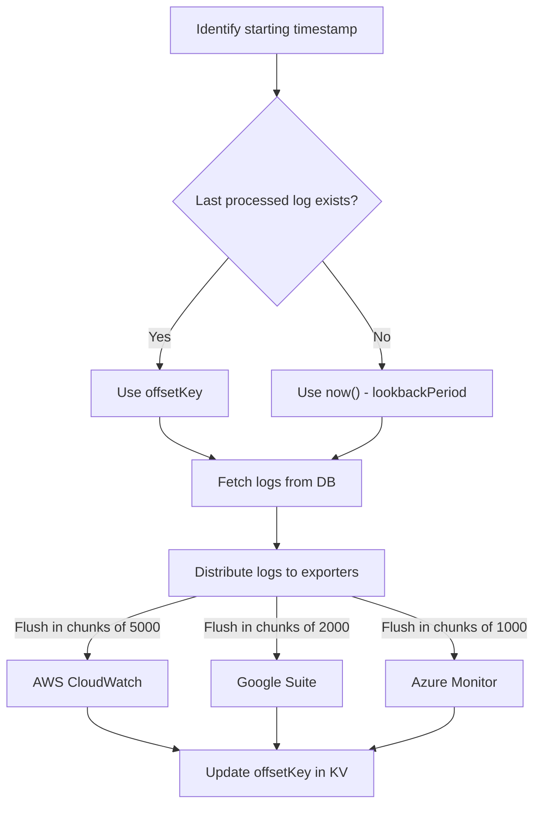

Manage and distribute logs across your entire infrastructure.

<div class="video-container">
    <iframe src="https://www.youtube.com/embed/iV6JtAwtuBg?si=9BrJXbEZLXbRXQIN" title="YouTube video player" frameborder="0" allow="accelerometer; autoplay; clipboard-write; encrypted-media; gyroscope; picture-in-picture; web-share" referrerpolicy="strict-origin-when-cross-origin" allowfullscreen></iframe>
</div>

## Log Shipper functionality

Log Shipper can distribute Kestra logs from across your instance to an external logging platform. Log synchronization queries logs and automatically batches them into optimal chunks. The batch process is done intelligently through defined synchronization points. Once batched, the Log Shipper delivers reliable, consistent log batches to your monitoring platform.

Log Shipper is built on top of [Kestra plugins](/plugins/), ensuring it can integrate with popular logging platforms and expand as more plugins are developed. As of Kestra version 0.21, supported observability platforms include ElasticSearch, Datadog, New Relic, Azure Monitor, Google Operational Suite, AWS Cloudwatch, Splunk, OpenSearch, and OpenTelemetry.

## Log Shipper properties

The Log Shipper plugin has several key properties to define where the logs should be sent and how they are batched. Below is a list of the definable properties and their purpose:

- `logExporters` - This property is required, and it specifies the plaform where the logs will be exported. It support a list of entries, allowing you to export logs to different platforms at once
- `logLevelFilter` - Specifies the minimum log level to send with the default being `INFO`. With `INFO`, all log levels `INFO` and above (`WARNING` and `ERROR`) are batched. If you only want logs that are warnings or errors, then you can set this property to `WARNING` and so on.
- `lookbackPeriod` - Determines the fetch period for logs to be sent. For example, with a default value of `P1D`, all logs generated between now and one day ago are batched.
- `namespace` - Sets the task to only gather logs from a specific Kestra [Namespace](../../04.workflow-components/02.namespace.md). If not specified, all instance logs are fetched.
- `offsetKey` - Specifies the prefix of the [Key Value (KV) store](../../05.concepts/05.kv-store.md) key that contains the last execution's end fetched date. By default this is set as `LogShipper-state`. You can change this key store name to reset the last fetched date if, for example, you want to export previously exported logs.
- `delete` - By default this property is set to `false`. Boolean property that when set to `true` deletes the batched logs as a part of the task run

## How log shipper works

Let's take a look at a simple example of a Log Shipper task that fetches logs and exports them to AWS CloudWatch, Google Operational Suite, and Azure Monitor at the same time.

```yaml
id: logShipper
namespace: system

tasks:
  - id: shipLogs
    type: io.kestra.plugin.ee.core.log.LogShipper
    logLevelFilter: INFO
    lookbackPeriod: P1D
    offsetKey: logShipperOffset
    logExporters:
      - id: awsCloudWatch
        type: io.kestra.plugin.ee.aws.LogExporter
        accessKeyId: "{{ secret('AWS_ACCESS_KEY_ID') }}"
        secretKeyId: "{{ secret('AWS_SECRET_KEY_ID') }}"
        region: us-east-1
        logGroupName: kestra
        logStreamName: production
        chunk: 5000

      - id: googleOperationalSuite
        type: io.kestra.plugin.ee.gcp.LogExporter
        projectId: my-gcp-project
        chunk: 2000

      - id: azureMonitor
        type: io.kestra.plugin.ee.azure.LogExporter
        endpoint: https://endpoint-host.ingest.monitor.azure.com
        tenantId: "{{ secret('AZURE_TENANT_ID') }}"
        clientId: "{{ secret('AZURE_CLIENT_ID') }}"
        clientSecret: "{{ secret('AZURE_CLIENT_SECRET') }}"
        ruleId: dcr-69f0b123041d4d6e9f2bf72aad0b62cf
        streamName: kestraLogs
        chunk: 1000
```

The plugin starts by identifying the starting timestamp and checking if the last processed log exists. If it does, the plugin uses the `offsetKey` to fetch logs from the database. If the last processed log does not exist, the plugin uses the current time minus the `lookbackPeriod` to fetch logs from the database.

The logs are then distributed to the exporters in chunks of 5000, 2000, and 1000 for AWS CloudWatch, Google Suite, and Azure Monitor, respectively. Once the logs are distributed, the offset key in the Key Value store is updated.




## Log Shipper examples

The Log Shipper integrates with many popular observability platforms. Below are a coupe of example flows using a Kestra core plugin as well as external platform plugins.

### Kestra `FileLogExporter`

The following example uses Kestra's core `FileLogExporter` plugin to sychronize the logs of the `company.team` namespace. The `synchronize_logs` task outputs a file, and the log file `uri` is passed as an expression in the `upload` task to then upload the logs to an S3 bucket.

```yaml
id: log_shipper_file
namespace: system

tasks:
  - id: synchronize_logs
    type: io.kestra.plugin.ee.core.log.LogShipper
    logLevelFilter: INFO
    lookbackPeriod: P1D
    offsetKey: LogShipper-local-demo
    delete: false
    namespace: company.team
    logExporters:
      - id: file
        type: io.kestra.plugin.ee.core.log.FileLogExporter

  - id: upload
    type: io.kestra.plugin.aws.s3.Upload
    accessKeyId: "{{ secret('AWS_ACCESS_KEY_ID') }}"
    secretKeyId: "{{ secret('AWS_SECRET_KEY_ID') }}"
    from: "{{ outputs.synchronize_logs.outputs.file.uri }}"
    key: logs/kestra.txt
    bucket: kestra-log-demo-bucket
    region: eu-west-2
```

### Datadog

The below example demonstrates an execution that runs a daily log synchronization and distribution of logs with [Datadog](https://www.datadoghq.com/) using the default property settings.

```yaml
id: log_shipper
namespace: company.team

triggers:
  - id: daily
    type: io.kestra.plugin.core.trigger.Schedule
    cron: "@daily"

tasks:
  - id: log_export
    type: io.kestra.plugin.ee.core.log.LogShipper
    logLevelFilter: INFO
    lookbackPeriod: P1D
    delete: false
    logExporters:
      - id: DatadogLogExporter
        type: io.kestra.plugin.ee.datadog.LogExporter
        basePath: '{{ secret("DATADOG_INSTANCE_URL") }}'
        apiKey: '{{ secret("DATADOG_APIK_KEY") }}'
```

The batched logs directly populate your Datadog instance like in the following screenshot:


### AWS Cloudwatch

This example exports logs to [AWS Cloudwatch](https://aws.amazon.com/cloudwatch/). The following example flow triggers a daily batch and exports to AWS's service [Amazon CloudWatch](https://docs.aws.amazon.com/cloudwatch/):

```yaml
id: log_shipper
namespace: company.team

triggers:
  - id: daily
    type: io.kestra.plugin.core.trigger.Schedule
    cron: "@daily"

tasks:
  - id: log_export
    type: io.kestra.plugin.ee.core.log.LogShipper
    logLevelFilter: INFO
    lookbackPeriod: P1D
    offsetKey: log_shipper_aws_cloudwatch_state
    delete: false
    logExporters:
      - id: aws_cloudwatch
        type: io.kestra.plugin.ee.aws.cloudwatch.LogExporter
        accessKeyId: "{{ secret('AWS_ACCESS_KEY_ID') }}"
        secretKeyId: "{{ secret('AWS_SECRET_KEY_ID') }}"
        region: "{{ vars.region }}"
        logGroupName: kestra
        logStreamName: kestra-log-stream
```

The logs are viewable in the interface of the specified Log Group and can be examined like in the following screenshot:


### AWS S3

This example exports logs to [AWS S3](https://aws.amazon.com/s3/). The following example flow triggers a daily batch and exports to AWS's S3 object storage:

```yaml
id: log_shipper
namespace: system

triggers:
  - id: daily
    type: io.kestra.plugin.core.trigger.Schedule
    cron: "@daily"

tasks:
  - id: log_export
    type: io.kestra.plugin.ee.core.log.LogShipper
    logLevelFilter: INFO
    lookbackPeriod: P1D
    logExporters:
      - id: S3LogExporter
        type: io.kestra.plugin.ee.aws.s3.LogExporter
        accessKeyId: "{{ secret('AWS_ACCESS_KEY_ID') }}"
        secretKeyId: "{{ secret('AWS_SECRET_KEY_ID') }}"
        region: "{{ vars.region }}"
        format: JSON
        bucket: logbucket
        logFilePrefix: kestra-log-file
        maxLinesPerFile: 1000000
```
### Google Operational Suite

This example exports logs to [Google Cloud Observability](https://cloud.google.com/products/observability). The following example flow triggers a daily batch and exports to Google Cloud Platform's observability monitor:

```yaml
id: log_shipper
namespace: company.team

triggers:
  - id: daily
    type: io.kestra.plugin.core.trigger.Schedule
    cron: "@daily"

tasks:
  - id: shipLogs
    type: io.kestra.plugin.ee.core.log.LogShipper
    logLevelFilter: INFO
    lookbackPeriod: P1D
    offsetKey: logShipperOffset
    delete: false
    logExporters:
      - id: googleOperationalSuite
        type: io.kestra.plugin.ee.gcp.operationalsuite.LogExporter
        projectId: my-gcp-project
```

This example exports logs to [Google Cloud Storage](https://cloud.google.com/storage?hl=en). The following example flow triggers a daily batch and exports to Google Cloud Storage:

```yaml
id: log_shipper
namespace: company.team

triggers:
  - id: daily
    type: io.kestra.plugin.core.trigger.Schedule
    cron: "@daily"

tasks:
  - id: log_export
    type: io.kestra.plugin.ee.core.log.LogShipper
    logLevelFilter: INFO
    lookbackPeriod: P1D
    logExporters:
      - id: GCPLogExporter
        type: io.kestra.plugin.ee.gcp.gcs.LogExporter
        projectId: myProjectId
        format: JSON
        maxLinesPerFile: 10000
        bucket: my-bucket
        logFilePrefix: kestra-log-file
```

### Azure Monitor

This example exports logs to [Azure Monitor](https://learn.microsoft.com/en-us/azure/azure-monitor/overview). The following example flow triggers a daily batch and export to Azure Monitor:

```yaml
id: log_shipper
namespace: company.team

triggers:
  - id: daily
    type: io.kestra.plugin.core.trigger.Schedule
    cron: "@daily"

tasks:
  - id: shipLogs
    type: io.kestra.plugin.ee.core.log.LogShipper
    logLevelFilter: INFO
    lookbackPeriod: P1D
    offsetKey: logShipperOffset
    delete: false
    logExporters:
      - id: azureMonitor
        type: io.kestra.plugin.ee.azure.LogExporter
        endpoint: https://endpoint-host.ingest.monitor.azure.com
        tenantId: "{{ secret('AZURE_TENANT_ID') }}"
        clientId: "{{ secret('AZURE_CLIENT_ID') }}"
        clientSecret: "{{ secret('AZURE_CLIENT_SECRET') }}"
        ruleId: dcr-69f0b123041d4d6e9f2bf72aad0b62cf
        streamName: kestraLogs
```

### Azure Blob Storage

This example exports logs to [Azure Blob Storage](https://azure.microsoft.com/en-us/products/storage/blobs/). The following example flow triggers a daily batch and export to Azure Blog Storage:

```yaml
id: log_shipper
namespace: company.team

triggers:
  - id: daily
    type: io.kestra.plugin.core.trigger.Schedule
    cron: "@daily"

tasks:
  - id: log_export
    type: io.kestra.plugin.ee.core.log.LogShipper
    logLevelFilter: INFO
    lookbackPeriod: P1D
    logExporters:
      - id: AzureLogExporter
        type: io.kestra.plugin.ee.azure.storage.LogExporter
        endpoint: https://myblob.blob.core.windows.net/
        tenantId: tenant_id
        clientId: client_id
        clientSecret: client_secret
        containerName: logs
        format: JSON
        logFilePrefix: kestra-log-file
        maxLinesPerFile: 1000000
```

### Elasticsearch

This example exports logs to [Elasticsearch](https://www.elastic.co). The following example flow triggers a daily batch and export to [Elasticsearch Observability platform](https://www.elastic.co/observability).

```yaml
id: logShipper
namespace: system

triggers:
  - id: daily
    type: io.kestra.plugin.core.trigger.Schedule
    cron: "@daily"

tasks:
  - id: shipLogs
    type: io.kestra.plugin.ee.core.log.LogShipper
    logLevelFilter: INFO
    lookbackPeriod: P1D
    offsetKey: logShipperOffset
    delete: false
    logExporters:
      - id: elasticsearch
        type: io.kestra.plugin.elasticsearch.LogExporter
        indexName: kestra-logs
        connection:
          basicAuth:
            password: "{{ secret('ES_PASSWORD') }}"
            username: kestra_user
          hosts:
            - https://elastic.example.com:9200
```

### New Relic

This example exports logs to [New Relic](https://newrelic.com/). The following example flow triggers a daily batch and export to the [New Relic Observability Platform](https://newrelic.com/platform).

```yaml
id: logShipper
namespace: system

triggers:
  - id: daily
    type: io.kestra.plugin.core.trigger.Schedule
    cron: "@daily"

tasks:
  - id: shipLogs
    type: io.kestra.plugin.ee.core.log.LogShipper
    logLevelFilter: INFO
    lookbackPeriod: P1D
    offsetKey: logShipperOffset
    delete: false
    logExporters:
      - id: newRelic
        type: io.kestra.plugin.ee.newrelic.LogExporter
        basePath: https://log-api.newrelic.com
        apiKey: "{{ secret('NEWRELIC_API_KEY') }}"
```

### Splunk

This example exports logs to [Splunk](https://www.splunk.com/). The following example flow triggers a daily batch and export to [Splunk Observability Cloud](https://www.splunk.com/en_us/products/observability-cloud.html).

```yaml
id: log_shipper
namespace: system

triggers:
  - id: daily
    type: io.kestra.plugin.core.trigger.Schedule
    cron: "@daily"

  tasks:
    - id: log_export
      type: io.kestra.plugin.ee.core.log.LogShipper
      logLevelFilter: INFO
      lookbackPeriod: P1D
      offsetKey: logShipperOffset
      delete: false
      logExporters:
        - id: SplunkLogExporter
          type: io.kestra.plugin.ee.splunk.LogExporter
          host: https://example.splunkcloud.com:8088
          token: "{{ secret('SPLUNK_API_KEY') }}"
```

### OpenSearch

This example exports logs to [OpenSearch](https://opensearch.org/) database. The following example flow triggers a daily batch and export to [OpenSearch Observability platform](https://opensearch.org/platform/observability/index.html).

```yaml
id: log_shipper
namespace: system

triggers:
  - id: daily
    type: io.kestra.plugin.core.trigger.Schedule
    cron: "@daily"

tasks:
  - id: logSync
    type: io.kestra.plugin.ee.core.log.LogShipper
    logLevelFilter: INFO
    lookbackPeriod: P1D
    offsetKey: logShipperOffset
    delete: false
    logExporters:
      - id: OpensearchLogExporter
        type: io.kestra.plugin.ee.opensearch.LogExporter
        connection:
          hosts:
            - "http://localhost:9200/"
        indexName: "logs"
```

### OpenTelemetry

This example exports logs to [OpenTelemetry](https://opentelemetry.io/). The following example flow triggers a daily batch and export to an [OpenTelemetry Collector](https://opentelemetry.io/docs/collector/).

```yaml
id: logShipper
namespace: system

triggers:
  - id: daily
    type: io.kestra.plugin.core.trigger.Schedule
    cron: "@daily"

tasks:
  - id: shipLogs
    type: io.kestra.plugin.ee.core.log.LogShipper
    logLevelFilter: INFO
    lookbackPeriod: P1D
    offsetKey: logShipperOffset
    delete: false
    logExporters:
      - id: openTelemetry
        type: io.kestra.plugin.ee.opentelemetry.LogExporter
        otlpEndpoint: http://otel-collector:4318/v1/logs
        authorizationHeaderName: Authorization
        authorizationHeaderValue: "Bearer {{ secret('OTEL_TOKEN') }}"
```

## Audit Log Shipper

To send [Audit Logs](06.audit-logs.md) to an external system, there is the Audit Log Shipper task type. The Audit Log Shipper task extracts logs from the Kestra backend and loads them to desired destinations including Datadog, Elasticsearch, New Relic, OpenTelemetry, AWS CloudWatch, Google Operational Suite, and Azure Monitor.

The Audit Log Shipper uses the following properties similar to the execution Log Shipper, except that the `resources` property replaces the `logLevelFilter` property.
- `logExporters` - This property is required, and it specifies the platform where the audit logs will be exported. It supports a list of entries, allowing you to export logs to different platforms at once
- `resources` - Specifies from which Kestra resource to ship audit logs for (e.g., FLOW, EXECUTION, USER, KV STORE, etc.)
- `lookbackPeriod` - Determines the fetch period for audit logs to be sent. For example, with a default value of `P1D`, all audit logs generated between now and one day ago are batched.
- `offsetKey` - Specifies the [key](../../05.concepts/05.kv-store.md) that contains the last fetched date. By default, Kestra uses the key `LogShipper-state`. You can change the value of that KV pair if you want to export previously fetched logs again.
- `delete` - Boolean property that, when set to `true`, deletes the logs from Kestra's database right after they are successfully exported, helping optimize storage space for logs that have already been exported and thus no longer need to occupy space in Kestra's metadata database. By default, this property is set to `false`.

The below workflow ships Audit Logs to multiple destinations using each of the supported monitoring systems.

```yaml
id: Audit-logShipper
namespace: system

tasks:
  - id: shipLogs
    type: io.kestra.plugin.ee.core.log.AuditLogShipper
    resources:
      - FLOW
      - EXECUTION
    lookbackPeriod: P1D
    offsetKey: logShipperOffset
    logExporters:
      - id: file
        type: io.kestra.plugin.ee.core.log.FileLogExporter

      - id: awsCloudWatch
        type: io.kestra.plugin.ee.aws.cloudwatch.LogExporter
        accessKeyId: "{{ secret('AWS_ACCESS_KEY_ID') }}"
        secretKeyId: "{{ secret('AWS_SECRET_KEY_ID') }}"
        region: us-east-1
        logGroupName: kestra
        logStreamName: production

      - id: googleOperationalSuite
        type: io.kestra.plugin.ee.gcp.operationalsuite.LogExporter
        projectId: my-gcp-project

      - id: azureMonitor
        type: io.kestra.plugin.ee.azure.monitor.LogExporter
        endpoint: https://endpoint-host.ingest.monitor.azure.com
        tenantId: "{{ secret('AZURE_TENANT_ID') }}"
        clientId: "{{ secret('AZURE_CLIENT_ID') }}"
        clientSecret: "{{ secret('AZURE_CLIENT_SECRET') }}"
        ruleId: dcr-69f0b123041d4d6e9f2bf72aad0b62cf
        streamName: kestraLogs

      - id: datadog
        type: io.kestra.plugin.ee.datadog.LogExporter
        basePath: https://http-intake.logs.datadoghq.eu
        apiKey: "{{ secret('DATADOG_API_KEY') }}"

      - id: elasticsearch
        type: io.kestra.plugin.elasticsearch.LogExporter
        indexName: kestra-logs
        connection:
          basicAuth:
            password: "{{ secret('ES_PASSWORD') }}"
            username: kestra_user
          hosts:
            - https://elastic.example.com:9200

      - id: newRelic
        type: io.kestra.plugin.ee.newrelic.LogExporter
        basePath: https://log-api.newrelic.com
        apiKey: "{{ secret('NEWRELIC_API_KEY') }}"

      - id: openTelemetry
        type: io.kestra.plugin.ee.opentelemetry.LogExporter
        otlpEndpoint: http://otel-collector:4318/v1/logs
        authorizationHeaderName: Authorization
        authorizationHeaderValue: "Bearer {{ secret('OTEL_TOKEN') }}"

triggers:
  - id: dailySchedule
    type: io.kestra.plugin.core.trigger.Schedule
    cron: "0 0 * * *"
    disabled: true
```
