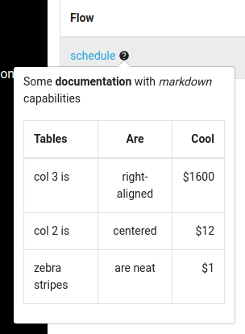

# Flows
> Flows are used to implement your workload. They define all the tasks you want to perform and the order in which they will be run.

You define a flow thanks to a declarative model in YAML.

A flow must have an identifier (id), a namespace, and a list of [tasks](../tasks/).

A flow can also have [inputs](../inputs/), [listeners](../listeners/), [error handlers](../errors-handling/), and [triggers](../triggers/).

## Flow sample

Here is a sample flow definition. It uses tasks available in Kestra core for testing purposes.

```yaml
id: samples
namespace: io.kestra.tests
description: "Some flow **documentation** in *Markdown*"

labels:
  env: prd
  country: FR

inputs:
  - name: my-value
    type: STRING
    required: false
    defaults: "default value"
    description: This is a not required my-value

variables:
  first: "1"
  second: "{{vars.first}} > 2"

tasks:
  - id: date
    type: io.kestra.core.tasks.debugs.Return
    description: "Some tasks **documentation** in *Markdown*"
    format: "A log line content with a contextual date variable {{taskrun.startDate}}"

taskDefaults:
  - type: io.kestra.core.tasks.log.Log
    values:
      level: ERROR
```

You can add arbitrary `labels` to your flow. Labels can be handy when you have a lot of flows to sort them on multiple dimensions.

You can also define `taskDefaults` inside your flow; this is a list of default task properties that will be applied to each task of a certain type inside your flow. Task defaults can be handy to avoid repeating the same value for a task property in case the same task type is used multiple times in the same flow.

You can set flow variables that will be accessible by each task using <code v-pre>{{ vars.key }}</code>. Flow `variables` is a map of key/value pairs.

The most important part of a flow is the list of tasks that will be run sequentially when the flow is executed.

## Flow Properties

The following flow properties can be set.

| Field | Description |
| ---------- | ----------- |
|`id`|The flow identifier, must be unique inside a namespace.|
|`namespace`|Each flow lives in one namespace, this is useful for flow organization and is mandatory.|
|`revision`|The flow version, handled internally by Kestra, and incremented for each modification. You should not manually set it.|
|`description`|The description of the flow, more details [here](#document-your-flow).|
|`labels`|The list of labels which are string key/value pairs.|
|`inputs`|The list of inputs, more details [here](../inputs/).|
|`variables`|The list of variables (such as api key, table name, URL, etc) that can be reached inside tasks with <code v-pre>{{ vars.name }}</code>.|
|`tasks`|The list of tasks, all tasks will be run sequentially.|
|`errors`|The list of error tasks, all listed tasks will be run sequentially only if there is an error on the current execution. More details [here](../errors-handling/).|
|`listeners`|The list of listeners, more details [here](../listeners/).|
|`triggers`|The list of triggers which are external events (such as date schedule or message presence in a broker, for example) that will launch this flow, more details [here](../triggers/).|
|`taskDefaults`|The list of default task values, this avoid repeating the same properties on each tasks.|
|`taskDefaults.[].type`|The task type is a full qualified Java class name.|
|`taskDefaults.[].forced`|If set to `forced: true`, the taskDefault will take precedence over properties defined in the task (default `false`).|
|`taskDefaults.[].values.xxx`|The task property that you want to be set as default.|
|`disabled`|Set it to `true` to disable execution of the flow.|

## Document your flow

You can add documentation to flows, tasks, etc... to explain the goal of the current element.

For this, Kestra allows adding a `description` property where you can write documentation of the current element.
The description must be written using the [Markdown](https://en.wikipedia.org/wiki/Markdown) syntax.

You can add a `description` property on:
- [Flows](../flow)
- [Tasks](../flow)
- [Listeners](../listeners)
- [Triggers](../triggers)

All descriptions will be visible on the UI:




