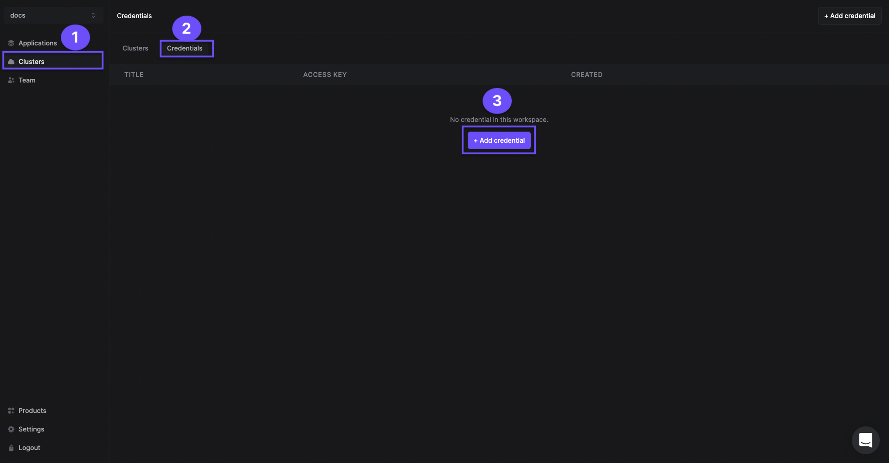
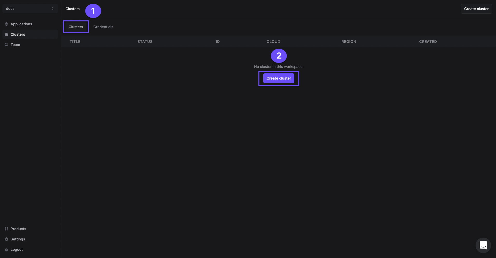
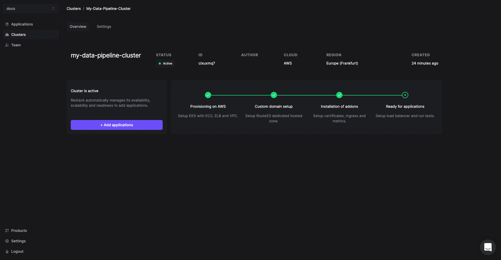

# Deployment on AWS with Restack
[Restack](https://restack.io) lets you deploy Kestra on your own AWS infrastructure on Kubernetes.

## Getting Started

To deploy Kestra with Restack:

  - [Sign up for a Restack account](#sign-up-for-a-restack-account).
  - [Add AWS credentials with AdministratorAccess](#add-aws-credentials-with-administratoraccess).
  - [One-click cluster creation with Restack](#one-click-cluster-creation-with-restack).
  - [Deploy Kestra on Restack](#deploy-kestra-on-restack).
  - [Start using Kestra](#start-using-kestra).
  - [Deploy multiple instances of Kestra](#deploy-multiple-instances-of-kestra).

## Sign up for a Restack account

To Sign up for a Restack account, visit [www.restack.io/signup](https://www.restack.io/signup). You can sign up with your corporate email address or your GitHub profile. You do not need a credit card to sign up.

If you already have an account, login to Restack at [www.restack.io/login](https://www.restack.io/login).

## Add AWS credentials with AdministratorAccess

To deploy Kestra in your own AWS infrastructure with Restack, you will need to add your credentials as the next step.

Make sure that this account has *AdministratorAccess*. This is how Restack can ensure an end-to-end cluster creation and cluster management process.

1. Navigate to **Clusters** in the left-hand navigation menu.
2. Select the **Credentials** tab.
3. Click **Add credential**.
    
4. Give a suitable title to your credentials for managing them later.
5. Enter your [**AWS Access Key ID** and **AWS Secret Access key**.](https://docs.aws.amazon.com/accounts/latest/reference/root-user-access-key.html)
6. Click **Add credential**.
    

>[How to get your AWS Access key ID and AWS Secret Access Key](https://docs.aws.amazon.com/accounts/latest/reference/root-user-access-key.html)

## One-click cluster creation with Restack

:::tip
Running your application on a Kubernetes cluster lets you deploy, scale and monitor the application reliably.
:::

Once you have added your credentials:
1. Navigate to the **Clusters** tab on the same page and click on **Create cluster**.
    
2. Give a suitable name to your cluster.
3. Select the region you want to deploy the cluster in.
4. Select the AWS credentials you added in the previous step.
    

The cluster creation process will start automatically. Once the cluster is ready, you will get an email on the email id connected with your account.

Creating a cluster is a one-time process. From here you can add other open source tools or multiple instances of Kestra in the same cluster.

Any application you deploy in your cluster will be accessible via a free **restack domain**.
Contact the Restack team via chat to set a custom domain for your Kestra instances.

## Deploy Kestra on Restack

1. Click **Add application** from the Cluster description or go to the Applications tab in the left hand side navigation.
2. Click **Kestra**.
    
3. Select the cluster you have already provisioned.
4. Click **Add application**.

## Start using Kestra

Kestra will be deployed on your cluster and you can access it using the link under the *URL* tab.

You can also check the workloads and volumes that are deployed within Kestra.

## Deploy multiple instances of Kestra

Restack makes it easier to deploy multiple instances of Kestra on the same or multiple clusters.
 So you can test the latest version before upgrading or have a dedicated instance for development and for production.
