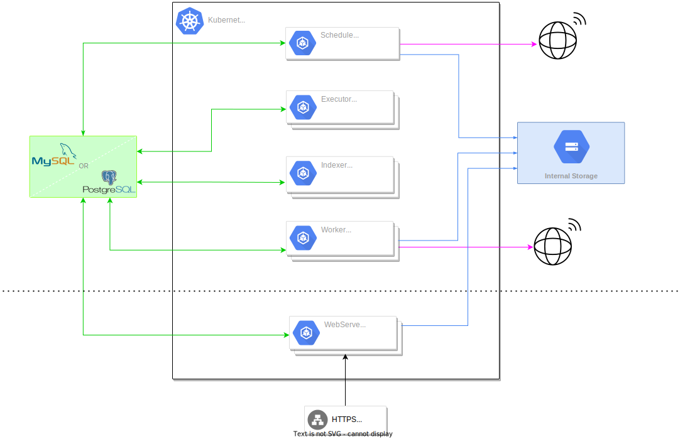

# Architecture

## The Kestra internal components

Kestra has three internal components:
- The **Internal Storage** stores flow data like task outputs and flow inputs.
- The **Queue** is used for internal communication between Kestra server components.
- The **Repository** is used to store flows, templates, executions, logs, etc. The repository stores every internal object.

These internal components are provided on multiple implementations depending on your needs and deployment architecture. You may need to install additional plugins to use some implementations.

### The Internal Storage

Kestra uses an **Internal Storage** to handle incoming and outgoing files of varying sizes. This notion is included in the heart of Kestra. Nowadays, storage availability is backed up by many file systems. We rely on these to guarantee the scalability of Kestra. The *Kestra Internal Storage* will store all the files generated by all tasks and transmit them between different tasks if needed.

By default, only the local storage is available. It uses a directory inside the host filesystem, so it is not scalable and not designed for production usage.

More implementations are available as plugins.

You can replace the local storage with one of the following storage implementations:
- [Storage Minio](https://github.com/kestra-io/storage-minio) for [Minio](https://min.io/), which is compatible with [AWS S3](https://aws.amazon.com/s3/) and all other *S3 Like* storage.
- [Storage GCS](https://github.com/kestra-io/storage-gcs) for [Google Cloud Storage](https://cloud.google.com/storage).
- [Storage Azure](https://github.com/kestra-io/storage-azure) for [Azure Blobs Storage](https://azure.microsoft.com/en-us/services/storage/blobs/).

### The Queue

The Queue or more precisely queues are used internally for communication between the different Kestra server components. Kestra provides multiple queue types that must be used with their repository counterparts.

There are three types of queues:
- **In-Memory** that must be used with the In-Memory Repository.
- **Database** that must be used with the Database Repository.
- **Kafka** that must be used with the Elasticsearch Repository. **Only available in the [Enterprise Edition](https://kestra.io/features/enterprise.html)**.

## The Repository

The Repository or more precisely repositories are the internal way to store data. Kestra provides multiple repository types that must be used with their queue counterparts.

There exist three types of repositories:
- **In-Memory** that must be used with the In-Memory Queue.
- **Database** that must be used with the Database Queue.
- **Elasticsearch** that must be used with the Kafka Queue. **Only available in the [Enterprise Edition](https://kestra.io/features/enterprise.html)**.

## The Kestra server components

Kestra consists of multiple server components that can be scaled independently. 
Each server component interacts with the Kestra internal components (internal storage, queues, and repositories).

### Executor

The **Executor** handles all executions and [flowable tasks](../../developer-guide/flowable). The only goal of the Executor is to receive created executions and look for the next tasks to run. There is no heavy computation required (and no capacity for it) for this server component.

The Executor also handles special execution cases:
- [Listeners](../developer-guide/listeners).
- [Flow Triggers](../developer-guide/triggers/flow.md).
- [Templates](../developer-guide/templates).

You can scale Executors as necessary, but as no heavy computations are done in the Executor, this server component only requires little resources (unless you have a very high rate of executions).

### Worker

The **Worker** is where all tasks are run. A Worker will receive a task from the Executor and will process it. As tasks can be nearly anything (heavy computations, simple API calls, etc.), the Worker is essentially a Thread Pool where you can configure the number of threads you need.

You can scale Workers as necessary and have many instances on multiple servers, each with its own Thread Pool.

As the worker will execute the tasks, it needs access to any external services used by your tasks (database, REST services, message broker, etc.).

### Scheduler

The **Scheduler** will handle most of the [Triggers](../developer-guide/triggers) (except the [Flow Triggers handled by the Executor](../developer-guide/triggers/flow.md)). It will continuously watch all triggers and, if all the conditions are met, will trigger an execution (submit it to the Executor).

Internally, a Scheduler has two Thread Pools:
- **ScheduledExecutorService**: This Thread Pool will tick every second and try to find an available job.
- **CachedThreadPool**: This Thread Pool will deal with all other scheduler computational needs: detecting files, executing queries, fetching queues, ...

::: warning
By default, Kestra will handle all dates based on your system timezone. You can change the timezone with [JVM options](../administrator-guide/configuration/others#jvm-configuration).
:::

Some triggers may require access to external services (triggers based on database query or message subscription, for example). If you use such triggers, the Scheduler will need access to the required external services as it executes them.

### Indexer

The **Indexer** is an optional component only needed when using Kafka and Elasticsearch. It will watch for many Kafka topics (like flows and executions) and will index their content to Elasticsearch [Repositories](#repositories).

### Webserver

The **Webserver** offers two main modules in the same component:
- **API**: All the [APIs](../api-guide/) that allow triggering executions for any systems and interacting with Kestra.
- **UI**: The [User Interface](../user-interface-guide) (UI) is also served by the webserver.

The Webserver interacts mostly with the Repository to deliver a rich API/UI. It also interacts with the Queue to trigger new executions, follow executions in real time, etc.

::: tip
Each server component (other than the Scheduler) can continue to work as long as the Queue is up and running. The Repository is only used to help provide our rich Web UI, and even if the Repository is down, workloads can continue to process on Kestra.
:::

## Plugins

Kestra's core is not by itself able to handle many task types. We have therefore included a [Plugins](../../plugins) system that allows developing as many task types as you need.
A wide range of plugins is already available, and many more will be delivered by the Kestra team!

Plugins are also used to provide different implementations for Kestra internal components like its Internal Storage.

## Deployment architecture

Kestra is a Java application that is provided as an executable. You have many deployments options:
- [Docker](../administrator-guide/deployment/docker)
- [Kubernetes](../administrator-guide/deployment/kubernetes)
- [Manual deployment](../administrator-guide/deployment/manual)

At its heart, Kestra has a plugin system allowing you to choose the dependency type that fits your needs.

You can find three example deployment architectures below.

### Small-sized deployment

For a small-sized deployment, you can use Kestra standalone server, an all-in-one server component that allows running all Kestra server components in a single process. This deployment architecture has no scaling capability.

It can be used with a database as the only dependency. This allows running Kestra with a minimal stack to maintain. We have for now three databases available:
- PostgreSQL
- MySQL
- H2

Database configuration options are available [here](../administrator-guide/configuration/databases/README.md).

### Medium-sized deployment

For a medium-sized deployment, where high availability is not a strict requirement, you can use a database (Postgres or MySQL) as the only dependency. This allows running Kestra with a minimal stack to maintain. We have, for now, two databases available for this kind of architecture, as H2 is not a good fit when running distributed components:
- PostgreSQL
- MySQL

All server components will communicate through the database.

::: warning
When using a database, you can't scale the replica count for the scheduler, and you must have only **one** instance of it for the whole cluster.
:::

Database configuration options are available [here](../administrator-guide/configuration/databases/README.md).

In this deployment mode, unless all components run on the same host, you must use a distributed storage implementation like Google Cloud Storage, AWS S3, or Azure Blobs.

### High availability with no single point of failure deployment

To support higher throughput, and full horizontal and vertical scaling of the Kestra cluster, we can replace the database with Kafka and Elasticsearch. In this case, all the server components can be scaled without any single point of failure.

Kafka and Elasticsearch are available only in the **[Enterprise Edition](https://kestra.io/features/enterprise.html)**.

In this deployment mode, unless all components run on the same host, you must use a distributed storage implementation like Google Cloud Storage, AWS S3, or Azure Blobs.

#### Kafka

[Kafka](https://kafka.apache.org/) is Kestra's primary dependency in high availability mode. Each of the most important server components in the deployment must have a Kafka instance up and running. Kafka allows Kestra to be a highly scalable solution.

Kafka configuration options are available [here](../administrator-guide/configuration/kafka/README.md).

##### Kafka Executor

With Kafka, the Executor is a heavy [Kafka Stream](https://kafka.apache.org/documentation/streams/) application. The Executor processes all events from Kafka in the right order, keeps an internal state of the execution, and merges task run results from the Worker.
It also detects dead Workers and resubmits the tasks run by a dead Worker.

As the Executor is a Kafka Stream, it can be scaled as needed (within the limits of partitions count on Kafka). Still, as no heavy computations are done in the Executor, this server component only requires a few resources (unless you have a very high rate of executions).

##### Kafka Worker

With Kafka, the Worker is a [Kafka Consumer](https://kafka.apache.org/documentation/#consumerapi) that will process any Task Run submitted to it. Workers will receive all tasks and dispatch them internally in their Thread Pool.

It can be scaled as needed (within the limits of partitions count on Kafka) and have many instances on multiple servers, each with its own Thread Pool. 

With Kafka, if a Worker is dead, the Executor will detect it and resubmit their current task run to another Worker.

#### ElasticSearch
[ElasticSearch](https://www.elastic.co/) is Kestra's user interface database in high availability mode, allowing the display, search, and aggregation of all Kestra's data (Flows, Executions, etc.). ElasticSearch is only used by the webserver (API and UI).

Elasticsearch configuration options are available [here](../administrator-guide/configuration/elasticsearch/README.md).
