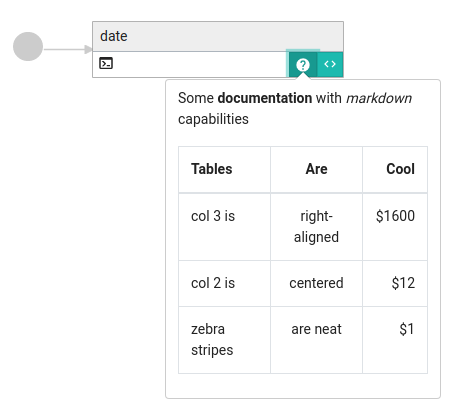

# Document your flow

You can add documention to flows, tasks, ... in order to explain what is the goal of the current element.

For this, Kestra allows to add a `description` attribute where you can write some documentation of the current element.
Description must be written on [Markdown](https://en.wikipedia.org/wiki/Markdown).

You can add `description` attribute on: 
- [Flows](../flow)
- [Tasks](../flow)
- [Listeners](../listeners)
- [Triggers](../triggers)

All description will be visible on the ui : 

