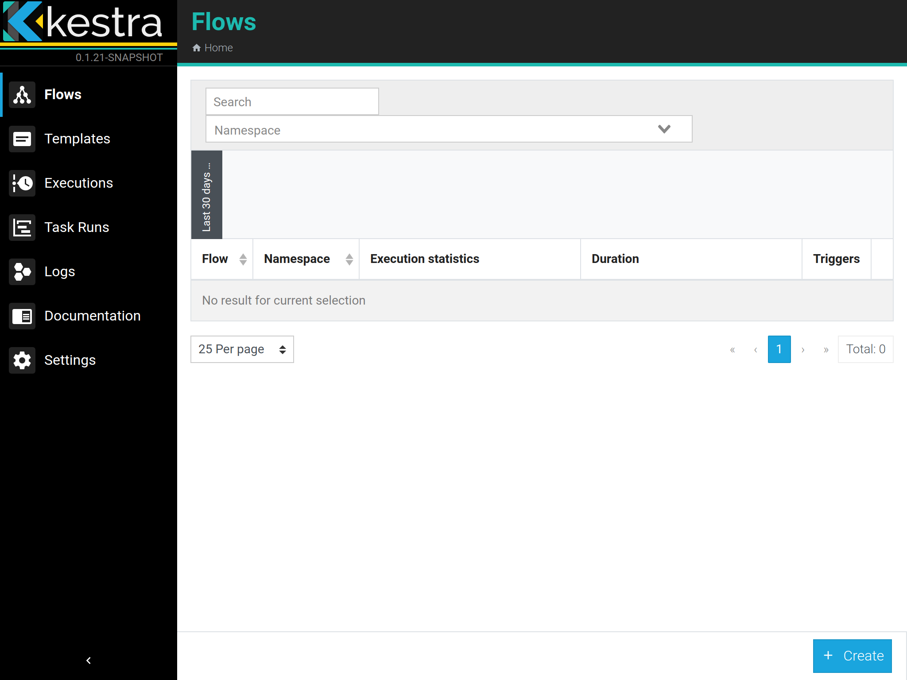

# Getting Started


## Before you begin
Make sure you have already installed:
- [Docker](https://docs.docker.com/engine/install/)
- [Docker Compose](https://docs.docker.com/compose/install/)

## Launch Kestra

- Download the compose file [here](https://github.com/kestra-io/kestra/blob/develop/docker-compose.yml) and save it with the name `docker-compose.yml`, for linux and macos, you can run `wget https://raw.githubusercontent.com/kestra-io/kestra/develop/docker-compose.yml`
- Run `docker-compose pull`
- Run `docker-compose up -d`
- Open `http://localhost:8080` on your browser


::: warning
Default amount of memory available for Docker on MacOS is often not enough to get Kestra up and running with all dependencies. If enough memory is not allocated, it might lead to kestra instance continuously restarting. You should at least allocate 4GB memory for the Docker Engine (ideally 8GB). You can check and change the amount of memory in [Resources](https://docs.docker.com/docker-for-mac/#resources).

You can also check if you have enough memory by running this command:
```bash
docker run --rm "debian:buster-slim" bash -c 'numfmt --to iec $(echo $(($(getconf _PHYS_PAGES) * $(getconf PAGE_SIZE))))'
```
:::


## Create your first flow
The default installation is empty and don't contain any flows.




We will create the first one :


* Click on the `Create` button at the button
* Paste the flow below
* Click on save

```yaml
id: logs
namespace: io.kestra.tests

tasks:
- id: t1
  type: io.kestra.core.tasks.debugs.Echo
  format: first {{task.id}}
  level: TRACE
- id: t2
  type: io.kestra.core.tasks.debugs.Echo
  format: second {{task.type}}
  level: WARN
- id: t3
  type: io.kestra.core.tasks.debugs.Echo
  format: third {{flow.id}}
  level: ERROR
```

You will see the Topology of your flow as graph on `Overview` tabs.


## Execute your first flow
Now let's run our first flow and see it running :

* Now hit the button `Execute` on top Tabs.
* You will see in Real time the execution of the current flow

* Look at the log of the current tasks on `Logs`

* And watch the topology of the current execution.


## Next Steps
Now, you are ready to use Kestra !

Now I suggest you to read some documentations in order:
- to understand Kestra [concepts](../concepts).
- read the [Developer Guide](../developer-guide) to understand how to code your own flow.
- Look at [Plugins](../../plugins) to have some real task .
- [Deploy](../administrator-guide) your kestra instance to real environments.

