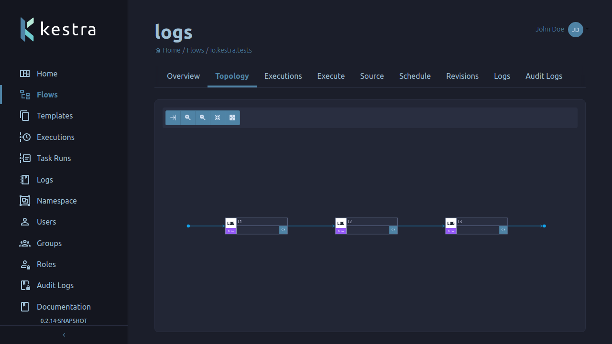
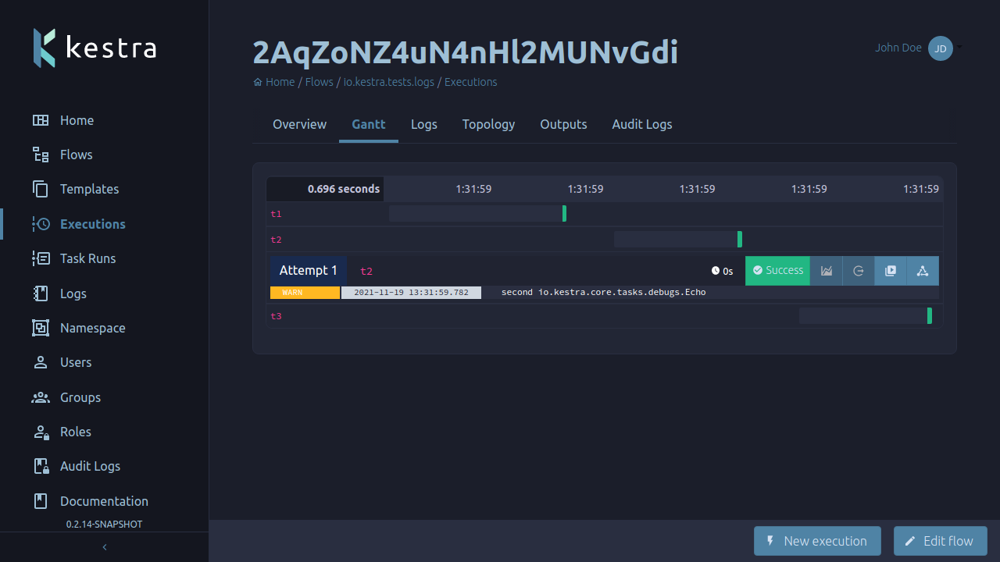
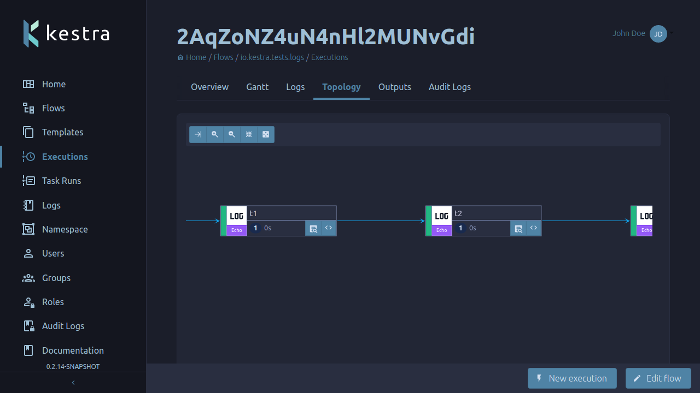

# Getting Started


## Before you begin
Make sure the followings are already installed:
- [Docker](https://docs.docker.com/engine/install/)
- [Docker Compose](https://docs.docker.com/compose/install/)

## Launch Kestra

- Download the Docker Compose file [here](https://github.com/kestra-io/kestra/blob/develop/docker-compose.yml) and save it with the name `docker-compose.yml`. For linux and MacOS, you can run `wget https://raw.githubusercontent.com/kestra-io/kestra/develop/docker-compose.yml`.
- Run `docker-compose up -d`.
- Open [http://localhost:8080](http://localhost:8080) in your browser.


::: warning
The default amount of memory available for Docker on MacOS is often not enough to get Kestra up and running with all dependencies. If enough memory is not allocated, it might lead to the Kestra instance continuously restarting. You should allocate at least 4GB memory for the Docker Engine (ideally 8GB). You can check and change the amount of memory in [Resources](https://docs.docker.com/docker-for-mac/#resources).

You can also check if you have enough memory by running this command:
```bash
docker run --rm "debian:buster-slim" bash -c 'numfmt --to iec $(echo $(($(getconf _PHYS_PAGES) * $(getconf PAGE_SIZE))))'
```
:::


## Create your first flow
The default installation contains some examples you can access on the `Flows` menu item.

We will create a new one:


* Click on the `Create` button at the bottom.
* Paste the flow below.
* Click on save.

```yaml
id: logs
namespace: io.kestra.tests

tasks:
- id: t1
  type: io.kestra.core.tasks.debugs.Echo
  format: first {{task.id}}
  level: TRACE
- id: t2
  type: io.kestra.core.tasks.debugs.Echo
  format: second {{task.type}}
  level: WARN
- id: t3
  type: io.kestra.core.tasks.debugs.Echo
  format: third {{flow.id}}
  level: ERROR
```

You will see the topology of your flow as a graph in the `Topology` tab.




## Execute your first flow
Now let's execute our first flow and see it running:

* Go to the `Execute` tab.
* Hit the `Execute` button on top.
* You will see in real-time the execution of the current flow.

* Look at the log of the current task in the `Logs` tab.

* And watch the topology of the current execution.



## Next Steps
Now, you are ready to use Kestra!

As next steps, we suggest reading the following documentations in this order:
- Learn Kestra [concepts](../concepts).
- Read the [Developer Guide](../developer-guide) to understand how to build your own flow.
- Look at [Plugins](../../plugins) to perform some real tasks.
- [Deploy](../administrator-guide) your Kestra instance to real environments.

