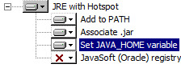
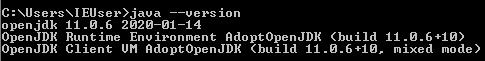
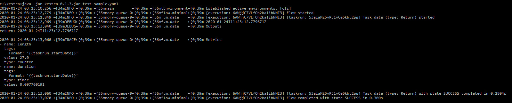

# Getting Started

# Install and configure Kestra for flow developments
<!-- ------------------------ -->


## Presentation

In this tutorial we'll be interested in how to setup a working Kestra environement for flow developments By following this tutorial, you will be able to finally describe and execute a sample flow.

In a next tutorial, we'll see what tools and concepts are available in Kestra and how to efficiently use them.

### Goals

* Install **java JRE 11** is a requirement to let kestra run properly
* Download and run **Kestra executable** to run our first flow command

::: tip
This is windows based tutorial. The same tutorial will work on linux systems but some setup steps will be different. The following should also work on macos.
:::

## Install java JRE 11

### On windows

You may have an existing java installation on your computer. You can check this install by opening a window command line and typing `java    *-version`.
If you have either a response from the terminal like *java: command not found* or *java version 8*, then you have to install the following java 11 version.

* Download and install Java JRE 11 [from here](https://github.com/AdoptOpenJDK/openjdk11-binaries/releases/download/jdk-11.0.6%2B10/OpenJDK11U-jre_x86-32_windows_hotspot_11.0.6_10.msi) will let your computer be able to run Kestra executable (this is a 32bit version for windows 7. Choose another version here if you need something else.)
* Run the installer and add **set JAVA_HOME variable** to the install like the picture below

* Check the install by opening a window command line and do the following command `java --version`. Ensure you have the version 11 at least.


### On Linux

for debian / ubuntu based distros, you can run the following command to install JAVA :

`sudo apt install openjdk-11-jre`

You are now ready to run Kestra.

## Setup Kestra

Kestra is a java application. You will have to download a built version and then run commands in the terminal to test it works as expected.

* Download Kestra [latest version here](https://kestra-download-latest-xfpg5jduea-ew.a.run.app)
* Move the downloaded file in some cool place like `c:\kestra\kestra-xxx.jar` (on linux `/home/<username>/kestra` will be ok)
* Add the following flow sample file to the following location *c:\kestra\sample.yaml* with the following content :

::: warning
Beware the flow file **MUST** be a **.yaml** extension (.yml will not work)
:::

```yaml
id: sample
namespace: org.kestra.tests

tasks:
- id: date
  type: org.kestra.core.tasks.debugs.Return
  format: "{{taskrun.startDate}}"
```

* Check your setup is ready to go by issuing the follwing command in the terminal `cd c:\kestra` then `java -jar kestra-xxx.jar test sample.yaml`

]
(Right click on the image, then display image to see the entire output)

On the command output above, you can see the flow has been processed properly in a while.

::: tip
The output will render better on windows soon. for now log color output does not render. On unix terminals, output renders will colors.
:::

If all of this work, you are ready to go further with kestra. You now may have a look at Kestra concepts and flow definition tutorial to start developping flows for kestra.
