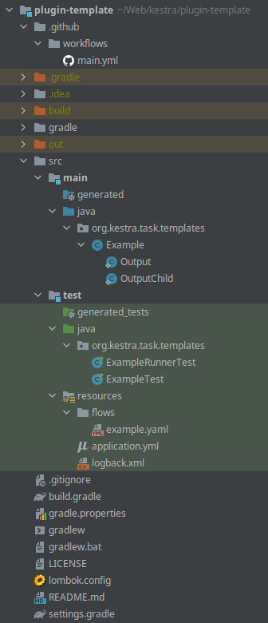

# Plugin Developer Guide

We provide a plugin template in order to start quickly the development of a new plugins.

## Requirements
Kestra plugins development requirements are :
* [Java](https://java.com) 11 or later
* [IntelliJ IDEA](https://www.jetbrains.com/idea/) (or any other Java IDE, we provide only help for IntelliJ IDEA)
* [Gradle](https://gradle.org/) (included most of the time with the IDE)

## Create a new plugins

Here is the step:

1. Go on the [plugin-template]() repository.
2. Click on *Use this template*.
3. Choose the github account your want to link & repository name for the new plugins.
4. Clone the new repository: `git clone git@github.com:{{user}}/{{name}}.git`.
5. Open the cloned directory in IntelliJ IDEA.
6. Enable [annotations processors](https://www.jetbrains.com/help/idea/annotation-processors-support.html).
7. If you are using an IntelliJ IDEA < 2020.03, install the [lombok plugins](https://plugins.jetbrains.com/plugin/6317-lombok) (if not it's included by default).

Done ! You are ready to create a new plugin, here is the directory structure you will have:

## Develop a new plugins
In order to customize your plugin to your need you can follow this guide based on your need:

<ChildTableOfContents :max="1" />
