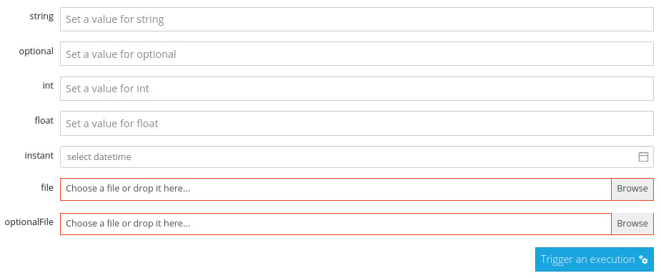

# Flow Inputs

Kestra's flow executions can be parametrized using inputs. This can be done programmatically using the API, or via the web UI using dynamically generated forms.

Here are the following input fields available :

`STRING, INT, FLOAT, DATETIME, FILE`

Each fields are required or optional and have to be named in tasks description, so the web interface can bind named input to their backend processing when a task is triggered.

Here is the input sample flow description containing all possible inputs :

```yaml
id: inputs
namespace: org.kestra.tests
revision: 1
inputs:
  - name: string
    type: STRING
    required: true
  - name: optional
    type: STRING
    required: false
  - name: int
    type: INT
    required: true
  - name: float
    type: FLOAT
    required: true
  - name: instant
    type: DATETIME
    required: true
  - name: file
    type: FILE
    required: true
  - name: optionalFile
    type: FILE
    required: false
tasks:
  - id: string
    type: org.kestra.core.tasks.debugs.Return
    format: "{{inputs.string}}"
  - id: int
    type: org.kestra.core.tasks.debugs.Return
    format: "{{inputs.int}}"
  - id: float
    type: org.kestra.core.tasks.debugs.Return
    format: "{{inputs.float}}"
  - id: instant
    type: org.kestra.core.tasks.debugs.Return
    format: "{{inputs.instant}}"
  - id: file-content
    type: org.kestra.core.tasks.debugs.Return
    format: "{{inputs.file.content}}"
  - id: file
    type: org.kestra.core.tasks.debugs.Return
    format: "{{inputs.file}}"
  - id: file-uri
    type: org.kestra.core.tasks.debugs.Return
    format: "{{inputs.file.uri}}"

```

With such flow, the web ui let you input some inputs by generating a form accordingly on the flow > trigger view. The input form for the task above looks like below :



Once inputs filled, you can trigger a flow execution that will run with [contextual inputs](/docs/dynamic-fields) as task variables.