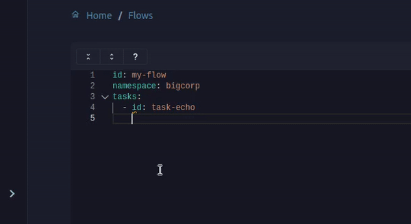
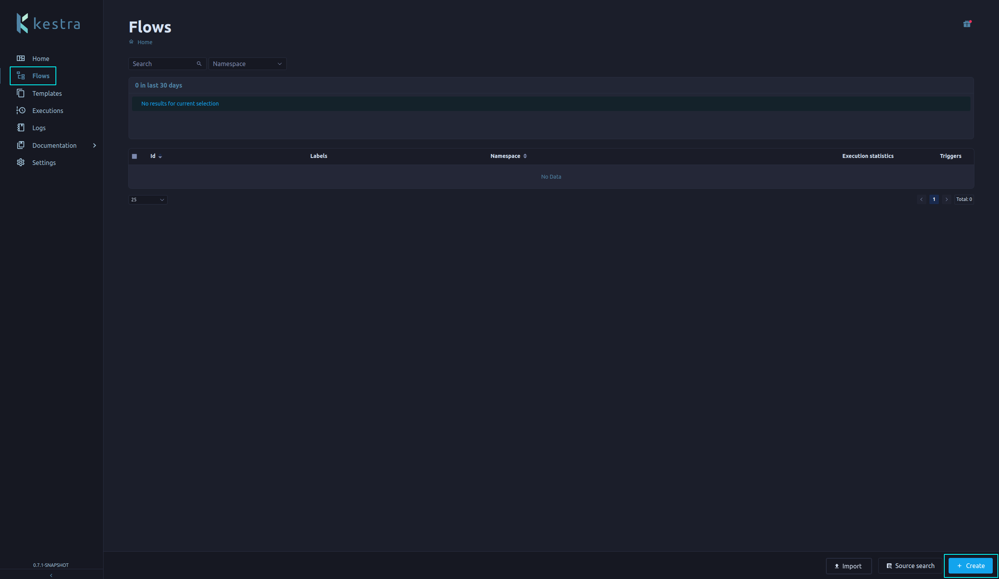
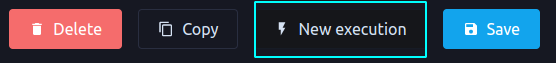

# Fundamentals

This section will guide you through the fundamentals of Kestra.

::: tip
We assume you followed the [Getting Started](../getting-started/README.md) guide before this tutorial.
:::

## Flows

In Kestra, we define flows using the declarative language YAML.

We identify them by an `id` and a `namespace`. The `id` is a unique identifier inside the [namespace](https://kestra.io/docs/concepts/flows.html#namespace), which is used to group flows. It can also have a [description](https://kestra.io/docs/developer-guide/documentation/) and labels.

```yaml
id: kestra-tutorial
namespace: io.kestra.tutorial
labels:
  env: PRD
description: |
  # Kestra Tutorial
  As you notice, we can use markdown here.
```

Discover more about flows in the [Flows](../flows/README.md) section.

## Tasks

We use Tasks to write flows. We define a Task by an `id`, a `type`, and some properties related to its type. And each one is a step in your Flow that will execute a specific action. For example, you can use a Task to run a Python script.

```yaml
tasks:
  - id: python
    type: io.kestra.core.tasks.scripts.Python
    inputFiles:
      main.py: |
        print("Hello World")
```

:::tip
At the moment of writing this guide, [Kestra has 290+ tasks](https://kestra.io/plugins/), which can be challenging to remember. That's why we provide an auto-completion feature to help you find the Task you need. Use the shortcut `CTRL or ⌘ + SPACE` to activate it.
:::



## Create your first Flow

Now, let's create our first Flow. On the left side of the screen, click on the **Flows** tab.
Then, click on the **Create** button.



Use the following Flow in the Editor, then click the **Save** button.
This Flow will download a CSV file from the French Data Portal.

```yaml
id: kestra-tutorial
namespace: io.kestra.tutorial
labels:
  env: PRD
description: |
  # Kestra Tutorial
  As you notice, we can use markdown here.
tasks:
  - id: download
    type: io.kestra.plugin.fs.http.Download
    uri: "https://www.data.gouv.fr/fr/datasets/r/d33eabc9-e2fd-4787-83e5-a5fcfb5af66d"
```

After saving it, you will see a **New Execution** button. Click on it and watch your first Flow running.




<NextStep message="The next step is to add Inputs to your flow" link="../inputs/"/>
