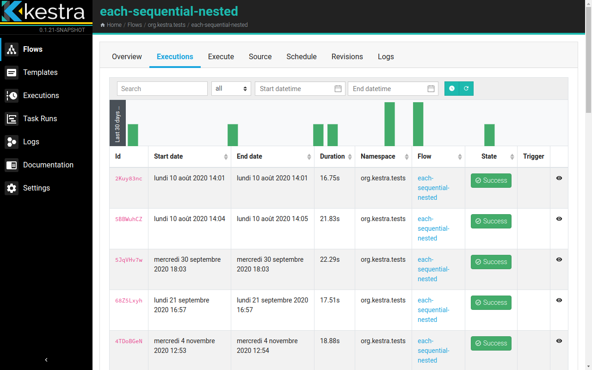
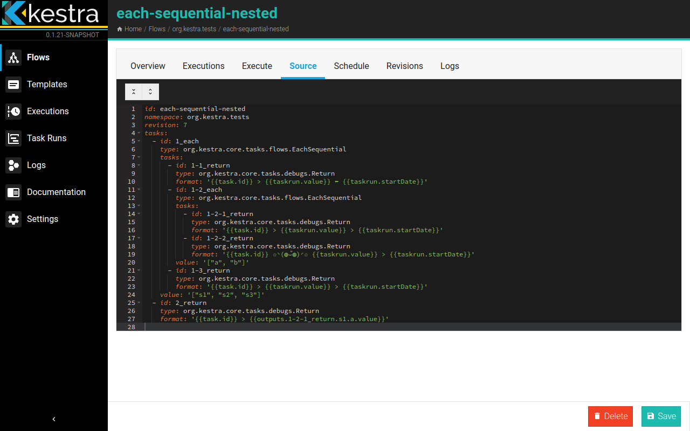
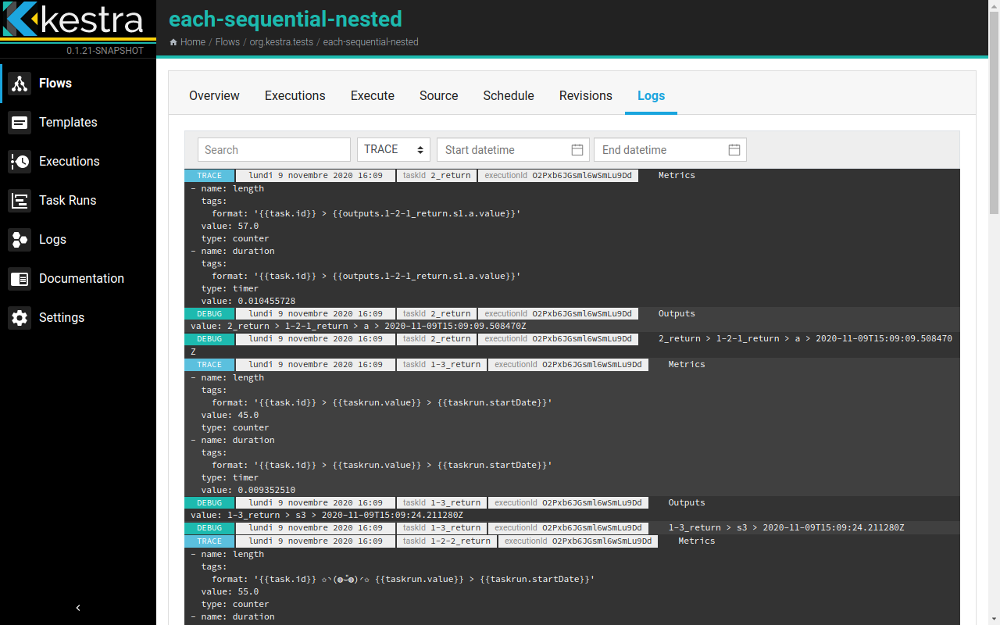
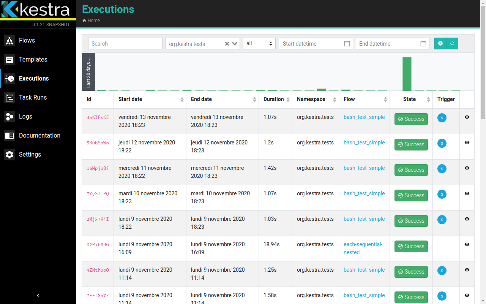
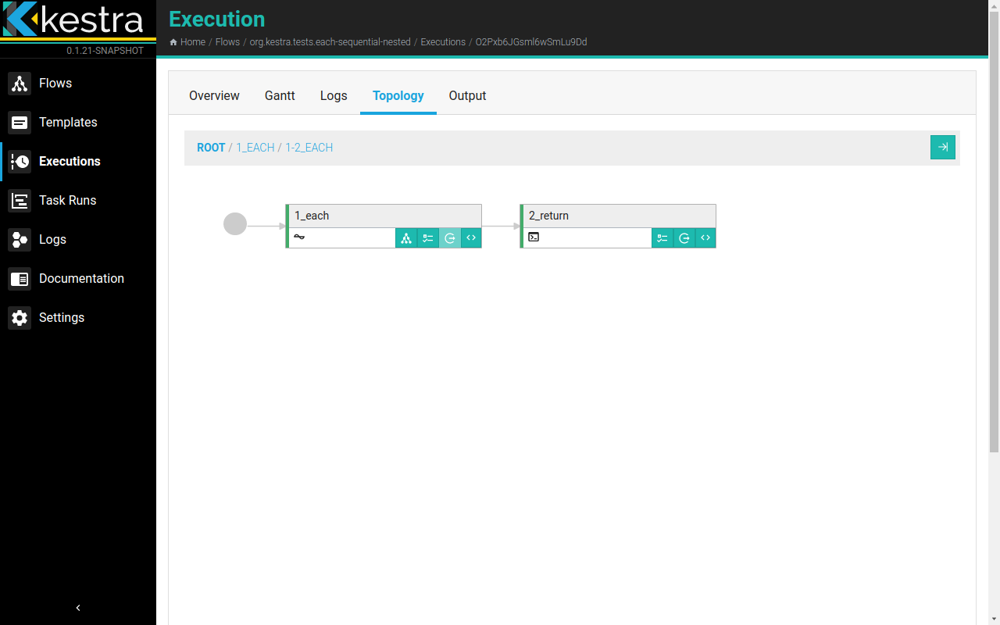
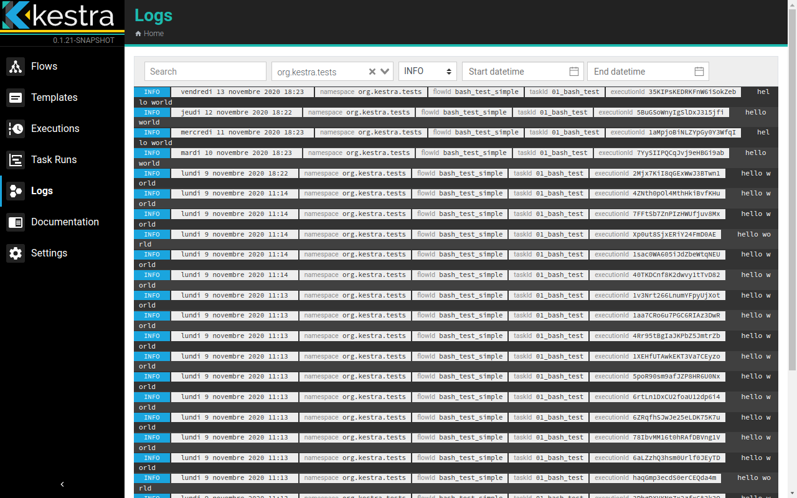

# User Interface Guide

Kestra comes with a web user interface. For now, here are some screenshots, Later a full user guide will here. 

## Flows

## Executions

## Task Runs

## Logs

## Documentation

