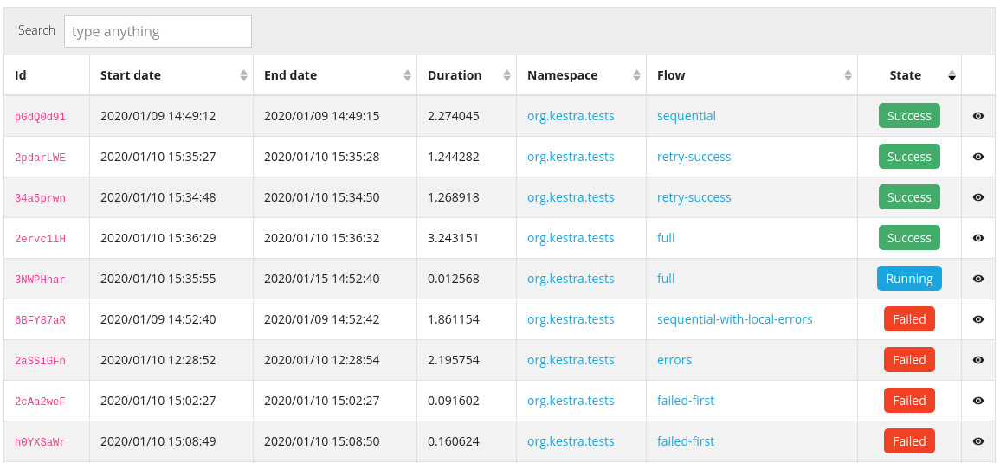
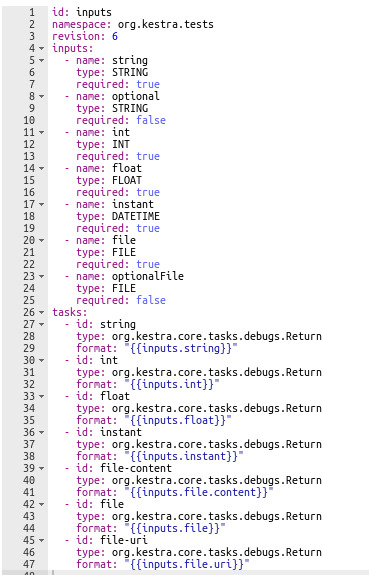
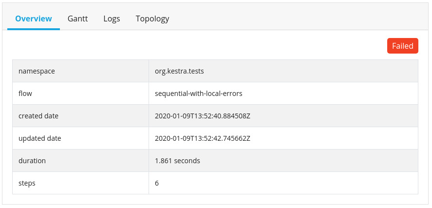
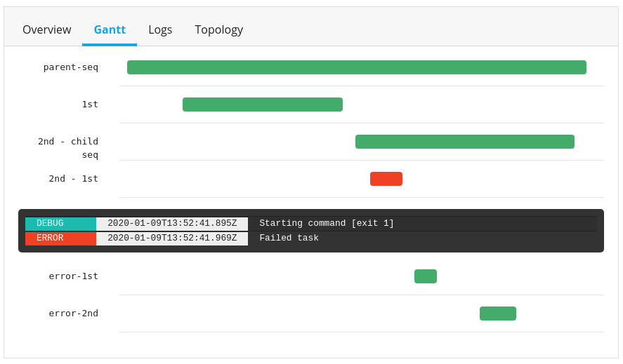
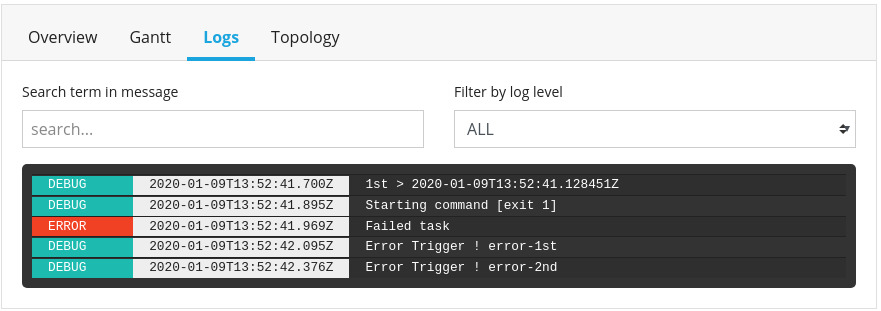

# User Interface Guide

Kestra comes with a web user interface. This section is the documentation related to the user interface usage.

## Homepage / Flow list

When launching Kestra webui, the first page you reach is the flow page where flows are searchable.

On the left, the menu let you reach all parts of the frontend. You can browse to [Flows](/docs/concepts/flows) and [Executions](/docs/concepts/executions).

The flows list shows all registered flows in the system. You can dig into the flow detail by clicking on the show column on the right (or double click on a row).

Have a look at the [table how to](/docs/webui/#table-how-to) section for more details about this page usage.

## Flow details

The flow detail view shows the following tabs:

|Tab|Description|
|-|-|
|Overview|A visual rendering for current flow.|
|Executions|the same view as executions list, but scoped to the current flow. Displayed executions are related to current flow.|
|Trigger|Display a form to trigger a flow. This will display some input fields depending on flow input requirements. . Go to [task model](/task) for more details about how to describe a working flow.|
|Source|Display and let you edit current flow from a text editor. The flow is a yaml document describing how tasks are related and what they do. |

## Execution list

On the execution list page executions are listed and filterable to search some specific execution. It works the same way than the flow list.
a

## Execution details

The execution detail view shows the following tabs:

|Tab|Description|
|-|-|
|Overview|A sumup for the execution information. |
|Gantt|A Gantt diagram representation for the current flow execution processing.  **Note** : Gantt colored lines are clickable to display related log ouputs|
|Logs|The execution logs. This is a filterable list for execution outputs |
|Topology|A visual rendering for current flow.|

## Table how to

Data tables are tables that display information in table format. There are for example some list of flows and executions displayed like this.

This table display let you browse data in many ways. Here are the main concepts about browsing data:

**Sorting** : Data tables let you sort data by clicking on the column header. This will order data depending on it's type (string, number, date...)

**Filtering** : The *search* field on top of the table let you type anything that will filter table results depending on their content. By default, the search input will dig into the whole collection of searchable data.

**Pagination** : The pagination system let you browse all results pages one by one and display the amount of row displayed per page at once.

Note: All filters are *combinable* and the more filter are enable the more accurate the result set will be.
