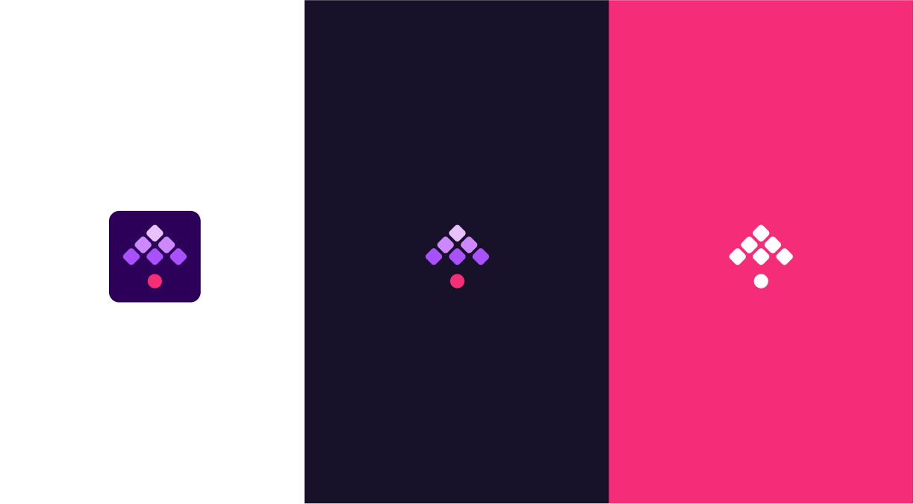
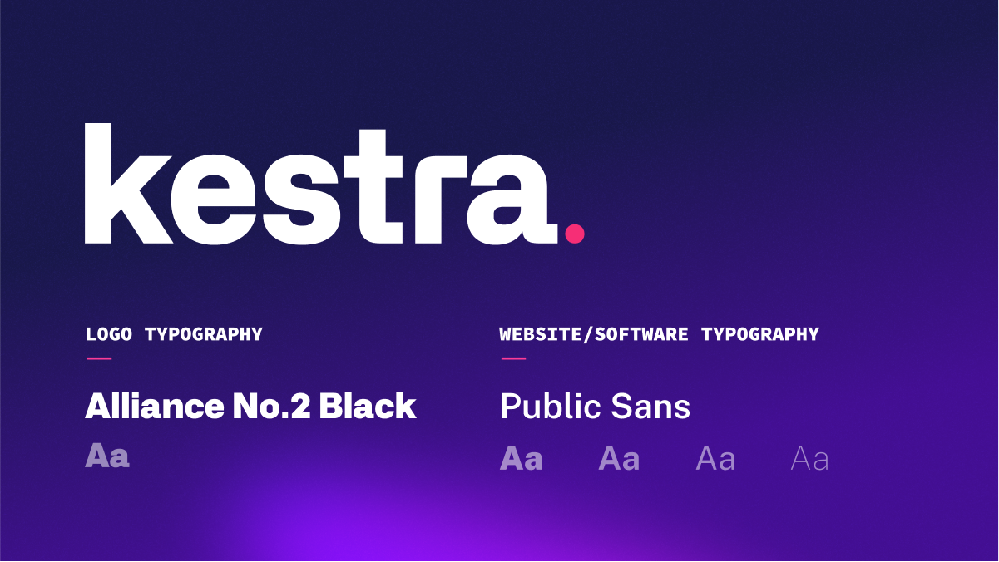
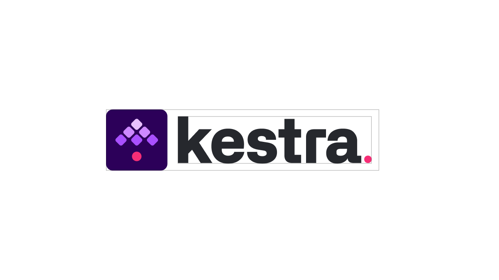
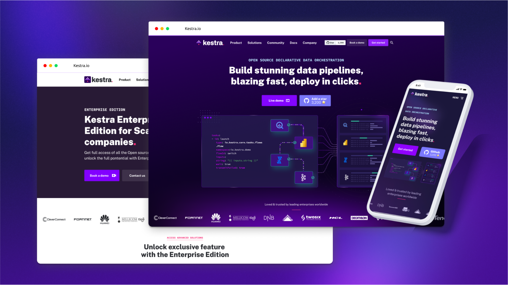
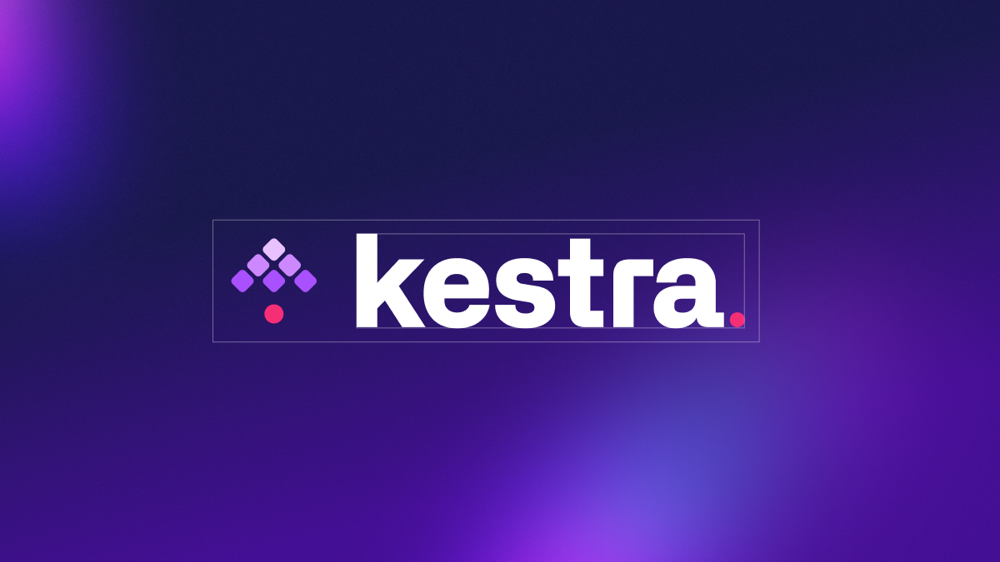

As we unveil our new branding, we aim to showcase the sophistication and innovation behind our product, while maintaining a visual identity that is both intuitive and captivating. In this blog post, we will explore the story behind [Kestra](https://github.com/kestra-io/kestra)'s logo, typography, and design elements, delving into the meaning and message they convey. Join us on this journey as we reveal the essence of our brand and how it reflects our dedication to providing the best data orchestration solution for all of our users.

## The Story Behind Kestra's Logo and the Message It Conveys

When we created Kestra, our ambition was to design a simple yet powerful and fast data orchestration platform. We wanted to enable our clients to manage complex data flows with the same ease as a conductor who leads a complex symphony. This is how our logo was born, which embodies our tool and its ability to orchestrate multiple tasks simultaneously.

## The Logo and Its Components

The Electric Pink dot located in the pictogram represents Kestra, our data orchestrator. The six diamonds facing it symbolize the different tasks of the workflow and the data software plugins that Kestra manages with ease, just like a conductor who directs each musician with precision. Together, they execute a complex musical score, orchestrated with skill.

The Electric Pink dot and the triangle formed by the six diamonds represent an upward arrow, a UP, symbolizing the improvement that Kestra brings to IT organizations. Indeed, thanks to our data orchestration platform, our clients can improve their performance and optimize their workflows.

## Typography and Typeface

The name "Kestra" is written in lowercase and stylized in the Alliance Typeface font to reflect technological innovation, open-source, and scalable technologies. We added a new Electric Pink dot at the end of our product name, reminiscent of the Kestra orchestrator in the pictogram, but also to subtly evoke the expression "Kestra, period!", symbolizing the uniqueness of Kestra and its guarantee to be the best orchestration solution for all our users' needs.

## The Message Behind the Logo

Our logo is a symbol of Kestra's expertise and efficiency in data orchestration. It suggests to our clients our commitment to providing the best solution on the market. The goal of the Kestra logo is to captivate attention, affirm our modernity and ambition, while subtly suggesting our pride, talent, reliability, and performance.

## Evoking a Sense of Harmony and Precision

Just as a conductor brings harmony and precision to a symphony, Kestra's visual identity seeks to convey the same sense of balance and control. The combination of colors, shapes, and typography in our logo and branding materials reflects our dedication to creating a user-friendly, intuitive platform that empowers data professionals to orchestrate their workflows with ease and precision.

## A Modern and Ambitious Design

Kestra's new visual identity showcases our dedication to staying at the forefront of technology and innovation. Our modern and ambitious design reflects our commitment to continuous improvement, ensuring that our platform remains the best-in-class solution for data orchestration. By incorporating a sleek and contemporary aesthetic, we aim to communicate our unwavering dedication to providing the most efficient and powerful data orchestration platform on the market.

## A Visual Identity That Resonates

In conclusion, our new visual identity not only captures the essence of Kestra's mission but also resonates with our clients, partners, and the data community at large. The combination of our logo, typography, and design elements creates a cohesive and impactful visual identity that communicates our core values and solidifies them.

We hope that our new visual identity resonates with you and showcases the innovation, sophistication, and dedication to excellence that Kestra embodies. As we continue to evolve and grow, we invite you to join the community and contribute to the success of Kestra.

You can download Kestra’s logo kit [here](https://drive.google.com/drive/folders/1nwf1BeIZqAGC9uPiq33W-nvDwXDK5tPR?usp=sharing).

To stay up-to-date with our latest developments and engage with our team, we encourage you to join our [Slack channel](/slack). Here, you can ask questions, share your thoughts, and connect with fellow Kestra users and enthusiasts.

Additionally, if you find our data orchestration platform valuable and want to support our efforts, please give us a star on [GitHub](https://github.com/kestra-io/kestra). Your feedback and support are essential to our growth and development.
