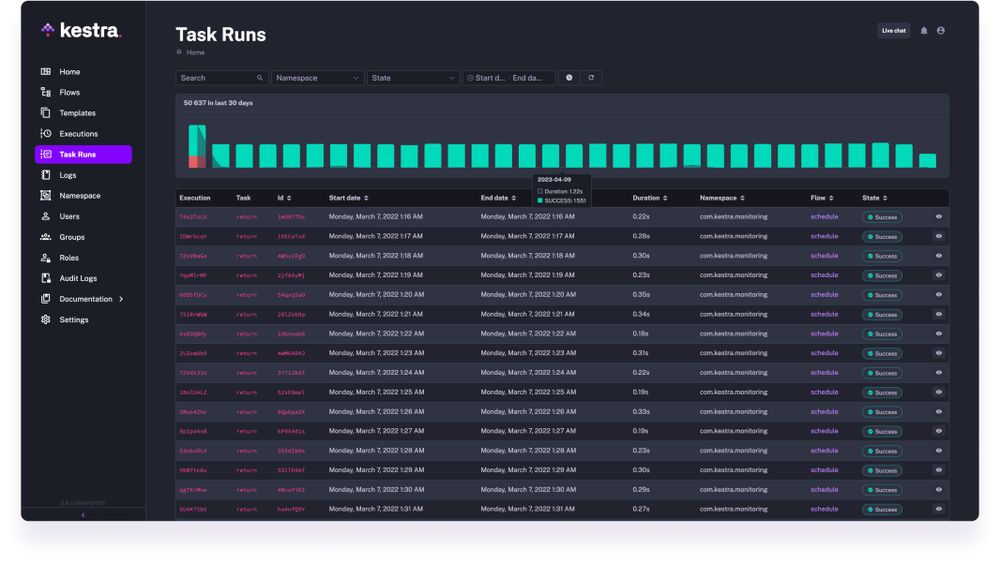
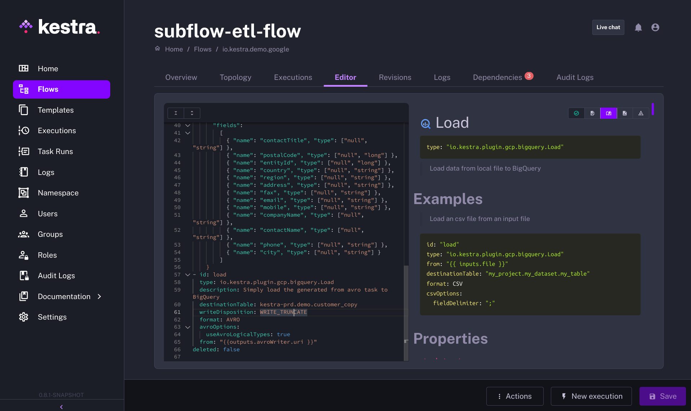

The world of data engineering is constantly evolving, especially in the face of the progress introduced by AI. This article outlines how [Kestra](https://github.com/kestra-io/kestra) addresses the requirements of organizations in search of a proficient data orchestrator.

## Making an Informed Choice: Key Considerations for an Orchestrator

Choosing the right orchestrator for your organization requires thoughtful deliberation. Here are a few essential considerations to guide your decision:

### 1-Flexibility ###
Kestra's strength lies in its flexibility. We ensure that workflows are not just created, but they can be quickly modified, deployed, and adjusted as per the evolving data stack of the user. Its declarative approach with YAML allows for more straightforward workflow modification and adaptation, making it a suitable choice for a fast iteration cycle on the workflow management.

### 2-Scalability ###
Kestra has been designed with scalability at its core. Developed using leading cloud-native technologies and a robust architecture such as Apache Kafka or Elasticsearch, Kestra is capable of scaling to millions of executions without any hassle. As data volumes grow and tasks become complex, Kestra can accommodate this growth without compromising performance, proving its value as a scalable data orchestrator.

### 3-Dependency Management ###
Managing dependencies can be a challenge as workflows grow in complexity. Kestra's topology view brings clarity to complex workflows, offering a transparent overview of task interdependencies. It enables you to visualize the complete workflow with its intuitive interface, thereby simplifying the management of interdependent tasks.

### 4-User Friendly ###
Kestra's intuitive and user-friendly interface makes the tool accessible to both data engineers and business stakeholders. Despite dealing with complex workflows, Kestra ensures the user interface remains simple and understandable. With an embedded code editor, auto-completion, and clear visualization of workflow dependencies, Kestra simplifies data orchestration management.

### 5-Integration & Extension capabilities ###

Kestra's flexibility and versatility, underlined by its extensive [range of plugins](/plugins/), makes it an ideal tool for creating complex workflows with deep integrations with multiple systems. For systems without existing plugins, Kestra's compatibility with containers such as **Docker** and **Kubernetes** makes integration straightforward.

### 6-Monitoring ###

Troubleshooting any issue occurring on your workflow is a very important step of your orchestration.  Kestra offers real-time visibility into your workflows, enabling you to identify and address issues quickly. You can track task execution, dependencies, failures, and more, which provides you with the granular detail necessary to effectively manage your data orchestration.

### 7-Testing ###
Ensuring workflows are tested before they are pushed into production can save a lot of trouble down the line. With Kestra, workflows can be thoroughly tested before they go live, providing an essential safety net for your data project.

### 8-Documentation ###

Good documentation supports a smoother learning process and encourages team collaboration. We have a strong focus on our integrated documentation, reducing the learning curve and making it easier for teams to work together effectively.

### 9-Backfilling ###
It's about ensuring no data is left unprocessed due to failures or delays. With Kestra, backfilling is built into the system, ensuring the continuity and completeness of data processing.

### 10-Data Control ###
In Kestra, the transfer of metadatas is facilitated through connections, task inputs/outputs, and data pipelines, ensuring efficient and reliable movement between tasks and workflows.

### 11-API Control ###
Kestra provides full API control, enabling complete management of workflows without relying solely on the UI and facilitating integration with other tools.

### 12-Security ###
Kestra takes data security seriously, with our [Enterprise Edition](/enterprise) we provide robust security measures to ensure your data is safeguarded throughout its life cycle. With features such as SSO/OIDC authentication, role-based access Control, and Secret Manager Integration, Kestra ensures a secure platform for data orchestration.

## A Declarative Data Orchestrator: Embracing YAML for Workflow ##

A distinguishing feature of Kestra is its declarative nature. We leverage YAML (Yet Another Markup Language) to define workflows. YAML is  known for its simplicity, readability, and ease of use, making it an ideal choice for building data pipelines. With a declarative approach, both data teams and business stakeholders can participate in the workflow creation process.

Through declarative orchestration, we aim to ensure that Kestra remains accessible and easy to use, facilitating collaboration and enabling fast iteration cycles. We're building a flexible, scalable, secure, and user-friendly tool. As we continue to evolve with the dynamic journey of data orchestration, we remain committed to evolving and adapting to it. You can learn more about declarative orchestration [here](/features/declarative-data-orchestration).

Join the Slack [community](/slack) if you have any questions or need assistance.
Follow us on [Twitter](https://x.com/kestra_io) for the latest news.
Check the code in our [GitHub repository](https://github.com/kestra-io/kestra) and give us a star if you like the project.
