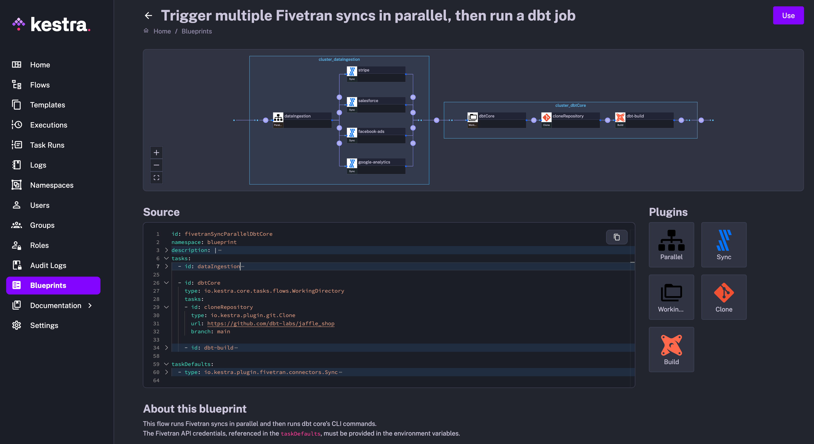
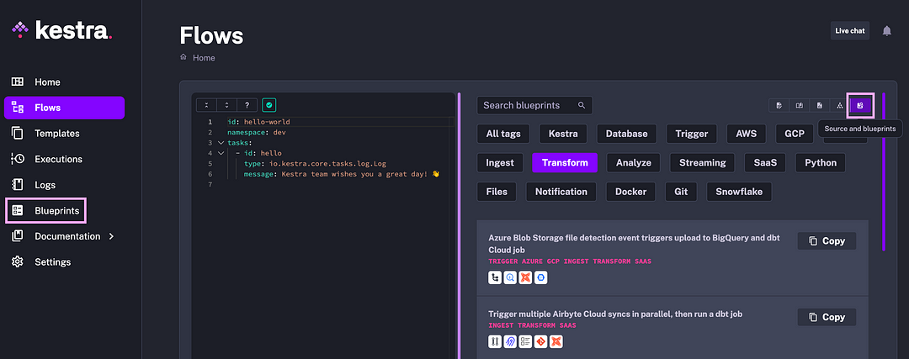

Data professionals are exposed to a growing number of tools in the data, AI, and engineering ecosystem. If you combined the logo of every tool used by a typical data team, you would likely get a picture resembling an app store. Amidst a wide variety of such apps, it can be challenging to integrate *existing* applications with *new* ones while retaining institutional knowledge and staying adaptable to change. We’ve  introduced a **new feature** in the [Kestra](https://github.com/kestra-io/kestra) UI called **Blueprints** to help you implement repeatable workflow patterns and share knowledge within your organization.

## Why Blueprints

### The first step is always the hardest

Blueprints are helpful because they make it **easier to get started**. Often the biggest hurdle to solving a challenging problem is just taking the first step. Blueprints help by providing a scaffold (…blueprint?) for a specific use case or integration.

### More time for work that is actually fun and rewarding

Many data management tasks are increasingly **standardized**. It doesn’t make much sense to write glue code yet again only to concurrently trigger several data ingestion syncs, then start a dbt or Spark transformation job, configure alert notifications, or invoke some process via a third-party API and report on their completion status. Instead of spending time writing imperative code to glue those standardized tasks together, you can just declare them in a YAML config, validate they work as expected, and move on to the next tasks quickly. Less time spent on *boring* glue code, more time left for *fun* code that adds value to your business. Blueprints further optimize that process by providing ready-to-use examples to help you iterate even faster.

### A better place for docs than docs

Blueprints serve as a natural extension to the docs. Instead of searching online resources for configuration or real-life examples, they are now available in a place where you need them most — right next to your code editor.

## What are Blueprints

Blueprints is a curated, organized, and searchable catalog of ready-to-use examples designed to help you kickstart your workflow. Each Blueprint combines code and documentation and can be assigned several tags for organization and discoverability.

All blueprints are validated and documented so that they *just work*. You can easily customize and integrate them into your new or existing flows with a single click on the “Use” button.

## Getting Started with Blueprints

First, start Kestra locally by downloading the [docker-compose file](https://raw.githubusercontent.com/kestra-io/kestra/develop/docker-compose.yml) and running `docker compose up -d`. Then navigate to the UI: http://localhost:8080/.

Blueprints are accessible from two places in the UI:

1. The left navigation **sidebar**
2. A dedicated **tab** in the code editor named *“Source and blueprints”,* showing your source code and Blueprints side by side.

Once you are on the Blueprints page, you can:

1. **Search** blueprints for a specific use case or integration, e.g., Snowflake, BigQuery, DuckDB, Slack, ETL, ELT, Pandas, GPU, Git, Python, Docker, Redis, MongoDB, dbt, Airbyte, Fivetran, etc.
2. **Filter** by a tag, e.g., filter for *Docker*, to see various ways to run containers in your flow. Or filter for *Notifications* to see several options for configuring alerts on success or failure.

## How to contribute to Blueprints

Blueprints, available out of the box, cover only the most common and standardized tasks. There are two ways to extend Blueprints with more nuanced workflow examples tailored to your needs.

1. **Community Blueprints:** use the [dedicated issue template](https://github.com/kestra-io/kestra/issues/new?assignees=&labels=blueprint&projects=&template=blueprint.yml) on GitHub to contribute a new Blueprint. We’ll then either add your Blueprint right away or leave comments to discuss and refine the flow together.
2. **Custom Blueprints:** while Community Blueprints are visible to everyone, the Enterprise Edition allows adding private fine-grained Blueprints available only to your organization. You can use them to share, centralize, and document commonly used workflows in your team. The combination of custom plugins and Custom Blueprints covers a wide range of integrations and workflow patterns tailored to your needs.

Blueprints facilitate fast feedback loops and knowledge sharing. No need to wait for the next release or implement a CI/CD workflow. Once the Blueprint is published, it’s available within the UI right away. No upgrade or restart is required. This way, you can quickly share institutional knowledge with your team. By combining custom plugins and blueprints, you can effectively build a private App Store for your data workflows.

## Next steps

We’re constantly expanding the collection of Blueprints. We hope you’ll enjoy using Blueprints as much as we enjoy creating them. Which use cases and integrations would you like to see covered next? If you have any suggestions about new Blueprints or improvements to the existing ones, submit a [GitHub issue](https://github.com/kestra-io/kestra/issues/new?assignees=&labels=blueprint&projects=&template=blueprint.yml) or ask us [via Slack](/slack).
