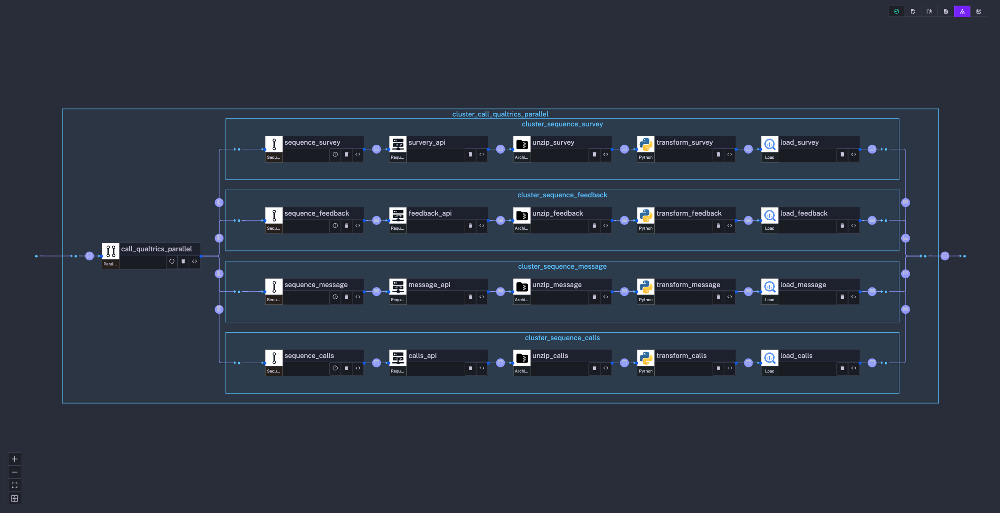
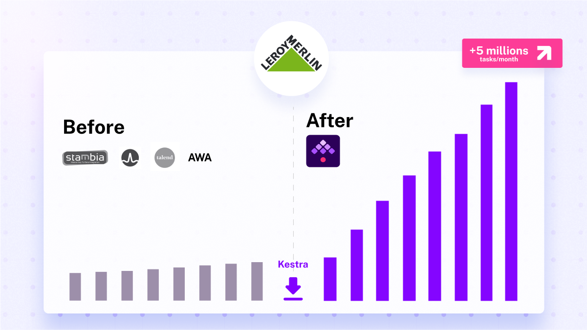

In its transformation journey towards a cloud-based data infrastructure, Leroy Merlin France (LMFR) a global retail company employing more than 24,000 people encountered significant challenges. At the time, they relied on a traditional on-premises data platform, using Teradata as its database, Talend for data integration, and then relied on global operations teams through service requests for scheduling using tools such as Dollar U and Automic Workload Automation. The team of 30 data engineers, organized by business domains, faced three major bottlenecks:

- An **infrastructure bottleneck** that required a rapid migration to a serverless cloud architecture using Google Cloud with BigQuery as the central source for business intelligence, analytics and AI.

- A **data pipeline bottleneck** that required re-architecting the bottleneck of a central data team to a decentralized data integration lead directly from the product team.

- A **delivery and automation bottleneck** that required the adoption of CI/CD and DataOps principles to improve data operations

Initially, LMFR turned to Apache Airflow, but a pilot project exposed several limitations. Looking for a better solution, they discovered [Kestra](https://github.com/kestra-io/kestra), a tool that not only fulfilled the initial requirements but also unlocked the potential for a Data Mesh Architecture, enabling several hundred data practitioners to collaboratively and securely produce high-quality data analytics.

Leroy Merlin France has experienced a 900% increase in data production over the past two years. After adopting Kestra, they experienced significant improvements in scalability, speed, reliability, data processing efficiency, and reduced cost.

## Selecting the Right Data Orchestration Solution ##

### Why Apache Airflow failed in their organization
Leroy Merlin France considered a managed Apache [Airflow](/vs/airflow) service through Cloud Composer as its primary data orchestration solution due to the popularity of this open-source project. However, upon applying Airflow to a pilot project, they encountered several major issues unacceptable for such an organization:

1. **Complexity in Simple Tasks**: The creation of workflows, previously straightforward, turned into a time-consuming task. Designing and maintaining DAGs amplified the complexity, causing processing delays and even generating bottlenecks instead of eliminating them.

2. **Reliability Issues**: Airflow proved unreliable, with tasks often failing due to the orchestrator itself rather than errors in the code. These reliability issues resulted in substantial time spent on unnecessary firefighting, reducing overall productivity.

5. **Security**: Airflow's architecture did not support triggering flows created by one team based on flows from other teams, raising security concerns. This lack of inter-team flow initiation became a significant hindrance to collaboration and secure orchestration.

3. **Long Processing Times**: In some cases, the duration of data flows orchestrated by Airflow was twenty times longer than the legacy workflow Airflow was supposed to replace, making it unsuitable for the low-latency, high-throughput requirements of their data operations. Airflow requires a significant amount of CPU and memory resources to handle even moderate workloads, leading to increased infrastructure costs and potential performance bottlenecks.

4. **Expensive**: The cost of using Google Cloud Composer escalated dramatically due to the involvement of many teams and the need to maintain multiple secured environments. With the company experiencing continuous growth, supporting multiple managed  Airflow environments would become financially unfeasible.
These limitations made the company realize that Airflow couldn't meet its data orchestration needs.

### How Kestra Has Overcome Airflow's Limitations
Kestra, with its unique architecture, addressed the issues that they faced with Airflow, providing a simpler, faster, and more reliable data orchestration solution:

1. **Simplifying Complexity**: Kestra is a Declarative Data Orchestrator, which means it allows users to describe workflows and tasks using a simple, high-level language (YAML). This approach simplifies workflow creation and management, making defining, maintaining, and iterating on building data pipelines easier.

2. **Reliable Architecture**: Kestra's robust architecture ensured tasks were no longer prone to failures due to the orchestrator, increasing overall productivity.

3. **Fast Data Processing**: Kestra's ability to efficiently orchestrate dataflows led to significantly shorter processing times, making it a suitable solution for their low-latency, high-throughput data operations requirements.

4. **Cost Savings**: Kestra's lightweight, event-driven architecture minimized CPU and memory resource consumption, allowing the organization to handle even complex workloads without incurring high infrastructure costs or performance bottlenecks.

>"In less than a month, with no previous experience in continuous deployment and data orchestration, I felt autonomous with my data flows and could collaborate with my teammates. Kestra had become a total necessity for me." *Data engineer*

---

## Orchestrate a Data Mesh Architecture

After adopting Kestra, the team has gained enough confidence and trust in its data infrastructure to implement [data mesh](https://www.datamesh-architecture.com/).

In a data mesh system, different data products take ownership of their respective data models, metrics, and reports, promoting an organizational structure where teams are fully responsible for their specific data domains.

The data mesh structure also emphasized the importance of a "self-serve data platform", with dedicated Data Platform teams providing the necessary tools and abstractions for domain teams to build upon.

Kestra proved invaluable in this context, catering to both novice and seasoned users. The intuitive UI facilitated swift development, while the integration of plugins and scripting capabilities allowed for the creation of highly customized pipelines.

With Kestra incorporating full integration of CI/CD tools,  such as Terraform and GitHub Action, the Data Platform team was able to maintain complete control over deployment and resource management. Kestra's API exposure of all its components also allowed for further customization when required.

For instance, a specific interface was constructed for business users to import data into the customer data platform (CDP), displaying columns, data types, and destinations. This interface then automatically created a Kestra flow to import the data into the CDP. Data practitioners had access to customized tools that improved automation while maintaining excellent governance practices.

The adoption of a simple yet scalable data mesh structure empowered business teams to independently produce and manage their data pipelines.

---

## Use cases

The following section provides concrete use cases enabled by adopting Kestra and data mesh.

### Scale Data Analysis & Data Science
Data analysts and scientists often spend more time on data wrangling than on core business problems. To scale practices and help data practitioners work on real problems, they use Kestra to automate SQL pipeline creation through the tight integration of Terraform with Kestra. This workflow allows to express SQL queries and table schema in Git and build Kestra flows automatically. It greatly simplifies their daily work as they only have to focus on SQL.

#### Simplified and Automated Architecture ####
The team adopted a simple yet robust architecture:

1.  They used generic Terraform code to create Kestra flows directly from SQL scripts, simplifying the pipeline creation process.

2.  For data table and view creation, they employed generic Terraform code that can interpret native Google API JSON responses (from the `bq show` command).

3.  They adhered to a standard folder tree structure in Git repositories for storing SQL scripts and schema definitions, facilitating easy navigation and management.

4.  They also introduced feed type management (WRITE_APPEND, WRITE_TRUNCATE, MODE_DELTA), to accommodate different data handling needs.

---

### Collect Customer Feedback into the Data Warehouse ###

Due to their extensive product range, collecting and ingesting customer feedback into a centralized system was crucial.

To do so, they implemented a robust data flow within Kestra. This flow involves four REST APIs provided by Qualtrics (customer feedback tool) for data collection.

To optimize performances and avoid resource overutilization, the data collection process is performed in batches of five, with parallelization using Kestra's workflow capabilities.

To handle large volumes of collected data efficiently, the flow includes segmentation of API calls and transformation operations on historical data. This approach helps manage the large data volume and improves performance.

The received JSON data from Qualtrics is unzipped within a Docker environment. Python scripts are then used to transform the JSON, applying recursive functions for standardization, field transposition/renaming, and pivoting surveys into a generic key/value format for storage in BigQuery.

---

### Custom Plugins: From Collection to Centralization
They aimed to further simplify the ingestion process and eliminate the burden of data loading. To meet this need, they developed a custom Kestra plugin, which automated several essential steps in their data handling process:

- **Archiving incoming data**: The plugin archives incoming data to a Google Cloud Storage Bucket, providing a reliable backup.

- **Validating data**: To prevent bad data ingestion, the plugin technically validates the data using an Avro schema. This ensures the appropriate typing (integer, date, etc.) of all incoming data.

- **Data versioning**: The plugin creates a new version of data if a breaking change in the schema occurs, ensuring continuity and consistency. You can think of it as their implementation of data contracts within Kestra.

- **Appending technical columns**: Technical columns such as data load time, execution ID are appended by the plugin, allowing full lineage tracing in the data warehouse.

- **Loading data into a temporary table**: Before final processing, the data is first loaded into a temporary table.

- **Quality checks**: The plugin validates data quality based on specific business rules (upper/lower bound checks, key validation with referential integrity checks, deduplication, etc.) before loading it into the Operational Data Store (ODS).

- **ODS loading**: The cleaned, validated data is finally loaded into the ODS, providing a mirror image of data from the incoming system.

Data transfer was set up via HTTPS directly to the Kestra API, reducing dependencies. In most cases, a simple `curl` command was used for triggering ingestion, or a straightforward HTTP client was developed to reach the Kestra API.

---

### Enhance Supply with Report Automation ###
To support charitable initiatives, each store allocates a portion of the margin to be donated to program-affiliated associations. The task of calculating these sums, informing store leaders, and providing payment details is managed by Kestra.

The data platform team used Kestra's capabilities to develop a dedicated workflow to handle this process. This workflow calculates the precise amounts to be allocated based on store performance metrics and other relevant data. The resulting sums are then prepared for distribution to the respective stores.

The flow then initiates Kestra's email tasks to generate personalized emails and the notification task to send a message to the store manager. These emails detail the exact sum to be contributed and provide clear instructions on the payment process.

Despite the intricacies of handling large volumes of data and coordinating personalized communication across numerous stores, the overall task was relatively easy. Thanks to Kestra's efficient orchestration capabilities, creating the files, generating the emails, and dispatching them were simple and efficient.

---

## Sustaining Growth at Scale

Before Kestra integration, domain teams executed less than half a million tasks monthly. Leroy Merlin France used tools such as Talend, scheduled by DollarU or AWA, but moving toward cloud and scale processes was a significant bottleneck.

However, with the shift to a data mesh organization and Kestra's integration, their task management surged to over 5 million tasks monthly, which amounts to 75 days of processing every single day!

That growth was not possible to accomplish with Apache Airflow.

>"Kestra is the unifying layer for our data and workflows. Rather than trying to do it all, it provides a highly open and extensible plugin architecture that connects to everything and allows tasks to be embedded from potentially any application or programming language. You can start small, but then there is no limit to the possibilities and scalability of such an open architecture." *Head of Data Engineering*

---

## Next steps

Kestra effectively addressed Leroy Merlin France's initial needs and exceeded expectations by facilitating an unexpected yet highly beneficial result: the establishment of a data mesh architecture.

By implementing a data mesh, Kestra has empowered teams throughout the organization to independently manage and produce their own data pipelines. This not only promotes efficiency and reduces bottlenecks but also encourages ownership. Over a span of 18 months, the cumulative user base expanded by more than **900%**, totaling over **500 users**. These users transitioned from legacy tools, which supported only a limited set of executions and faltered at scale, to executing millions of tasks per month with Kestra, thereby generating significant value for their business.

If you have any questions, reach out via [Kestra Community Slack](/slack) or open [a GitHub issue](https://github.com/kestra-io/kestra).

If you like the project, give us [a GitHub star](https://github.com/kestra-io/kestra) and join [the open-source community](/slack).
