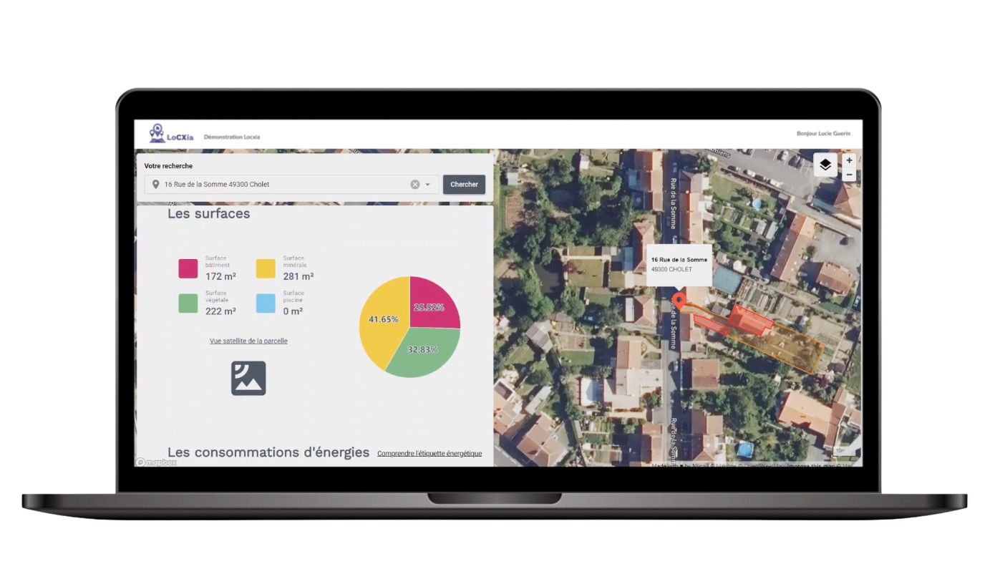

Ntico has designed [Locxia](https://www.locxia.com/), a powerful platform that gives businesses and local authorities a deeper understanding of their territories and residents thanks to satellite imagery. At the core of their solution lies [Kestra](https://github.com/kestra-io/kestra), used for ingesting, processing, and visualizing vast datasets.

This post dives into how Ntico uses Kestra to create and manage data pipelines for its digital solution.

## About Ntico

[Ntico is a French consulting and software company](https://www.ntico.com/), specializing in developing data-driven applications and managing intricate projects.

They provide consulting, data analysis, and software development services tailored to enhance operational efficiency.

Additionally, Ntico offers operational services encompassing production, network infrastructure, cloud, and security solutions. Their expertise extends to advanced logistics solutions that maximize productivity and streamline supply chains.

Ntico's unique offerings include Locxia, a data platform designed to develop comprehensive insights into territories and their inhabitants.

## About Locxia

Locxia is a data platform focused on housing data. Developed by Ntico's data experts, it empowers businesses and local authorities to better understand their customers and territories. The platform provides access to over 250 value-added data sourced from satellite images and public data; all consolidated and accessible on a dedicated platform.

Their use-case is primarily aimed at large retail companies or specialized distribution brands, aiming to supplement their customer databases with reliable data that are easily accessible through their business applications (CRM, BI, etc.), thereby improving their customer knowledge. Additionally, it assists local authorities in better understanding their territories, enabling them to construct and communicate their public policies more effectively.

They provides a wide range of data at a very low granularity:

* Outdoor development: presence of gardens and swimming pools, surfaces, etc.
* Buildings & installations: nature, ground surfaces, etc.
* Energy diagnosis: Energy Performance Diagnostics (DPE), etc.

## Kestra

To support high data volume and scalability requirements, Ntico experts chose Kestra as the data orchestrator powering Locxia.

### Advanced Data Ingestion and Processing

Kestra is used in the process of coordinating data ingestion processes for Locxia. It handles extensive datasets from diverse sources such as APIs, open-data platforms like [data.gouv.fr](https://www.data.gouv.fr/fr/) and [IGN](https://geoservices.ign.fr/), as well as raw satellite images. Kestra manages the scraping and ingestion of these sources, and then efficiently pushes this data into an [AWS S3 bucket](https://aws.amazon.com/s3/). The S3 bucket serves as the central data repository, storing the scraped data content predominantly in GeoJSON which is a geospatial data interchange format based on JavaScript Object Notation (JSON) format.

> “Kestra is really good because it can be used by a beginner as well as an expert!” Thomas Depierre - NTICO Engineer.

Right from the onset, the team at Ntico knew they would be dealing with an enormous amount of data - terabytes worth of valuable, detailed geospatial data. The challenge was to create a platform that could effectively handle this vast volume of information, not just in terms of storage, but in data processing and cost management as well.

As an integral part of the Locxia platform's inception, Kestra provided the scalable, efficient, and cost-effective data orchestration capabilities that Locxia needed.

### Manage Application Tokens

When users register and connect to Locxia, the Ntico application backend seamlessly integrates with Kestra. This integration enables Kestra to generate and rotate tokens, providing a secure and efficient authentication mechanism for users accessing Ntico's services.

It demonstrates how Kestra is not only a data orchestrator for analytics: it can cover a wide range of orchestrated processes such as business operations, resource management or application integrations.

### Great User Experience

Locxia’s team made full use of [Kestra's user interface](../../docs/09.ui/index.mdx). The platform's topology view was instrumental in managing Locxia's extensive data workflows. It gave the team an immediate visual representation of task dependencies, improving their understanding of the entire data pipeline. This holistic perspective facilitated the planning and execution of necessary modifications effectively.

A standout feature appreciated by the Ntico developers was Kestra's openness to customization: if anything needed custom development, they could bring their own business logic and technical needs thanks to Docker support. Hence, they have the total freedom to create their own pipelines and build new systems quickly.
Moreover, they develop flows in the proper user interface - allowing to limit context-switching with integrated documentation and full topology view. They also follow best practices for continuous integration and development thanks to the integration with GitHub Action.

> “Kestra's scalable and cost-effective data orchestration capabilities provided the foundation for our data platform Loxcia, allowing us to effectively handle and process vast amounts of geospatial data.” Emmanuel Santerne - NTICO Associate

## Conclusion

The collaboration between Ntico and Kestra has been instrumental in the development of Locxia, a modern data platform that revolutionizes the understanding of housing data. As specialized in logistics optimization and data-driven solutions, Ntico recognized the need for a robust data orchestrator to handle the vast volumes of geospatial data involved in Locxia.

By leveraging Kestra's simple data ingestion and processing capabilities, Ntico successfully tackled the challenges associated with diverse data sources, including APIs, open-data platforms, and raw satellite images. Kestra served as the backbone of Locxia, effectively coordinating data ingestion processes.

Moreover, Kestra's user-friendly interface and customizable features empowered the Ntico team to design and build tailored data pipelines. This flexibility allowed Ntico to bring their own business logic to the platform, ensuring that Locxia met their specific requirements.

Ntico's choice of Kestra as the data orchestrator for Locxia has resulted in a remarkable data platform that empowers businesses, local authorities, and retail companies to gain deep insights into their customers, territories, and housing data. Kestra's advanced capabilities, scalability, and customization options have played a pivotal role in enabling Ntico to deliver a reliable, accessible, and efficient solution for data-driven decision-making.
