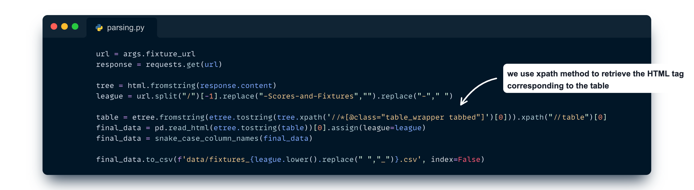
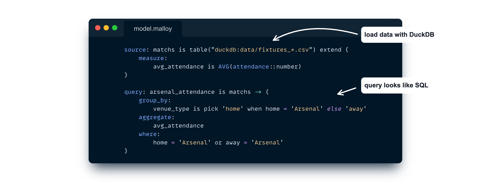
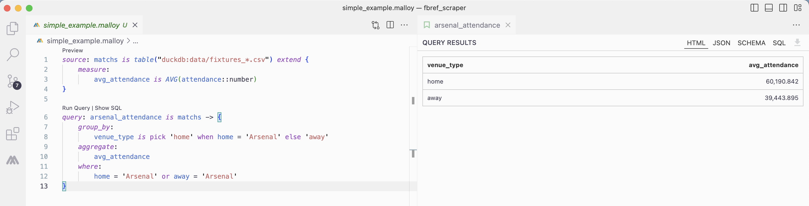
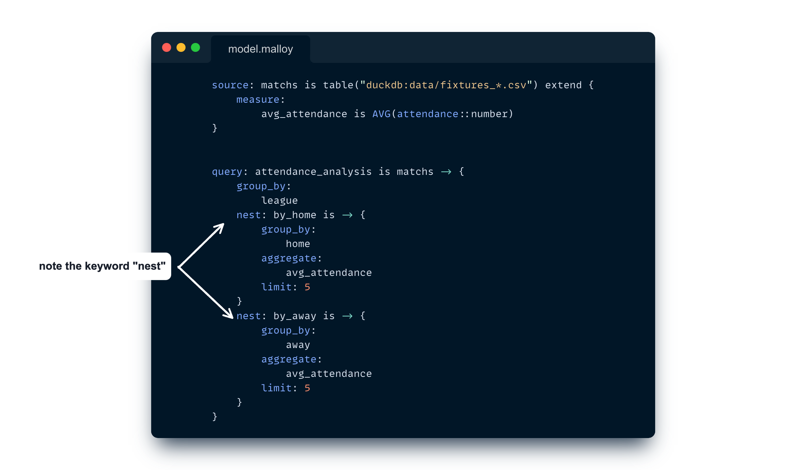
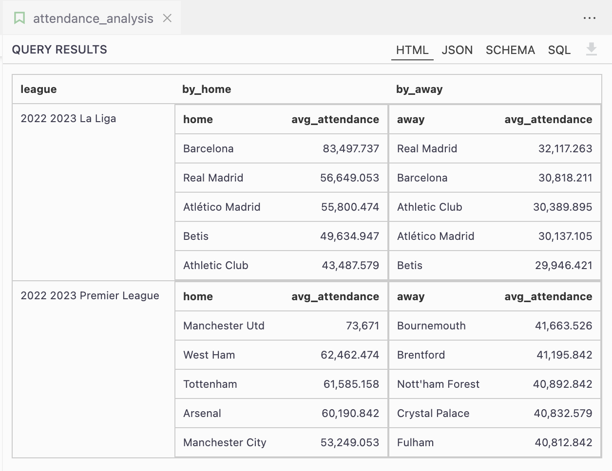
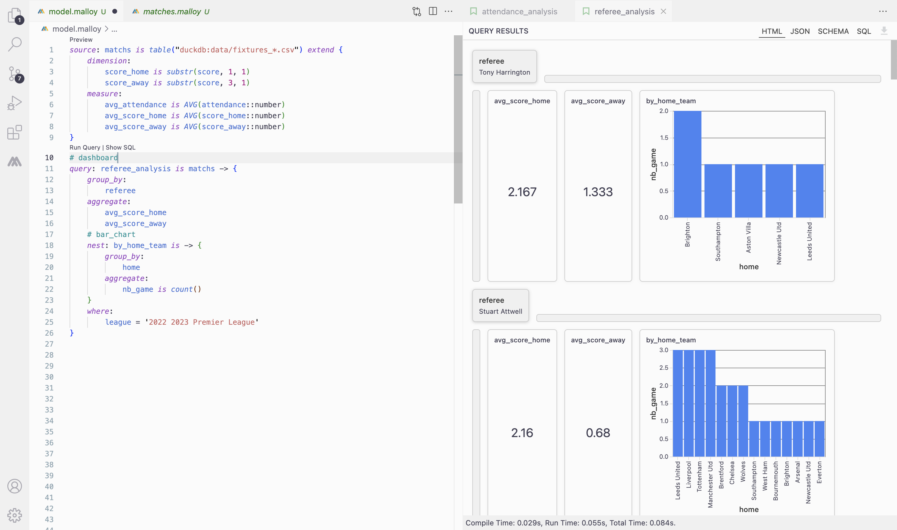
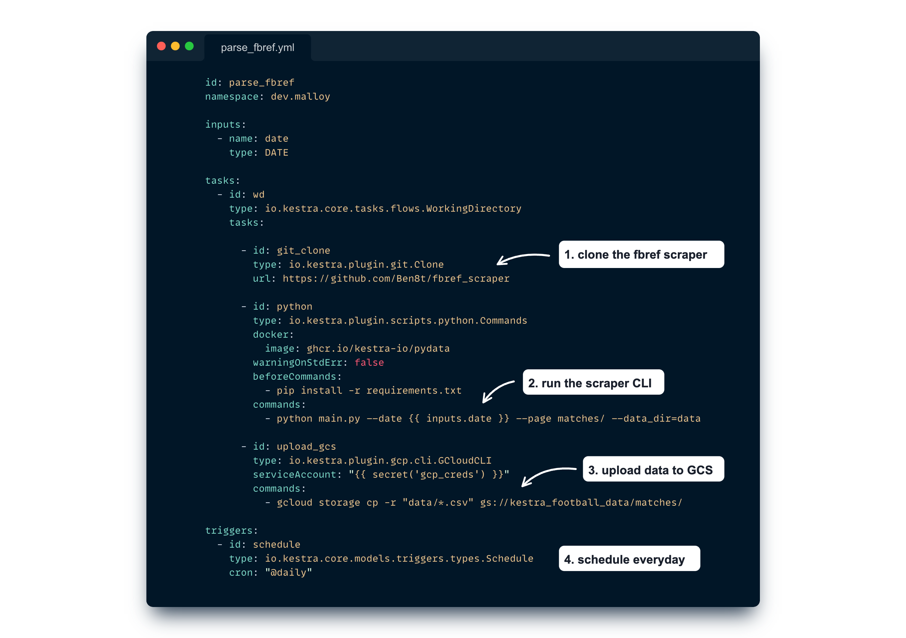

Accessing football data has never been more convenient than it is today. With [public websites](https://fbref.com/) featuring user-friendly bot policies and [private companies opening up their datasets](https://github.com/statsbomb/open-data), getting started with football analytics is [a far smoother journey than it was just a few years ago](https://medium.pimpaudben.fr/part-2-a-career-in-football-analytics-the-how-ae8b5eca38ce).

But, here’s the real challenge: once you have the data, how do you effectively process and analyze it? While the traditional route may involve opening a Jupyter Notebook or an RStudio session, it often lacks the simplicity of replication, automation, and clean semantics.

Until recently, orchestrating data ingestion, constructing robust analysis, and automating the entire process seemed like a task requiring a Ph.D. in data engineering.

Is there a more straightforward approach to enhance the reliability of our analysis and automate data scraping?

In this blog post we will see how using the last data tool kids in the block helps us to fetch football data, perform powerful yet simple queries, and seamlessly manage the entire process.

## Get Football Data out of Fbref.com

[fbref.com](https://fbref.com/) is a well-known website for football analytics enthusiasts: it covers many competitions with a lot of statistical details for games, teams, players, etc.

From a data-engineering perspective, fbref facilitates the task for us: it has quite nice [scraper policies](https://www.sports-reference.com/bot-traffic.html) and has a very simple design making the scraping task not a painful challenge.

You could find a [specific scraper project in this repository](https://github.com/Ben8t/fbref_scraper/tree/main): at the moment of writing it contains parsers for the matches/ and the fixtures/ endpoints.

It’s quite straightforward, as we only need to retrieve table tags and write them as proper CSV files. Here is an example of how we parse the table for the competition fixtures pages:

If you’re willing to explore the whole parsing strategies and dedicated CLI, [check out the project on GitHub](https://github.com/Ben8t/fbref_scraper).

## Use Malloy to analyze teams scores and fixtures

Once we have some data we can start diving into analysis. To do so, we’ll use the new language introduced by some Google fellows recently : [Malloy](https://www.malloydata.dev/).
If you don’t know Malloy already, I urge you to watch this [talk made during the Data Council conference in 2023](https://www.datacouncil.ai/talks/malloy-an-experimental-language-for-data?hsLang=en).

Long story short: Malloy is an open source language that offers a new way to compose with data. When you’re working with complex data, and want to see the relationships between data, you often end-up in complex queries.

Malloy wants to break the “rectangle shapes” of data. Most data exists in hierarchies (orders, items, products, users). Most query results are better returned as a hierarchy (category, brand, product).

Malloy provides a smart semantic to deal with hyper-dimensional data, nested queries and dimension/measure modelling.

Let’s start with a simple example on our freshly scraped data:

This query allows us to compute the average attendance of Arsenal team depending on the game venue (home or away).

Malloy currently supports reading data from [BigQuery](https://cloud.google.com/bigquery), [DuckDB](https://duckdb.org/) and Postgre. We’re using the DuckDB engine here for easier reproducibility.

They are many interesting things to notice in this simple example:

* **measure**: Malloy is composable by design. It means that you write computations one time and reuse them whenever you need them in subsequent queries. It helps a lot to build a simple metric layer.
* **looks like SQL**: in fact Malloy compiles to SQL in the end. Therefore, it has group_by, aggregations, filters, and all common SQL features.

Malloy can be run directly in your VS Code editor, from Python, Node or with a dedicated CLI. It also comes with a notebook-like component, which is great to create complex reports.

This first example is very straightforward and doesn’t bring new things compared to SQL. Things get very interesting when we look at complex queries:

See how we neatly [nest](https://malloydata.github.io/documentation/language/nesting) results here? Doing this in SQL would be much trickier. Looking at Malloy’s compiled SQL gives us a hint about the complexity in regular SQL.

Furthermore Malloy supports some plotting features with simple tags such as below example. Just add # bar_chart will draw a bar chart for each nested result.

Same, with # dashboard tag a query is rendered as a dashboard, dimensions aligned at the top, and aggregates and nested queries float within the dashboard.

You can check [all rendering tags in the documentation](https://malloydata.github.io/documentation/visualizations/overview).

I encourage you to look at the whole documentation, especially [the common pattern section](https://malloydata.github.io/documentation/patterns/yoy) showcasing the power of Malloy.

## Orchestrate & Schedule with Kestra
Now that we have a scraper to get data and a tool to analyze them, we need to link the two on a schedule.

That’s where Kestra makes the glue !

[Kestra](https://github.com/kestra-io/kestra) is an open-source declarative orchestrator. You can write data workflows using YAML files and trigger executions seamlessly.

Let’s create a first flow to scrape matches results every day.

This Kestra Flow does several things:

* Clone the fbref parser project we mentioned earlier.
* Run the main python script to download matches data at the given input date.
* Upload data to Google Cloud Storage.
* We scheduled this flow daily, so everyday it will download the latest games data.

Now that we have a process to get data everyday, we can move on to analysis automation with Malloy.

In a separate flow we use the Malloy CLI Kestra plugin to run Malloy commands on our data:

In this flow we have the following tasks:

1. Download our data back to Google Cloud Storage. We could have passed data through the two flows but we prefer to save our data in a dedicated space — the “data lake way” — it’s better for keeping all data in one place.
2. Write some inline Malloy scripts to analyze differences between goals and expected goals, nested by venue (home/away). In a production environment we would have preferred to store those scripts in a dedicated GitHub repository and use the Git clone Kestra plugin to retrieve them in our Flows.
3. Run the Malloy CLI and expose data results in outputs (so they can be used afterward in downstream flows for example).

Here we export Malloy results to a JSON file, but we could have saved those to BigQuery tables for example, enabling us to connect dashboard tools such as [Looker](https://cloud.google.com/looker-studio), [Metabase](https://www.metabase.com/) or [Superset](https://superset.apache.org/).

If you want to know more about Kestra and its wide range of possibilities, I encourage you to look at the documentation and join the community on Slack.

---

Nowadays we often see whole [dbt](https://www.getdbt.com/) projects trying to denormalize data to allow a broader usages in any analytics project.

Malloy, and the semantic layer in a more general view, offers a way to denormalize on the fly. It opens the box for normalization in dbt or upstream projects, keeping all data models clean and well arranged, making high dimension and complex analytics rendering a downstream and easier task.

This whole exercise showcases how having a proper domain system language (DSL) for dealing with complex concepts is a keystone.

With Malloy for high dimension modelling and Kestra for declarative orchestration, we perceive what could be the dreamed data stack: a stack with fewer tools, each of them allowing end users to express their need in a fluid way, with proper semantics.

Indeed, a data stack with a proper user experience.

Feel free to share your vision of the perfect data experience! Reach out via [Kestra Community Slack](/slack) or open [a GitHub issue](https://github.com/kestra-io/kestra).

If you like the project, give us [a GitHub star](https://github.com/kestra-io/kestra) and join [the open-source community](/slack).

