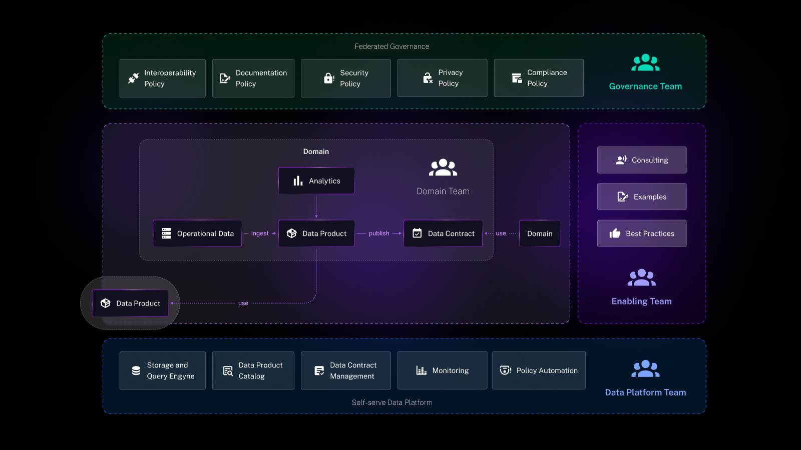

Platforms such as Zapier and Make have empowered a new wave of citizen developers—business users who can build applications and workflows to meet their immediate needs without writing a single line of code, helping businesses to innovate rapidly and respond to changing customer demands with minimal delay.

But it seems that almost everyone forgot something in the equation, is the IT System Department aware of what the business is doing? Do they have a view on what the marketing, the sales team, or the product team are doing on their side, and is the information shared across all systems of the organization?

This is what we are going to talk about in this blog post and how we need tools that are both suitable for business users and the IT department.

## The Data Mesh Model: A Prelude to Unified Usage

The concept of a data mesh has made significant inroads into how we handle and disseminate information within organizations. It champions the idea of decentralized data ownership, where domain-specific teams manage their data as a product. However, it's not just the data that needs this democratization; the actual usage and operational workflows need to reflect this model too.

Business users must become the owners of their workflows—designers of their processes and architects of their outcomes. To realize this vision, the empowerment of business users through technology is critical. Some of those tools as mentioned in the introduction have, quite literally, put the power of automation into the hands of the marketer, the sales executive, or the HR manager.

 But this power comes with an underlying risk—the growth of shadow IT. These well-intentioned solutions can inadvertently lead to the creation of isolated pockets of IT, hidden from the centralized governance that a unified IT environment provides.

## Business User Empowerment vs. Shadow IT

The heart of the matter lies in the balance between empowerment and control. Business users need the freedom to manipulate their tools and workflows, yet this needs to be under the umbrella of a centralized IT strategy to avoid the pitfalls of shadow IT. When business departments take tech matters into their own hands without IT oversight, the risks can escalate—data breaches, compliance issues, and inefficiencies are just the tip of the iceberg.

In the name of digital agility, businesses often encourage their teams to solve problems using the most immediate and accessible technological solutions. This trend has given rise to no-code and low-code platforms, empowering non-technical business users to create applications and automate processes independently.

### Understanding the Implications of Empowerment and Shadow IT

Empowerment through technology allows business users to act swiftly, addressing their operational challenges without waiting for engineers interventions. For example, a sales team might use a low-code platform to quickly build a customer tracking system tailored to their specific needs, bypassing lengthy developpers queues.

The downside to this approach arises when such systems are deployed without IT oversight, potentially resulting in security gaps, data inconsistencies, and regulatory noncompliance. These risks are particularly pronounced when sensitive data is involved or when these systems need to integrate with established enterprise IT infrastructure.

### How to Strike the Right Balance

To achieve the right equilibrium, organizations can adopt several measures:

1. **Approved Technology Lists**: Organizations can create a list of approved technologies that meet their security and compliance standards.
2. **Regular Sync-Ups**: Establish channels for regular communication between IT and business units to ensure that new tools align with the broader IT framework and company policies.
3. **Transparent Oversight**: Integrate systems that track and manage the applications and tools being used across the company, ensuring that the owners has a clear view of the technology landscape.
4. **Focused Education**: Offer training for business users that covers the critical aspects of IT policy, data handling, security, and compliance to minimize uninformed risks.

The future points towards a cooperative IT framework that places the IT department in a guiding role, helping to navigate the complexities of technology choices while empowering business users to contribute to technological solutions. This collaborative environment should offer platforms and guidelines that enable users to innovate within a secure and compliant structure.

By pursuing this balanced approach, companies can capitalize on the proactive initiative of their teams while safeguarding against the fragmentation and risks associated with shadow IT. The goal is a cohesive, secure, and efficient IT environment that supports the business's objectives and drives growth.

### Choosing the Right Development Approach: Context Matters

The debate between no-code/low-code platforms and traditional coding is not a matter of absolutes but a question of context. The decision hinges on several factors, including a company's size, its in-house technical expertise, and the specific needs of the business.

For startups or small to medium-sized enterprises without a dedicated developer or engineering team, no-code and low-code platforms can be invaluable. They enable these companies to build functional applications quickly to serve immediate business needs or validate new market opportunities without heavy investment in technical resources.

However, for larger organizations or those with complex, specialized needs, these platforms might serve best as a starting point or a rapid prototyping tool rather than the foundation of their IT strategy. The simplicity and speed of no-code/low-code can sometimes come at the expense of customization and scalability, which are often non-negotiable in large-scale environments.

### Balancing Flexibility with Structure

Recognizing the diverse needs of businesses, more automation platforms are now offering dual functionality: a code editor for developers and a low-code/no-code editor for business users. This versatility caters to varied use cases within the same organization, allowing non-technical business users to create straightforward workflows while giving developers the tools to build complex systems with greater precision and control.

For instance, Zapier’s AI Beta represents a step towards this middle ground, aiming to streamline workflow creation with the help of AI. This feature seeks to minimize the trade-offs associated with no-code solutions by offering a more intelligent and adaptable toolset that can potentially satisfy a broader range of business requirements.

## The Case for a Hybrid Model

A hybrid model can offer the best of both worlds. No-code and low-code platforms can empower non-technical users to take initiative and respond quickly to business needs, while traditional coding remains available to address more intricate, long-term projects that require deeper customization and integration.

By implementing a hybrid approach, companies don't have to choose between speed and sophistication. They can enable rapid deployment where it's needed and maintain rigorous control where complexity demands it. This balance allows businesses to remain agile and innovative without sacrificing the robustness and scalability that IT governance ensures.

In the end, the choice isn't necessarily about picking one approach over the other; it's about finding the right tool for the job at hand and recognizing that as a company grows and evolves, its tools may need to evolve as well.

### Advocating for a Centralized IT Strategy with User Empowerment

That’s why a  shift is required—one that advocates for the centralization of IT without sidelining business users. The solution should encompass the following elements:

1. **User-Friendly Workflow Design**: Business users should have access to tools that allow them to design and manage their workflows intuitively.
2. **Centralized Oversight**: All user-created workflows and tools should be visible to IT, ensuring governance, security, and alignment with broader business goals.
3. **Collaborative Ecosystem**: The tools must promote collaboration between business and IT, allowing for co-creation and shared understanding.

## Kestra: Harmonizing Business and Engineers

We provide solutions that simplify complex orchestration challenges without burdening your system with additional layers of complexity. Our platform is uniquely designed to cater equally to the needs of both business users and  engineers, ensuring a harmonious and efficient operational environment.

Kestra strikes the perfect balance, offering the simplicity and flexibility essential for modern businesses. We empower users, from business analysts to engineers, ensuring that everyone can contribute effectively within a unified system.

Interested in learning more about how Kestra is addressing complex orchestration challenges with ease and efficiency? Read our blog post on [How to Solve Complex Orchestration Problems Without Adding Complexity](../2023-12-14-orchestration-problems-and-complexity/index.md)

If you have any questions, reach out via [Slack](/slack) or open [a GitHub issue](https://github.com/kestra-io/kestra).

If you like the project, give us a [⭐️ GitHub star](https://github.com/kestra-io/kestra) and join [🫶 the community](/slack).
