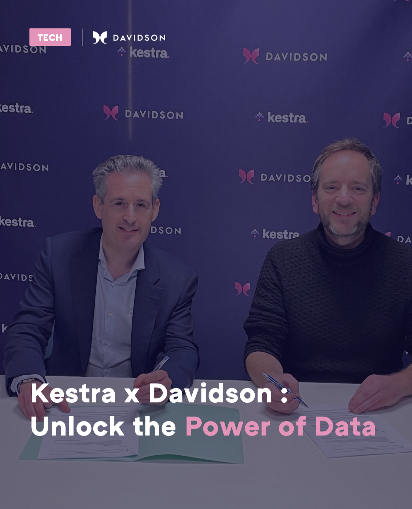
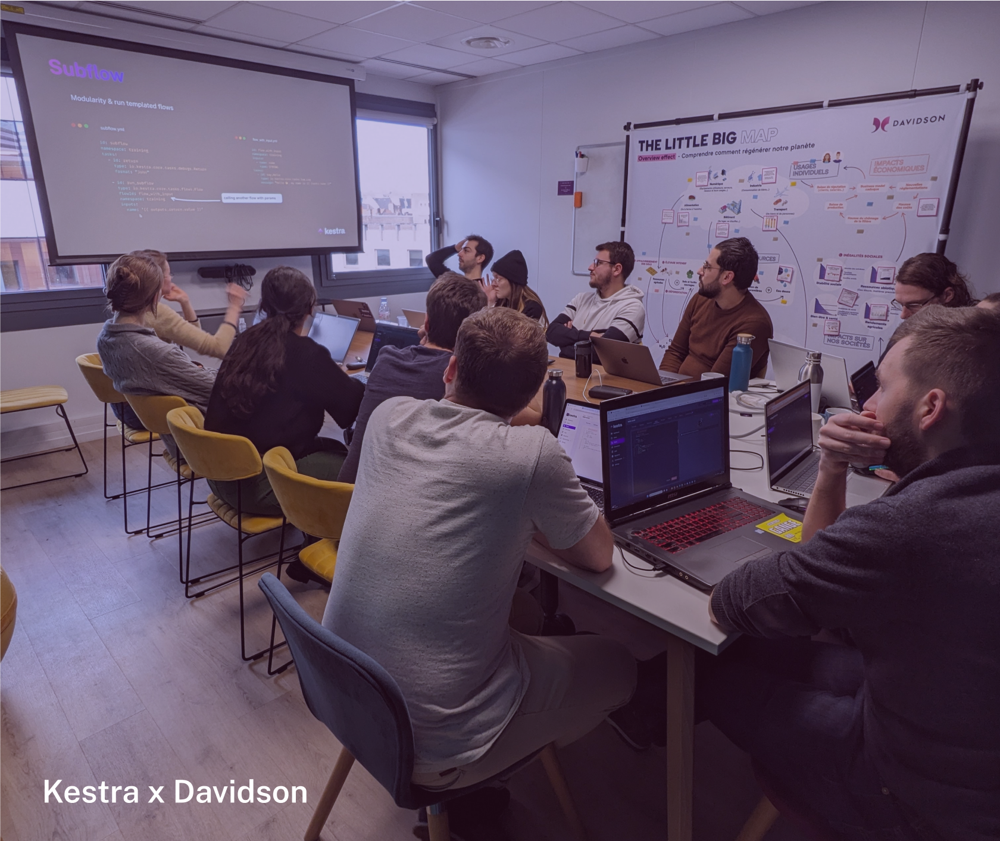

We are excited to announce our partnership with [Davidson](https://www.davidson.group/), a leader in the consulting industry known for its expertise in digital transformation and modern technologies.

> "Partnering with Davidson was a natural fit. We’re sharing the same values herited the open-source DNA and a common sense to solve businesses pains with cutting-edge technology."
*Quentin SINIG, VP Go-to-Market at Kestra.*

> "By partnering with Kestra, we gain access to scalable and customizable capabilities that will allow us to fully leverage all the market opportunities.
*Nicolas Lecaplain, Business Unit Director*

## About Davidson
Davidson is a renowned management consulting and technology expertise firm established in 2005. Davidson has made a significant impact in the industry with its expansive network across France, Switzerland, Belgium, the United Arab Emirates, Spain, and Germany. Boasting over 2,000 employees they stands out with their unique approach to consultancy, focusing on domains such as cloud infrastructure, telecomunication, Big Data & AI, smart factories, healthcare, and finance.

### Why This Partnership Matters
We're thrilled to have Davidson on board as our partner! Davidson's approach is refreshingly different: by cultivating an environment where creativity and collective intelligence are the norm,  they stand out as unique incubators of innovation. This collaborative spirit is exactly what we were looking for in a partner, and we're confident that together, we can achieve great things.

### Davidson's Commitment to Excellence
Davidson’s expertise supercharges Kestra’s platform. In less than 60 days, we were impressed by their capacities to enable an entire department at full speed, leading to commercial discussions with multiple industry leaders and 18 certified consultants! And that’s only the beginning…

### A Synergistic Partnership
Our Engineering teams collaborated for weeks on readily available solutions for advanced automation needs. Meanwhile, our Sales teams aligned on a comprehensive delivery approach covering everything from single technical assistance to structured Proof of Concepts. This combined effort, already battletested with a couple of customers, empowers companies to implement robust, collaborative orchestration solutions efficiently.

### Empowering Businesses with Advanced Orchestration
Together, Kestra and Davidson are committed to empowering businesses to implement simple, powerful, and collaborative orchestration solutions more effectively. This partnership will provide businesses with the support they need to implement Kestra in their operations successfully, ensuring they get the full benefits of advanced workflow orchestration.

### Knowledge sharing and Community Engagement

This partnership will also feature a knowledge exchange program, including joint training and workshops. We're excited about the opportunities for mutual learning and community engagement this collaboration will foster.

## Get Involved

Stay tuned for more updates on this exciting partnership. For more information or to get involved with our joint initiatives, please contact us through [Slack channels](/slack). We're eager to explore this new chapter with Davidson and invite you to join us on this journey!

