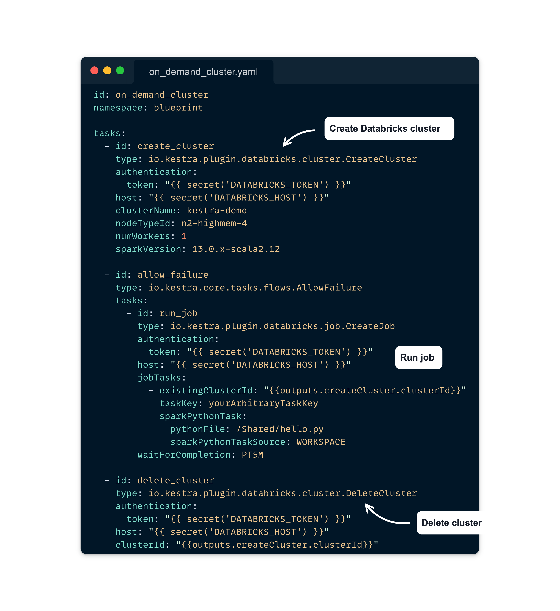
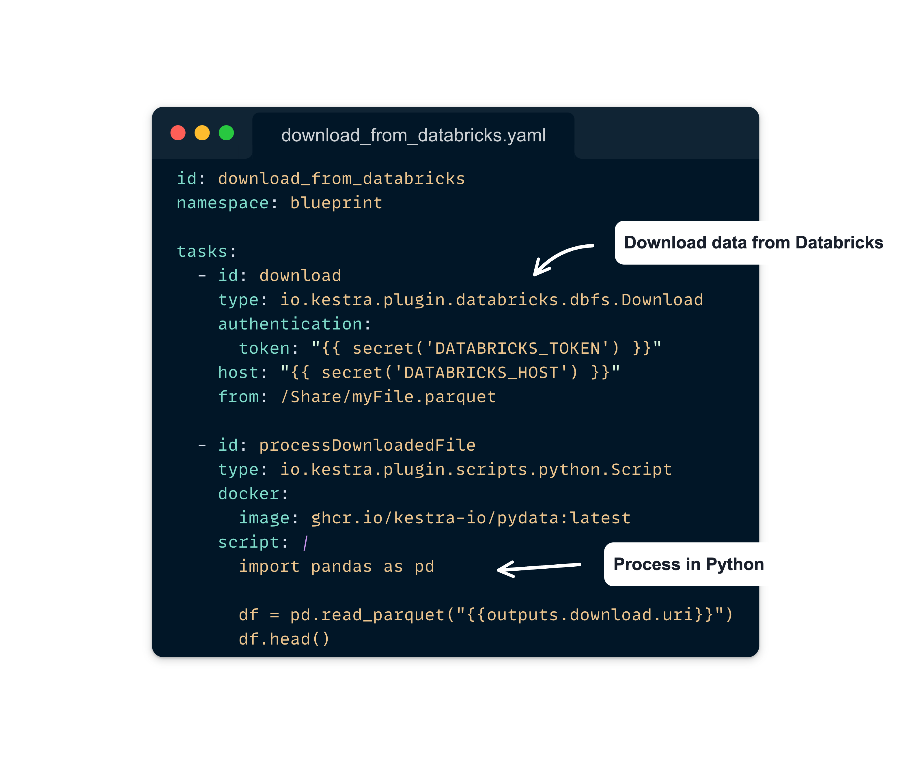

**We're excited to announce a strategic partnership between [Kestra](https://github.com/kestra-io/kestra) and [Databricks](https://www.databricks.com/), uniting our strengths to enhance the data orchestration and analytics landscape. This collaboration is set to empower data teams by integrating Kestra's orchestration capabilities with Databricks' unified analytics platform, offering a comprehensive solution for managing complex data workflows.**

## About Databricks

Databricks offers a unified platform that facilitates collaborative work across data science, engineering, and analytics teams. Their platform is engineered to simplify the data lifecycle, encompassing preparation, exploration, analytics, and machine learning, all within a cloud-based environment. Designed to manage the full spectrum of the data and analytics lifecycle, from ingestion to visualization and machine learning, Databricks stands as a comprehensive tool for organizations aiming to leverage advanced analytics and big data in a cloud-centric world.

The platform's architecture, built on the foundation of open-source projects like Apache Spark, Delta Lake, and MLflow, ensures data sovereignty while promoting collaboration through shared data and AI workloads. Databricks' commitment to an open, unified, and scalable system helps organizations to reduce costs and accelerate the delivery of their data and AI initiatives. With features like natural language search and development, automatic optimization, and robust governance and security measures, Databricks simplifies the complexity of data management and AI application development, offering an adaptable solution that scales with the demands of any business, from startups to global enterprises.

## Kestra's Integration with Databricks

Kestra leverages this advanced architecture to provide dynamic data workflow management, enhancing Databricks' capabilities with efficient orchestration and scheduling. Through our partnership with Databricks we offer a way to simplify the execution of data engineering tasks, from managing compute clusters and interacting with the Databricks File System (DBFS) to executing SQL queries and scheduling jobs directly on the Databricks platform.

Kestra's plugin for  Databricks extends the platform's functionality, allowing for efficient data processing and transformation. This integration empowers data teams to leverage Databricks' compute and storage resources more effectively, optimizing data workflows and reducing operational costs.

### **Practical Applications of the Kestra-Databricks Integration**

The integration between Kestra and Databricks leverages the strengths of both platforms to offer comprehensive solutions for data orchestration and analytics. Here's a deeper dive into how this partnership empowers users with practical applications:

1. **Dynamic Compute Cluster Management**: Automating compute cluster operations in Databricks with Kestra significantly streamlines resource management. Users can dynamically scale computational resources up or down based on the workflow's requirements, enhancing efficiency and optimizing costs. This is achieved through Kestra's **`CreateCluster`** and **`DeleteCluster`** tasks, which provide granular control over the lifecycle of compute clusters in Databricks. By specifying parameters such as cluster name, node type, number of workers, and Spark version, users ensure that each workflow has the exact computational resources it needs, when it needs them.

2. **Efficient Data Movement**: The **`Upload`** task in Kestra simplifies moving data to and from the Databricks File System (DBFS), eliminating the manual handling of files and streamlining the data workflow. This capability is particularly useful for workflows that involve preprocessing data in DBFS before analysis or moving results out of Databricks for further processing or visualization. By automating data uploads and downloads, Kestra ensures that the right data is available at the right stage of the workflow, facilitating seamless data pipelines.

3. **Streamlined Data Queries**: Executing SQL queries within Databricks using Kestra's task system brings a new level of efficiency to data processing. The **`Query`** task allows users to perform operations directly on data stored in Databricks, from data transformation to analytics. This integration is vital for workflows that require iterative data exploration, complex transformations, or aggregations before downstream processing. By embedding SQL execution within the orchestration workflow, Kestra enhances Databricks' data processing capabilities, enabling more sophisticated data analysis and decision-making based on real-time insights.

Through the Kestra-Databricks integration, users benefit from a more cohesive and streamlined approach to managing data workflows, from infrastructure management to data processing and analysis. This partnership enhances the capabilities of both platforms and empowers users to tackle more complex data challenges with greater agility and precision.

## What's Next

Our collaboration with Databricks is the beginning of a strategic partnership designed to evolve. We're dedicated to deepening this relationship, aiming to unveil new functionalities and use cases that will further empower our users. Expect to see a range of exciting developments as we continue to explore the synergies between Kestra and Databricks.

Stay tuned for updates on additional integrations and case studies showcasing how this partnership is facilitating more efficient, scalable, and effective data management strategies. For a closer look at how Kestra and Databricks are working together today, check out our [blueprints](/blueprints?page=1&size=24&q=databricks). These resources are designed to give you practical insights into leveraging our combined strengths for your data projects.

If you have any questions, reach out via [Slack](/slack) or open [a GitHub issue](https://github.com/kestra-io/kestra).

If you like the project, give us [a GitHub star](https://github.com/kestra-io/kestra) and join [the community](/slack).
