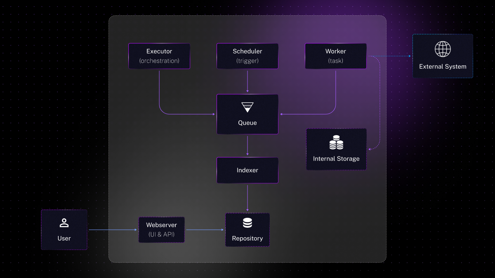

One of the recent Kestra evolutions I was responsible for was multitenancy support, a critical feature for providing scalable and secure data management solutions to a wide range of clients. This blog post delves into how we're implementing multi-tenancy at Kestra, guided by insights from a recent talk I gave on designing multi-tenant SaaS systems.

## What’s Multi-Tenancy

Multi-tenancy is a software architecture model that enable a single instance of software to serve multiple tenants or client organizations, It simulates several logical instances within a single physical instance. The goal is to maximize resource efficiency while ensuring data isolation and operational cost control.

## Exploring Multi-Tenancy Models

Multi-tenancy comes in various forms, each with its pros and cons, from separate instances per tenant to shared databases with tenant-specific schemas or data rows.

### Dedicated Instance Model

This model advocates for launching a distinct application instance for every tenant. While its simplicity is appealing, it demands higher operational costs due to the need to maintain individual instances for each tenant.

### Dedicated Database Model

Here, each tenant benefits from a dedicated database, ensuring data isolation at the database level. This straightforward approach slightly elevates implementation costs but also raises operational expenses, as it requires maintaining separate databases.

### Shared Database, Dedicated Schema

In this approach, we allocate a unique database schema for every tenant within a shared database environment. It strikes a balance between simplicity and operational efficiency, offering a cost-effective solution without the complexity of managing numerous databases. However, it leans on the database’s ability to support multiple schemas, which could become a single point of failure (SPOF).

### Shared Tables with Tenant ID

The most flexible yet complex model involves embedding a **`tenantId`** identifier in each table row. This method offers great operational efficiency and flexibility but demands a higher implementation effort to ensure data isolation and security.

## Kestra’s Distributed Architecture Explained

Kestra’s architecture is built on a distributed system, where various components interact asynchronously, primarily through messaging queues. Below is an overview of the key components that make up Kestra’s architecture:

### Core Components of Kestra:

- **Executor:** This component is the component behind the orchestration logic, managing the execution lifecycle of data workflows.
- **Scheduler:** Responsible for initiating workflows based on trigger events, the Scheduler ensures tasks are executed at the right time.
- **Worker:** The Worker executes the individual tasks within a flow, interacting with both internal data storage and external systems as needed.
- **Indexer:** An optional but valuable component, the Indexer enhances data retrieval by indexing workflow metadata into a database.
- **Webserver:** The front-facing component of Kestra, providing user interface and API access to manage and monitor their workflows.

note that the **Worker** is the only component that access to external systems needed to execute a flow (remote database, web service, cloud service, …) as well as Kestra’s internal data storage.

### Deployment Modes and Runners:

Kestra supports several deployment modes,  with all components in a single process, or microservice with one component per process.

For data management and queueing, Kestra utilizes two main runners:

- **JDBC Runner:** Ideal for environments preferring traditional databases, this runner supports H2, PostgreSQL, and MySQL for both queueing and repository functions.
- **Kafka Runner:** For more demanding scalability requirements, this runner employs Kafka for queue and Elasticsearch for repositary, available exclusively in the enterprise edition.

## Multi-Tenancy at Kestra

### The SaaS Project: Kestra Cloud

The objective? To create a robust, highly available cluster that can host a Kafka runner for each cloud provider and region, ensuring:

- Individual resource allocation (namespace, flow, execution) for each tenant
- Strict data isolation to maintain tenant privacy
- A user is global to all tenants

### Understanding namespace

Namespaces are hierarchical structures similar to filesystem directories, they are a component of Kestra used to store flows. Namespaces allow for specific configurations (e.g., tasks, secrets) and role-based access control in our enterprise version, raising the question of their utility in our multi-tenant architecture.

### Evaluating Multi-Tenancy Models

Our exploration of multi-tenancy models revealed three viable options:

1. **Tenant per Namespace**: Leveraging Kestra's existing namespace logic, this model would equate each namespace to a distinct tenant, note that this solution is close to the one schema per tenant solution, but using namespace, wich is a specific property of Kestra .
2. **Tenant per Base Namespace**: A variation of the above, where the base namespace serves as the tenant, allowing for multiple sub-namespaces under a single tenant umbrella.
3. **Tenant via `tenantId` Property**: Introducing a dedicated **`tenantId`** across Kestra's components to distinctly identify tenant data.

As one of Kestra’s runners uses Kafka and Elasticsearch, which do not support the notion of schema, only a declination of the *Tenant model within tables/messages* was possible. The three solutions therefore propose adding the tenant to a new property or using an existing property (namespace) to limit the changes required.

### Our Decision: The `tenantId` Approach

Ultimately, we selected the **`tenantId`** model for its flexibility and alignment with Kestra's distributed architecture. This approach enables us to maintain the granular control needed for effective multi-tenancy, such as data isolation and tenant-specific configurations, without limiting user functionalities in the cloud or complicating the underlying system.

Using namespace would have been convenient, as we already had namespace-based flow isolation as well as role-based access management. But it would have greatly reduced the functionality of a user of our Cloud, as a namespace or basic namespace could not have been used by different users.

### Implementation Journey

Incorporating a **`tenantId`** across Kestra required us to:

1. Extend all model objects with a **`tenantId`** property
2. Implement tenant-based filtering in all database queries
3. Resolve **`tenantId`** at the API layer.

You see it comming, it was not that simple!

Adding a property to a large number of classes / filters / queries / … brings a high risk of oversight, and therefore of bugs. And that’s exactly what happened.

Despite great care during implementation, there were a few places where the tenant was not passed:

- **Oversights and Bugs**: The large application of **`tenantId`** across various system components led to inevitable oversights, resulting in bugs. Particularly challenging was managing context passage due to complexities with Lombok builders.
- **Data Listing Complications**: Similarly, some parts of Kestra require knowledge of all data (for example, all flows), so we had to ensure that, for example, when we list flows from the API, the list is filtered by tenant, but not when we list flows from the flow scheduler.

### Handling Legacy Users

To ease the transition for existing users, we introduced a default tenant strategy, represented by a null **`tenantId`**. This approach, while intended to simplify migration, introduced its own set of complexities and bugs..

## Reflection and Conclusion

The process of embedding multi-tenancy into Kestra revealed the complexities of altering a system's foundational architecture to accommodate such a significant feature. Through this journey, we've gained insights into both the potential and the pitfalls of implementing multi-tenancy, setting a solid foundation for Kestra's evolution as a platform.

In conclusion, multitenancy is essential when setting up a SaaS, and once you’ve carefully chosen your implementation model, you can expect a long, laborious and bug-prone implementation. To mitigate the risk of bugs, we choose to merge the PR on the multi-tenant at the start of the release cycle, which enabled us to test it for a month on our own test environments before delivering it to our users, thus uncovering many of the bugs that had been introduced.

As a final note I strongly recommend that you plan a substantial testing period, as we did. implementing a multi-tenant architecture isn’t easy, ideally, it needs to be implemented as early as possible in a code base.

Stay tuned for more insights on our engineering journey!

> this blog post was originally posted in my personal blog you can check it [here](https://www.loicmathieu.fr/wordpress/en/informatique/concevoir-un-saas-multitenant/)

If you have any questions, reach out via [Slack](/slack) or open [a GitHub issue](https://github.com/kestra-io/kestra).

If you like the project, give us [a GitHub star](https://github.com/kestra-io/kestra) and join [the community](/slack).