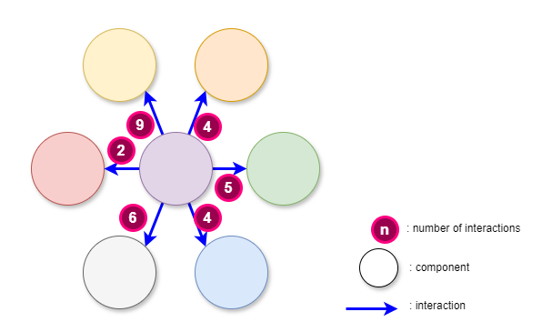
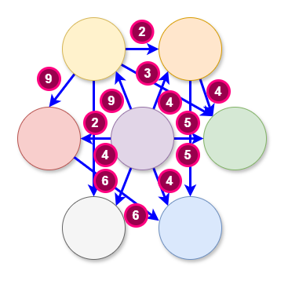
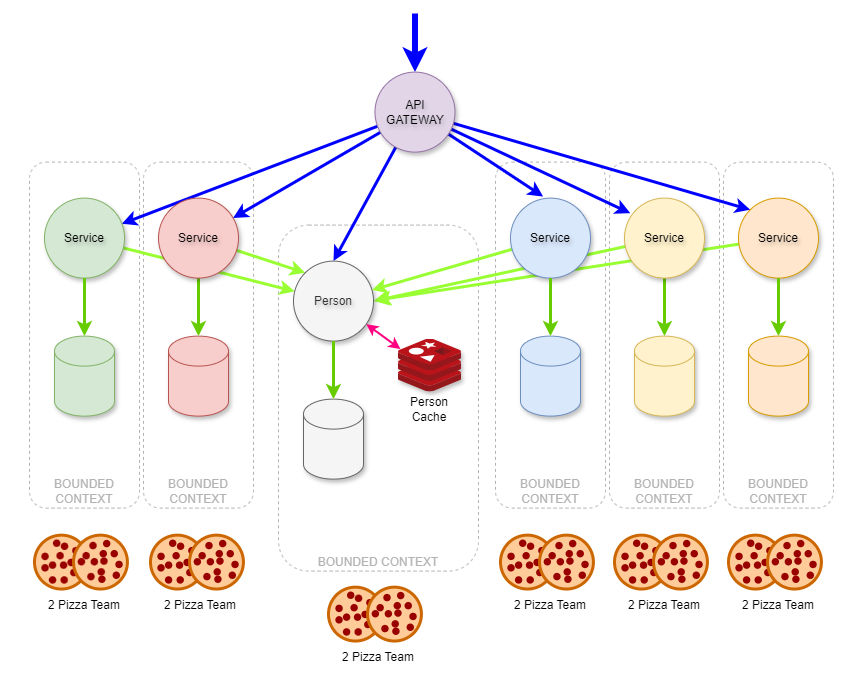
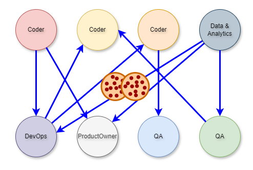
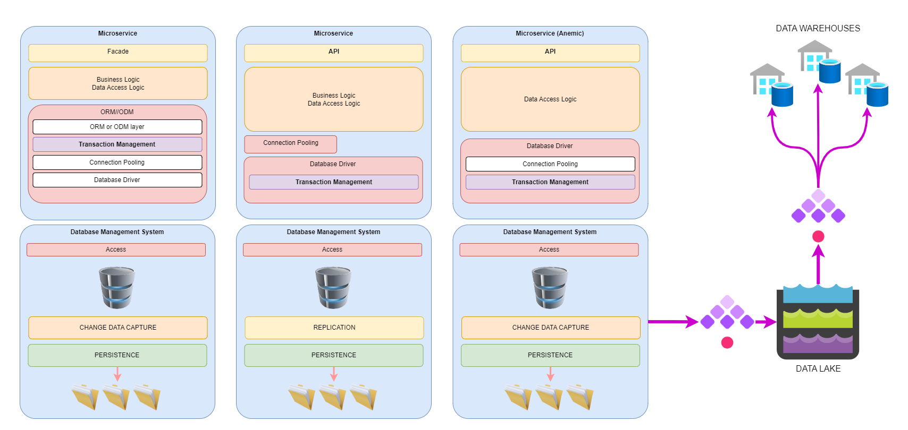
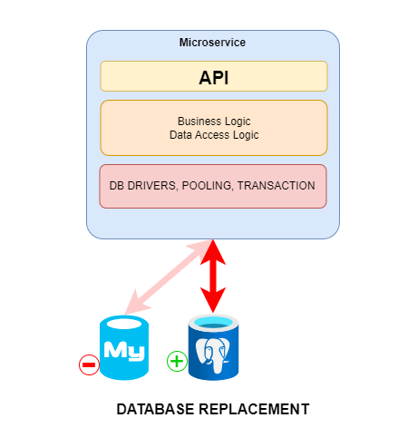
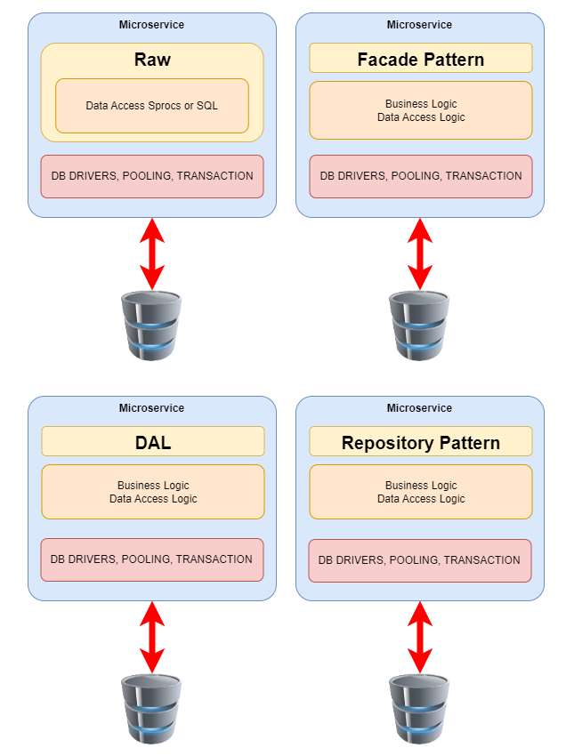

**Context is everything. Decisions need context;  effective choices rely on considering all relevant factors.  For example, a doctor wouldn't prescribe medication solely based on symptoms; they'd need the patient's medical history as context.**

**Let’s make sure we know and understand the context before we decide on an OLTP microservices database.**

## The Problem with Microservices Architecture

The problem with microservices has always been twofold: managing the complexity of dozens or hundreds of microservices, and domain-driven design. Fortunately, understanding and properly executing domain-driven design is just a matter of doing the [reading](https://www.wiley.com/en-us/Patterns,+Principles,+and+Practices+of+Domain+Driven+Design-p-9781118714706#:~:text=Patterns%2C%20Principles%2C%20and%20Practices%20of%20Domain%2DDriven%20Design%20%7C%20Wiley) and following the rules (and maybe re-engineering some bad business processes).

Managing complexity is a different matter, where the secret is simply to avoid it at all costs. The first step in avoiding it is coming up with a small set of definitions and then some metrics to help us identify and quantify complexity. Why a set of definitions? Because for software developers, complexity comes in several different flavors. Starting from the inside moving outward, we have:

- **[Cyclomatic complexity](https://en.wikipedia.org/wiki/Cyclomatic_complexity) of software**
- **Complexity of interacting systems (think C4 diagrams)**
- **Complexity of workloads done by systems and software (think data flow diagrams)**
- **Complexity of operational management (think technologies and skillsets)**
- **Complexity of attack surfaces (think of all the interfaces that software has)**
- **Complexity of people and teams and department and silos**
- **Complexity of priorities and visions and goals and missions and objectives**

Managing all of this complexity is a real challenge, often it’s the hardest part of running an IT department. The items above are key constituents of your context for making decisions.

The simplest measure of complexity, the one that is easiest to understand and use, is the number of components and the number of interactions between components (components can be anything).

The following diagrams illustrate the easiest way of measuring complexity. The first diagram shows the number of components in a system, the interactions, and the number of interactions between components:

If you simply change the labels and the layout of the components, you see the familiar and well-architected API Gateway to microservices:

However, in the subsequent illustration, you can see right away that the complexity is greatly increased. The number of components has not increased but the number of interactions has increased dramatically.

There is a saying that is appropriate here: “Good fences make good neighbors.” The following examples show a complete lack of fences, or boundaries between domain context. The API Gateway to microservices architecture shows a relatively low level of complexity. However, In this example, there is little analysis or evidence of domain-driven design and there is a significant amount of complexity as a result.

This is exactly what happens inside a monolithic web application, an example of which is illustrated below. This was how everyone built applications when web application servers were the hot new technology.

The result of multiple teams working on the same business domains was fragile, slow-to-change, monolithic apps.

Then one magical day, Domain-Driven Design and Microservices got together and the result was highly reliable, scalable, systems that quickly could adapt to the needs of the business and its customers. Yay!

If you followed the rules, and managed complexity not just in the system architecture but in the software development teams’ architecture, you too could do what Netflix, Amazon, and others have done.

Amazon's two-pizza team structure gives teams low complexity, single-threaded ownership over a product or service. This means that the team is responsible for the entire customer experience and the lifecycle of the product or service. The teams are also organized around the product or service they deliver, rather than the skills they provide.

## The OLTP Database

It’s now very clear why complexity is probably the most important aspect of context - complexity covers everything. Choosing a database for an OLTP microservice also has context and complexity; it’s more than just deciding which one can perform 1000 inserts per second. They can all do that, more or less, with enough hardware. They can all run on your desktop and they’re all available in the cloud.

The diagram below is an ecosystem view of the context for your OLTP database choice:

The stakeholders alone can be daunting to consider,each with their own set of requirements:

| Backend Developers,  DB Admins                       | Business Team (change and downtime approvals)    |
| Devops                                               | Governance                                       |
| Infra                                                | Vendor Mgmt                                      |
| Cloud                                                | CTO                                              |
| Data Engineers                                       | Project Managers                                 |
| Cybersecurity                                        | Risk Management                                  |
| BI Analysts                                          | FinOps                                           |

But let’s start with the core requirements or capabilities

For the dev team, the choice of database is mostly decided by the ecosystem of helpful libraries that make implementing a domain-driven design better, faster, and stronger.

But when you step back just a bit, you see that the complexity nearly explodes. The combination of drivers, connection pooling libs, transaction managers, and ORM or ODM packages add up quickly, increasing the number of interactions, particularly when it comes time to do a vulnerability scan and roll back to a previous version of one library. And of course, you have to get the data out, not just for OLTP reads, but for analytics, machine learning, and their various data engineering workflows.

This side of the content equation can be particularly aggrieved when the data schema suddenly changes without prior consultation.

## Managing Backend Complexity

There are three powerful tools complexity-management that can save your sanity: Automation, Architectural and Change Management.

### Automation

A few years after I started writing web apps in the late 1800s, I realized I was writing the same thing again and again. Web page calls some code to get some data, display the data in a form or a table, sort the table, allow some edits, validate the change, save the data, and show a happy message to the user. The same thing, javascript, web app code, db code, sql DML. Again and again. Being a lazy programmer, I realized that I could automate this with a schema writer and reader, some templates for web forms and tables, JavaScript, web app code, db code and sql, all dumped into a template processor, and then some code to update the various source repos.

Every time somebody needs a change to the schema, I edit the schema, press a button and boom. Done.

**When I started this I worked entirely in code. Nowadays I use Kestra to handle this workflow automation, even adding items like Slack notifications when changes occur and adding CRs to the change management system.**

### Architecture

What, exactly, are you doing with your OLTP database. At the very least, I hope, you’re doing something that needs transactions. And just to be sure we're all aligned:

- A transaction is a software mechanism for controlling state changes. It ensures that two or more state changes occur successfully, and if one change fails, any changes that have occurred during the transaction are un-done.
- Either everything succeeds and the state of the system is changed, or the state is reverted to its pre-transaction state.
- Retries are not typically included as part of the transaction.

Transactions can be applied to any kind of state, not just databases. In the database world, transactions play a crucial role in ensuring data consistency and integrity.

Transactions uphold the principles of Atomicity, Consistency, Isolation, and Durability (ACID properties). These properties guarantee the reliability of database operations and the business process that rely on the data. You can read all about [ACID](https://en.wikipedia.org/wiki/ACID) on wikipedia.

While we’re at it, you know about CAP, right? The [CAP theorem](https://en.wikipedia.org/wiki/CAP_theorem) is a computer science theory that states that a distributed database can only provide two of three characteristics simultaneously:

1. **Consistency**
2. **Availability**
3. **Partition tolerance.**

If your company is successful enough, you may one day need to worry about CAP, so be ready for it today.

**Transactions don’t have to be limited to financial workloads.**

Anytime you need a state change to be atomic, you need a transaction. Transactions can also be handled by the database engine, or by the code that calls the database engine. In the illustration below, we have two microservices, one needs a cache and the other does not. Since data integrity AND consistency are vital to the business, transactions are implemented where they are needed.**

The microservice on the left has a cache that must be consistent with the data in the database aka the [system of record](https://en.wikipedia.org/wiki/System_of_record). This means that two transactions are needed: the inner database transactions ensure the consistency and integrity of the database, while the outer ensures the overall integrity of the database and the cache. The microservice on the right has no need for a cache in their use case so only one transaction in the database is required.

### Architectural Principles & Design Patterns

There are a few architectural principles and design patterns that can go a long way to helping you manage complexity but also help you cope with changing schemas and database growth:

- Separation of concerns is a design principle for splitting software into modules. Each module handles a specific aspect (like data access or user interface) to improve organization, maintainability, and reusability.

- Data access abstraction hides the nitty-gritty details of how a program gets data (like SQL commands) behind a simpler interface. This lets developers focus on what data is needed, not how to retrieve it, making code cleaner and easier to maintain.

- Loose Coupling means software parts rely on each other minimally, minimizing the impact of change requests.

- Cohesion means elements within a part tightly focus on a single task, making the code more focused and understandable.

- Encapsulation bundles data and the methods that operate on that data together. This keeps internal details hidden and lets you control access, promoting data integrity, modularity, and reusability of your code.

**Loose coupling is key to managing complexity and inevitable change…**

**and growth!**

### Software Design Patterns

[Design patterns](https://en.wikipedia.org/wiki/Software_design_pattern) are reusable solutions to common programming problems. They provide blueprints for structuring code to make it more flexible, maintainable, and easier to understand. AS far as OLTP microservices are concerned, there are a few that can apply, depending on your use cases:

- **Facade Pattern**
- **Repository Pattern**
- **Data Access Layer (DAL)**

***In this diagram, Raw is provided as a contrast to the actual design patterns.***

### Repository Pattern

The Repository Pattern is a valuable tool for promoting separation of concerns and data access abstraction:

**Abstraction** – The Repository defines an interface that specifies methods for data access operations like CRUD (Create, Read, Update, Delete) functionalities. This interface hides the underlying implementation details of how data is accessed (e.g., SQL queries, Object-Relational Mappers (ORMs)).

**Encapsulation** – Concrete implementations of the repository interface encapsulate the logic for interacting with the data source (usually a database). This separation allows you to switch between different data access technologies (e.g., switching from raw SQL to an ORM) without affecting the core logic of your microservice.

**Improved Maintainability** – The separation of concerns makes the code easier to understand, modify, and test. Changes to data access logic can be isolated within the repository implementation without affecting the business logic.

**Flexibility** – The abstraction layer allows you to switch between different data access technologies without modifying the core microservice logic. This future-proofs your codebase and makes it adaptable to evolving needs.

**Testability** – By mocking the repository interface, you can effectively unit test your microservice logic independent of the actual data access layer.

### Data Access Layer (DAL)

For many OLTP microservices, a Data Access Layer (DAL) emerges as the preferred architectural choice. A DAL streamlines data access, promotes scalability, and ensures uniformity across microservices. A DAL provides:

- **Separation of Concerns** – The recommended approach is to separate data access logic from the presentation layer. A DAL acts as an intermediary layer between the application code and the database. By isolating data access concerns, you achieve cleaner code organization and maintainability.

- **Scalability and Flexibility** – In an OLTP microservice, scalability is crucial. The DAL allows you to scale data access independently of other components.As your microservice grows, you can optimize and scale the DAL without affecting other parts of the system.

- **Consistent Data Access Patterns** – The DAL enforces consistent data access patterns across microservices. It encapsulates low-level database interactions, ensuring that all services follow the same conventions. This consistency simplifies maintenance and reduces the chance of errors.

- **Security and Abstraction** – The DAL provides a security boundary between the application and the database. It allows you to implement authentication, authorization, and auditing at a centralized level. Additionally, the DAL abstracts the underlying database details, shielding the application from changes in data storage technologies.

### Facade Pattern

For other microservices, the Facade Pattern may be the preferred choice for several reasons. It can simplify microservice interactions (reducing complexity), promote consistency, and enhances security:

- **Simplification and Abstraction** –  The Facade Pattern provides a single interface that hides the intricate business logic residing in subsystems. In an OLTP microservice, this abstraction simplifies interactions by exposing straightforward APIs. Developers can focus on high-level functionality without dealing with low-level complexities.

- **Unified Entry Point** – Microservices often involve multiple subsystems, databases, and external services, and the facade acts as a front-facing entry point, shielding clients from the underlying complexity. It consolidates various service calls into a cohesive interface, making it easier for clients to interact with the microservice.

- **Consistent Design and Maintenance** – By using the facade pattern, you ensure consistent data access patterns across microservices. It encapsulates low-level database interactions, promoting uniformity. Maintenance becomes more manageable because changes are localized within the facade.

### Security and Anti-Corruption Layer

The facade provides a security boundary between the application and the database. It allows centralized implementation of authentication, authorization, and auditing. Additionally, it acts as an anti-corruption layer, ensuring that new applications aren't limited by dependencies on legacy systems.

## OLTP Candidates for your Microservices

## MongoDB

MongoDB excels in handling large volumes of unstructured or semi-structured data (like JSON * BSON) with flexible schema designs. While not traditionally ideal for OLTP due to potential performance overhead in rigid transactions, it can handle some OLTP workloads if performance is not ultra-critical.

Why a NoSQL database? Because unstructured data is an increasing source of transactional data. Think ChatGPT, prompts and completions.

### Client Libraries

MongoDB supports a wide range of programming languages through its client libraries, allowing for easy integration into various applications.

- **Languages Supported:**
    - C, C++, C#
    - Go
    - Java
    - Kotlin
    - Node.js
    - PHP
    - Python
    - Ruby
    - Rust
    - Scala
    - Swift
    - TypeScript

### Connection Pooling

Connection pooling is inherently supported across various MongoDB drivers, ensuring efficient database connection management.

- **Java:** mongodb-driver-sync and mongodb-driver-async.
- **JavaScript (Node.js):** Inbuilt support in MongoDB's Node.js driver.
- **Python:** pymongo library.
- **C# (.NET):** MongoDB.Driver library.
- **C++:** mongocxx driver.

### Transaction Management

MongoDB introduced multi-document ACID transactions in version 4.0, extending these capabilities to sharded clusters and replica sets. Transactions in MongoDB come with additional overhead, which may affect performance in high-demand scenarios, making it suitable for specific OLTP workloads but not universally ideal for all high-performance needs.

- **MongoDB Native Driver (Core API):** Enables transaction management programmatically for languages like Node.js.
- **Spring Data MongoDB (Java):** Provides integration for transaction management within Java applications.
- **Prisma (Node.js):** Supports transactions in MongoDB through its Node.js library.
- **FastAPI with MongoDB (Python):** Allows Python applications using FastAPI to manage MongoDB transactions effectively.

## PostgreSQL

PostgreSQL (ORDBMS): another open-source RDBMS offering a powerful feature set beyond MySQL, including complex data types, stored procedures, and advanced indexing. It provides robust ACID transactions and is well-suited for OLTP workloads that demand both performance and flexibility for complex data operations.

### Client Libraries

PostgreSQL's client libraries are extensive, covering a broad spectrum of programming languages with various libraries to facilitate database interactions.

- **C:** Basic support through libpq and ECPG for embedding SQL in C code.
- **C++:** Enhanced support with libraries such as libpqxx, QtSql, Pgfe, and OZO.
- **Elixir:** Postgrex for Elixir applications.
- **Go:** Libraries including pq, pgx, and go-pg.
- **Haskell:** postgresql-simple for Haskell.
- **Java:** PostgreSQL JDBC Driver for Java applications.
- **Javascript:** node-postgres and pg-promise for Node.js.
- **Common Lisp:** Postmodern and CLSQL.
- **.Net:** Npgsql and ODBC for .NET framework.
- **Perl:** DBD::Pg and DBD::PgPP.
- **PHP:** Pomm and ext-pq.
- **Python:** psycopg2 for Python.
- **R:** RPostgreSQL.
- **Ruby:** ruby-pg.
- **Rust:** rust-postgres.
- **tcl:** pgtcl for Tcl programming.

### Connection Pooling

PostgreSQL client libraries offer connection pooling mechanisms to manage database connections effectively.

- **libpq (C library):** Foundation for client libraries with connection pooling capabilities.
- **Java:** PostgreSQL JDBC Driver with built-in connection pooling.
- **Python:** psycopg2 with connection pooling via psycopg2.pool.
- **C++:** Integration with external libraries for connection pooling.
- **JavaScript:** pg and pg-promise with pooling functionalities.
- **.NET:** Npgsql library features connection pooling.
- **PHP:** Third-party libraries or framework-specific solutions for connection pooling.

### Transaction Management

PostgreSQL is renowned for its robust ACID transaction capabilities, offering various transaction isolation levels and the ability to encompass complex transactional logic within stored procedures, spanning multiple tables.

- **Libpq for C/C++ applications:** Offers direct integration for managing PostgreSQL transactions.
- **Java Database Connectivity (JDBC):** Enables transaction management in Java applications.
- **Python psycopg2:** A library for Python that provides PostgreSQL transaction management.
- **C++ taopq:** A modern C++ library facilitating transaction management with PostgreSQL.

## MySQL
MySQL is a popular open-source RDBMS known for its speed, reliability, and ease of use. It uses a structured table format with strong ACID transaction guarantees, making it a solid choice for OLTP applications that require high data consistency and performance for frequent short transactions.

### Client Libraries

MySQL offers a selection of official connectors for various languages, alongside a wealth of community-developed libraries.

- **Official Connectors:**
    - Java: Connector/J
    - C++: Connector/C++
    - Python: Connector/Python
    - C: MySQL C API
    - PHP: MySQLi extension
    - Node.js: mysql or mysql2 libraries
    - Go: Go MySQL Driver
    - .NET: MySqlConnector or Connector/NET
    - Ruby: mysql2 gem
- **Community-Developed Libraries:** Additional libraries providing specific functionalities for less common languages can be found at [Awesome MySQL](https://github.com/shlomi-noach/awesome-mysql).

### Connection Pooling

MySQL supports connection pooling across its connectors, enhancing application performance and resource management.

- **Connector/J (Java):** Implements connection pooling through HikariDataSource.
- **Connector/Python (Python):** Connection pooling available with adapters like MySQLConnectionPool.
- **MySQL C API (C):** Basis for libraries with connection pooling functionalities, like MySQL Connector/C++.
- **Other Language-Specific Libraries:** Built-in connection pooling in libraries for PHP (MySQLi extension) and Node.js (mysql2).

### Transaction Management

MySQL ensures data consistency in OLTP systems through full ACID transaction support, efficient locking mechanisms, and the ability to handle transactions across multiple tables.

- **MySQL Connector/C for C/C++ clients:** Enables transaction management in C/C++ applications.
- **The JDBC driver for MySQL:** Provides transaction support for Java clients.
- **Python MySQL Connector:** A library for managing MySQL transactions in Python.
- **Node.js ecosystem:** Includes libraries such as mysql2, node-mysql, and mysql for transaction management.

## Oracle
Oracle Database (RDBMS): a high-performance, enterprise-grade RDBMS known for scalability, security, and data integrity features. It offers strong ACID transactions and is a solid choice for large-scale OLTP deployments that require robust functionality and mission-critical reliability.

### Client Libraries

Oracle Database connectivity is supported through Oracle Instant Client and specific drivers for a range of programming languages.

- **Supported Languages:**
    - Python
    - Node.js
    - Go
    - .Net
    - PHP
    - Ruby
- **Tools and Interfaces:**
    - Oracle Call Interface (OCI)
    - Oracle C++ Call Interface (OCCI)
    - JDBC OCI
    - ODBC
    - Pro C/C++ Precompiler for C and C++ application development.

### Connection Pooling

Oracle Database employs Universal Connection Pool (Java) for efficient connection management, available for Java applications to optimize database access and resource utilization.

### Transaction Management

Oracle Database excels in providing comprehensive ACID transaction features with high concurrency control, leveraging optimistic locking for performance optimization in OLTP systems. It also supports advanced transactional features like savepoints and flashback queries.

- **All Oracle client libraries:** Offer transaction management capabilities, facilitating comprehensive transactional support across various programming environments.

## ORM/ODM Libraries

ORM (Object-relational mapping) and ODM (Object Document Mapper) libraries simplify the interaction between application code and databases by abstracting the database model into the programming language used.

### MongoDB ODM Libraries

MongoDB benefits from ODMs that map the document model of MongoDB to the object model of programming languages, simplifying data manipulation and access.

- **Mongoose (JavaScript/Node.js):** The most widely used ODM for MongoDB, featuring a comprehensive API and schema definitions.
- **TypeORM (TypeScript/JavaScript):** Supports MongoDB among other databases, offering a clean API.
- **Mango (Python):** A performant ODM for Python with powerful schema definition.
- **DjangODM (Python):** Integrates MongoDB into Django projects seamlessly.

### PostgreSQL ORM Libraries

Several ORM libraries provide enhanced support for PostgreSQL, facilitating model definition, relationship management, and complex queries.

- **Sequelize (Node.js):** A promise-based ORM supporting PostgreSQL and others.
- **Prisma:** A modern ORM/database toolkit compatible with PostgreSQL.
- **TypeORM (TypeScript/Node.js):** Offers extensive PostgreSQL support with strong type safety.
- **Objection.js (Node.js):** A SQL-centric lightweight ORM for PostgreSQL.
- **Knex.js:** A versatile query builder for PostgreSQL, often used with or without ORMs like bookshelf.js.
- **Django ORM (Python):** Django's built-in ORM fully supports PostgreSQL features.

### MySQL ORM Libraries

MySQL is supported by various ORM libraries that facilitate object-relational mapping, enhancing development productivity and data management efficiency.

- **Prisma (Node.js/TypeScript):** Modern ORM that supports MySQL.
- **Sequelize (Node.js):** A comprehensive ORM for MySQL and other databases.
- **TypeORM (TypeScript/Node.js):** Tailored for TypeScript, supporting MySQL.
- **Mongoose (Node.js):** Traditionally used with MongoDB, also supports MySQL.
- **Bookshelf.js & Objection.js:** Built on Knex.js, these ORMs provide additional abstraction layers for MySQL.
- **Waterline:** An ORM compatible with MySQL and other databases.
- **Knex.js (Query Builder):** A powerful tool for crafting SQL queries in Node.js applications, functioning beyond ORM capabilities.

### Oracle Database ORM Options

Oracle Database's transaction management is supported by its own and external libraries, though its dedicated ORM usage is less common.

- **Oracle ORM:** Specifically designed for Oracle Database, suitable for environments heavily integrated with Oracle technologies.
- **JDBC (Java Database Connectivity):** While not an ORM, it's a foundational API for Java applications connecting to Oracle Database, used with ORM-like frameworks such as Spring JDBC for data access abstraction.

## In Conclusion

I don’t envy you the task of choosing the *right* database for your OLTP  microservice. The best advice I can offer is to involve your team, however many pizzas it takes to come up with an agreement on requirements.

Please do give some serious thought to an automation solution for all the database related coding, scripting and SQLing. It’s saved my sanity more times than I can count and the QA team loves it! Using a workflow orchestration platform like Kestra makes this kind of automation ridiculously easy.

Whatever you do, keep a close watch on complexity and give a shout when it starts to grow in the dark corners of your shop like!

Join the Slack [community](/slack) if you have any questions or need assistance.
Follow us on [Twitter](https://x.com/kestra_io) for the latest news.
Check the code in our [GitHub repository](https://github.com/kestra-io/kestra) and give us a star if you like the project.
