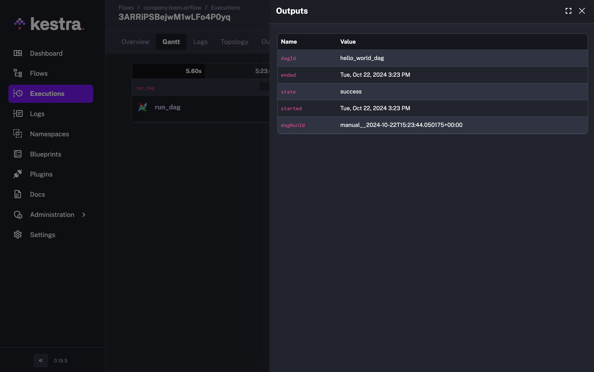
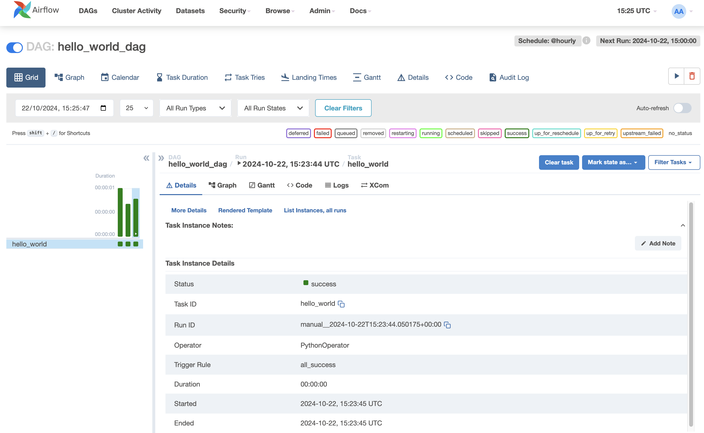

[Airflow 2](/vs/airflow) is end-of-life. Whether your team is [upgrading to Airflow 3](../2026-01-27-airflow-3-vs-airflow-2/index.md) or [evaluating a broader migration](../2026-01-18-enterprise-airflow-alternatives/index.md), the decision can’t wait much longer. But committing to a direction doesn’t mean committing to a big-bang cutover.

With Kestra, you can transition one workflow at a time. Keep what works in Airflow, move jobs into Kestra incrementally, and avoid the risk of a full rewrite while critical workflows are in production. Kestra’s [Airflow plugin](/plugins/plugin-airflow) lets you trigger and monitor Airflow DAGs directly from within Kestra, giving you a unified control plane across both systems from day one.

I’ll walk through how the plugin works, then show how this fits into a broader migration strategy for teams that can’t afford downtime.

## The Strangler Fig Pattern for Orchestration

This gradual migration is part of a well-known strategy called the [**Strangler Fig Pattern**](https://martinfowler.com/bliki/StranglerFigApplication.html), where the new system (Kestra) slowly replaces the old one (Airflow) by taking over its workflows, piece by piece. Over time, more and more workflows run in Kestra, while Airflow’s role diminishes. Eventually, Kestra handles everything.

This approach avoids the risks and complexity of doing a full migration in one go. Instead of uprooting everything at once, you can orchestrate Airflow DAGs within **Kestra’s control plane** and **centralized UI**, gaining better visibility and scalability, while continuing to leverage what’s already working in Airflow.

:::alert{type="info"}
📘 **Airflow 2 is no longer maintained.** If you're evaluating whether to upgrade to Airflow 3 or migrate to Kestra, our free [Airflow 2 to Kestra migration guide](/resources/airflow-2-eol-whitepaper) breaks down both paths.
:::

### Airflow Plugin: Migrate Without Disruption

In response to many requests from users seeking support for easier migrations from Airflow, we've developed a **plugin** that lets you trigger and orchestrate Airflow DAGs directly from within Kestra. This makes it possible to **run Airflow jobs as part of your Kestra workflows**, giving you the flexibility to incorporate your existing DAGs into Kestra's broader orchestration capabilities.

Here’s an example of how you can use Kestra to trigger an Airflow DAG:

```yaml
id: airflow
namespace: company.team

tasks:
  - id: run_dag
    type: io.kestra.plugin.airflow.dags.TriggerDagRun
    baseUrl: http://host.docker.internal:8080
    dagId: hello_world_dag
    wait: true
    pollFrequency: PT1S
    options:
      basicAuthUser: "{{ secret('AIRFLOW_USERNAME') }}"
      basicAuthPassword: "{{ secret('AIRFLOW_PASSWORD') }}"
    body:
      conf:
        source: kestra
        namespace: "{{ flow.namespace }}"
        flow: "{{ flow.id }}"
        task: "{{ task.id }}"
        execution: "{{ execution.id }}"

```

In this setup:

- **Trigger Airflow DAGs** through Kestra's Airflow plugin using the Airflow REST API.
- **Monitor and poll the status** of your Airflow tasks directly within Kestra, allowing for real-time visibility.
- **Pass execution metadata** (like task and flow IDs) to maintain context and track workflow performance across both platforms.


Kestra captures all the DAG run information.


On the other side, the Airflow DAG is triggered successfully.

## Kestra: A central control plane for all your workflows

Once integrated, Kestra becomes the **central control plane** for orchestrating workflows across your stack. Whether it's managing complex real-time data pipelines or orchestrating legacy Airflow jobs, you can monitor all executions through **Kestra’s dashboard**, which offers deeper insights and enhanced monitoring compared to Airflow’s built-in tools. Centralized logging, real-time outputs, and cross-system execution history mean you're not context-switching between dashboards to understand what's running.

Kestra’s **declarative approach** removes the glue code that makes Airflow DAGs complex. Instead of managing Python dependencies and intricate DAG structures, you define workflows in a simple, readable format and manage them directly through the UI.

### Simplifying complex workflows: get rid of glue code

Airflow is known for its complexity in constructing DAGs, especially when basic workflows end up requiring complicated Python scripts. With **Kestra**, you can streamline your workflows with a **declarative syntax**, eliminating the need for glue code and additional scripts.

Here’s how Kestra helps you:

- **No need for Python glue code**: Kestra’s pre-built tasks handle common operations like HTTP requests, file transfers, and API calls without extra scripts.
- **Unified orchestration**: Use Kestra to orchestrate tasks across diverse platforms (cloud services, data processing, APIs) within the same workflow.
- **UI-based or as code management**: Build, trigger, and monitor workflows directly from Kestra’s UI or build everything as code.

## Going deeper on the migration decision

The Strangler Fig approach handles the tactical question: how do you move workflows without breaking production? There’s a harder one underneath it. Teams upgrading to Airflow 3 are not just modernizing their tooling. They’re reaffirming a commitment to a Python-first, scheduler-centric architecture where execution is coupled to orchestration. That may still be the right call for your team, but the Airflow 2 EOL is worth treating as a moment for deliberate evaluation rather than routine maintenance.

Our [Airflow migration whitepaper](/resources/airflow-2-eol-whitepaper) covers the decision in full: the real cost of the Airflow 3 upgrade, what a declarative alternative looks like at scale, and how teams like Crédit Agricole migrated across 100+ clusters without a big-bang cutover. Free to download.

[Download the whitepaper →](/resources/airflow-2-eol-whitepaper)

If you’d rather talk through your specific setup, [book a demo](/demo).

:::alert{type="info"}
If you have any questions, reach out via [Slack](/slack) or open [a GitHub issue](https://github.com/kestra-io/kestra).
If you like the project, give us [a GitHub star](https://github.com/kestra-io/kestra) and join [the community](/slack).
:::
