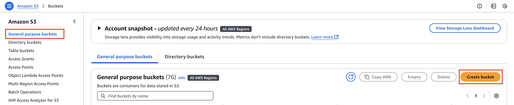
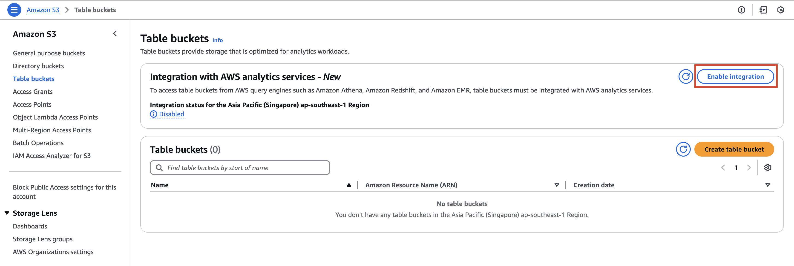
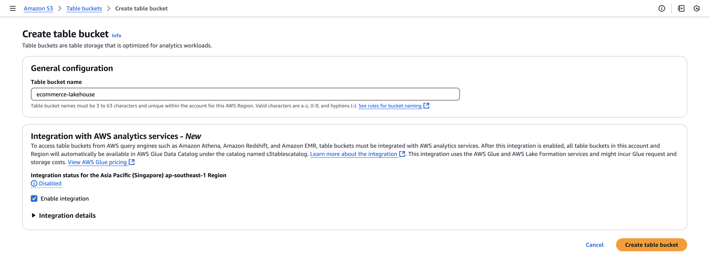
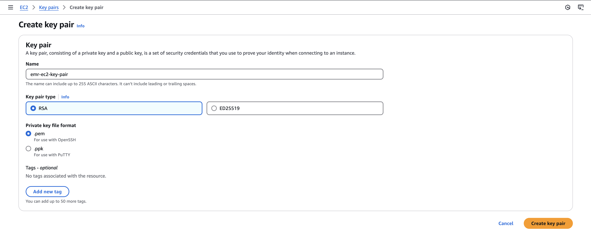

Amazon recently introduced S3 Tables, purpose-built for storing and querying tabular data directly on S3. Backed by built-in Apache Iceberg support, S3 Tables make data instantly accessible to popular AWS and third-party analytics engines like EMR and Athena.

In this post, we’ll show you how to orchestrate a complete workflow using Kestra—from downloading raw CSV files to converting them, uploading to S3, and creating Iceberg-backed S3 Tables. You’ll also learn how to query the data using Athena.

## Why S3 Tables and Kestra?

Structured data is often stored in files across object storage systems like S3—but making it queryable usually requires manual setup, format conversion, and provisioning of compute engines.

With Kestra, you can automate this entire process. Our declarative workflows handle data conversion, orchestration logic, infrastructure interactions, and job submission to EMR—all in a repeatable and trackable way.

This walkthrough will help you:

- Ingest and convert data into Parquet format

- Upload the data into S3

- Create an Iceberg table backed by S3 Table Buckets

- Automate querying through Athena

## Prerequisites

We will need the following as a prerequisite before we could proceed with the workflow creation:

- Kestra server running on version >= 0.21.0
- AWS account with access to IAM, S3 and Athena

Ensure you select the AWS region in which S3 Tables are [supported](https://docs.aws.amazon.com/AmazonS3/latest/userguide/s3-tables-regions-quotas.html).

## Implementing Kestra Workflow for S3 Tables

In order to get the end-to-end Kestra workflow that interacts with S3 table, we will need a lot of prework to be done. We will go through each of the step in detail. This will involve making some changes on the AWS console. In the process, we will also develop the Kestra workflow incrementally.

### Create general purpose S3 bucket

Firstly, we will need a general purpose S3 bucket where we will store the data. For this, navigate to the [S3 service](https://console.aws.amazon.com/s3/home) on the AWS console. From the left navigation menu, select `General purpose buckets`. On the `General purpose buckets` page, select the `Create bucket` button. On the `Create bucket` page, provide a globally unique bucket name in the `Bucket name` text box. For the purpose of this blog, for example we name the bucket as `s3-general-purpose-ecommerce`. Rest of the configurations can be left as default, and select the **Create bucket** button at the bottom of the page. This will create the new bucket.



From the `General purpose buckets` page, search for the newly created bucket, and select the bucket name. On the corresponding bucket's home page, select the `Create folder` button. Provide the folder name, for example `data`, and select the `Create folder` button at the bottom of the page. We will be storing our data in this folder.

### Getting the data into S3 bucket

Navigate to the Kestra UI, and create a new flow. We will download the CSV file containing products data using the [HTTP Download task](/plugins/core/http/io.kestra.plugin.core.http.download). We will then convert the CSV data into ION format using the [CsvToIon task](/plugins/plugin-serdes/csv/io.kestra.plugin.serdes.csv.csvtoion), and then from ION format into a parquet file using [IonToParquet task](/plugins/plugin-serdes/parquet/io.kestra.plugin.serdes.parquet.iontoparquet). Finally, we will upload the parquet file into the recently created S3 general purpose bucket inside the `data` folder using [S3 Upload task](/plugins/plugin-aws/s3/io.kestra.plugin.aws.s3.upload).

This is how the Kestra flow will look like:

```
id: s3_tables_demo
namespace: company.team
description: With this flow, you will upload the products data in parquet format into S3 general purpose bucket

tasks:
  - id: http_download
    type: io.kestra.plugin.core.http.Download
    uri: https://huggingface.co/datasets/kestra/datasets/raw/main/csv/products.csv

  - id: csv_to_ion
    type: io.kestra.plugin.serdes.csv.CsvToIon
    from: "{{ outputs.http_download.uri }}"

  - id: ion_to_parquet
    type: io.kestra.plugin.serdes.parquet.IonToParquet
    from: "{{ outputs.csv_to_ion.uri }}"
    schema: |
      {
        "type": "record",
        "name": "Product",
        "namespace": "com.kestra.product",
        "fields": [
          {"name": "product_id", "type": "int"},
          {"name": "product_name", "type": "string"},
          {"name": "product_category", "type": "string"},
          {"name": "brand", "type": "string"}
        ]
      }

  - id: s3_upload
    type: io.kestra.plugin.aws.s3.Upload
    accessKeyId: "{{ secret('AWS_ACCESS_KEY') }}"
    secretKeyId: "{{ secret('AWS_SECRET_KEY') }}"
    region: "{{ secret('AWS_REGION') }}"
    from: "{{ outputs.ion_to_parquet.uri }}"
    bucket: "s3-general-purpose-ecommerce"
    key: "data/products.parquet"
```

### Creating S3 Table Bucket

On the [S3 service](https://console.aws.amazon.com/s3/home) page on the AWS console, navigate to `Table buckets` from the left navigation menu.

In case, you are opening the table buckets page for the first time, you will see a box at the top of the page about `Integration with AWS analytics services - New` with the `Enable integration` button. Select the button and enable the integration of S3 table buckets with AWS analytics services like Amazon EMR, Amazon Redshift and Amazon Athena.



Next, we will create a table bucket. Select the `Create table bucket` button at the top of the page. On the `Create table bucket` page, provide an appropriate name for the table bucket, say `ecommerce-lakehouse`. Select the `Create table bucket` button at the bottom of the page. This will create the new table bucket.



### Providing IAM Access

Navigate to [IAM service](https://console.aws.amazon.com/iam/home) on the AWS console. Navigate to `Roles` from the left navigation menu. Using the search box on the top of the page, ensure that you have `EMR_DefualtRole` and `EMR_EC2_DefaultRole` roles already present. If the roles are missing, you can create these default roles using `create-default-roles` as described [here](https://docs.aws.amazon.com/cli/latest/reference/emr/create-default-roles.html). Both these roles will be required for creating the EMR cluster.

On the `Roles` page with IAM, search for `EMR_EC2_DefaultRole`, and select the same. On the `EMR_EC2_DefaultRole` role page, select the `Add permissions` button, and from the dropdown that appears, select `Attach Policies`. On the `Attach policy for EMR_EC2_DefaultRole` page, search for `AmazonS3TablesFullAccess`, select the `AmazonS3TablesFullAccess` policy and select `Add permissions` button. This provides full access to S3 tables from the EC2 machines of the EMR.

### Creating EC2 key pair

Navigate to [EC2 service](https://console.aws.amazon.com/ec2/home) on the AWS console. From the left navigation menu, navigate to `Key pairs`. On the `Key pairs` page, select the `Create key pair` button at the top of the page. On the `Create key pair` page, provide an appropriate name for the key pair, say `emr-ec2-key-pair`, and select the `Create key pair` button at the bottom of the page. This will download the pem file associated with the key pair to your machine, and the new key pair will be created.



### Create PySpark Job

We will now create the Spark job that will create Iceberg namespace and Iceberg table, and load the data into the S3 table bucket which will then be available for query using the Iceberg table.

#### Spark Configuration

In order to leverage S3 tables for loading the data into Iceberg table, we need to use the following Spark configuration:

```
spark.sql.catalog.s3tablesbucket=org.apache.iceberg.spark.SparkCatalog
spark.sql.catalog.s3tablesbucket.catalog-impl=software.amazon.s3tables.iceberg.S3TablesCatalog

#This should be set to the ARN of the S3 table bucket
spark.sql.catalog.s3tablesbucket.warehouse=arn:aws:s3tables:ap-southeast-1:1234567890:bucket/ecommerce-lakehouse

spark.sql.extensions=org.apache.iceberg.spark.extensions.IcebergSparkSessionExtensions
```

We will set this configuration while running the `spark-submit` command in the EMR related Kestra task `CreateClusterAndSubmitSteps`.

Also, we will be including the following packages to provide all the necessary libraries for working with Iceberg using S3 tables:

```
org.apache.iceberg:iceberg-spark-runtime-3.5_2.12:1.6.1
software.amazon.s3tables:s3-tables-catalog-for-iceberg:0.1.0
```

These packages will be provided along with the `spark-submit` command.

#### PySpark Job

The following is the PySpark job code:

```
from pyspark.sql import SparkSession, SQLContext
import argparse

if __name__ == "__main__":
    parser = argparse.ArgumentParser()
    parser.add_argument("--input", type=str, help="Data location in S3", default="")
    args = parser.parse_args()

    spark = SparkSession.builder.appName("Load to Iceberg").getOrCreate()
    sqlContext = SQLContext(spark.sparkContext)

    #Create Iceberg namespace
    sqlContext.sql("CREATE NAMESPACE IF NOT EXISTS s3tablesbucket.data")

    #Create Iceberg table
    sqlContext.sql("CREATE TABLE IF NOT EXISTS s3tablesbucket.data.products (product_id INT, product_name STRING, product_category STRING, brand STRING) USING iceberg")

    data_file_location = args.input
    data_file = spark.read.parquet(data_file_location)

    #Load data to Iceberg table `products`
    #The data is loaded into S3 table bucket provided in the Spark configuration
    data_file.writeTo("s3tablesbucket.data.products") \
        .using("iceberg") \
        .tableProperty("format-version", "2") \
        .createOrReplace()

    spark.stop()
```

We can write this code in a python file, say `load_to_iceberg.py`, and upload this file in the S3 general purpose bucket that we had created earlier `s3-general-purpose-ecommerce`.

### Adding EMR CreateClusterAndSubmitSteps task to Kestra workflow

Now comes the final step towards working with the S3 Tables using Kestra. We will create the `CreateClusterAndSubmitSteps` EMR task that will dyanmically create the EMR cluster based on the configuration provided in the task, and then submit the Spark job as a step to the EMR cluster. The task will look like follows:

```
  - id: create_cluster_and_submit_spark_job
    type: io.kestra.plugin.aws.emr.CreateClusterAndSubmitSteps
    accessKeyId: "{{ secret('AWS_ACCESS_KEY') }}"
    secretKeyId: "{{ secret('AWS_SECRET_KEY') }}"
    region: "{{ secret('AWS_REGION') }}"
    clusterName: "Spark job cluster"
    logUri: "s3://s3-general-purpose-ecommerce/test-emr-logs"
    keepJobFlowAliveWhenNoSteps: true
    applications:
        - Spark
    masterInstanceType: m5.xlarge
    slaveInstanceType: m5.xlarge
    instanceCount: 3
    ec2KeyName: smantri-test
    releaseLabel: emr-7.5.0
    steps:
      - name: load_to_iceberg
        jar: "command-runner.jar"
        actionOnFailure: CONTINUE
        commands:
          - spark-submit --packages org.apache.iceberg:iceberg-spark-runtime-3.5_2.12:1.6.1,software.amazon.s3tables:s3-tables-catalog-for-iceberg:0.1.0 --conf spark.sql.catalog.s3tablesbucket=org.apache.iceberg.spark.SparkCatalog --conf spark.sql.catalog.s3tablesbucket.catalog-impl=software.amazon.s3tables.iceberg.S3TablesCatalog --conf spark.sql.catalog.s3tablesbucket.warehouse=arn:aws:s3tables:ap-southeast-1:1234567890:bucket/ecommerce-lakehouse --conf spark.sql.extensions=org.apache.iceberg.spark.extensions.IcebergSparkSessionExtensions s3://s3-general-purpose-ecommerce/load_to_iceberg.py --input s3://s3-general-purpose-ecommerce/data/products.parquet
    wait: true
```

The final Kestra workflow will look as follows:

```
id: s3_tables_demo
namespace: company.team
description: With this flow, you will upload the products data in parquet format into S3 general purpose bucket

tasks:
  - id: http_download
    type: io.kestra.plugin.core.http.Download
    uri: https://huggingface.co/datasets/kestra/datasets/raw/main/csv/products.csv

  - id: csv_to_ion
    type: io.kestra.plugin.serdes.csv.CsvToIon
    from: "{{ outputs.http_download.uri }}"

  - id: ion_to_parquet
    type: io.kestra.plugin.serdes.parquet.IonToParquet
    from: "{{ outputs.csv_to_ion.uri }}"
    schema: |
      {
        "type": "record",
        "name": "Product",
        "namespace": "com.kestra.product",
        "fields": [
          {"name": "product_id", "type": "int"},
          {"name": "product_name", "type": "string"},
          {"name": "product_category", "type": "string"},
          {"name": "brand", "type": "string"}
        ]
      }

  - id: s3_upload
    type: io.kestra.plugin.aws.s3.Upload
    accessKeyId: "{{ secret('AWS_ACCESS_KEY') }}"
    secretKeyId: "{{ secret('AWS_SECRET_KEY') }}"
    region: "{{ secret('AWS_REGION') }}"
    from: "{{ outputs.ion_to_parquet.uri }}"
    bucket: "s3-general-purpose-ecommerce"
    key: "data/products.parquet"

  - id: create_cluster_and_submit_spark_job
    type: io.kestra.plugin.aws.emr.CreateClusterAndSubmitSteps
    accessKeyId: "{{ secret('AWS_ACCESS_KEY') }}"
    secretKeyId: "{{ secret('AWS_SECRET_KEY') }}"
    region: "{{ secret('AWS_REGION') }}"
    clusterName: "Spark job cluster"
    logUri: "s3://s3-general-purpose-ecommerce/test-emr-logs"
    keepJobFlowAliveWhenNoSteps: true
    applications:
        - Spark
    masterInstanceType: m5.xlarge
    slaveInstanceType: m5.xlarge
    instanceCount: 3
    ec2KeyName: smantri-test
    releaseLabel: emr-7.5.0
    steps:
      - name: load_to_iceberg
        jar: "command-runner.jar"
        actionOnFailure: CONTINUE
        commands:
          - spark-submit --packages org.apache.iceberg:iceberg-spark-runtime-3.5_2.12:1.6.1,software.amazon.s3tables:s3-tables-catalog-for-iceberg:0.1.0 --conf spark.sql.catalog.s3tablesbucket=org.apache.iceberg.spark.SparkCatalog --conf spark.sql.catalog.s3tablesbucket.catalog-impl=software.amazon.s3tables.iceberg.S3TablesCatalog --conf spark.sql.catalog.s3tablesbucket.warehouse=arn:aws:s3tables:ap-southeast-1:1234567890:bucket/ecommerce-lakehouse --conf spark.sql.extensions=org.apache.iceberg.spark.extensions.IcebergSparkSessionExtensions s3://s3-general-purpose-ecommerce/load_to_iceberg.py --input s3://s3-general-purpose-ecommerce/data/products.parquet
    wait: true
```

Running this workflow will get the data loaded onto the S3 table bucket which can then be queried using Iceberg table in query services like Amazon Athena.

### Querying S3 Table using Amazon Athena

Navigate to [Athena service](https://console.aws.amazon.com/athena/home) on the AWS console. Under the `Data` section on the left panel, select `Data source` as `AwsDataCatalog`, select `Catalogue` as `s3tablescatalog/ecommerce-lakehouse`, and `Database` as `data`. The `Tables and views` section should automatically show up the recently populated `products` table.

On the Query tab, you can write the query to get the data from this table:

```
SELECT * FROM "data"."products";
```

You should be able to see all the 20 rows from the table getting displayed in the `Query results` section.


Thus, we have successfully leverage S3 table bucket to create an Iceberg table.

## Conclusion

Kestra workflows can be used to work with the S3 table buckets and create Iceberg tables. This enables us to introduce orchestration related to S3 tables with Kestra, bringing in all the good features that S3 tables have to offer.

If you have any questions, reach out via [Kestra Community Slack](/slack) or open [a GitHub issue](https://github.com/kestra-io/kestra).

If you like the project, give us a [GitHub star](https://github.com/kestra-io/kestra) and join [the open-source community](/slack).
