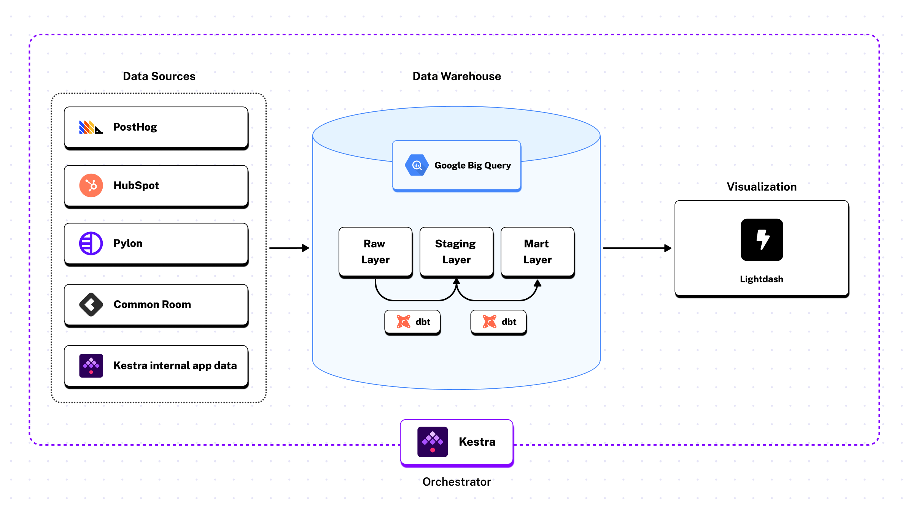

## **How Kestra runs on Kestra**

As Kestra’s only analytics engineer, I run a [production-grade ELT stack](../../docs/15.how-to-guides/etl-pipelines/index.md) end-to-end. I rely on PyAirbyte and custom dltHub sources to ingest data from platforms like PostHog, HubSpot, and Pylon into BigQuery, transform it with dbt, and visualize it in Lightdash. This streamlined pipeline enables me to support sales, marketing, product, and leadership teams from a single, cohesive system.

This works because Kestra treats my Python scripts, SQL transformations, and bash utilities as first-class citizens—no refactoring required. Unlike other orchestrators, which expect code to conform to their framework patterns, Kestra orchestrates my existing tooling exactly as written. For enterprises, this means migrating workflows doesn't require rewriting your codebase or training teams on new abstractions.

When the [orchestration layer](../2023-09-13-choreography#orchestration-is-the-core-layer-underneath-data/index.md) stays out of the way, I get to spend my time doing the work analytics engineers actually want to do: understanding the business, answering internal questions, and building things my colleagues actually use.

## **Our data stack**

Here's what Kestra's data infrastructure actually looks like:



**Sources:**

- PostHog (product analytics)
- [HubSpot](/plugins/plugin-hubspot) (CRM)
- Pylon (ticketing)
- Common Room (community data)
- Internal application data

**Ingestion:**

- [PyAirbyte](/plugins/plugin-airbyte)
- [dltHub](/plugins/plugin-dlt)

**Warehouse:**

- [BigQuery](/plugins/plugin-gcp/bigquery)

**Transformation:**

- [dbt Core](/plugins/plugin-dbt)

**Visualization:**

- Lightdash

**Orchestration:**

- Kestra (obviously)

## **The architecture decisions that matter**

In Kestra, workflows are [defined declaratively](../declarative-from-day-one) in `YAML` and execution happens in [Docker](../../docs/02.installation/02.docker/index.md) containers. (New to `YAML`? We have an [introductory blog post here.](../2023-11-27-yaml-crashcourse/index.md) Orchestration logic is kept separate from application code by design. That separation makes it easier to orchestrate data pipelines that span [multiple languages](../../docs/16.scripts/index.mdx) and tools.

This is important for enterprise environments, because data pipelines routinely coordinate SQL transformations, Python-based ingestion, and language-specific services that teams rely on for different parts of the stack.

In our case, this shows up directly in how the analytics stack is wired together. dbt models, containerized ingestion jobs, and downstream checks are coordinated by the same orchestration layer, without forcing those components into a single programming model. The result is simpler pipelines and reusable building blocks.

### **Any language, one workflow**

In Kestra, a single [flow](../../docs/05.workflow-components/01.flow/index.md) can:

- Check out a GitHub repository
- Build a Docker image
- Run dbt models
- Execute a Python script
- Call a Go binary
- Hit an API endpoint

All of these happen without rewriting existing code or translating it into a single framework. Each component runs in the form it was designed to run, using the language and tooling that make sense for that task.

This lets us evolve the stack incrementally. We can introduce a new service, keep a legacy script, or change how a particular step is implemented without turning orchestration into a refactoring project that adds unnecessary work. SQL stays SQL. Python stays Python. Language-specific services remain first-class citizens.

Kestra simply ties these pieces together without introducing additional layers that teams then have to maintain.

### **Subflows for reusability**

When enterprises scale, the number of pipelines grow and the same operational steps repeat everywhere: building containers, wiring credentials, running dbt, handling failures consistently. Duplicating those steps makes changes harder and increases the risk of inconsistencies, so Kestra supports reuse at the workflow level through **[subflows](../../docs/05.workflow-components/10.subflows/index.md)**.

A subflow is a complete workflow that can be invoked by other workflows. This lets us standardize how pipelines run without copying configuration everywhere, so adding or modifying pipelines stays cheap as the stack grows.

In our analytics stack, that shared logic is captured in a utility subflow called `pydata`. Its job is to handle containerized execution like dbt runs. When I need to run dbt after ingesting data from HubSpot, I call the subflow. When I need to run dbt after ingesting from PostHog, I call the same subflow and can even adjust CPU or memory allocation for each call, since running dbt typically requires fewer resources than ingestion and loading.

```yaml
# Simplified example
id: hubspot
namespace: data.sources

tasks:
  - id: subflow
    type: io.kestra.plugin.core.flow.Subflow
    flowId: pydata
    namespace: data.utils
    inputs:
      cmd: "python -m <path-to-python-function-that-extracts-hubspot-data>"
    wait: true

triggers:
  - id: schedule
    type: io.kestra.plugin.core.trigger.Schedule
    cron: 0 1 * * *
```

Individual workflows don’t need to know how containers are built or how dbt is invoked; they just delegate that responsibility to `pydata`.

The benefit is simplicity. When something changes in how we run dbt or build images, we update it once. Every pipeline stays consistent, readable, and focused on source-specific logic. As the number of pipelines grows, the operational surface area stays small.

This is the kind of reuse analytics engineering actually needs: a way to centralize coordination without spreading infrastructure concerns across every pipeline.

### **Smart alerting by namespace**

In Kestra, every workflow belongs to a [**namespace**](../../docs/05.workflow-components/02.namespace/index.md), and that namespace is visible to the orchestrator at runtime.

We use namespaces to reflect ownership and purpose in the analytics stack. Data pipelines live in one namespace, product and internal workflows live in other namespaces.

Because namespaces are part of the orchestration model, we can build [**alerting**](../../docs/15.how-to-guides/alerting/index.md) once, at the system level. A single monitoring flow watches execution states across all workflows.

When one of our workflows fails or enters a warning state, the monitoring flow inspects the namespace and routes failures to its respective [Slack](/plugins/plugin-slack) channel. Data pipeline failures go to #data-alerts, and product-related failures go to #product-alerts.

The routing logic is a small set of conditional [**tasks**](../../docs/05.workflow-components/01.tasks/index.mdx) defined in ~30 lines of `YAML`:

```yaml
id: slack
namespace: monitors

tasks:
  - id: data
    type: io.kestra.plugin.slack.SlackExecution
    url: "{{ render(namespace.slack.webhook) }}"
    channel: "#data-alerts"
    username: "Kestra Monitor"
    iconEmoji: ":alert:"
    executionId: "{{ trigger.executionId }}"
    runIf: "{{ trigger.namespace | startsWith('data') }}"

  - id: product
    type: io.kestra.plugin.slack.SlackExecution
    url: "{{ render(namespace.slack.webhook) }}"
    channel: "#product-alerts"
    username: "Kestra Monitor"
    iconEmoji: ":alert:"
    executionId: "{{ trigger.executionId }}"
    runIf: "{{ trigger.namespace | startsWith('product') }}"

triggers:
  - id: listen
    type: io.kestra.plugin.core.trigger.Flow
    conditions:
      - type: io.kestra.plugin.core.condition.ExecutionStatus
        in:
          - FAILED
          - WARNING
```

As workflows are added or ownership changes, the alerting model remains stable because it’s driven by namespace, not by individual pipelines.

Kestra also provides ready-to-use [**Blueprints**](/blueprints) for common patterns like this, making it easy to implement monitoring, alerting, and other operational workflows without starting from scratch.

### **Environment separation through Terraform and tenants**

All our flows are deployed via [**Terraform**](../../docs/13.terraform/index.mdx) for one simple reason: Kestra’s model maps cleanly onto **infrastructure-as-code** practices.

Flows, namespaces, [**schedules**](../../docs/05.workflow-components/07.triggers/01.schedule-trigger/index.md), and [**secrets**](../../docs/06.concepts/04.secret/index.md) in Kestra are all declarative and environment-scoped. That makes them a natural fit for being managed alongside the rest of our infrastructure, rather than existing as state hidden in a UI or embedded in application code.

In our setup, workflow definitions live in [**Git**](/plugins/plugin-git) and are promoted [from development to production](../../docs/14.best-practices/1.from-dev-to-prod/index.md) through Terraform. We maintain separation between development and production environments through Terraform state, ensuring changes are tested before they reach production. Terraform owns the deployment lifecycle, while Kestra remains the execution and coordination layer.

For enterprises requiring stronger isolation, Kestra Enterprise provides [**tenants**](../../docs/07.enterprise/02.governance/tenants/index.md)—fully isolated environments within a single Kestra instance. Each tenant gets its own namespace hierarchy, execution isolation, and access controls. This enables multi-team deployments where different business units can operate independently while sharing the same orchestration infrastructure.

For example, our secrets flow from [**GCP Secret Manager**](/plugins/plugin-gcp) into Terraform and then into Kestra. There’s no secondary configuration layer or ambiguity about what’s deployed where. Orchestration is treated like infrastructure, using the same patterns we rely on everywhere else.

For a small analytics team (n=1), this matters because it removes operational risk. One person can make changes confidently without accidentally breaking production.

## **What this enables at Kestra**

All of this runs on one stack, coordinated by one orchestration layer, without requiring a team of specialists to keep it running.

With this setup, I deliver insights that directly impact how we grow and serve customers:

- **Sales can close faster** because they have real-time pipeline visibility and deal data from HubSpot. Instead of waiting for end-of-week reports, they see which prospects are engaging, where deals are stuck, and which outreach strategies are actually converting.
- **Marketing can measure what matters** because we've connected campaign data to product usage and revenue outcomes. They know which channels bring in users who actually convert, which content drives engagement, and how to allocate budget based on what's working—not what they hope is working.
- **Product can build the right things** because PostHog data is joined with customer data to show not just what people are doing, but who's doing it and why it matters. We can identify which features drive retention, where users get stuck, and what high-value customers need most.
- **Support can get ahead of problems** because ticket trends from Pylon are correlated with product usage patterns. When we see a spike in a particular issue, we know which customers are affected and can reach out proactively instead of waiting for complaints to roll in.
- **Leadership can make informed bets** because Common Room data shows us who's engaged in our community, where conversations are happening, and which topics are gaining traction. This feeds directly into product roadmap decisions and go-to-market strategy.

## **Orchestration has to match the reality of modern data teams**

As many of my fellow analytics engineers know, modern data teams aren't Python-only. We’re all running a mix of SQL, dbt, shell scripts, Python, and other language-specific tools, often within the same data pipeline and maintained by different people over time.

The job of an orchestrator is to adapt to that complexity. It should coordinate work across a diverse stack, run code reliably, and make failures visible, without forcing everything into a single language or abstraction.

That’s the model Kestra is built around. It’s what enables me to run our entire analytics operation solo. It’s the setup that allows teams to move fast when the business needs answers.

If you’re curious to dig deeper, **[book a demo](/demo)** to see how Kestra can support your analytics stack.