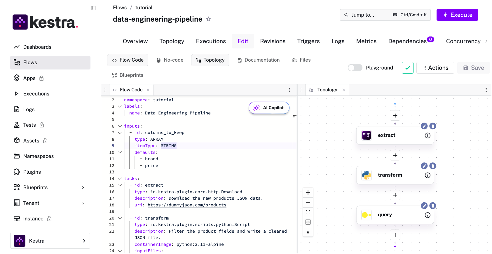

If you're here, you've probably already discovered that Apache Airflow is excellent at orchestrating data pipelines and considerably less excellent at making your platform team's life easy. The gap between "works in development" and "runs reliably in production with proper access controls, audit logging, and disaster recovery" is where enterprise requirements live, and it's a gap that Airflow was never designed to close.

This isn't a knock on Airflow. It emerged from Airbnb's data team in 2014 to solve their specific scheduling problems, and it solved them well. But enterprise orchestration in 2026 involves concerns that simply weren't on the roadmap at the time: [multi-tenant governance](../../docs/08.architecture/10.multi-tenancy/index.md), [real-time event processing](../../docs/15.how-to-guides/realtime-triggers/index.md), hybrid cloud deployment, and the kind of compliance requirements that make auditors happy.

So what are your actual options in 2026? 

| Tool | Best for |
|------|----------|
| **Kestra** | Platform teams needing multi-language support, governance, and deployment flexibility |
| **Astronomer** | Teams committed to Airflow who want managed infrastructure and enterprise support |
| **Dagster** | Data teams wanting asset-centric orchestration with strong lineage and data quality |
| **Prefect** | Python developers who want lightweight orchestration without DAG ceremony |
| **Control-M** | Regulated industries with existing mainframe/batch workloads |
| **AWS Step Functions** | AWS-native shops orchestrating serverless and microservices |
| **Azure Data Factory** | Microsoft-centric enterprises with hybrid on-prem/cloud data movement |

## What enterprise teams need from Airflow alternatives

Google "Airflow alternatives" and you'll find plenty of articles that compare tools on ease of use, language support, and GitHub stars. Sure, these matter, but enterprise teams care about a different set of questions entirely.

First, there's the governance problem. When you have 200 data engineers writing pipelines, you need guardrails that prevent well-meaning people from doing damage. Things like:

- [Role-based access control](../../docs/07.enterprise/03.auth/rbac/index.md) that actually works
- [Namespacing](../../docs/07.enterprise/02.governance/namespace-management/index.md) that isolates teams
- [Audit trails](../../docs/07.enterprise/02.governance/06.audit-logs/index.md) that satisfy your compliance officer without requiring a dedicated forensics team to interpret

Second, there's deployment flexibility. "Cloud-native" is a fine marketing term until your security team mandates on-premises deployment for certain workloads, or your company operates in a jurisdiction with data residency requirements. Companies want to have the ability to run the same orchestration platform in GCP, on-prem, and air-gapped environments.

Third, there's language lock-in. Airflow is Python, and only Python. That was a reasonable choice in 2014 when Python dominated data work, but modern orchestration needs span [multiple languages](https://kestra.io/features/code-in-any-language). Your data team writes Python, your backend engineers write Go, your ML team uses a mix of everything, and increasingly you're coordinating across all of them. An orchestrator that forces everything through Python becomes a bottleneck: either you rewrite everything, or you build brittle workarounds.

Finally, there's operational burden. Airflow's architecture means your platform team becomes an Airflow operations team. Workers, schedulers, metadata databases, and executors all need care and feeding. At scale, this becomes a meaningful line item in your engineering budget.

| Criteria | Kestra | Astronomer | Dagster | Prefect | Control-M | Step Functions |
  |----------|--------|-----------|---------|---------|-----------|----------------|
  | **Multi-tenancy** | Native | Limited | Cloud only | Cloud only | Yes | IAM-based |
  | **RBAC** | Native | Yes | Cloud only | Cloud only | Yes | IAM policies |
  | **Audit logging** | Native | Yes | Cloud only | Cloud only | Yes | CloudTrail |
  | **On-prem deployment** | Yes | No | Yes | Yes | Yes | No |
  | **Air-gapped support** | Yes | No | Limited | No | Yes | No |
  | **Multi-language** | Any | Python only | Python only | Python only | Any | JSON/ASL |
  | **Self-hosted option** | Yes (OSS) | No | Yes | Yes | Yes | No |

### Managed Airflow options

Before exploring alternatives, it's worth understanding your options for sticking with Airflow itself. Three managed services dominate this space:

**Astronomer** is the commercial company behind Airflow, offering the most feature-complete managed experience with dedicated support, security controls, and enterprise features. It's the option for organizations that want to stay on Airflow with white-glove service.

**Amazon MWAA (Managed Workflows for Apache Airflow)** provides Airflow as a managed AWS service. It integrates tightly with AWS IAM, S3, and other services, making it convenient for AWS-native teams. However, you're limited to AWS infrastructure and MWAA's specific Airflow configurations.

**Google Cloud Composer** is Google's managed Airflow offering, deeply integrated with BigQuery, Dataflow, and GCP services. Like MWAA, it trades flexibility for convenience. You get managed infrastructure but within Google's ecosystem constraints.

All three solve Airflow's operational burden but don't address its fundamental limitations: Python-only workflows, limited multi-tenancy, and batch-oriented architecture. If those constraints work for you, managed Airflow is a valid path. If not, read on.

### Python-focused alternatives

If your team is committed to Python and you want to stay in that ecosystem, these are your main options.

**Astronomer**, which we’ve already discussed, is the path of least resistance for companies that aren’t ready to migrate off Airflow. You're still running Airflow with all its architectural constraints, but someone else handles the operational pain. 

**Dagster** is Python-based and has made an interesting bet in this space. Rather than treating orchestration as "run this task, then that task," Dagster treats it as "materialize this data asset." The Software-defined Assets paradigm makes lineage and data quality first-class citizens. For enterprises drowning in pipeline spaghetti, this conceptual clarity has real value. Dagster Cloud offers a managed option that handles infrastructure concerns. The tradeoff, and it's a big one, is that Dagster's abstractions require your team to learn Dagster's way of thinking.

**Prefect** took a different path: keep Python at the center, but strip away Airflow's ceremony. There's no DAG file to maintain separately from your code. You write Python functions, decorate them, and Prefect handles the rest. This works for teams that want orchestration to stay out of their way. Enterprise concerns are addressed through Prefect Cloud, which adds RBAC, SSO, and audit logging. The challenge is that "just Python" means your workflows are only as portable as your Python environment, and governance depends heavily on the cloud offering.

### Cloud-native options

**AWS Step Functions** is Amazon's answer to workflow orchestration. If you're already deep in AWS, Step Functions integrates tightly with Lambda, ECS, and the rest of the ecosystem. The visual workflow builder is genuinely useful, and you get AWS's reliability guarantees. The catch is vendor lock-in. Your workflows become AWS-specific, and pricing can surprise you at scale since you pay per state transition.

**Azure Data Factory** serves a similar role in Microsoft's ecosystem. It's particularly strong for hybrid scenarios where you're moving data between on-prem SQL Server and Azure services. If your enterprise runs on Microsoft, Data Factory fits naturally. The limitation is the same: you're building on a proprietary platform that doesn't translate to other clouds.

**Google Cloud Dataflow** takes a different approach, focusing on stream and batch processing with Apache Beam under the hood. It's powerful for large-scale data transformation but is more of a processing engine than a general-purpose orchestrator. If your primary need is ETL at scale within GCP, it's worth taking a closer look at.

### The legacy option
**Control-M** represents the enterprise legacy option. BMC's orchestration platform has been around for decades and is deeply embedded in traditional enterprise IT. If you're in financial services or another heavily regulated industry, Control-M might already be running your batch jobs. It handles compliance requirements well and integrates with mainframe systems. The downside is that it feels like enterprise software from another era: complex, expensive, and not built for the cloud-native workflows modern data teams expect.

### Other tools to consider

Depending on your use case, you may also encounter these options in your evaluation. These solve specific problems well but typically require more infrastructure investment and don't offer the same breadth of enterprise features as purpose-built orchestration platforms.

**Argo Workflows** is a Kubernetes-native workflow engine popular with platform teams already running K8s. It excels at CI/CD and ML pipelines where containers are the unit of work. The learning curve is steep if you're not already in the Kubernetes ecosystem, and it lacks the enterprise governance features (RBAC, multi-tenancy, audit logs) that come standard in commercial offerings.

**Flyte** emerged from Lyft's ML platform team and focuses on ML and data workflows. It has strong typing, versioning, and reproducibility features that ML teams value. Like Argo, it's Kubernetes-native, which is either a feature or a constraint depending on your infrastructure.

**Temporal** is technically a workflow engine, not an orchestrator, but it appears in many evaluations. It's designed for long-running, stateful workflows with complex retry and compensation logic (e.g. saga patterns and distributed transactions). It’s a better fit if your primary need is application-level workflow coordination rather than data pipeline orchestration.

## Kestra: A universal approach to enterprise data orchestration

Kestra takes a fundamentally different approach from Python-centric tools: it's a **declarative control plane that orchestrates execution [in any language](https://kestra.io/features/declarative-data-orchestration)**. Rather than forcing you to rewrite everything in Python, Kestra coordinates your existing scripts, containers, and services through a unified interface. 

In practice, this means:

- **Declarative:** Define *what* should happen and *when* in YAML; execute the actual work in whatever language or tool makes sense.
- **True language flexibility:** The same orchestration layer coordinates [Python scripts](../../docs/15.how-to-guides/python/index.md), SQL queries, [shell commands](../../docs/15.how-to-guides/shell/index.md), Go binaries, and API calls without caring what language runs underneath.
- **Accessible to non-developers:** A data analyst can read and modify a workflow without understanding Python packaging or virtual environments. Teams that prefer clicking to coding get a [real UI](../../docs/no-code/01.no-code-flow-building/index.md), not a bolted-on afterthought.
- **Easy migrations:** Bring existing workloads as-is without refactoring. Just wrap what you have and orchestrate it.

### What this enables

- **Multi-team orchestration:** [Leroy Merlin France](https://kestra.io/use-cases/stories/14-datamesh-at-scale-increased-its-data-production-by-900percent), the global home improvement retailer, runs a single Kestra instance with 250+ active users and 5000+ workflows across teams. Their Data Mesh architecture lets different data domains manage their own pipelines independently while [RBAC](../../docs/07.enterprise/03.auth/rbac/index.md) and namespace isolation ensure teams only see their own workflows—enabling a 900% increase in data production.
- **Legacy modernization:** [FILA](https://kestra.io/use-cases/stories/17-erp-transformation-smarter-faster-fully-automated), the global sportswear brand, migrated their PLM and ERP integrations from manual batch scripts to 2000+ Kestra workflows. With 25+ engineers now managing 2.5 million monthly executions, they've replaced fragile legacy processes with event-driven orchestration that handles complex multi-system data flows across SQL Server, APIs, and file transfers.
- **Declarative data stack orchestration:** [Gorgias](https://kestra.io/use-cases/stories/13-gorgias-using-declarative-data-engineering-orchestration-with-kestra), the AI customer experience platform, uses Kestra to orchestrate their entire data stack—triggering Airbyte syncs, running dbt transformations, and coordinating Hightouch reverse-ETL jobs. Their IaC approach with YAML-based configuration eliminated manual interventions and enabled seamless CI/CD for data workflows.

For enterprise deployment, Kestra runs anywhere: any cloud, on-premises, or air-gapped. [Kestra Cloud](https://kestra.io/cloud) offers a fully managed option for teams that don't want to handle infrastructure, while the [self-hosted version](../../docs/02.installation/index.mdx) gives you complete control. For faster cloud deployment, Kestra is available on [AWS Marketplace](https://aws.amazon.com/marketplace/pp/prodview-uilmngucs45cg), [Azure Marketplace](https://marketplace.microsoft.com/en-us/product/AzureApplication/kestra_technologies.kestra-open-source-official), and [Google Cloud Marketplace](https://kestra.io/docs/installation/gcp). You can deploy a production-ready instance in minutes through your existing cloud billing.

The event-driven architecture handles [real-time triggers](https://kestra.io/blogs/2024-06-27-realtime-triggers) natively rather than bolting them onto a batch-oriented scheduler. [Governance features](https://kestra.io/docs/enterprise/governance) like [namespace isolation](../../docs/07.enterprise/02.governance/07.namespace-management/index.md), [RBAC](../../docs/07.enterprise/03.auth/rbac/index.md), and [audit logging](../../docs/07.enterprise/02.governance/06.audit-logs/index.md) are built into the core rather than reserved for a cloud tier.

### Honest tradeoffs to consider

1. **YAML verbosity:** Complex conditional logic is possible but more verbose than native code. If you're doing heavy branching or dynamic DAG generation, the declarative approach requires more lines than equivalent Python.
2. **Smaller ecosystem:** Kestra's plugin ecosystem, while sizable and growing (1200+) is still smaller than Airflow's decade-old library of operators. You may need to write custom plugins for niche integrations.
3. **Different mental model:** Teams coming from code-first orchestrators need to shift thinking from "writing a program" to "declaring a workflow." This learning curve is real, even if the end result is simpler.

This is a trade that makes sense for platform teams supporting diverse users but requires adjustment for Python-only teams.

## Choosing the right Airflow alternative

It comes down to who's writing workflows, what constraints you're operating under, and (critically) where you're headed.

If your team is Python-native and you want minimal disruption, Astronomer or Prefect keep you in familiar territory. If you're ready to invest in a new paradigm altogether, Dagster might be worth the learning curve.

But here's the question most comparisons don't ask: what happens when your orchestration needs expand beyond data pipelines?

The reality of 2026 is that workloads are converging. [AI workflows](../../docs/ai-tools/ai-workflows/index.md) don't respect the boundaries between data engineering, ML ops, and application development. The same platform that orchestrates your [ETL pipelines](../../docs/15.how-to-guides/etl-pipelines/index.md) might need to coordinate model training, API calls, and business process automation. If you choose a Python-only orchestrator today, you're betting that Python will remain the center of gravity for every workflow your organization needs to run. That's a big bet.

This is where Kestra's language-agnostic approach pays off. You can start with [data pipelines](../../docs/use-cases/01.data-pipelines/index.md), migrate off Airflow without rewriting everything, and then expand to orchestrate workloads across teams and languages as your needs evolve. No silos,  second orchestrator for non-Python work, or rearchitecting when requirements change.

We're obviously biased, but we'd make this case: the right orchestration platform isn't just about solving today's problems. It's about having room to grow. Tools that are cutting-edge today may feel limiting in a few years as the landscape shifts. A platform that doesn't lock you into a single language or paradigm gives you options.

The best orchestration tool is the one your team uses well today *and* it's also the one that won't force another migration when your needs inevitably change tomorrow.

**Ready to explore Kestra for your team?** [Talk to an expert](https://kestra.io/demo) about your use case, or [schedule an Airflow migration call](https://kestra.io/demo) if you're planning a transition.

## FAQ

### Is Airflow still a good choice in 2026?

It's complicated. Airflow 2 reaches end-of-life in 2026, and Airflow 3.0 introduces breaking changes that require migration effort regardless of whether you stay on Airflow or move elsewhere. If you're already running Airflow 2, you're facing a migration either way, whether to Airflow 3 or to an alternative. For teams starting fresh, Airflow's Python-only constraint and batch-oriented architecture are harder to justify when alternatives offer more flexibility out of the box. The ecosystem maturity is real, but so is the technical debt.

### What's the easiest Airflow alternative to migrate to?

Kestra is designed for easy migration because you can wrap existing scripts without rewriting them. You can orchestrate your current Python, shell, or SQL workflows immediately and refactor over time. Prefect is another low-friction option if you're committed to staying Python-native.

### Can I run Kestra on-premises or air-gapped?

Yes. Kestra supports deployment anywhere: public cloud, private cloud, on-premises data centers, and fully air-gapped environments. This flexibility is a key differentiator from cloud-only alternatives and managed Airflow services.

### What languages does Kestra support?

Kestra orchestrates workflows in any language. Your tasks can execute Python, R, Julia, Node.js, Go, Rust, shell scripts, SQL, or anything that runs in a container. The orchestration layer (YAML) is separate from the execution layer (your code).

### How does Kestra handle RBAC and multi-tenancy?

Kestra provides native [role-based access control](../../docs/07.enterprise/03.auth/rbac/index.md) and [multi-tenancy](../../docs/08.architecture/10.multi-tenancy/index.md) through namespace isolation. Teams can share a single Kestra instance while maintaining strict boundaries—each team sees only their workflows, secrets, and execution history.

### How do I get started with Kestra?

You can [try Kestra locally](../../docs/01.quickstart/index.md) in minutes with Docker, deploy via cloud marketplaces ([AWS](https://aws.amazon.com/marketplace/pp/prodview-uilmngucs45cg), [Azure](https://marketplace.microsoft.com/en-us/product/AzureApplication/kestra_technologies.kestra-open-source-official)), or start immediately with [Kestra Cloud](https://kestra.io/cloud).