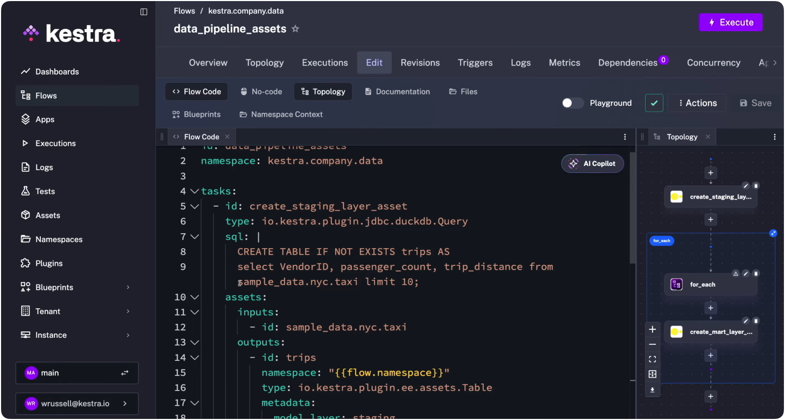
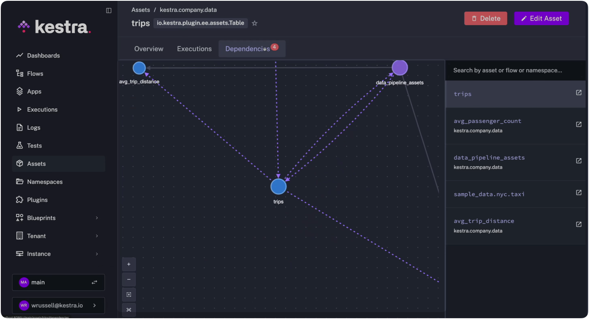
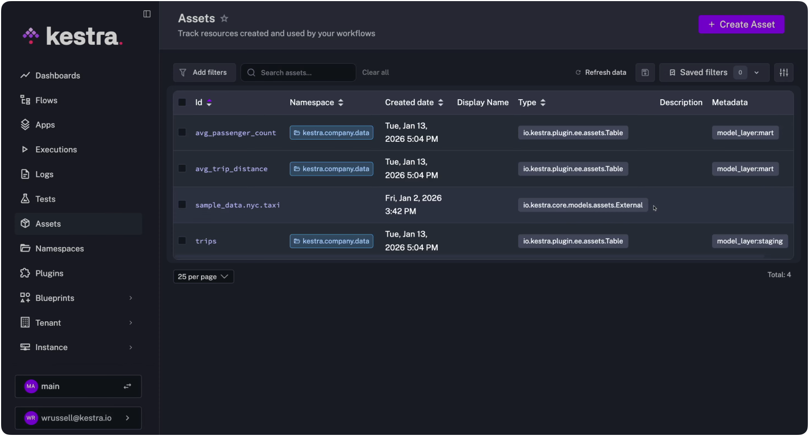
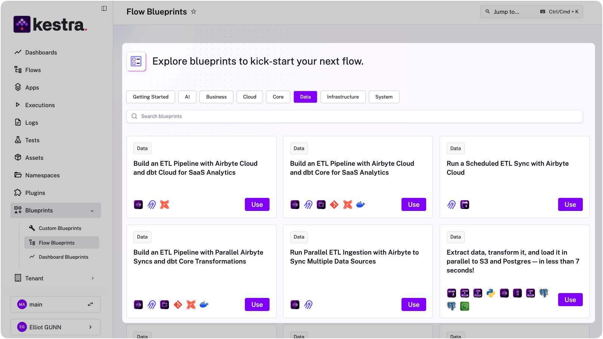

[Kestra 1.2](../release-1-2/index.md) introduces Assets, a way to track both data artifacts (tables, datasets, files) and infrastructure resources (buckets, VMs, compute) in a single inventory. Every workflow declares what it consumes and produces, and Kestra builds the dependency graph automatically.



Here’s why this matters: You're a data engineer and your DevOps team moves an on-prem ETL node to a different subnet. Which pipelines are now failing to connect? Or a team member provisions a new S3 bucket for customer data. How do you track which workflows are writing to it?

These scenarios share a common problem: the thing that changed includes both data and infrastructure, but your orchestrator only tracks task execution order. You can see that "Task A runs before Task B," but you can't see what they actually touch. When something breaks, you're left tracing dependencies manually.

Assets solve this by letting you declare what each task reads and writes, whether that's a database table, a cloud bucket, a file, or a provisioned VM. 

## Why data-only orchestration falls short

Modern [orchestration tools](../2024-09-18-what-is-an-orchestrator/index.md), even forward-thinking ones, assume that "asset" means "data asset," like tables, views, and datasets. 

**This is a fundamental architectural limitation.** These tools were designed around the assumption that orchestration means scheduling SQL transformations, so they track what happens between databases, not what happens between systems.

This works well enough for transformation-heavy workflows where every step reads a table and writes another table. But production [data pipelines](../../docs/use-cases/01.data-pipelines/index.md) rarely stay that clean. A typical analytics workflow might:

1. Pull raw data from an external API
2. Land it in a cloud storage bucket
3. Load it into a staging table
4. Transform it through multiple layers
5. Export aggregates to a downstream system

**Steps 1, 2, and 5 involve infrastructure, not just data.** If your lineage tool only tracks tables, you lose visibility into the bucket that holds your raw data, the API that feeds it, and the export job that delivers it. When something breaks, you're missing context. And when you're planning changes, you can't predict the impact across systems.

Kestra’s Assets solve this by treating data and infrastructure as first-class citizens in the orchestrator itself. Tables, buckets, file uploads, and provisioned VMs are assets. A table is an asset. A bucket is an asset. A file upload is an asset. They all live in the same inventory, with the same lineage tracking, built into execution.

## How Kestra's Assets work

You declare assets directly on workflow tasks using the `assets` property. Each task can specify `inputs` (resources it reads) and `outputs` (resources it creates or modifies).

Here's a simple example that creates a staging table:

```yaml
id: data_pipeline_assets
namespace: kestra.company.data

tasks:
  - id: create_staging_layer_asset
    type: io.kestra.plugin.jdbc.duckdb.Query
    sql: |
      CREATE TABLE IF NOT EXISTS trips AS
      select VendorID, passenger_count, trip_distance from sample_data.nyc.taxi limit 10;
    assets:
      inputs:
        - id: sample_data.nyc.taxi
      outputs:
          - id: trips
            namespace: "{{flow.namespace}}"
            type: io.kestra.plugin.ee.assets.Table
            metadata:
              model_layer: staging

pluginDefaults:
  - type: io.kestra.plugin.jdbc.duckdb
    values:
      url: "jdbc:duckdb:md:my_db?motherduck_token={{ secret('MOTHERDUCK_TOKEN') }}"
      fetchType: STORE
```

The task declares `sample_data.nyc.taxi` as an input (an external source managed outside this workflow) and `trips` as an output. Kestra registers both in its inventory and draws the dependency line between them.

The `metadata` field is flexible. You can tag assets by model layer (staging, mart), owner, environment, or any dimension that helps you filter and organize. This becomes useful when you have hundreds of assets and need to answer questions like "show me all staging tables owned by the data team."

## Three use cases for data teams

### 1. Multi-layer data pipelines with full lineage

The classic analytics pattern: staging layer reads from external sources, mart layer aggregates for reporting. With Assets, you track the complete chain.

```yaml
id: data_pipeline_assets
namespace: kestra.company.data

tasks:
  - id: staging
    type: io.kestra.plugin.jdbc.duckdb.Query
    sql: |
      CREATE TABLE trips AS
      SELECT * FROM sample_data.nyc.taxi LIMIT 10;
    assets:
      inputs:
        - id: sample_data.nyc.taxi
      outputs:
        - id: trips
          type: io.kestra.plugin.ee.assets.Table
          metadata:
            model_layer: staging

  - id: mart
    type: io.kestra.plugin.jdbc.duckdb.Query
    sql: SELECT AVG(trip_distance) AS avg_distance FROM trips;
    assets:
      inputs:
        - id: trips
      outputs:
        - id: avg_trip_distance
          type: io.kestra.plugin.ee.assets.Table
          metadata:
            model_layer: mart

```

Kestra builds the lineage graph automatically: `sample_data.nyc.taxi` -> `trips` -> `avg_trip_distance`. In the image below, Kestra's graph shows you the dependencies between the `trips` asset and the `avg_trip_distance` asset. Blue represents Asset objects, grey represents the Flows.



If the external source schema changes, you can trace the impact downstream. If a mart table looks wrong, you can trace it back to its staging dependencies.

### 2. Infrastructure provisioning with resource tracking

Many data teams do more than transform data; they also [provision the infrastructure](../../docs/use-cases/04.infrastructure/index.md) that holds it. When your platform team creates S3 buckets for different domains, those buckets become dependencies for downstream workflows.

```yaml
id: provision_team_buckets
namespace: company.infra

inputs:
  - id: teams
    type: MULTISELECT
    values: [Business, Data, Finance, Product]

tasks:
  - id: create_buckets
    type: io.kestra.plugin.core.flow.ForEach
    values: "{{ inputs.teams }}"
    tasks:
      - id: create_bucket
        type: io.kestra.plugin.aws.cli.AwsCLI
        commands:
          - aws s3 mb s3://kestra-{{ taskrun.value | slugify }}-bucket
        assets:
          outputs:
            - id: kestra-{{ taskrun.value | slugify }}-bucket
              type: AWS_BUCKET
              metadata:
                provider: s3
                team: "{{ taskrun.value }}"

```
The full code example, including credentials, [can be found here.](../../docs/07.enterprise/02.governance/01.assets/index.md#infrastructure-use-case-team-bucket-provisioning) 

Later, when the data team uploads files to their bucket, they reference it as an input asset:

```yaml
id: upload_file
namespace: kestra.company.data

tasks:
  - id: download
    type: io.kestra.plugin.core.http.Download
    uri: https://huggingface.co/datasets/kestra/datasets/raw/main/jaffle-csv/raw_customers.csv

  - id: aws_upload
    type: io.kestra.plugin.aws.s3.Upload
    bucket: kestra-data-bucket
    from: '{{ outputs.download.uri }}'
    key: raw_customer.csv
    assets:
      inputs:
        - id: kestra-data-bucket
      outputs:
        - id: raw_customer
          type: io.kestra.plugin.ee.assets.File
          metadata:
            owner: data

pluginDefaults:
  - type: io.kestra.plugin.aws
    values:
      accessKeyId: "{{ secret('AWS_ACCESS_KEY') }}"
      secretKeyId: "{{ secret('AWS_SECRET_ACCESS_KEY') }}"
      region: "{{ secret('AWS_REGION') }}"
```

Now your lineage graph connects infrastructure provisioning to data workflows. You can answer questions like: "Which teams are using which buckets?" and "What files have been uploaded to each bucket?"

### 3. Infrastructure operations with asset-based targeting

You can see your assets globally across Kestra on the Assets page:



And you can reference them dynamically in other workflows with the `assets()` function, which queries your inventory and returns matching assets for when you need to target infrastructure operations at scale.

```yaml
id: upgrade_python
namespace: team.infra

tasks:
  - id: upgrade_python_on_machines
    type: io.kestra.plugin.core.flow.ForEach
    values: '{{ assets(metadata={"nodes": "python"}) | jq(".[].id") }}'
    tasks:
      - id: upgrade_python
        type: io.kestra.plugin.scripts.shell.Commands
        description: "upgrades Python to 3.14, and checks the version."
        commands:
          - "ssh user@{{ taskrun.value }} 'sudo apt-get update && sudo apt-get install -y python3.14'"
          - "echo 'Python upgrade and check completed for {{ taskrun.value }}'"
```

This workflow queries the asset inventory for all machines tagged with `"nodes": "python"` and runs the upgrade across each one. The inventory stays current because it's populated by the workflows that provision the infrastructure.

## Shipping lineage to external systems

If you're already using OpenLineage-compatible tools (Marquez, DataHub, Atlan), Assets integrates with them. The [**AssetShipper**](/plugins/core/asset-ee/io.kestra.plugin.ee.assets.assetshipper) task exports your asset metadata to external lineage providers in either `ION` or `JSON` formats:

```yaml
id: ship_asset_to_file
namespace: kestra.company.data

tasks:
  - id: export_assets
    type: io.kestra.plugin.ee.assets.AssetShipper
    assetExporters:
      - id: file_exporter
        type: io.kestra.plugin.ee.assets.FileAssetExporter
        format: JSON
```

This lets you maintain a single source of truth in Kestra while pushing lineage data to specialized catalogs for discovery and [governance](../../docs/07.enterprise/02.governance/index.mdx).

## Blueprints to get started

Kestra's [Templated Blueprints](../../docs/07.enterprise/02.governance/custom-blueprints/index.md) lets you create reusable workflow templates that users can instantiate by filling out a form, no YAML editing required. Platform teams define the template once (including asset declarations), and other teams generate production-ready workflows by selecting options from dropdowns.



These blueprints let teams adopt asset tracking without writing `YAML` from scratch. Fill in the form, get a workflow with complete lineage built in.

## **Assets build the complete picture**

Most lineage tools only track data assets. Kestra's Assets track everything your pipelines touch: the tables, the buckets, the files, the infrastructure. When you declare inputs and outputs on every task, Kestra builds the dependency graph that shows how it all connects.

The result is lineage that reflects what you work on each day, not just the data transformation layer. When something breaks, you can trace the full chain. When you're planning changes, you can see the impact across data and infrastructure.

Assets are available in Kestra Enterprise Edition 1.2+. Check out our [docs](../../docs/07.enterprise/02.governance/01.assets/index.md) or get in touch [for a demo.](/demo)