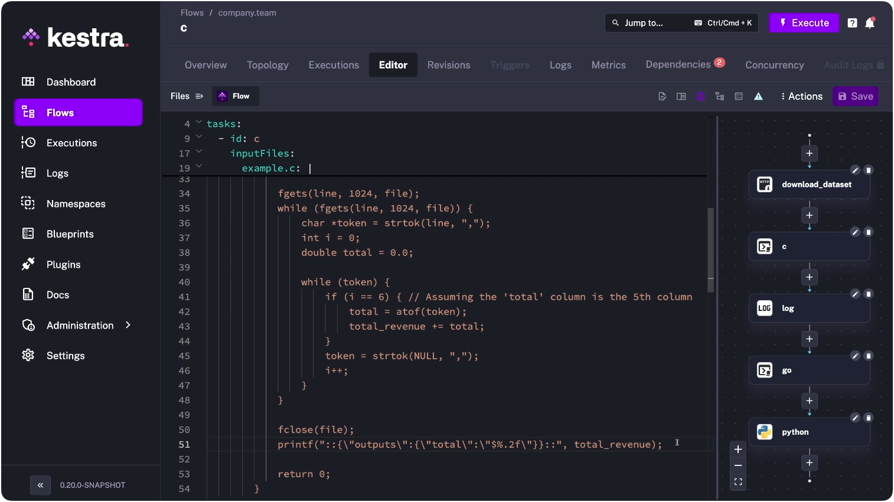
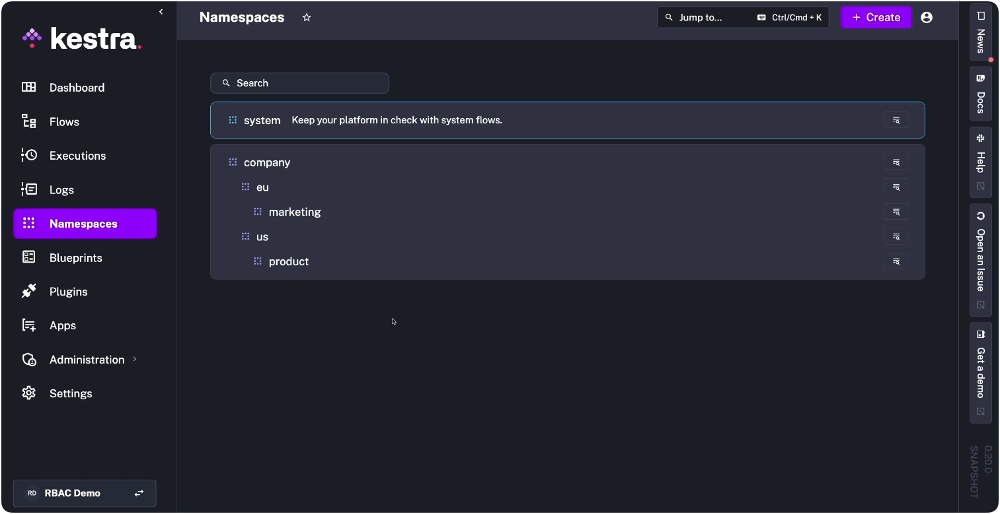

The first two months of 2026 delivered more capable AI models than the prior two years. That pace is doing something strange to data engineering: making the job easier to enter and larger in scope at the same time.

AI has lowered the bar of entry into data engineering: Claude Code can draft your pipeline, explain it, and debug it automatically. But every business process that gets structured becomes automatable, and the surface area of things that need orchestrating keeps expanding faster than the tools are democratizing access.

Not everyone encountering that surface is a data engineer by title -- the spectrum runs from analytics engineers using Claude to push past what they could tackle pre-LLM, to legal ops managers running daily AI summaries they'd never call "workflow engineering." The tools designed for "data orchestration" weren't built for this scope. 

I argue that in 2026, the coordination layer is now the scarce resource, not the code, and examine how the data engineer role is fracturing under that pressure, why orchestration is becoming the universal layer for pipelines, infrastructure, and business processes alike, and what it means for the teams building in this environment.

## The coordination problem outlasts the coding problem

### The "data engineer" role is fragmenting

This part isn't new. Mature data teams have had Platform Engineers, Data Engineers, and ML Engineers as distinct roles since the early 2020s. What AI changes is the permeability between those lanes.

A platform engineer who would never have touched a feature store can now configure Feast or Tecton with Claude's help. A data analyst who previously stopped at SQL can write production-grade pipeline logic, then use a YAML-first orchestrator to ship it without waiting on a dedicated data engineer. An ML engineer who depended on the data team to build training datasets can now build the ingestion layer themselves.

The three roles still exist, but their walls are getting porous:
* Platform engineers build orchestration systems that handle the full stack: [Kubernetes](/plugins/plugin-kubernetes), [Terraform](/plugins/plugin-terraform), and internal platforms at scale.
* Workflow engineers build pipelines and automations using SQL and YAML-based orchestration without deep Python or Java expertise. They live in dbt, [Airbyte](/plugins/plugin-airbyte) configurations, and orchestration UIs.
* AI engineers coordinate between feature stores (Feast, Tecton), model training infrastructure (PyTorch, TensorFlow), and inference pipelines.

The modern data stack is the forcing function. When your stack includes [Fivetran](/plugins/plugin-fivetran) for extraction, dbt for transformation, [Snowflake](/plugins/plugin-jdbc-snowflake) for warehousing, and [Hightouch](/plugins/plugin-hightouch) for reverse ETL, plus infrastructure provisioning and API coordination, you need orchestration that handles all of it. 

The platform engineer, workflow engineer, and AI engineer all touch the same dependency graph. They just enter it from different ends.

### The new bottleneck isn't the code

If everyone can write code, everyone can break production. The new bottleneck isn't writing the SQL query or the Python script. It's coordinating that work across different systems, languages, and teams.

When does this run? What happens if the Fivetran sync fails? What downstream dbt models depend on this table? Who gets alerted when Snowflake queries time out? How do we retry the Hightouch sync without duplicating records in Salesforce?

Answering these questions requires orchestration thinking, not traditional engineering thinking. Understanding dependencies across systems, not just within databases. A product manager who can write a dbt model with Claude Code still needs to think like an operator when that model depends on upstream Airbyte extractions, S3 file arrivals, and API rate limits.

Kestra runs tasks in C, Go, Python, and any other language in the same flow -- each task executes in whatever language makes sense, coordinated by a single YAML definition.

The range of who's doing this without calling it orchestration is wider than it looks. A developer sets up Claude Code with MCP servers and hooks. When a file lands in S3, a hook fires, Claude pulls context from the MCP knowledge base, generates a summary, and writes it to a [Slack](/plugins/plugin-slack) channel. They wrote maybe 20 lines of YAML and some hook configuration. That's [event-driven orchestration](../2024-06-27-realtime-triggers/index.md). 

On the other end, a financial analyst at a bank uses Claude Cowork to run a morning briefing: pull from their portfolio dashboard, compare against yesterday's close, flag anomalies, draft commentary. They're doing the same thing (event-driven, dependency-aware orchestration) but they just happen to call it "my AI."

### Declarative tooling is what makes it possible

[Declarative, language-agnostic tooling](../2024-10-25-code-in-any-language/index.md) is what's winning. dbt proved this at the transformation layer: analytics engineers have been authoring SQL transformations in YAML and Jinja for years without needing Python expertise. The same model is now extending to the full orchestration stack -- infrastructure provisioning, API coordination, and business process automation alongside data transformations. AI assistants accelerate the extension: they can generate clean configurations, validate them before runtime, and explain them to the non-engineer who has to maintain them next month.

YAML wins because it separates what you want from how to execute it. In a Python-based DAG, all task configuration is expressed in Python -- shell scripts, SQL queries, R models, Julia computations, and Go microservices all get wrapped in Python operator classes that non-Python team members can't read or modify. YAML keeps the orchestration logic in one place and the execution logic in whatever language makes sense for each task. That separation is what lets AI validate configurations before runtime, and what makes the result readable to someone who didn't write it.

This isn't a new pattern. Infrastructure-as-code took off with Terraform and Kubernetes for exactly the same reason: declarative configuration handles heterogeneous systems better than imperative code does. Workflow orchestration is following the same path.

Run a SQL query daily, alert on failure, retry three times: in a YAML-first orchestration tool, that's 10 lines of declarative configuration. Maintainable by a workflow engineer who learned SQL last week, and easy for an AI assistant to generate, validate, and explain.

In a YAML-first orchestration tool, it's 10 lines of declarative configuration. Both work. But only one is maintainable by a workflow engineer who learned SQL last week, and only one is easy for an AI assistant to generate, validate, and explain.

If your tool is a mess, AI will generate messy code. If your tool is clean and declarative, AI will generate clean, maintainable workflows.

When I was doing research for this article, I spoke to my colleague, Benoit, who runs product at Kestra and is a Claude power user. He shared how he works at the frontier of exactly this pattern. He writes a large spec document, hands it to Opus via a CLI tool called Bids (a DAG for agents, backed by a database), which breaks it into epics and issues. He then spins up five Claude Code sessions in parallel. The agents coordinate via MCP Agent Mail: when one claims an issue, it broadcasts to the others so they can reprioritize their queues. Kestra sits underneath as the scheduler and execution layer. The whole thing only works because the tooling is clean enough for AI to generate, read, and modify without losing coherence.

## Three predictions

The structural picture above describes where things are. Here's where I think they go.

**Prediction 1: "Workflow engineer" becomes an official job title by 2027.** 
Not a data engineer, not a DevOps engineer, but someone who orchestrates work across systems, languages, and teams. The key skills: understanding dependencies, event-driven architecture, and debugging distributed systems. Deep expertise in any single programming language becomes optional. Domain expertise and orchestration thinking become mandatory. 

The precedent is already there. "Analytics engineer" went from a dbt Labs blog post in 2016 to a mainstream job title by 2021. "Workflow engineer" follows the same logic: it's analytics engineer generalized beyond data transformations to the full dependency graph -- infrastructure, APIs, and business processes included. The title doesn't exist yet at most companies. The work does. "Workflow orchestration engineer" and "automation platform engineer" variants are already appearing in postings at data-forward companies; the job description (own the dependency graph, not the individual scripts) is consistent regardless of what the title says.

**Prediction 2: The pendulum swings again.** 
Just as everyone becomes a workflow engineer, we'll see the opposite trend emerge. Some companies will realize they've over-distributed engineering work and created chaos. A new category will emerge: "workflow governance" tools designed to prevent the mess that happens when 50 people can ship production workflows with no central oversight. 

The problem will shift from "how do we build faster" to "how do we prevent disasters." When orchestration scope expands from data pipelines to infrastructure and business processes, the blast radius of failures expands too.

**Prediction 3: Data engineering becomes operations engineering.** 
AI is commoditizing the "data" part. Anyone can write SQL or Python with assistance. The "engineering" part becomes the differentiator: reliability, incident response, cost. AI is already starting to manage the transformation logic itself. 

Take Salesforce-to-PostgreSQL ingestion: today that's a pipeline someone builds, field mapping by field mapping. Describe the same transformation in natural language and an agent figures out the mapping; the orchestration layer handles scheduling and retries. What remains is the operations work: did the sync run? Did it fail? Was it retried? Did it corrupt data? The best data engineers of 2026 think like SREs. They'll build platforms that let workflow engineers ship safely, with guardrails that prevent the most common failure modes.

## What to do about it

### For data practitioners
The legal ops manager running daily AI contract summaries is a useful mirror. When it breaks, she won't know if the problem is the S3 path, the Claude API call, or the downstream Slack notification. She wrote maybe 20 lines of YAML; she now owns a distributed system.

Orchestration thinking is the skill gap. Not coding: understanding dependencies. Knowing which upstream process yours relies on, what happens when it fails, and who needs to know. 

For a data analyst, that means understanding how your dbt model depends on upstream Fivetran syncs and downstream Hightouch activations, not just the SQL inside the model. For an ML engineer, it means knowing whether your training job failed because of bad data, a failed feature store sync, or an infra timeout.

AI can write the code. It can't know which business process depends on which API contract. That knowledge is your moat. The role evolves toward owning the dependency graph, not the individual scripts.

### For companies
The workflow sprawl risk from Prediction 2 is not hypothetical. Every workflow engineer who can push to production without visibility into the dependency graph is a future incident. The blast radius of an orchestration failure scales with scope: data pipelines fail quietly; infrastructure automation failures take down environments.

Invest in the platform layer before the sprawl starts. That means namespaces to isolate team domains, RBAC so platform engineers can grant the right level of access without opening the entire system, and audit logs that make failures traceable. In practice, that hierarchy looks like this: `company.eu.marketing` and `company.us.product` as separate domains, each with its own access boundary.

Declarative, structured tooling makes this easier: when configurations are readable, reviews are possible. Don't mistake "everyone can code" for "everyone should ship to production unsupervised." That division of labor is what prevents Prediction 2 from becoming your problem.

## Closing thoughts

The no-code revolution promised to democratize software development by hiding code behind visual interfaces. It failed because the abstraction was wrong. What actually democratized software development was making the real tools accessible, with AI assistants as guides.

Real workflows cross boundaries. An analytics workflow pulls from the [Stripe](/plugins/plugin-stripe) API, writes to S3, triggers schema validation, loads into Snowflake, runs dbt transformations, exports metrics to Looker, and syncs customer segments to Braze. Calling this "data orchestration" ignores the API coordination, infrastructure dependencies, and business system integration.

Orchestration is the universal layer. Now that everyone can build workflows, the tools that win will be the ones that treat the Stripe extraction, the S3 dependency, and the Braze sync as equally first-class problems, not as side effects of a "data" tool stretching past its original design.

If you're building the orchestration layer for your team (whether that's [data pipelines](../../docs/use-cases/01.data-pipelines/index.md), [infrastructure automation](../../docs/use-cases/04.infrastructure/index.md), or the business processes that connect them), [Kestra](/) is worth a look. Browse the [plugin library](/plugins) to see coverage for Fivetran, dbt, Snowflake, Airbyte, and the rest of the modern data stack.

You can have a workflow running in [under five minutes](../../docs/01.quickstart/index.md). [Book a demo](/demo) if you want to see how enterprise teams handle the governance side: namespaces, [RBAC](../../docs/07.enterprise/03.auth/rbac/index.md), [audit logs](../../docs/07.enterprise/02.governance/06.audit-logs/index.md), and [cross-stack lineage](../../docs/07.enterprise/02.governance/01.assets/index.md).

*Thanks to Will Russell for his generous feedback and sharp editorial eye on earlier drafts of this piece.*