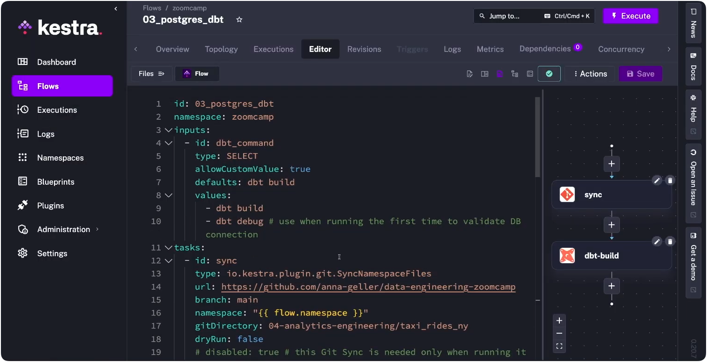
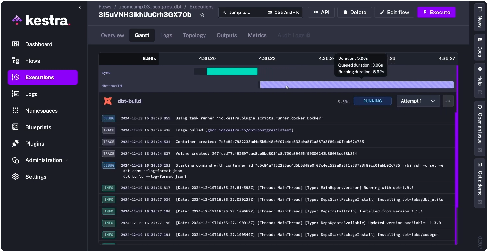
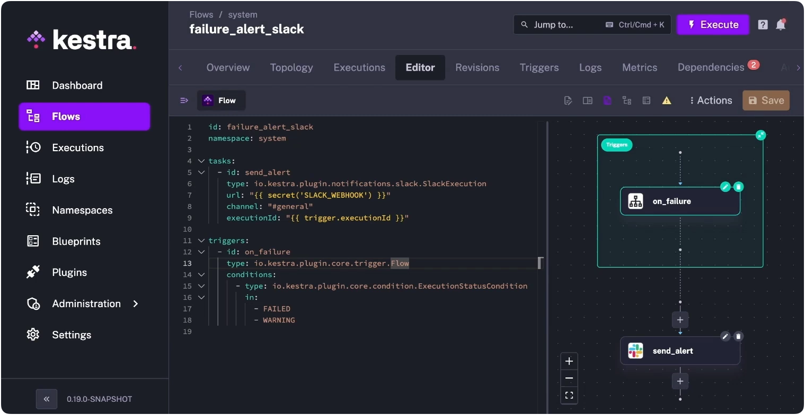

[dbt Core](/plugins/plugin-dbt) handles transformation. It doesn't schedule itself, wait for upstream sources, retry on failure, or alert anyone when something breaks. So you need something around it that does — an orchestrator that knows when source data is ready, triggers the run, and handles what happens when things break.

The choice matters more than it might seem. Kestra's own analytics stack runs this way: our analytics engineer, Rok, uses Kestra to orchestrate PyAirbyte ingestion, dbt transformations in [BigQuery](/plugins/plugin-gcp), and Lightdash reporting for the entire company on a single platform. [That setup is documented here.](../2026-01-06-how-kestra-runs-on-kestra/index.md) What follows is why Kestra is a natural fit for dbt Core teams specifically, and what that looks like in practice.

## Kestra works with dbt Core and dbt Cloud

The two use cases are different, but Kestra adds value in both.

**dbt Core** ships without a production runtime. No scheduler, no retry logic, no dependency management, no alerting. You need something around it that handles all of that.

Kestra is that layer: it runs your dbt CLI commands in isolated containers, waits for upstream sources before triggering, retries on transient failures, and routes alerts when things break. The rest of this post is about this setup.

**dbt Cloud** includes its own scheduler and CI runner, so teams whose pipeline starts and ends with dbt can get by without a separate orchestrator. But most pipelines don't start and end with dbt. They start with ingestion ([Airbyte](/plugins/plugin-airbyte), [Fivetran](/plugins/plugin-fivetran), custom extractors) and feed into activation or analytics layers downstream.

dbt Cloud orchestrates its slice. Everything around it is your problem.

Kestra handles that broader pipeline (ingestion, transformation, activation) as a single workflow. dbt Cloud can still run the transformation layer; Kestra coordinates what happens before and after.

And for teams that care about cross-stack lineage, Kestra's [Assets](../../docs/07.enterprise/02.governance/01.assets/index.md) fill the gap dbt Cloud leaves: dbt tracks lineage within your models, but has no visibility into the S3 bucket feeding them or the reverse ETL sync consuming their output. Assets tracks inputs and outputs across every step in the pipeline, not just within dbt.


## Why Kestra is a natural fit for dbt Core


### dbt is YAML. So is Kestra.

dbt teams already think in YAML. A Kestra workflow uses the same syntax and mental model, so there's no context switch between defining a dbt model and defining the orchestration around it.

Here's a dbt schema definition:

```yaml
# dbt schema.yml
models:
  - name: orders
    description: cleaned orders
    columns:
      - name: order_id
        tests:
          - unique
          - not_null
```

And here's the Kestra task that runs it:

```yaml
# kestra workflow
id: dbt_pipeline
namespace: company.data
tasks:
  - id: build
    type: io.kestra.plugin.dbt.cli.DbtCLI
    commands:
      - dbt build
```

Python-based orchestrators require a different context entirely: DAG definitions, decorator patterns, framework-specific imports. For a team that lives in YAML and SQL, that's a real overhead cost.

The topology updates live as you type — no deploy-to-preview cycle. You can see the DAG take shape before the workflow ever runs.




### Your dbt project stays untouched

Kestra's dbt plugin runs CLI commands (`dbt build`, `dbt test`, `dbt deps`) inside isolated Docker containers. Point it at your existing repo and it runs as-is.


### Orchestration beyond dbt, including lineage

dbt rarely runs in isolation. Ingestion and activation sit on either side of it, and Kestra handles those with 1200+ plugins. dbt becomes one step in a larger workflow rather than an isolated process you glue to other tools with scripts.

For teams that care about cross-pipeline lineage, Kestra's [Assets](../../docs/07.enterprise/02.governance/01.assets/index.md) feature tracks inputs and outputs across every step, not just within dbt. You can see which warehouse tables a dbt model reads from, what downstream workflows consume its output, and which execution created or last modified a given asset, across your entire stack from ingestion through activation.


### Built-in production primitives

[Retries](../../docs/05.workflow-components/12.retries/index.md) with exponential backoff, [error handling](../../docs/05.workflow-components/11.errors/index.md) blocks, [secrets management](../../docs/07.enterprise/02.governance/secrets-manager/index.md), [RBAC](../../docs/07.enterprise/03.auth/rbac/index.md), [audit logs](../../docs/07.enterprise/02.governance/06.audit-logs/index.md) — Kestra treats these as first-class workflow components, declared in the same YAML file as your dbt tasks rather than bolted on through separate tooling.


### Event-driven, not just scheduled

Kestra can trigger dbt runs on a [cron schedule](../../docs/05.workflow-components/07.triggers/01.schedule-trigger/index.md), but also in response to file arrivals in S3, [webhook calls](../../docs/05.workflow-components/07.triggers/03.webhook-trigger/index.md), [Kafka](/plugins/plugin-kafka) messages, or the completion of an upstream task. Your dbt models run when the data is actually ready, not on a timer that hopes it is.


## What a production dbt + Kestra setup looks like

Most analytics engineers piece this together over time: a cron job here, a Slack webhook bolted on there, a bash script that sort-of retries. 

Kestra's version is all of it in one YAML file, co-located with the orchestration logic itself. These patterns come from [Kestra's dbt documentation](../../docs/use-cases/02.dbt/index.md) and production Blueprints.


### Cloning, building, and scheduling

The setup most teams start with: clone from Git, install packages, run `dbt build`, schedule daily. Kestra handles all of it, and the `containerImage` field pins the exact dbt version to the workflow — no more "works on my machine" builds or host environment collisions. Credentials stay in Kestra's secrets manager, not in profiles.yml committed to your repo.

```yaml
id: dbt_pipeline
namespace: company.data

tasks:
  - id: dbt
    type: io.kestra.plugin.core.flow.WorkingDirectory
    tasks:
      - id: clone
        type: io.kestra.plugin.git.Clone
        url: https://github.com/your-org/dbt-project
        branch: main
      - id: build
        type: io.kestra.plugin.dbt.cli.DbtCLI
        containerImage: ghcr.io/kestra-io/dbt-duckdb:latest
        commands:
          - dbt deps
          - dbt build
        profiles: |
          my_project:
            outputs:
              prod:
                type: snowflake
                account: "{{ secret('SNOWFLAKE_ACCOUNT') }}"
                user: "{{ secret('SNOWFLAKE_USER') }}"
                password: "{{ secret('SNOWFLAKE_PASSWORD') }}"
                database: analytics
                schema: public
            target: prod

triggers:
  - id: daily
    type: io.kestra.plugin.core.trigger.Schedule
    cron: "0 8 * * *"
```

Credentials live in Kestra's secrets manager, not in your repo. The `containerImage` field controls which dbt version runs, isolated from anything else on the host.


### Upstream dependencies

The classic analytics engineer workaround: schedule dbt at 8am, Fivetran finishes at 8:12, so you push the cron to 9am and add a buffer. The buffer gets stale, models run on yesterday's data, and nobody notices until a dashboard looks wrong.

The real fix is declaring the dependency explicitly. Kestra sequences tasks: the Airbyte sync runs first, dbt starts only after it completes.

```yaml
tasks:
  - id: airbyte_sync
    type: io.kestra.plugin.airbyte.connections.Sync
    connectionId: "{{ secret('AIRBYTE_CONNECTION_ID') }}"

  - id: dbt_build
    type: io.kestra.plugin.dbt.cli.DbtCLI
    containerImage: ghcr.io/kestra-io/dbt-duckdb:latest
    commands:
      - dbt build
```

Tasks run sequentially by default. If the sync fails, dbt never starts. Multiple independent sources can run in parallel, with dbt gated on all of them completing.

Every execution gets a Gantt view showing task timing, plus real-time container logs — so when something does fail, you're looking at exactly what ran, in what order, and where it stopped.




### Retries

Warehouse timeouts, [Snowflake](/plugins/plugin-jdbc-snowflake) query failures, and transient network errors are a fact of life in production. Without retry logic, a 30-second blip pages someone at 8am or silently breaks a dashboard. With it, most transient failures resolve themselves before anyone notices.

```yaml
- id: dbt_build
  type: io.kestra.plugin.dbt.cli.DbtCLI
  retry:
    type: exponential
    maxAttempts: 3
    interval: PT30S
    maxInterval: PT5M
  commands:
    - dbt build
```

Three attempts with exponential backoff. The retry is declared alongside the task, not in a separate config file or monitoring layer.


### Failure alerting

When retries are exhausted, you want to know immediately — not when a stakeholder messages asking why a number looks off. The `errors` block runs only on workflow failure and routes to wherever your team actually responds: [Slack](/plugins/plugin-slack), email, [PagerDuty](/plugins/plugin-pagerduty), or anything with an API.

```yaml
errors:
  - id: slack_alert
    type: io.kestra.plugin.slack.SlackIncomingWebhook
    url: "{{ secret('SLACK_WEBHOOK') }}"
    messageText: |
      dbt build failed in {{ flow.namespace }}
      Execution: {{ execution.id }}
```

The message includes the execution ID, so whoever responds can jump directly to the logs instead of hunting through run history.

You can also set this up as a standalone system flow in Kestra — a single `failure_alert_slack` flow that watches for `FAILED` or `WARNING` status across your entire namespace and routes to Slack automatically, separate from any individual pipeline.




### Git sync and CI

For teams with a mature dbt workflow, [Git sync](../../docs/version-control-cicd/04.git/index.md) keeps Kestra's namespace files in sync with your repo automatically. Each run pulls the latest code — no manual clone step, no drift between what's in Git and what's running in production.

```yaml
tasks:
  - id: sync
    type: io.kestra.plugin.git.SyncNamespaceFiles
    url: https://github.com/your-org/dbt-project
    branch: main
    namespace: "{{ flow.namespace }}"
    gitDirectory: dbt
  - id: dbt_build
    type: io.kestra.plugin.dbt.cli.DbtCLI
    containerImage: ghcr.io/kestra-io/dbt-duckdb:latest
    namespaceFiles:
      enabled: true
    commands:
      - dbt deps
      - dbt build
```

The CI side of this is where it gets useful for larger teams: run `dbt build --select state:modified+` against a feature branch and block merges on test failures. Kestra persists the dbt manifest between runs, so state-based selection actually works — you're not rebuilding the full project on every PR.

## Getting started

The choice of orchestrator shapes more than deployment mechanics. It shapes whether your data team can reason about the full pipeline in one place, whether engineers outside the dbt project can understand what's running and when, and whether failure surfaces quickly or silently.

dbt Core handles transformation precisely. What wraps around it determines everything else. The fastest path to seeing this in practice is a [dbt Blueprint](/blueprints?tags=dbt): a production-ready template you can deploy and modify. For profiles management, manifest caching, and multi-environment setups, our [dbt orchestration docs](../../docs/use-cases/02.dbt/index.md) cover the full picture.

Running dbt across multiple teams with [namespace isolation](../../docs/07.enterprise/02.governance/07.namespace-management/index.md), RBAC, and audit logging? [Book a demo](/demo) to see those features in action.