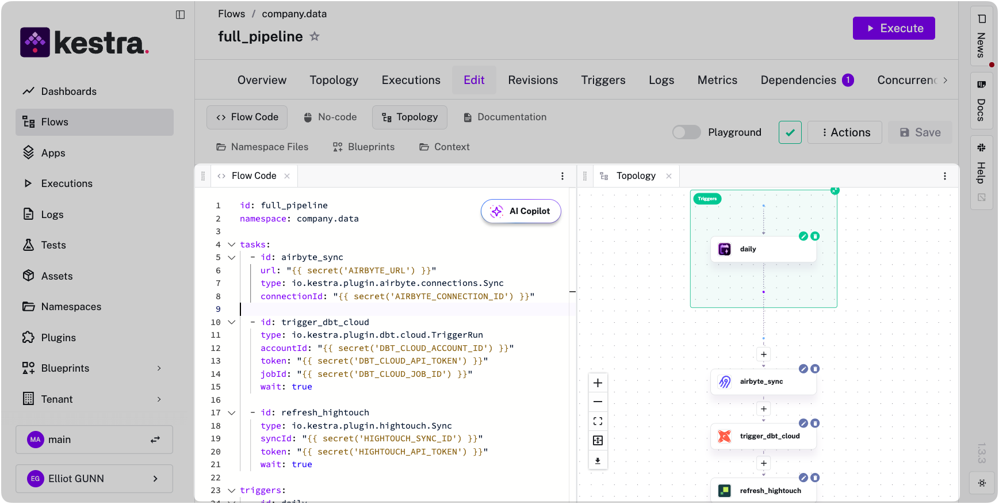
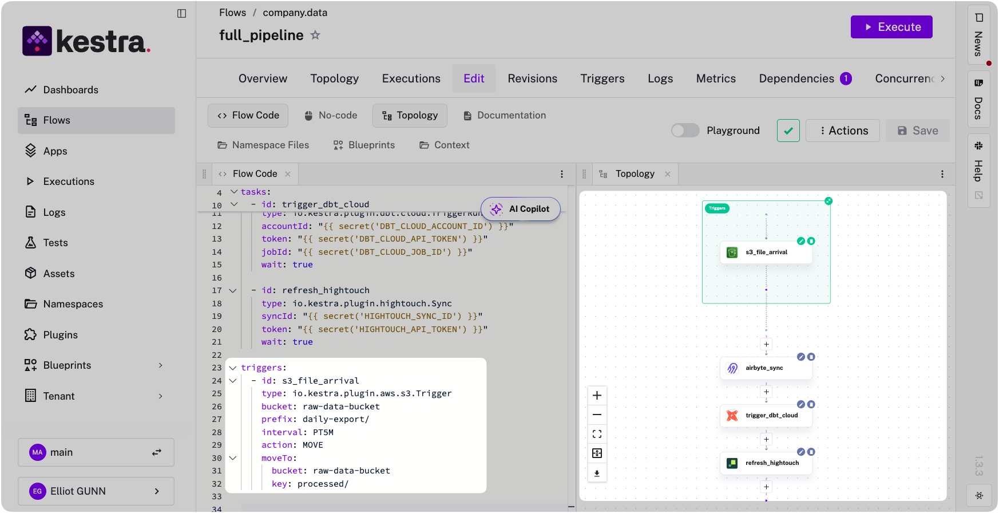
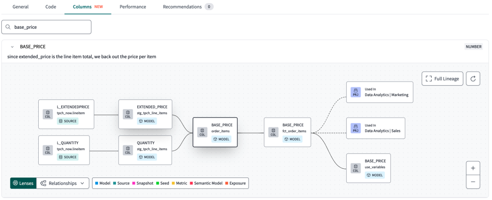
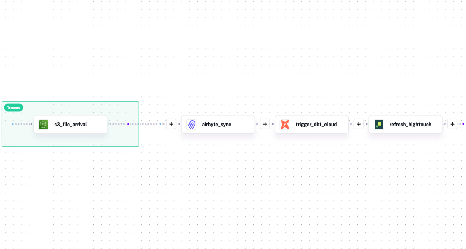
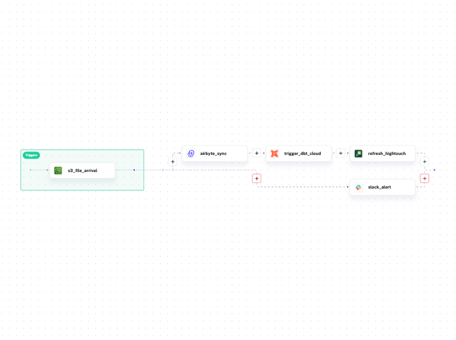
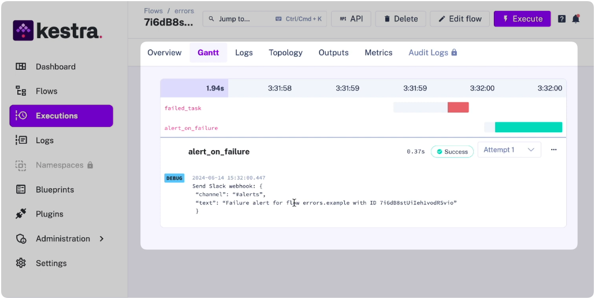

If your entire data pipeline is dbt models running on a schedule, dbt Cloud's built-in scheduler might cover you. It runs dbt commands on a cron schedule, handles CI on pull requests, and hosts a browser IDE. But most pipelines aren't that simple: they start with ingestion ([Airbyte](/plugins/plugin-airbyte), [Fivetran](/plugins/plugin-fivetran), custom extractors), pass through dbt for transformation, and feed into activation layers downstream (reverse ETL, dashboard refreshes, notifications). Everything upstream and downstream of transformation has to be figured out elsewhere.

dbt Cloud's scheduler was never designed to coordinate cross-tool pipelines. That's why their [documentation](https://docs.getdbt.com/docs/deploy/deployment-tools) dedicates a full page to external orchestrators that work with dbt Cloud, listing Kestra alongside other tools.

Unlike most orchestrators on that list, Kestra is language-agnostic: it orchestrates across tools and runs tasks in whatever language you're already using, whether that's Python scripts, dbt SQL, or Bash. It handles the full pipeline as a single workflow, with dbt Cloud running the transformation step. This means cross-stack lineage and failure handling that span the entire pipeline, not just the dbt layer.

I'll cover what dbt Cloud's scheduler actually handles and where it stops, then show how to build a full ingestion-to-activation pipeline with Kestra and dbt Cloud working together.

## What dbt Cloud's scheduler is limited to

dbt Cloud does three things: it schedules dbt jobs, runs CI checks on pull requests, and hosts a browser IDE. For teams that only need transformation orchestration, those features cover the basics -- but let's get precise about where those basics end.

**Scheduling is dbt-only.** dbt Cloud runs dbt commands on a cron schedule or Git event. It cannot trigger a run when an Airbyte sync completes, a file lands in S3, or a [Kafka](/plugins/plugin-kafka) message arrives. If your source data isn't ready when the schedule fires, your models build on stale inputs.

**No downstream coordination.** After dbt finishes, you often need to trigger a reverse ETL sync, refresh a dashboard, or send a Slack notification. dbt Cloud has no mechanism for any of this, so you have to use webhooks and custom scripts.

**CI is limited to three Git providers.** Automated CI only works with GitHub, GitLab, and Azure DevOps (Enterprise tier). Teams on Bitbucket, AWS CodeCommit, or internal Git servers have to figure out their own workarounds.

**Lineage stops at the dbt boundary.** dbt Cloud tracks lineage across your models. It has zero visibility into the S3 bucket feeding those models, the Fivetran connection syncing source data, or the [Hightouch](/plugins/plugin-hightouch) sync consuming the output. Your actual data pipeline is wider than what dbt can see.

**Consumption pricing is hard to forecast.** CI runs, scheduled jobs, and API-triggered executions all draw from the same pool of model builds. That's an expensive blind spot for dbt Labs' consumption-based billing model.

If your pipeline genuinely starts and ends inside dbt, these limitations don't bite. But most analytics engineers discover they need upstream coordination within the first few months of production use. That's the point where the "do I need an orchestrator?" question answers itself.

## How Kestra orchestrates dbt Cloud

Kestra doesn't replace dbt Cloud — it wraps around it. dbt Cloud keeps running your transformations on its own scheduler. Kestra handles the upstream triggers, downstream steps, cross-pipeline lineage, and failure handling that dbt Cloud leaves out.

Instead of having three separate tools, Kestra defines the entire pipeline in one YAML file. Tasks run sequentially by default: in this example, the Airbyte sync finishes, then dbt Cloud runs, then Hightouch activates the output.

```yaml
id: full_pipeline
namespace: company.data

tasks:
  - id: airbyte_sync
    type: io.kestra.plugin.airbyte.connections.Sync
    url: "{{ secret('AIRBYTE_URL') }}"
    connectionId: "{{ secret('AIRBYTE_CONNECTION_ID') }}"

  - id: trigger_dbt_cloud
    type: io.kestra.plugin.dbt.cloud.TriggerRun
    accountId: "{{ secret('DBT_CLOUD_ACCOUNT_ID') }}"
    token: "{{ secret('DBT_CLOUD_API_TOKEN') }}"
    jobId: "{{ secret('DBT_CLOUD_JOB_ID') }}"
    wait: true

  - id: refresh_hightouch
    type: io.kestra.plugin.hightouch.Sync
    syncId: "{{ secret('HIGHTOUCH_SYNC_ID') }}"
    token: "{{ secret('HIGHTOUCH_API_TOKEN') }}"
    wait: true

triggers:
  - id: daily
    type: io.kestra.plugin.core.trigger.Schedule
    cron: "0 8 * * *"
```



If any step fails, downstream tasks never start.

You can also replace the cron trigger with [event-driven triggers](../2024-06-27-realtime-triggers/index.md). Run the pipeline when data actually arrives, not when a schedule hopes it has:

```yaml
triggers:
  - id: s3_file_arrival
    type: io.kestra.plugin.aws.s3.Trigger
    bucket: raw-data-bucket
    prefix: daily-export/
    interval: PT5M
    action: MOVE
    moveTo:
      bucket: raw-data-bucket
      key: processed/
```




### Cross-stack lineage

In a multi-tool pipeline, dbt Labs' lineage view stops at each tool's boundary. dbt Cloud tracks your models, Airbyte tracks its syncs, Hightouch tracks its activations — and none of them know what the others are doing. When a dashboard shows stale data, you're jumping between three UIs trying to reconstruct what happened and in what order, because no single tool saw the whole thing.

Kestra sees the whole pipeline because it ran all of it — Python scripts, dbt SQL, Bash, API calls, regardless of what tool or language each step uses. That means it tracks assets across the entire execution graph, not just within a single tool's boundary. Kestra's [Assets](../../docs/07.enterprise/02.governance/01.assets/index.md) record which S3 files fed the Airbyte sync, which dbt models the sync populated, which Hightouch syncs consumed those models, and which execution last touched each asset. When a dashboard shows stale data, you trace the problem from the dashboard back to the source file in one place, not across four tools.

Here's what that difference looks like. dbt Cloud's lineage view shows your models and nothing else:



Kestra's view shows the full pipeline, with every tool and dataset connected in a single graph:




### Failure handling across the full pipeline

Here's a failure mode that's easy to miss: your Airbyte sync fails at 7:45am, but dbt Cloud fires at 8am on schedule, builds all your models successfully against yesterday's data, and reports green. Nobody gets paged and the dashboard looks fine until a stakeholder notices the numbers haven't moved. By the time you're notified, you're debugging a silent failure that happened hours ago.

This happens because each tool only handles failures within its own boundary. dbt Cloud retries only dbt jobs. It has no mechanism for knowing the upstream sync failed, alerting on a downstream activation breaking, or coordinating recovery across the pipeline.

Kestra handles failures at the workflow level because it orchestrates every step — whether that step is a Python script, a dbt SQL job, a Bash command, or an API call. One error handler covers all of them:

```yaml
errors:
  - id: slack_alert
    type: io.kestra.plugin.slack.SlackIncomingWebhook
    url: "{{ secret('SLACK_WEBHOOK') }}"
    messageText: |
      Pipeline failed at step: {{ taskrun.taskId }}
      Execution: {{ execution.id }}
      Namespace: {{ flow.namespace }}
```

[Retries](../../docs/05.workflow-components/12.retries/index.md), exponential backoff, and alerting are declared per-task or per-workflow and apply uniformly to every step. The language or tool running the task doesn't matter — the failure handling is the same.





## Deciding what you actually need

**dbt Cloud alone works when:**
- Your pipeline is dbt-only (no ingestion or activation steps)
- You use GitHub, GitLab, or Azure DevOps for CI
- You don't need cross-tool lineage
- You're comfortable with SaaS-only deployment and consumption pricing

**Add an orchestrator when:**
- Your pipeline includes ingestion, activation, or non-dbt steps
- You need event-driven triggers, not just cron schedules
- You want lineage across the full data lifecycle
- You need failure handling that spans multiple tools
- You require self-hosted deployment or air-gapped environments

If you're already building cron offsets, webhook relays, or polling scripts to coordinate tools around dbt Cloud, **you've already built a bad orchestrator.** The question, then, is whether to keep maintaining that glue or replace it with something purpose-built.

As a bonus, Kestra doesn't meter by workflow or execution, so the cost doesn't scale with your pipeline complexity the way dbt Cloud's consumption model does.

## Getting started

If you're already running dbt Cloud and want to stop building glue code, the fastest path is using one of Kestra's [dbt Blueprints](/blueprints?tags=dbt): pick one, swap in your dbt Cloud credentials, add your upstream and downstream steps. For profiles management, multi-environment configuration, and namespace isolation across teams, Kestra's [dbt orchestration docs](../../docs/use-cases/02.dbt/index.md) cover the full setup.

Running dbt Cloud alongside ingestion and activation tools across multiple teams? [Book a demo](/demo) to see how [namespace isolation](../../docs/07.enterprise/02.governance/07.namespace-management/index.md), [RBAC](../../docs/07.enterprise/03.auth/rbac/index.md), and cross-stack lineage work in practice.
