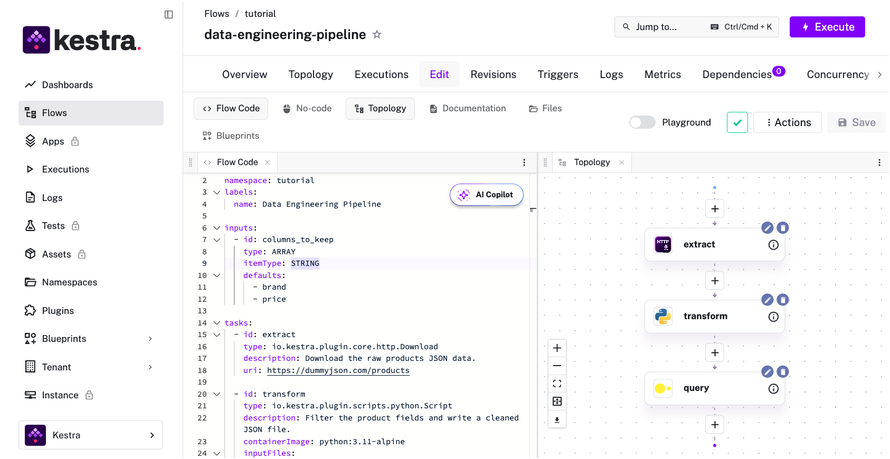
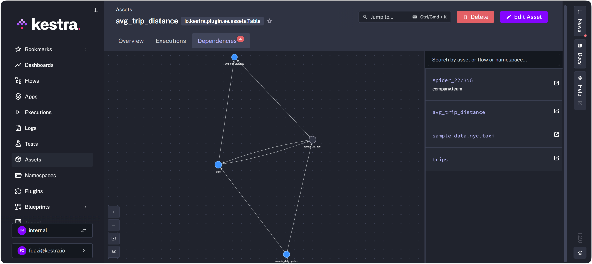

Airflow 2 is reaching end of life in April 2026. For most teams, the easiest path is to upgrade to [Airflow 3](../2026-01-27-airflow-3-vs-airflow-2/index.md) and move on. I think that's a mistake worth pausing on as Airflow's [open issue tracker](https://github.com/apache/airflow/issues?q=is%3Aissue+is%3Aopen+airflow+3+upgrade) hints at a challenging migration process.

The end of a major version is also one of the few moments where the switching cost is low enough to seriously evaluate alternatives. If you don't, you're likely locking in your orchestration model for the next decade.

The reason most teams won't evaluate is the same reason I [failed to migrate a data team to dbt](https://medium.pimpaudben.fr/how-i-failed-to-implement-dbt-in-my-previous-job-0b168f59e150) a few years ago. Even when you know a better alternative exists, migrations are painful enough that the status quo always wins. 

LLMs have started to change that calculus. I built [migration-skills](https://github.com/kestra-io/migration-skills) so the conversion part takes minutes instead of weeks or months. 

## Why teams default to Airflow 3

At my previous job as a data engineer, I spent six months building the case for migrating our data team from a legacy setup to dbt. I had a working prototype, benchmarks, and a migration plan. The technical argument was solid.

What I didn't have was a working demo in front of the people who needed to say yes, before they'd already mentally committed to the status quo. By the time I had something running end-to-end, the conversation was over.

Airflow migrations will replay this pattern exactly because the translation work is what kills effort to consider [better alternatives](../2026-01-18-enterprise-airflow-alternatives/index.md). Taking years of accumulated DAGs, each with its own workarounds and undocumented decisions, and converting them one by one into something new is a lot of work. Most teams look at that and decide the upgrade is easier. They never get to the working demo stage.

## Two directions

If you are able to look around for other options, there are two directions you could go in. One is staying in the Airflow orbit: a managed offering like MWAA or Astronomer, or upgrading to Airflow 3. The other is treating this moment as a real evaluation.

Python-native orchestrators often come up in that conversation. They're genuinely modern, but they're still Python-first frameworks. The same people who could own Airflow DAGs are the same people who can own workflows there. The ownership model doesn't change.

[Kestra](/vs/airflow) is built around a different constraint: workflows are defined in YAML, and your existing Python scripts, SQL queries, and Shell commands run as tasks in isolated containers without rewriting or wrapping. The logic you already have works, only the coordination layer changes.

## How LLMs change technical evaluations

 Converting between Python DAGs and YAML flows are exactly the kind of work LLMs handle well: the source is structured code with predictable patterns, the target format is well-documented, and the mapping rules are consistent. An LLM can read a Python DAG, understand the dependency graph and task logic, and emit valid YAML.

### Running the skill

[migration-skills](https://github.com/kestra-io/migration-skills) converts an Airflow DAG into a working Kestra flow. Symlink the repo into `~/.claude/skills/`, point it at a DAG file, and run:

```
/migrate-airflow-kestra dags/my_dag.py kestra/
```

It extracts Python task logic into separate namespace files, maps the DAG dependency structure to Kestra task definitions, and preserves parallel execution patterns.



The left pane is the flow definition in YAML — equivalent to your DAG file, but without Python imports or decorators. The topology on the right is the same dependency graph Airflow shows in its Graph view: tasks, execution order, and parallelism, just rendered from YAML instead of Python code.

## The mistake I keep watching teams make

At that previous job, I had a twelve-slide deck explaining why dbt was the right tool, a migration timeline, a risk matrix. I had everything except a running example in front of the people who needed to decide.

A working example moves things faster than any migration plan. One DAG, converted, running in Kestra, in front of the people who need to say yes.

## Try Kestra OSS

Kestra is open source. Five minutes to get running locally with Docker, then convert one DAG you know well and run it.

```bash
docker run --pull=always --rm -it -p 8080:8080 --user=root \
  -v /var/run/docker.sock:/var/run/docker.sock \
  -v /tmp:/tmp kestra/kestra:latest server local
```

Then:

1. Symlink [migration-skills](https://github.com/kestra-io/migration-skills) into `~/.claude/skills/`
2. Run `/migrate-airflow-kestra dags/my_dag.py kestra/` on a DAG you understand end-to-end
3. Import the output into Kestra and run it



Within an hour you'll have a working Kestra flow and a list of decisions the tool couldn't make for you: which DAGs are undocumented, which are duplicates, which exist only because nobody wanted to be the one to delete them. That's the actual migration work, and now you know what it is.

[Kestra OSS on GitHub](https://github.com/kestra-io/kestra) | [airflow-to-kestra-migration](https://github.com/kestra-io/airflow-to-kestra-migration)
