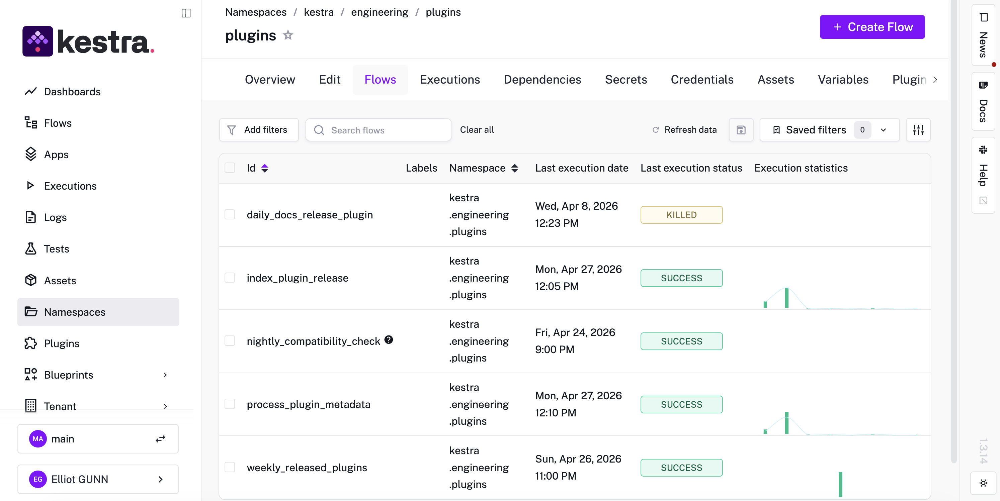
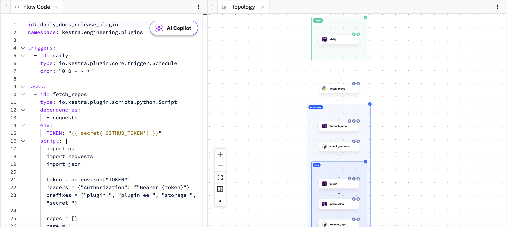

The Plugins & Integrations team at Kestra is responsible for the 1200+ plugins that connect Kestra to the rest of the data and cloud ecosystem. [AWS](/plugins/plugin-aws), [GCP](/plugins/plugin-gcp), [Azure](/plugins/plugin-azure), [Snowflake](/plugins/plugin-jdbc-snowflake), [Kafka](/plugins/plugin-kafka), [dbt](/plugins/plugin-dbt), [Airbyte](/plugins/plugin-airbyte), and a few hundred more. Every release, every regression, every compatibility check across all of them falls to us.

At that volume, releasing a plugin meant manually coordinating the same sequence of steps across every affected package: validate, release, index, notify. This manual process creates a lot of interruptions when you're also running multiple releases in parallel and also doing other engineering work.

We build orchestration software, so fixing this with Kestra was the obvious move. I'll walk through what we built and what changed.

## What the release process used to look like

Maintaining 1200+ plugins across a constantly-moving ecosystem means releases are continuous. A new plugin ships, a provider updates its API, a dependency bumps a version. Every one of those events needs the same sequence of steps: validate, release, index, notify.

Doing that manually means relying on whoever owns the release to remember every step, in order, without skipping anything under time pressure.

The other problem is visibility. When something goes wrong in a manual workflow, you often don't know until the damage is done. Nobody's watching every step of a plugin release at 4pm on a Friday. The failure surfaces when a user files an issue.

## What we built

Five flows cover the full lifecycle.

The core release flow, `daily_docs_release_plugin`, is semi-automated with one human-in-the-loop gate before anything ships. The automation handles preparation and runs the checks. Then it pauses for a manual approval. That pause is worth having as it's the moment where someone confirms that what's about to go out is what we intended, before it's irreversible. Everything else in the flow is automatic.

*The flow definition on the left; Kestra renders the task graph on the right automatically.*

When a new release tag is created, `index_plugin_release` triggers automatically. New plugin versions show up in the library without anyone having to remember to run the indexer. The metadata work lives in a [subflow](https://kestra.io/docs/workflow-components/subflows) called `process_plugin_metadata`, which `index_plugin_release` calls but which we can also run independently when something needs reindexing. Separating it out keeps debugging clean: if indexing fails, we know exactly where to look.

`nightly_compatibility_check` runs every night. It takes the entire plugin library and runs it against the latest `main` branch of Kestra core. The results land in Slack each morning.

The fifth flow, `weekly_released_plugins`, compiles a digest of everything that shipped: new features, bug fixes, version bumps. It posts automatically to [Slack](/plugins/plugin-slack) and our [Notion](/plugins/plugin-notion) database. The team gets a summary without anyone writing one, and it gives visibility beyond engineering: product, customer success, marketing, and sales can all follow what's shipping without attending every standup.

## What changed

The obvious answer is time saved. We do save time. But the more accurate, and interesting, answer is where the time went.

Before these flows, I was holding a lot of state in my head. What step are we on? Did that job finish? Was the metadata indexed for that version? That cognitive overhead is small per task but it compounds across a day when you're running multiple releases in parallel and also trying to do actual engineering work.

Now, that overhead is Kestra's responsibility. The flows track state, handle retries, and send alerts when something needs attention. My job is to handle the things that actually require human judgment: the approval gate in `daily_docs_release_plugin`, the investigation when a compatibility check fails, the decision about whether a breaking change in a dependency warrants a major version bump.

The nightly compatibility check is the one that changed my mornings most noticeably. Before we had it, discovering a plugin regression typically happened mid-day, when someone was in the middle of something else and had to drop it to investigate. Now it happens overnight while nobody's paying attention. By the time the day starts, the result is waiting. If it's clean, that's a green light. If something's broken, it's almost always a flaky test or a dependency change, and we can triage it before anyone's day gets derailed.

## Why YAML makes this easy to maintain

In Kestra, a workflow is a YAML file. It describes what tasks should run, in what order, and on what trigger. Kestra handles execution, retries, and state tracking. The logic lives in the tasks; the YAML describes the shape of the process.

We're not a large team, so the flows need to be readable by everyone on the team and debuggable without a handoff. YAML that describes intent, with tasks that execute the actual logic, means reading a flow is close to reading a checklist. You can understand what it does without knowing anything about how it was implemented.

When we needed to add the human-in-the-loop approval step to `daily_docs_release_plugin`, it was a few lines of YAML. When we needed to separate out the metadata indexing into its own subflow, it was a refactor that took less than an afternoon. The flow definition and the execution logic stay separate: the YAML describes what should happen, and Kestra handles execution.

## The floor we didn't know we were missing

Before we had these flows, a release that ran smoothly felt like a success. Now, a release that runs smoothly is the floor, not the ceiling. We get focus on the important questions that require human judgment. Why did this compatibility check fail? What changed in this dependency? Why is this plugin failing on main when it passed last week?

We have time to ask them now because the flows handle everything that doesn't require judgment.

[Kestra is open source](https://github.com/kestra-io/kestra). The five flows covering our release lifecycle (the release gate, indexing, metadata processing, nightly compatibility checks, and the weekly digest) are each a few dozen lines of YAML. If your team is running similar processes manually, the [plugin library](/plugins) and [Blueprint catalog](/blueprints) are good places to start.

We're also continuing to push this further. The next step is automating more of the maintenance cycle, including accelerating how we detect and respond to upstream dependency changes across the full plugin library. More on that as it ships.

If you want to build something similar, the [quickstart](../../docs/01.quickstart/index.md) gets you running in minutes. If you have questions or want to share what you've built, come find us on [Slack](/slack) or give us [a star on GitHub](https://github.com/kestra-io/kestra) ⭐️.
