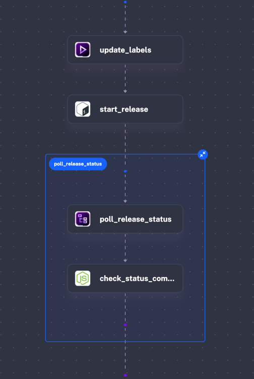
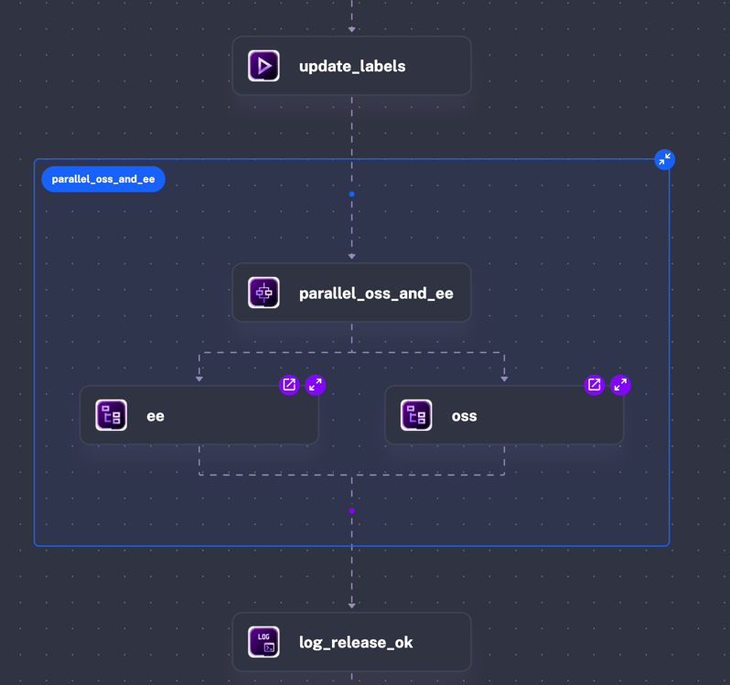
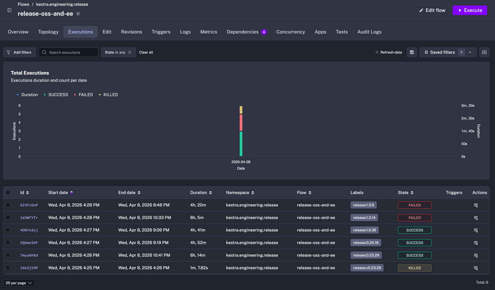
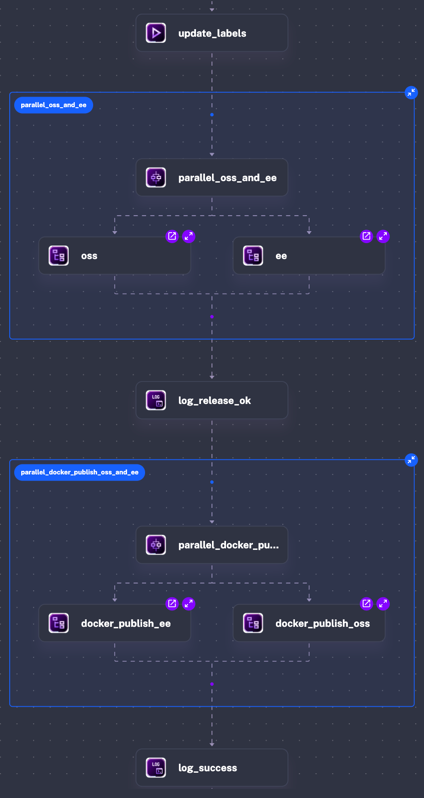
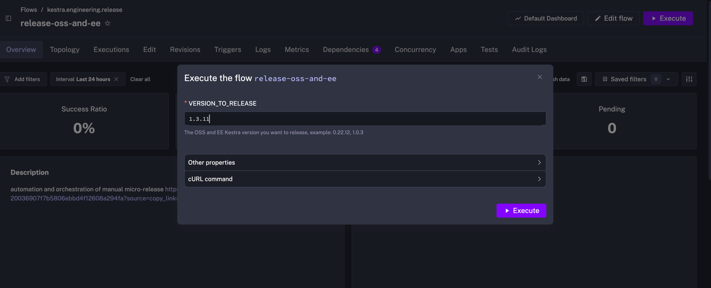

Every Tuesday, we ship bug fixes across multiple maintained versions at once — [LTS](../introducing-lts/index.md), latest, and sometimes older releases. At peak, that's four parallel releases on the same day.

For a while, coordinating those releases required a lot of manual actions and mental bandwidth between GitHub repositories.

We build orchestration software, so fixing this with Kestra was an obvious move. I'll walk through what that looked like, what I built to fix it, and what happened after I rolled it out.

## What the Tuesday releases looked like

A release used to go like this:
- First, we bump the version number on the specific release branch, a GitHub workflow kicks in.
- Wait for the build to pass
- Then we manually trigger another GitHub Actions workflow to publish our official Docker images.
- Do that twice: for both our OSS and enterprise repositories

The jobs run for an hour, sometimes longer on older releases with more accumulated test debt. So I'd context-switch back to whatever I was working on, try to get something done, and check back in 15 minutes to see where things stood.

If both main workflows passed, great. Trigger our Docker image publication.

If a flaky test failed (and they do, on every release, at some frequency), or a transient network error happened (reaching Maven Central, installing Ubuntu libs...), I'd relaunch the job manually and start the waiting cycle again. Then repeat the whole thing for each version being released. Four versions means four cycles of this, running in loose parallel, all of them needing attention at unpredictable intervals.

With these many interruptions, real work got fragmented into whatever I could fit between status checks. So I started automating it.

## Development journey of the Flow

### Starting point: my laptop terminal
My first pain point was having to navigate in GitHub UI to check the main CIs of my ongoing releases, that was 2 to 8 CI jobs to monitor.

My initial solution was to create a simple JS CLI command that would: check the status of a given GitHub workflow, retry once, and visually display the status with colors in my terminal.
It looked something like this:
```shell
while true; do npx --yes @kestra-io/kestra-devtools checkWorkflowStatus pre-release.yml --repo=kestra --branches='v{{inputs.VERSION_TO_RELEASE}}' --retry=1; sleep 10; done
```

I would run that in multiple terminals, and visually check from time to time if everything was green.

### Creating a first Flow
A few releases later, after a few fixes on my CLI tool, I went further and created the initial Kestra Flow of this project: a simple Flow that loops on the same command I used locally until GitHub workflow is green

Nothing fancy:
- a **start_release** shell task installing and using [GH CLI](https://cli.github.com/) to trigger a GitHub workflow
- and a **poll_release_status** [LoopUntil](../../docs/15.how-to-guides/loop/index.md) task checking this workflow job every 5 minutes, with a maximal timeout of 6 hours



```yaml
id: release-oss
namespace: kestra.engineering.release

inputs:
    - id: VERSION_TO_RELEASE
      type: STRING
      description: 'The OSS Kestra version you want to release, example: 0.22.12332, 1.0.32324'

tasks:
  - id: update_labels
    type: io.kestra.plugin.core.execution.Labels
    labels:
      release: "{{ inputs.VERSION_TO_RELEASE }}"
  - id: start_release
    type: io.kestra.plugin.scripts.shell.Script
    script: |

      # install GH CLI
      (type -p wget >/dev/null || (apt update && apt install wget -y)) \
      && mkdir -p -m 755 /etc/apt/keyrings \
      && out=$(mktemp) && wget -nv -O$out https://cli.github.com/packages/githubcli-archive-keyring.gpg \
      && cat $out | tee /etc/apt/keyrings/githubcli-archive-keyring.gpg > /dev/null \
      && chmod go+r /etc/apt/keyrings/githubcli-archive-keyring.gpg \
      && mkdir -p -m 755 /etc/apt/sources.list.d \
      && echo "deb [arch=$(dpkg --print-architecture) signed-by=/etc/apt/keyrings/githubcli-archive-keyring.gpg] https://cli.github.com/packages stable main" | tee /etc/apt/sources.list.d/github-cli.list > /dev/null \
      && apt update \
      && apt install gh -y

      export GH_TOKEN={{secret("GITHUB_TOKEN")}}

      echo "check that the tag does not exist"
      if gh api repos/kestra-io/kestra/git/ref/tags/v{{inputs.VERSION_TO_RELEASE}} --jq .ref >/dev/null 2>&1; then
        echo "❌ Tag already exists"
        exit 1
      else
        echo "✅ Tag does not exist"
      fi

      gh workflow run global-start-release.yml --repo kestra-io/kestra -f releaseVersion={{inputs.VERSION_TO_RELEASE}}

  - id: poll_release_status
    type: io.kestra.plugin.core.flow.LoopUntil
    condition: "{{ outputs.check_status_command.exitCode == 0 }}"
    failOnMaxReached: true
    checkFrequency:
      interval: PT5M
      maxDuration: PT6H
    tasks:
      - id: check_status_command
        type: io.kestra.plugin.scripts.node.Commands
        allowFailure: true
        commands:
          - npx --yes @kestra-io/kestra-devtools checkWorkflowStatus pre-release.yml --repo=kestra --branches=v{{inputs.VERSION_TO_RELEASE}} --retry=1 --require-success --githubToken={{secret("GITHUB_TOKEN")}}
```

I now had a Flow I could easily share with my colleagues, with logs and everything. I could go on a lunch break at the office without having to force my laptop to stay awake. Yes, I once kept it running with a 24-hour YouTube video just so it wouldn't sleep.

### Orchestrating with SubFlows
I quickly realised after a few other releases that I could easily duplicate **release-oss** Flow for our EE (Enterprise Edition) release, and run them in parallel.

Orchestrating with core Kestra tasks:
- a [Parallel](../../docs/15.how-to-guides/parallel-vs-sequential/index.md) task to run multiple tasks in parallel
- two Subflow tasks that will call the **release-oss** Flow I showed earlier

Retry logic for flaky tests lives in a dedicated [subflow](../../docs/05.workflow-components/10.subflows/index.md) that the main flow calls per version. When a test fails, the subflow retries without any input from me. I don't have to watch for it.


```yaml
id: release-oss-and-ee
namespace: kestra.engineering.release
description: automation and orchestration of manual micro-release

inputs:
    - id: VERSION_TO_RELEASE
      type: STRING
      description: 'The OSS and EE Kestra version you want to release, example: 0.22.12, 1.0.3'

tasks:
  - id: update_labels
    type: io.kestra.plugin.core.execution.Labels
    labels:
      release: "{{ inputs.VERSION_TO_RELEASE }}"
  - id: parallel_oss_and_ee
    type: io.kestra.plugin.core.flow.Parallel
    tasks:
      - id: oss
        type: io.kestra.plugin.core.flow.Subflow
        flowId: release-oss
        namespace: kestra.engineering.release
        inputs:
          VERSION_TO_RELEASE: "{{ inputs.VERSION_TO_RELEASE }}"
        wait: true
      - id: ee
        type: io.kestra.plugin.core.flow.Subflow
        flowId: release-ee
        namespace: kestra.engineering.release
        inputs:
          VERSION_TO_RELEASE: "{{ inputs.VERSION_TO_RELEASE }}"
        wait: true
  - id: log_release_ok
    type: "io.kestra.plugin.core.log.Log"
    level: INFO
    message: "Kestra {{inputs.VERSION_TO_RELEASE}} github, maven and docs released"
```

I could now quickly visually check 80% of my release process in Kestra by just looking at past Executions

Anyone on the team can run, modify, or debug the flow without a handoff. It doesn't depend on me being around to explain it.



### Final Flow
> Before I describe the full flow, I should address the obvious concern: if Kestra's infrastructure is down, doesn't using Kestra to run your releases mean you can't fix it?
>
> My answer: in this usecase, the flow is just a YAML file describing this manual procedure. If the instance goes down, an engineer opens the file, reads the steps, and runs them manually. The orchestrator adds automation, not a dependency you can't escape.

Remember I said the previous Flow was handling 80% of the release process?
We still had one manual action to run to publish our Dockers images: another GitHub workflow.

I didn't initially include it in the Flow because it didn't seem that useful. But we kept forgetting to run it manually, so I eventually automated it.

I added a new **docker-publish** Flow, almost identical to **release-oss**, and used the same Parallel + SubFlow pattern, to finally have the full release orchestrated by Kestra.


```yaml
id: release-oss-and-ee
namespace: kestra.engineering.release
description: automation and orchestration of manual micro-release

inputs:
    - id: VERSION_TO_RELEASE
      type: STRING
      description: 'The OSS and EE Kestra version you want to release, example: 0.22.12, 1.0.3'

tasks:
  - id: update_labels
    type: io.kestra.plugin.core.execution.Labels
    labels:
      release: "{{ inputs.VERSION_TO_RELEASE }}"
  - id: parallel_oss_and_ee
    type: io.kestra.plugin.core.flow.Parallel
    tasks:
      - id: oss
        type: io.kestra.plugin.core.flow.Subflow
        flowId: release-oss
        namespace: kestra.engineering.release
        inputs:
          VERSION_TO_RELEASE: "{{ inputs.VERSION_TO_RELEASE }}"
        wait: true
      - id: ee
        type: io.kestra.plugin.core.flow.Subflow
        flowId: release-ee
        namespace: kestra.engineering.release
        inputs:
          VERSION_TO_RELEASE: "{{ inputs.VERSION_TO_RELEASE }}"
        wait: true
  - id: log_release_ok
    type: "io.kestra.plugin.core.log.Log"
    level: INFO
    message: "Kestra {{inputs.VERSION_TO_RELEASE}} github, maven and docs released"
  - id: parallel_docker_publish_oss_and_ee
    type: io.kestra.plugin.core.flow.Parallel
    tasks:
      - id: docker_publish_oss
        type: io.kestra.plugin.core.flow.Subflow
        flowId: docker-publish
        namespace: kestra.engineering.release
        inputs:
          VERSION_TO_RELEASE: "{{ inputs.VERSION_TO_RELEASE }}"
          IS_EE: false
        wait: true
      - id: docker_publish_ee
        type: io.kestra.plugin.core.flow.Subflow
        flowId: docker-publish
        namespace: kestra.engineering.release
        inputs:
          VERSION_TO_RELEASE: "{{ inputs.VERSION_TO_RELEASE }}"
          IS_EE: true
        wait: true
  - id: log_success
    type: "io.kestra.plugin.core.log.Log"
    level: INFO
    message: "Kestra {{inputs.VERSION_TO_RELEASE}} was released successfully"
```

## Two touchpoints instead of fifteen-minute check-ins

Before, release days meant trying to not get lost between all the GitHub workflows for each release and staying on standby, so getting anything else done was basically impossible. Now I start a release in a few clicks and get back to work. The flow handles the intermediate state.



It also made us realise that what we thought was a quick fire-and-forget manual process could become a 4-hour waiting game when transient network errors or flaky test failures stacked up.

I was genuinely surprised by how long the whole process took once I saw the final duration in one of the first executions of that Flow.

Another bonus: we could start releases from our restaurant table on our phones at lunchtime.

## YAML makes adoption easy

I built this for myself initially, running it during support duty when I had the bandwidth to iterate on it. Once I was confident it worked reliably, I shared it with the team.

My colleague Brian picked it up almost immediately. He saw the pattern and applied it to something that had been bothering him too: the manual checklist work that follows a major release. Opening PRs to downstream repos, updating changelogs, the small but error-prone steps that nobody wants to own. He built a second flow that handles all of it.

And there's now a third flow: [nightly CI runs](/use-cases/ci-cd) on production branches. Every night, a Flow run GitHub workflows against the active branches. Engineers start in the morning with a health signal. If a branch is red, it's almost certainly regression introduced overnight, not a flaky test. Knowing that before you start your day is different from discovering it mid-PR review.

None of this required a meeting or a formal handoff. I built a flow, shared it, and the team saw what was possible and proactively added more. The YAML is readable enough that picking it up takes minutes.

## Why not just coordinate this in GitHub Actions?

GitHub Actions is excellent for CI steps. It's less suited for coordinating across multiple Workflows runs and handling retries at the orchestration layer.

A shell script could do the polling, but it's fragile and invisible. There's no DAG view, execution history, or failure alerts. You'd be replacing one manual process with a brittle automated one. The moment something goes wrong, you'd be debugging a script with no observability instead of reading an execution log.

Kestra gives you coordination and [execution history](../../docs/05.workflow-components/03.execution/index.md) out of the box. When something breaks in a different way every week, having execution history and a DAG view isn't a nice-to-have — it's the whole point.

Once I put it in a Flow, engineers stopped checking GitHub workflows every 15 minutes on Tuesdays.

## Try it yourself

If your release days look anything like ours did, a few dozen lines of YAML might save you a lot of Tuesday afternoons. We run this on [Kestra Enterprise](https://kestra.io/enterprise), the same stack that ships Kestra itself every Tuesday. Start with [Kestra OSS](https://github.com/kestra-io/kestra), or go straight to Enterprise if you need it in production.
