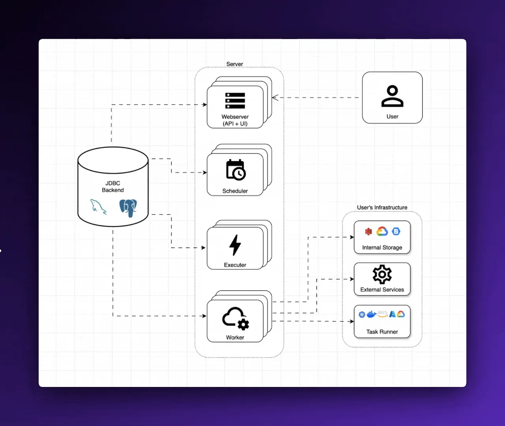
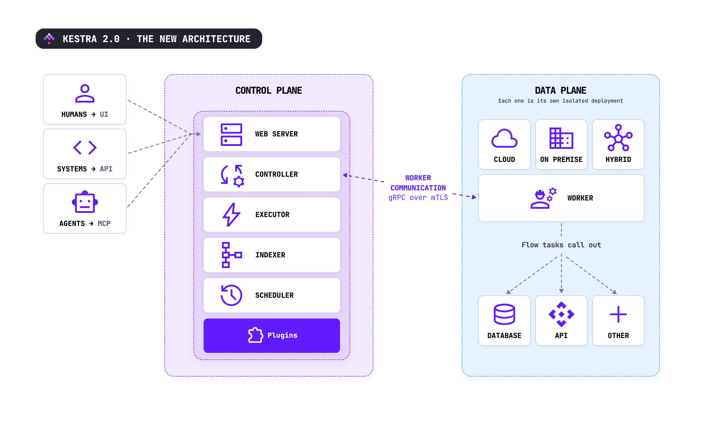

# We rebuilt the Kestra engine. Here is what changed and what it brought you.

Kestra 2.0 is the most significant release in the product's history. Beyond UI updates and AI capabilities, the Kestra team identified challenges with the current engine implementation and rewrote it. Not a coat of paint on the existing 1.x internals, but an actual replacement for how work is scheduled, dispatched, and run. This post is for people who operate Kestra or who are curious about what changed underneath and why it matters. This post focuses on key architectural changes and the resulting benefits.

### Workers in a 1.x world

The 1.x architecture has worked and scaled for many organizations since the product's inception. But it had a shape that created recurring pain. Workers are a core server component that executes runnable tasks and polls triggers directly connected to the database.  
  
Figure 1: Kestra 1.x architecture

As shown in Figure 1, the worker lives in the same control plane as the other Kestra components. The worker also needed database credentials, and every worker had to sit on a network that could reach the database. If you wanted workers in another region, inside a customer's restricted network, or in an air-gapped environment, you were fighting the architecture the whole way.

The database, a.k.a. the JDBC Backend in the figure above, is a critical piece of the platform. It is responsible for both serving as a repository for content such as metadata, flow definitions, and execution records and acting as the queue itself. The queue carries all internal messages between Kestra services. Under heavy execution volume, the database became the coordination bottleneck, with executions queued, waiting to be picked up, while everyone contended for it. To help mitigate these performance issues, two engine implementations ran side by side: a JDBC implementation and a Kafka Streams implementation. Two repository and queue options meant two codebases doing the same job. This doubled the surface area and doubled the work for every fix.

### The biggest release in the history of Kestra

In Kestra 2.0, we decided to rewrite the engine to address not only the worker issue but also other technical debt that has accumulated over the years. This release of Kestra 2.0 is by far our most significant, with its benefits stemming directly from the engine rewrite.

  
Figure 2: Kestra 2.0 architecture

### Queue and Repository are no longer bundled choices

In version 1.x, the queue and repository were tightly coupled as a fixed pair; you selected a bundle. You could choose JDBC for the queue or a combination of Kafka and Elasticsearch. That’s it. Version 2.0 separates them, allowing you to choose the queue and repository independently to best suit your needs. You can start by running everything on a single database and later move the queue to a faster system or scale the repository without rewriting any workflows. This change removes the Kafka Streams engine. There is now a single implementation of the executor, the scheduler, and the worker, regardless of which queue backend you run underneath. For you, that means behavior is consistent across backends rather than subtly different between the JDBC and Kafka paths, and fixes land once instead of twice.

The edition split here matters, so it is worth stating plainly. Open source runs on JDBC with your Postgres or MySQL for both the queue and the repository. The additional queue backends, Redis, AMQP, and Kafka, are the Enterprise differentiator. Use Redis or AMQP when you want low latency, Kafka when you want high availability, or JDBC when you want a balanced middle that is simplest to run.

### Indexer Service

With the new flexible back end, customers can now more easily move off of a database to a larger-scale message queue like Kafka and Redis for storage.  This service copies data from the queue into the repository for the front-end web server to consume and present to the user. This service doesn’t apply when you use JDBC since it's already in a queryable service, but it's mentioned here to raise awareness of this service. 

### Introducing the Controller

We addressed workers' dependency on the database by making them independent of it. To do this, we added a new component called the Controller. It sits between the Worker and the Kestra back-end components such as the queue and repository. With respect to the worker, all communication to Kestra goes through the controller.  
  
Figure 3: Kestra 2.0 high-level architecture showing new controller service

Since workers no longer talk directly to the backend, they don't need to store sensitive database credentials.  The connection between the worker and the controller is a single gRPC connection that can be secured with mutual TLS.

### You can now put workers almost anywhere

This is the direct payoff of a worker that holds no database connection. Because the only thing a worker needs to reach is the Controller, over an outbound gRPC connection, you can place workers in deployments that were awkward or impossible before:

- A separate VPC, or a different cloud, from where the control plane runs.  
- Another region, for latency or data locality.  
- On-premises, next to systems that never leave the building.  
- Restricted or air-gapped networks, where the worker connects outward, and nothing connects in. No inbound ports, no database port exposed.

For teams with data-residency requirements, this is a key point. It allows you to keep the workers and components that handle your data within your perimeter, while the control plane operates as a managed service elsewhere. The data plane remains where your rules specify it should be. If your network topology requires multi-region setups, Worker Groups allow you to steer specific workloads to specific worker pools with capacity guarantees.

### Less data now moves through the engine

A less obvious benefit of the rewrite, and one that operators notice daily, is that the engine no longer carries unnecessary data. Task outputs load only when needed. The executor retrieves an output only when needed, rather than passing all outputs through the queue just in case downstream components need them. In systems with millions of executions, this significantly reduces unnecessary data transfer. Now, minimal information flows over the queue. This change primarily enhances UI responsiveness and throughput under load, as the queue handles less work per execution. This dramatic performance improvement is one of the benefits an end user will experience with this engine rewrite. Expect to see blog posts arrive post-launch that show data comparing 1.x and the new 2.0 release.

Logs can live in their own backend. The new Log Data Store lets you point logs to a different store from the rest of your data, choose from JDBC, Elasticsearch, DataDog, or Splunk, at general availability. Logs are the bulkiest, highest-churn data Kestra writes, so moving them off your primary database takes real pressure off it. The logs still appear in the Kestra UI exactly as before; they are just sourced from wherever you put them.

### Where to learn more

Check out the Kestra 2.0 launch webinar on September 8th, 2026. [**Register here**](https://luma.com/194wtite) to learn more about this and other areas of this new release\!

For a deeper dive into the backend, watch out for the pre-launch webinar where we discuss these backend changes in more detail\! [**Watch the video**](https://www.youtube.com/watch?v=_ijZ1x7s2Uk)
