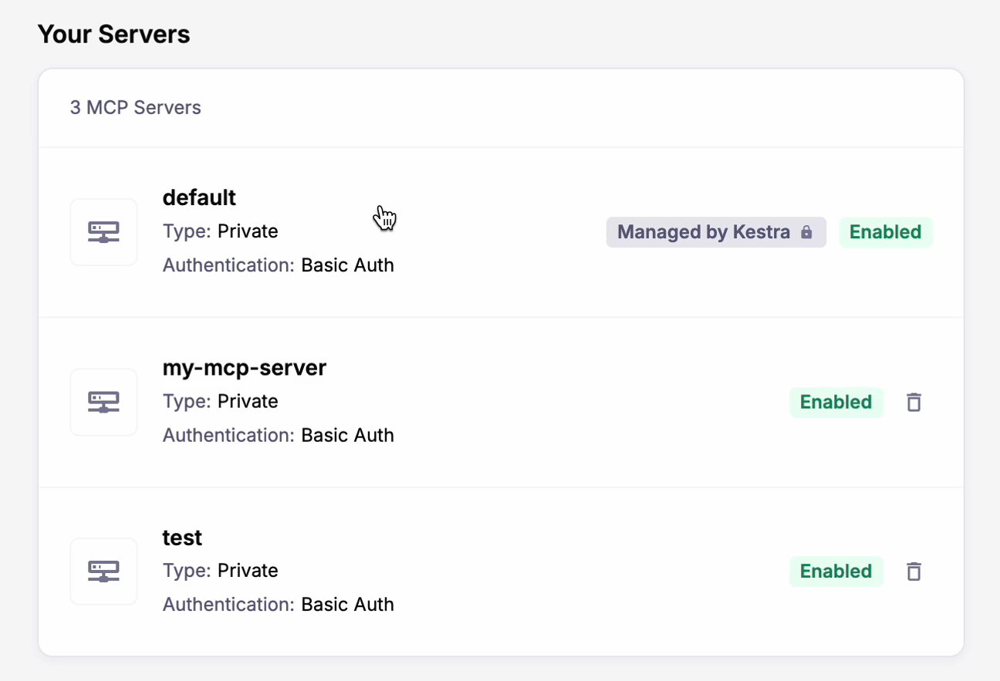
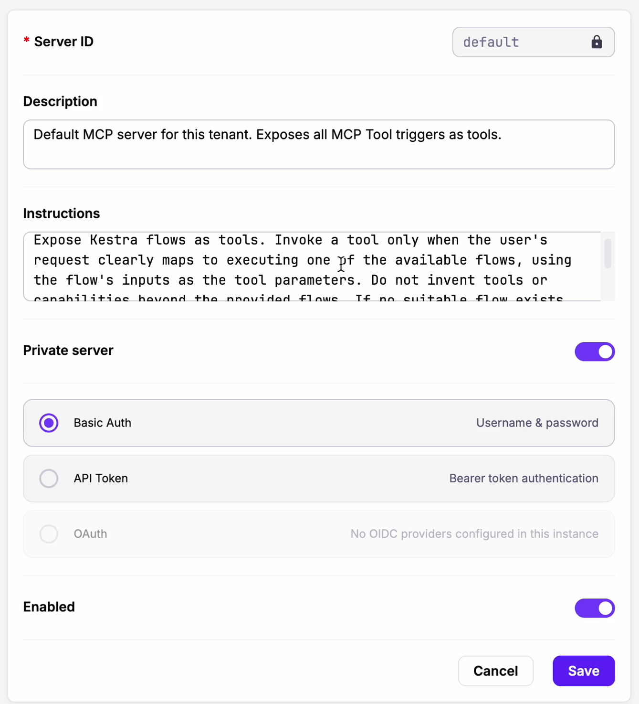
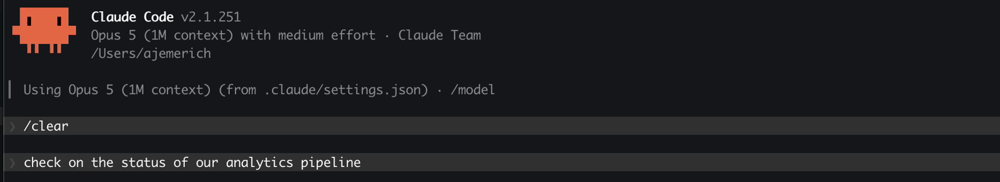
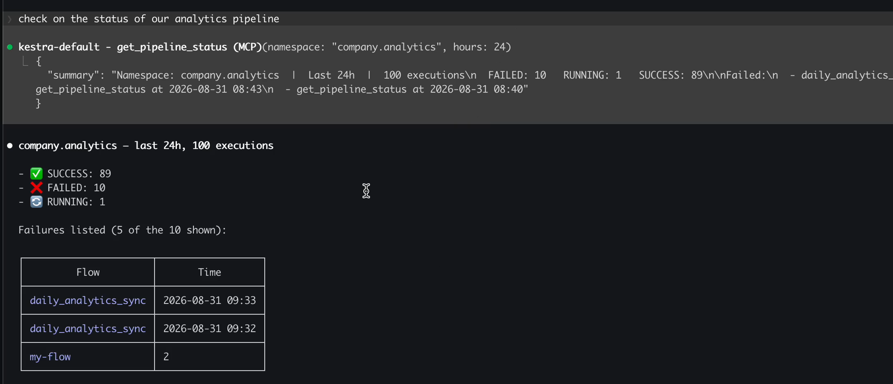
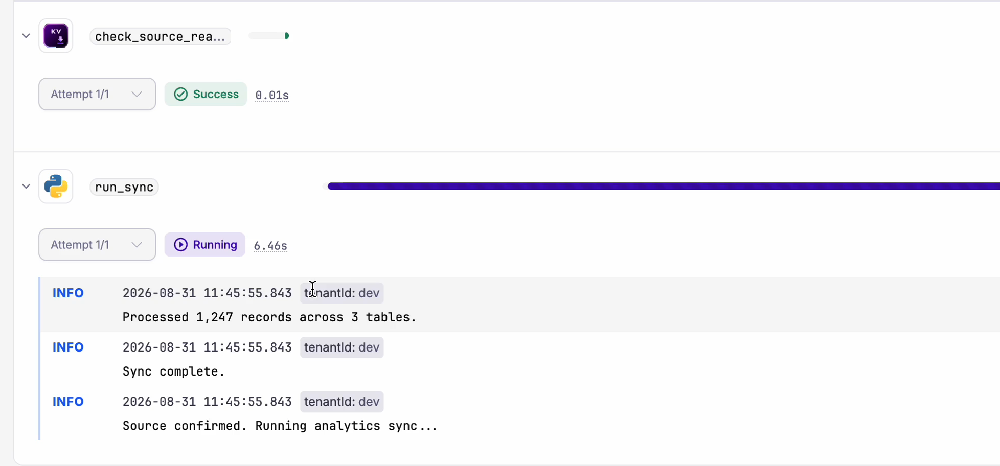
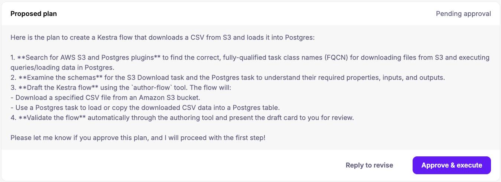

You don't want our agent. You want your agents calling your workflows. You already have Claude Code, Cursor, Codex, something built in-house. Those agents are built for you, for your case. What they lack is a safe way to reach the systems that matter, and what the platform team lacks is any way to see what the agent did once it got there.

So Kestra 2.0 does not ship you an agent. It makes **every workflow callable by the agents you already use**, and it treats those calls exactly like every other execution in the system.

## One trigger turns a flow into a tool

Connecting an agent to your infrastructure typically requires building an integration layer: an API wrapper, an auth story, a polling loop, and error translation. That layer is why most agent projects stall before production.

In Kestra 2.0, just add a trigger instead.

```yaml
triggers:
  - id: mcp
    type: io.kestra.plugin.core.trigger.McpToolTrigger
    toolName: get_pipeline_status
    title: Get Pipeline Status
    toolDescription: >
      Returns a summary of recent executions in a namespace, including counts
      by state and any failed flows with timestamps. Call this when the user
      asks about pipeline health, recent runs, or failures.
    mcpServer: default
```

That flow is now a named tool on an MCP server. An agent discovers it, calls it, and Kestra creates an execution using the matched inputs, runs the flow, and returns the outputs as the tool result.

Flow inputs map automatically to the tool's JSON schema, so the agent knows which arguments to send. Declare a `jsonSchema` on a JSON input, and that schema propagates into the tool spec. Outputs are returned in the response payload.

One field deserves more care than the rest. `toolDescription` is what the model reads to decide whether to call this tool at all. Vague descriptions lead to poor routing. **Write it for the agent; it's not a comment in your code:** specify what situation should trigger the call and what each input means.

## The server is already running

A `default` MCP server is provisioned for every tenant at startup, managed by Kestra, exposing every flow that carries an MCP trigger. Nothing to install on your end.

In Kestra Enterprise, you can create more in the UI: one per team, one per environment, and one for the agents you trust less than the others. Each server has its own settings.

- **Public or private.** Private servers require authentication.
- **Authentication.** Basic Auth, API token, or OAuth when you have an OIDC provider configured on the instance.
- **Instructions.** A server-level system prompt that constrains every agent connecting to it. The default reads: *"Expose Kestra flows as tools. Invoke a tool only when the user's request clearly maps to executing one of the available flows, using the flow's inputs as the tool parameters. Do not invent tools or capabilities beyond the provided flows."*
- **Connect.** Ready-to-paste connection config for Claude Desktop, Claude Code, Cursor and Codex.
- **Tool Flows.** Exactly which flows this server exposes, in one list.





## What it looks like from the agent's side

In Claude Code:





The agent chose the tool, filled in the namespace and time window from a natural language sentence, and got the state from the execution.

## Every agent call is an execution

When an agent calls a flow, Kestra creates an execution in the same list as the ones your schedules and webhooks created, with the same logs, the same Gantt view, the same task-level attempts and retries, the same Replay button, and **the same RBAC deciding whether it was allowed to happen at all.**

Agent-created executions are labelled with their origin: `system.from: mcp`, plus the server and session IDs. Filter the execution list on those, and you can see what the AI touched, when, and on whose behalf.



An agent calling Kestra has **no more privilege than a person clicking Run**, and it leaves the same trail. If the same action is expensive or irreversible, put a Case in front of it. The flow runs, reaches the gated step, and waits for a human. The agent is told the work is pending rather than done, and the approval lands in the incident view your team already uses. **The model proposes, a person decides**, and both halves are on the same execution record.

## Your agents get Kestra's brain too

The instance MCP server exposes *your* flows. There is a second, separate MCP server that gives any coding agent current knowledge of *Kestra itself*, at `https://api.kestra.io/v1/mcp`:

```shell
claude mcp add kestra --transport http https://api.kestra.io/v1/mcp
```

Connected, an agent can query live task schemas across the plugin catalog, search blueprints and pull the YAML, and search the docs, rather than guessing from training data that is months stale. Ask it what properties `io.kestra.plugin.jdbc.postgresql.Query` takes and it reads the actual schema.

And if you want your agent to be properly opinionated about Kestra, install the **Agent Skills**:

```shell
npx skills add kestra-io/agent-skills
```

Four ship today. `kestra-flow` generates and debugs flow YAML validated against the live schema, with guardrails against invented task types and hardcoded secrets. `kestra-flow-hardening` audits existing flows and produces a severity-ranked findings report before touching anything, and it refuses to recommend a blind retry on a non-idempotent write. `kestra-ops` drives `kestractl` for validate, deploy, run and namespace files, with confirmation on destructive actions. `migrate-airflow-kestra` converts a DAG, preserving dependencies and parallelism and mapping XCom onto input and output files.

Those work in Claude Code, Cursor, Windsurf, and Codex. None of them require Kestra to ship you a chat window.

## Bring your own model, including one that never leaves your network

If you do want AI inside Kestra, the model is your choice, not ours.

Register as many providers as you like and pick a default:

```yaml
kestra:
  ai:
    enabled: true
    providers:
      - id: anthropic
        display-name: Anthropic
        type: anthropic
        configuration:
          model-name: claude-opus-4-1-20250805
          api-key: "{{ secret('CLAUDE_API_KEY') }}"
      - id: ollama
        display-name: Ollama, self-hosted
        type: ollama
        isDefault: true
        configuration:
          model-name: llama3
          base-url: http://ollama.internal:11434
```

With more than one registered, users pick their model from a dropdown in the Copilot chat. **Amazon Bedrock, Anthropic, Azure OpenAI, DeepSeek, Google Gemini, Google Vertex AI, Mistral, OpenAI, OpenRouter, and anything Ollama can run** are supported in [Enterprise](https://kestra.io/enterprise). Open source runs Gemini, or a built-in Kestra service with a daily generation cap if you would rather not configure anything.

Each provider takes a `baseURL`, so you can point at an internal gateway. `clientPem` and `caPem` give you mutual TLS to that gateway. `customHeaders` handles the auth and routing your gateway expects. Per-provider `timeout` lets you hold a model to an SLA. And `kestra.ai.enabled: false` turns the whole thing off, including the fallback to Kestra's own service, which is the setting some security teams will want to see before anything else. **A self-hosted Ollama model behind mTLS means no prompt ever leaves your network.**

In Enterprise, an RBAC permission decides which roles may use the Copilot at all, per tenant or namespace.

## The Copilot got cautious

It is now a persistent sidebar with multi-turn memory, so "add retry logic" refines the flow in front of you instead of regenerating it. Three modes: **Edit** proposes YAML for approval, **Plan** breaks a complex task into numbered steps and executes each one after you confirm, **Ask** answers from the official docs and can read execution logs to diagnose a failed run.

Open it while viewing a flow, namespace, execution, dashboard, app, or test, and that resource attaches as a context tag; each one is independently removable, and every attach and detach is recorded in the transcript so you can see what the model is looking at. It reads your Policies, Variables, Secrets, and KV store, so "read from our MongoDB" reuses the credentials you already configured rather than inventing a connection string.

**Nothing is applied without an explicit confirmation.** Reject a change and the conversation continues so you can redirect, instead of starting over. Plan mode cancels the remaining steps. There is also a "Fix with AI" action on a failed task that opens the editor with the error already in context.



## When the agent runs inside the flow

Sometimes you do want the autonomy inside your flows. The AI Agent task takes a system message, a prompt, a provider, optional memory that persists across executions, and tools including web search, task execution, and calling other flows. It decides what to do and in what order, loops until a condition is met, and stays a declarative task with a normal execution record.

Three things landed for teams running those in production. **Guardrails** attach input and output expressions that fail the task when violated, which is deterministic filtering wrapped around a non-deterministic component. **Prometheus metrics** now cover every tool call, model provider call, and embedding store call, so you can see behaviour and cost without waiting for the invoice. And **MCP client tasks** let your flows call approved external MCP servers, so the relationship runs both ways.

## What is open source and what is not

The **MCP server and the MCP Tool Trigger are open source**. Exposing your flows as governed tools for your own agents is open source. The Kestra MCP resources endpoint and the Agent Skills are free and public. AI Agent tasks are open source, and the Copilot runs on Gemini or the built-in service.

**Enterprise** adds any model provider you like with the gateway, multiple MCP servers, mTLS and timeout controls, the Copilot RBAC permission, and Cases for human approval.

## Where to learn more

Join the Kestra 2.0 launch webinar on September 8th, 2026 at 15:00 UTC. [Register here](https://luma.com/194wtite).

For the architecture underneath, read [what changed in the engine](https://kestra.io/blogs/2026-09-01-kestra20-rebuild-engine) and how to choose your backend. Setup is in the [MCP server docs](https://kestra.io/docs/ai-tools), the [AI Copilot docs](https://kestra.io/docs/ai-tools/ai-copilot), and the [Agent Skills repository](https://github.com/kestra-io/agent-skills).
