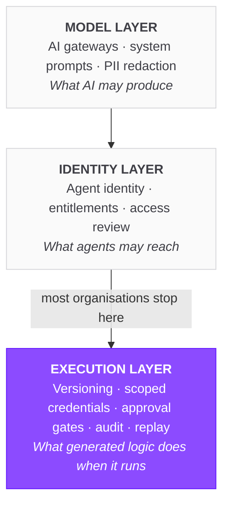
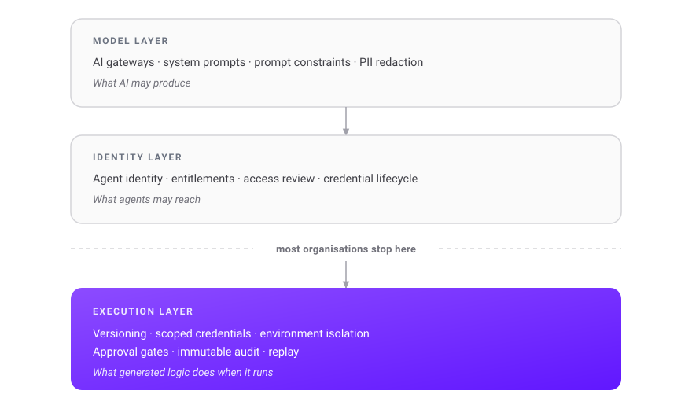

In Temporal's *State of Development 2026* survey of 554 developers, 85.5% said they trust or somewhat trust the output of their AI agents. In the same survey, 41.1% said they hit problems with those agents daily or more often, and 16.4% said hourly.

Both numbers are probably honest. Developers trust agents the way they trust a fast junior engineer: the work is usually good, and you would still never let it merge unreviewed. So the problem was never trust. The problem is that the volume of generated work has outgrown the review capacity that made that trust reasonable in the first place.

Most of the industry's answer has been to govern the model — gateways, prompt constraints, PII filters, agent identity. All of it useful. None of it governs what happens once the model produces something that *runs*. **Governing AI-generated workflows is a different problem from governing AI, and it lives one layer down: at execution.**

## What is AI workflow governance?

AI workflow governance is the set of policies, controls and accountability mechanisms applied to AI-driven workflows **at the point they execute** — covering which version ran, what credentials it used, which systems it reached, who approved it, and what it did.

### AI governance vs. AI workflow governance

AI governance is the broader discipline: model risk classification, ethical principles, regulatory alignment, data lineage, organisational accountability. It answers *what an organisation permits*.

AI workflow governance is the operational subset that answers *what actually happened*. It concerns itself with executions rather than intentions — the specific run, at 03:14 last Tuesday, that wrote to a production table.

The distinction matters because the two fail differently. A weak AI governance programme produces regulatory exposure. A weak AI *workflow* governance programme produces outages.

### AI governance is not a policy, it's a workflow

This is the shift worth internalising. A policy document stating that all AI-generated code must be reviewed before production is not a control. It is an aspiration, enforced by memory and goodwill, in an environment where more than half of developers now get from AI prototype to production-ready code in hours.

A control is a workflow state. The execution pauses. A named approver acts. The approval is recorded against the run. The difference between those two things is the difference between a governance programme that holds at volume and one that quietly stops being true.

### What is an AI governance system?

An AI governance system is the combination of tooling and process that enforces those policies automatically rather than procedurally. In practice it spans three layers: model-level controls on what AI may produce, identity-level controls on what agents may access, and execution-level controls on what generated workflows may do when they run.

Most organisations have built the first two and skipped the third. Everything below is about that gap.

## AI stopped suggesting code and started shipping workflows

The change in the last twelve months is not that AI got better at writing code. It is that AI-written code stopped being a suggestion and became a deployable artifact.

Temporal's survey of 554 developers quantifies the shift. Daily agent use jumped from 47.3% to 80.8% year over year — a 71% leap. Nearly half of respondents, 49.1%, now say agents are "in production" or "core to how they ship." And on velocity: 51.3% get from AI prototype to production-ready code in hours or faster, with 77.1% doing it within days.

Sit with that last figure. An automation that used to take a sprint to specify, build and review now takes an afternoon. Meanwhile the humans reviewing it read at exactly the speed they did last year, and the change-approval board still meets on Tuesdays.

This is the structural problem, and it is worth stating plainly because every governance decision downstream follows from it: **generation scales, review does not.** Any governance model that depends on a human reading every generated workflow before it runs will become either the bottleneck everyone routes around, or a rule that quietly stops being enforced. Usually both, in that order.

## What "AI governance" covers today, and what it misses

Search for AI agent governance and you will find two well-developed schools of thought. Both are necessary. Neither covers execution.

### Model-layer controls

AI gateways, system prompts, prompt constraint libraries, PII redaction, output filtering. These shape what a model is *allowed to produce*.

They are genuinely valuable, and they are strictly upstream. A prompt constraint can stop a model writing a query against a table it should not touch. It can do nothing about the workflow that was generated last month, approved by someone who has since left the company, and still runs every night at 2am.

We hear the ceiling of this approach constantly. One platform engineer described their entire agent control strategy in a single sentence: *"How do we control the behaviour of the agents? As of now we're just using the system prompt."*

A system prompt is a request. It is not a control.

### Identity-layer controls

The other school treats agents as a new class of non-human identity: give each one an identity, entitlements, and an access review cycle. This is where most vendor energy currently sits, and the instinct is right — an agent with standing production access is a real risk.

But identity governance answers *who may do what*. It does not answer which version of the flow ran on Tuesday at 03:14, what it wrote, or who approved the change that put it there. Entitlements are static. Executions are events.

### The execution gap

Between "what the model may produce" and "what the agent may access" sits a third thing that almost nobody is governing: **the execution of generated logic.** That is where credentials get used, where data gets written, and where blast radius stops being theoretical.

<!-- ===== REVIEW: DIAGRAM OPTION A — Mermaid (native, v11 already a dependency) ===== -->

<!-- ===== REVIEW: DIAGRAM OPTION B — static SVG (brand colours, dark-mode aware) ===== -->

*The three layers of AI workflow governance. Most organisations implement the model and identity layers, then stop — leaving the execution of generated logic ungoverned.*

<!-- ===== REVIEW: pick one of the two above, delete the other before merge ===== -->

## Four failure modes specific to AI-generated workflows

These are not hypotheticals. Each one comes up repeatedly with platform teams evaluating orchestration.

### Provenance: you can't review what you can't attribute

When a human writes a workflow, provenance is free. Git blame gives you an author, a commit, a pull request and a reviewer without anyone having to think about it. Generated workflows routinely arrive with none of that. Six months later, nobody can tell you whether a given flow was hand-written, generated and carefully reviewed, or generated and merged on a Friday afternoon.

Provenance for a generated workflow means recording five things as metadata on the artifact itself: that it was AI-generated, by which model and version, from which prompt or ticket, reviewed by whom, approved by whom. Without those fields, every subsequent audit is archaeology.

If most of your generated logic arrives through an assisted coding pipeline, this is where to enforce it — our guide to [AI code generation workflows](/resources/ai/ai-code-generation-workflow) covers that path in depth.

### Blast radius: generated code inherits your credentials

This is the failure mode that produces incidents. Generated logic runs with whatever permissions the runtime hands it, and it has no concept of least privilege unless the platform enforces one.

The specific problem we hear most often is long-lived credentials. One platform engineer abandoned a native AI integration over exactly this: *"We tried to use the native AI plugins but they look for long-term credentials rather than temporary credentials in AWS, which is a security concern for us."*

That is the correct instinct. A static key inside an agent-authored workflow is a standing grant to everything that key can reach, held by code no human has read closely. The right move is to bound the blast radius *before* you know whether the workflow is any good — not after it has proven otherwise.

### Missing human gates

Almost everyone says they want a human in the loop. Very few have implemented one as anything more than a notification.

There is a real difference between a Slack message saying "flow X is about to run" and an execution that is durably *paused* — holding its state, going nowhere, until a named approver acts — and that records who approved it. The first is a courtesy. The second is a control. Only one of them survives an audit.

This matters most exactly where you would expect. The teams we speak to in banking, insurance and the public sector treat the approval step as the thing that makes AI-driven automation permissible at all. One described the requirement plainly: *"Anything there, we have to get a lot of approvals for when it comes to what we give AI access to and how it can operate without us reviewing."*

Designing a human-in-the-loop workflow properly means deciding which actions genuinely warrant a gate, and then making that gate a first-class part of the execution rather than a message in a channel someone may or may not read.

### Unreplayable failures

In Temporal's survey, 35.7% named **tracking state** as the single most common blocker when working with agents — ahead of both debugging and cost.

That ranking makes sense once generated logic is in production. Hand-written workflows tend to fail in ways their author anticipated, because the author thought about failure while writing them. Generated workflows fail in ways nobody designed, because nobody designed them. Which means the ability to see the exact state of a failed run and replay it from the failed step — rather than reconstruct it from log lines — stops being a convenience and becomes the difference between a ten-minute fix and a lost afternoon.

One team put the underlying anxiety more bluntly than any framework would: *"I've read too many horror stories of 'I had Copilot make this script and I took down prod.'"*

## How to do AI workflow governance: six controls

None of these controls are exotic. They are what you would already apply to human-written production code. The difference is that AI-generated workflows need them enforced by the platform rather than by discipline, because there is too much output to review by hand.

1. **Keep workflows declarative and in Git.** A generated workflow that lands as a YAML diff in a pull request is reviewable in minutes by someone who did not write it. The same logic generated as imperative code in a notebook is effectively unreviewable. Declarative structure constrains the shape of what can be produced, and that constraint is what makes review possible at volume.

2. **Issue scoped, short-lived credentials per execution.** Generated workflows should never contain secrets and never inherit a broad standing role. Inject credentials at runtime from a secrets manager, scoped to the specific systems that workflow touches, expiring when the run ends.

3. **Isolate by namespace and tenant, and deny production by default.** An agent-authored workflow should land somewhere it cannot reach production systems until a human promotes it. Environment isolation is what converts "we hope this is safe" into "this cannot reach anything important yet."

4. **Make human approval a workflow state, not a notification.** The execution pauses durably. A named approver resumes it. The approval is recorded against the run. Reserve gates for decisions that warrant them — writes to production data, financial transactions, customer-facing actions, infrastructure changes — so that approval stays meaningful instead of degrading into a rubber stamp.

5. **Log every execution immutably.** Inputs, outputs, the flow version that ran, the credential scope it used, the approver. Per run, retained, queryable. This is what turns "an agent did something" into an answerable question, and it is the first thing an auditor will ask for. As one engineer said of their own stack: *"When I take off an agent, I need to connect with something and get its audit trail."*

6. **Support replay and backfill from any point.** When a generated step fails, or turns out to be subtly wrong, you want to fix that step and resume — not re-run six hours of upstream work, and not hand-repair half-written state at midnight.

Read together, these six do something specific, and it is the whole argument of this page: **they let you safely accept generated workflows you have not fully reviewed, because the platform bounds what a bad one can do.** That is the only version of AI workflow governance that survives 80% daily agent usage.

## Tools and systems for AI workflow governance

### What to look for in an AI governance tool

There is no single product category that covers this, and treating it as one purchase is how teams end up with three overlapping tools that each govern a third of the problem. Evaluate against the layer you are actually missing:

- **AI gateways and guardrail frameworks** — model outputs, prompt constraints, redaction
- **Identity governance platforms** — agent entitlements, access review, credential lifecycle
- **Orchestration platforms** — versioning, credential scoping, approval gates, execution audit, replay

Most organisations discover they have the first two and none of the third. There is a quick diagnostic for this. Pick a workflow that ran last week and try to produce its version, its inputs, its outputs and its approver in under five minutes. If you cannot, no amount of model-layer tooling will fix it, because the gap is not in what your AI is allowed to say — it is in what your platform remembers.

### Where orchestration platforms fit

Orchestration is the layer that already knows what ran, in what order, with what state and against which systems. That makes it the natural enforcement point for execution-level governance, rather than bolting on a separate audit system that has to reconstruct the same facts from the outside.

If you are mapping the wider category, our overview of [AI orchestration](/resources/ai/ai-orchestration) covers the fundamentals, and our comparison of [AI-native orchestration platforms](/resources/ai/ai-native-orchestration-platform) covers the tooling landscape.

## The shadow-AI trap

There is one failure mode that governance programmes create entirely by themselves, and it is the one most likely to be affecting you right now.

A developer explained how their team handles AI tooling:

> *"I'll be careful saying those words, because if we say we have an AI tool then it has to go through another committee to be approved. So we don't have an AI tool."*

They have an AI tool. What they do not have is a governed one.

This is what heavyweight governance produces. When the cost of declaring AI usage exceeds the cost of hiding it, people hide it — and the organisation loses precisely the visibility that governance existed to provide. The controls did not fail. They were never applied, because the process around them made honesty expensive.

Temporal's survey hints at the same problem from another direction: 84.5% of respondents believe they are better than their competitors at using AI agents. That is arithmetically impossible, and the report says so. It suggests most teams have very little idea what their peers are doing — or, more uncomfortably, what their own colleagues are doing.

The practical conclusion is to invert the default. Make the governed path the fast path. If shipping an agent-authored workflow through the platform is quicker than doing it off to the side, governance stops depending on compliance and starts depending on convenience. Committees are a poor substitute for defaults.

## A 30-day starting point

You do not need a framework to begin. You need four answers about workflows you are already running.

- **Inventory.** Which workflows in production were AI-generated? If you cannot answer that, adding the metadata field is your first control — backfill it by asking your team while they still remember.
- **Credentials.** Which of those hold long-lived secrets, or run under a role broader than they need? Rotate to scoped, runtime-injected credentials, highest blast radius first.
- **Gates.** Which of them write to production data or take customer-facing actions with no human approval? Add one, as a real pause rather than a notification.
- **Audit.** For a workflow that ran last Tuesday, can you produce the flow version, the inputs, the outputs and the approver in under five minutes? If not, fix logging before you add more agents.

Four answers. None of them require a new platform to start, and all four are prerequisites to trusting anything generated at volume.

## FAQ

**What is an AI governance system?**

An AI governance system is the combination of tooling and process that enforces AI policies automatically rather than procedurally. It spans model-level controls on what AI may produce, identity-level controls on what agents may access, and execution-level controls on what generated workflows do when they run. The third layer is the one most commonly missing.

**How do you do AI governance in practice?**

Start with what already runs, not with a framework. Inventory which production workflows were AI-generated, replace long-lived credentials with scoped runtime ones, add human approval gates to irreversible actions, and confirm you can reconstruct any execution from its audit record. Policy documents should follow controls, not precede them.

**What is the best tool for AI governance?**

There is no single best tool, and treating it as one purchase leads to overlapping products that each cover part of the problem. AI gateways handle model outputs, identity governance platforms handle agent entitlements, and orchestration platforms handle execution — versioning, credential scoping, approval gates, audit and replay. Buy for the layer you are missing.

**How is AI workflow governance different from AI model governance?**

Model governance controls what an AI system may produce. Workflow governance controls what happens when that output runs: which credentials it uses, which systems it reaches, who approved it and what it did. A workflow generated six months ago sits outside today's model controls but still executes nightly.

**Do I need a human-in-the-loop step for every AI-generated workflow?**

No, and trying to will get your approvals rubber-stamped. Reserve human gates for irreversible or high-impact actions: production data writes, financial transactions, customer communications, infrastructure changes. Everything else should rely on scoped credentials, environment isolation, and audit after the fact.

## Where Kestra fits

Kestra is an open-source orchestration platform built so that these controls are properties of the platform rather than habits of the team: workflows are declarative YAML in Git, credentials are injected at runtime, human approval is a first-class workflow state, and every execution is recorded and replayable — across 1,800+ plugins including AI and agent integrations.

For governance under real regulatory constraint, see how [public sector teams](/use-cases/public-services) run it, or start with the fundamentals of [declarative scheduling](/resources/infrastructure/job-scheduler).
