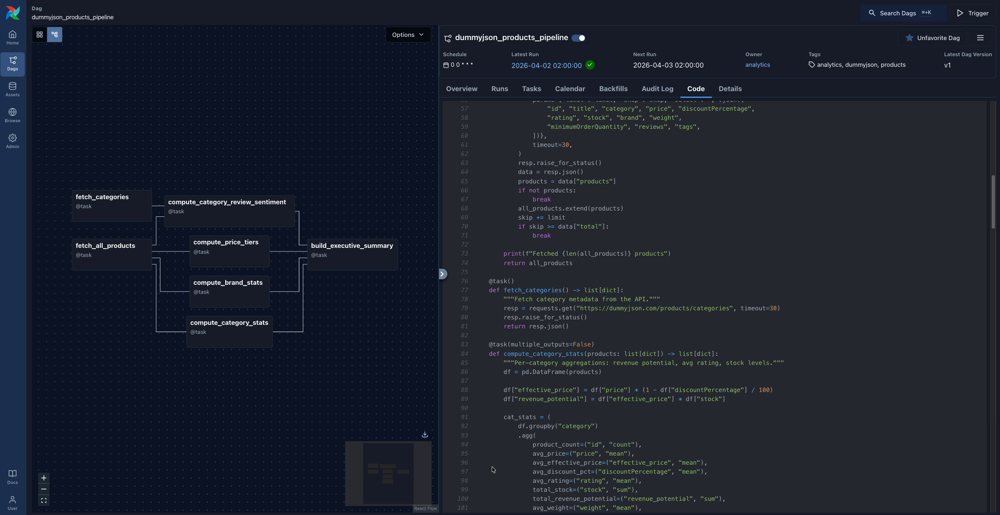
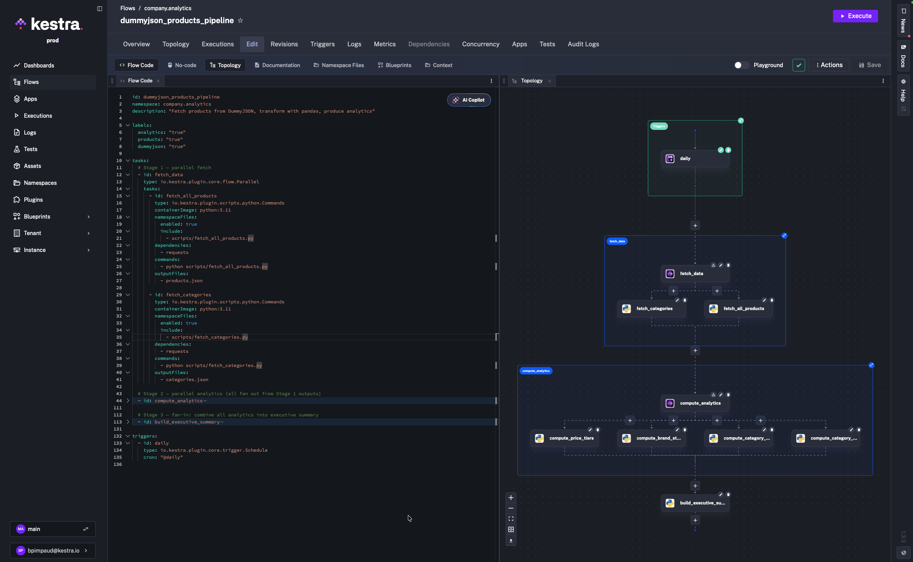

Migrating from Apache Airflow to Kestra is a decision many engineering teams make as their workflow complexity grows. Airflow's Python-first model works well for teams already comfortable with Python, but as pipelines scale, the operational overhead mounts: workers need the right packages installed, XCom has size limits, and DAG files mix orchestration logic with business logic in ways that become hard to maintain.

Kestra takes a different approach: declarative YAML flows, file-based data passing with no size limits, and a 600+ plugin ecosystem that covers most integrations out of the box. The IDE-like UI, with a live topology view and built-in code editor, makes the day-to-day workflow significantly smoother.

The migration itself used to require deep knowledge of both platforms. Now, with AI coding agents and Kestra's dedicated agent skills, you can migrate a DAG in minutes rather than hours. This post walks through a real migration — a DummyJSON products analytics pipeline — to show exactly what the process looks like.

## What Changes When You Move from Airflow to Kestra

Before touching any code, it helps to internalize the key conceptual shifts:

| Aspect | Airflow | Kestra |
|---|---|---|
| **Definition format** | Python code (DAG files) | Declarative YAML |
| **State passing** | XCom (serialized to metadata DB, size-limited) | Files via internal storage — no size limits |
| **Parallelism** | Implicit — independent tasks run in parallel | Explicit — wrap concurrent tasks in `io.kestra.plugin.core.flow.Parallel` |
| **Scheduling** | `schedule` parameter on the DAG object | Separate `Schedule` trigger with a `cron` expression |
| **Dependencies** | pip packages installed on workers | Java plugins loaded at startup, or per-task `dependencies` |
| **Namespace files** | No equivalent | First-class script/config storage, scoped per namespace |

The biggest shift is **data passing**. In Airflow, tasks return Python objects via XCom, which get serialized to the metadata database. In Kestra, tasks write files to disk, declare them in `outputFiles`, and Kestra uploads them to internal storage. Downstream tasks reference them via `inputFiles` using Pebble expressions like `{{ outputs.my_task.outputFiles['data.json'] }}`. No size limits, no serialization overhead.

## The Tool Stack for AI-Assisted Migration

The migration uses three tools working together:

1. **Claude Code** (or Codex / Gemini CLI) — the AI coding agent that reads your DAGs and generates Kestra flows
2. **`kestra-flow` agent skill** — gives Claude Code live knowledge of Kestra's flow schema so it never generates invalid YAML
3. **`kestra-ops` agent skill** — gives Claude Code the ability to operate `kestractl` for deployment, validation, and namespace file management

Install both skills by following the instructions at [kestra.io/docs/ai-tools/agent-skills](https://kestra.io/docs/ai-tools/agent-skills). Once installed, Claude Code automatically invokes the right skill based on what you ask.

You also need `kestractl` installed and pointed at a running Kestra instance:

:::collapse{title="Configure kestractl"}

```bash
kestractl config add local http://localhost:8080 ""
kestractl config use local

# Verify connectivity
kestractl flows list --namespace company.analytics
```

:::

## The Pipeline We're Migrating

The source DAG — `dummyjson_products_pipeline.py` — fetches product data from [dummyjson.com](https://dummyjson.com), runs pandas analytics, and produces JSON output artifacts. It has two stages of parallelism:

:::collapse{title="DAG topology"}

```
fetch_all_products ──┬──> compute_category_stats ──────┐
                     ├──> compute_brand_stats ──────────┤
                     ├──> compute_price_tiers ──────────┼──> build_executive_summary
                     └──> compute_category_review_sentiment ──┘
fetch_categories ────┘ (also feeds review_sentiment)
```

:::



The DAG uses the `@task` decorator pattern, with all business logic embedded directly in the DAG file:

:::collapse{title="Airflow DAG: dummyjson_products_pipeline.py"}

```python
default_args = {
    "owner": "analytics",
    "retries": 2,
}

with DAG(
    dag_id="dummyjson_products_pipeline",
    schedule="@daily",
    catchup=False,
    default_args=default_args,
):
    @task()
    def fetch_all_products() -> list[dict]:
        """Paginate through all products from the API."""
        all_products = []
        limit, skip = 30, 0
        while True:
            resp = requests.get(
                "https://dummyjson.com/products",
                params={"limit": limit, "skip": skip, "select": "id,title,category,price,..."},
                timeout=30,
            )
            resp.raise_for_status()
            data = resp.json()
            products = data["products"]
            if not products:
                break
            all_products.extend(products)
            skip += limit
            if skip >= data["total"]:
                break
        return all_products

    @task(multiple_outputs=False)
    def compute_category_stats(products: list[dict]) -> list[dict]:
        df = pd.DataFrame(products)
        df["effective_price"] = df["price"] * (1 - df["discountPercentage"] / 100)
        df["revenue_potential"] = df["effective_price"] * df["stock"]
        cat_stats = df.groupby("category").agg(...).round(2)
        return cat_stats.reset_index().to_dict(orient="records")

    # ... more tasks

    products = fetch_all_products()
    categories = fetch_categories()
    cat_stats = compute_category_stats(products)
    brand_stats = compute_brand_stats(products)
    price_tiers = compute_price_tiers(products)
    review_sentiment = compute_category_review_sentiment(products, categories)
    build_executive_summary(cat_stats, brand_stats, price_tiers, review_sentiment)
```

:::

Everything lives in one Python file. The task functions return Python objects that Airflow serializes via XCom.

## Step-by-Step: Migrating the DAG

### 1. Get Airflow Running (with Claude Code)

If you don't have a local Airflow instance already running, just ask Claude Code:

:::collapse{title="Claude Code prompt: spin up Airflow"}

```
Install Airflow and run it on port 28080
```

:::

Claude will create a virtual environment, install Airflow, initialize the database, and run `airflow standalone`. You'll have a working Airflow UI at `http://localhost:28080` in a few minutes.

### 2. Prompt Claude to Migrate

Open Claude Code in your project directory and give it a specific migration prompt:

:::collapse{title="Claude Code migration prompt"}

```
Using the kestra-flow skill, migrate my Airflow DAG at
dags/dummyjson_products_pipeline.py to Kestra.

Requirements:
- Namespace: company.analytics
- Use Python Commands tasks with python:3.11 container image
- Extract each @task function into a standalone namespace file under scripts/
- Preserve both stages of parallelism: fetch stage and analytics stage
- Use retries: 2 from the DAG's default_args
- Output results to the kestra-migrate/ directory
```

:::

What happens under the hood:

1. Claude reads the entire DAG file — tasks, dependencies, XCom wiring, schedule, retries
2. It invokes the `kestra-flow` skill, which fetches the live Kestra plugin schema from `https://api.kestra.io/v1/plugins/schemas/flow`
3. Every task type and property is validated against that schema before the YAML is written
4. Each `@task` function is extracted into its own Python script — XCom returns become file writes, XCom inputs become file reads

The output:

:::collapse{title="Generated file structure"}

```
kestra-migrate/
├── flow.yaml
└── scripts/
    ├── fetch_all_products.py
    ├── fetch_categories.py
    ├── compute_category_stats.py
    ├── compute_brand_stats.py
    ├── compute_price_tiers.py
    ├── compute_category_review_sentiment.py
    └── build_executive_summary.py
```

:::

### 3. What the Extraction Looks Like

The key transformation is how XCom data passing becomes file I/O. In Airflow, `fetch_all_products` returns a Python list that Airflow serializes to the metadata database. In the extracted namespace file, it writes a JSON file to disk instead:

:::collapse{title="Before: fetch_all_products (Airflow @task)"}

```python
@task()
def fetch_all_products() -> list[dict]:
    all_products = []
    # ... pagination logic ...
    return all_products  # serialized via XCom
```

:::

:::collapse{title="After: fetch_all_products (namespace file)"}

```python
import json, requests

all_products = []
limit, skip = 30, 0
while True:
    resp = requests.get("https://dummyjson.com/products", params={...}, timeout=30)
    resp.raise_for_status()
    data = resp.json()
    products = data["products"]
    if not products:
        break
    all_products.extend(products)
    skip += limit
    if skip >= data["total"]:
        break

print(f"Fetched {len(all_products)} products")
json.dump(all_products, open("products.json", "w"), indent=2)  # written to disk
```

:::

Similarly, `compute_category_stats` — which in Airflow received products via XCom — now reads `products.json` from disk:

:::collapse{title="After: compute_category_stats (namespace file)"}

```python
import json, pandas as pd

products = json.load(open("products.json"))  # reads from inputFiles
df = pd.DataFrame(products)
df["effective_price"] = df["price"] * (1 - df["discountPercentage"] / 100)
df["revenue_potential"] = df["effective_price"] * df["stock"]
cat_stats = df.groupby("category").agg(...).round(2)
json.dump(result, open("category_stats.json", "w"), indent=2, default=str)  # written to disk
```

:::

The Kestra flow connects these files explicitly through `outputFiles` and `inputFiles`:

:::collapse{title="Kestra flow: dummyjson_products_pipeline.yaml"}

```yaml
id: dummyjson_products_pipeline
namespace: company.analytics
description: "Fetch products from DummyJSON, transform with pandas, produce analytics"

labels:
  analytics: "true"
  products: "true"
  dummyjson: "true"

tasks:
  # Stage 1 — parallel fetch
  - id: fetch_data
    type: io.kestra.plugin.core.flow.Parallel
    tasks:
      - id: fetch_all_products
        type: io.kestra.plugin.scripts.python.Commands
        containerImage: python:3.11
        namespaceFiles:
          enabled: true
          include:
            - scripts/fetch_all_products.py
        dependencies:
          - requests
        commands:
          - python scripts/fetch_all_products.py
        outputFiles:
          - products.json

      - id: fetch_categories
        type: io.kestra.plugin.scripts.python.Commands
        containerImage: python:3.11
        namespaceFiles:
          enabled: true
          include:
            - scripts/fetch_categories.py
        dependencies:
          - requests
        commands:
          - python scripts/fetch_categories.py
        outputFiles:
          - categories.json

  # Stage 2 — parallel analytics (fan out from Stage 1 outputs)
  - id: compute_analytics
    type: io.kestra.plugin.core.flow.Parallel
    tasks:
      - id: compute_category_stats
        type: io.kestra.plugin.scripts.python.Commands
        containerImage: python:3.11
        namespaceFiles:
          enabled: true
          include:
            - scripts/compute_category_stats.py
        inputFiles:
          products.json: "{{ outputs.fetch_all_products.outputFiles['products.json'] }}"
        dependencies:
          - pandas
        commands:
          - python scripts/compute_category_stats.py
        outputFiles:
          - category_stats.json

      - id: compute_brand_stats
        type: io.kestra.plugin.scripts.python.Commands
        containerImage: python:3.11
        namespaceFiles:
          enabled: true
          include:
            - scripts/compute_brand_stats.py
        inputFiles:
          products.json: "{{ outputs.fetch_all_products.outputFiles['products.json'] }}"
        dependencies:
          - pandas
        commands:
          - python scripts/compute_brand_stats.py
        outputFiles:
          - brand_stats.json

      - id: compute_price_tiers
        type: io.kestra.plugin.scripts.python.Commands
        containerImage: python:3.11
        namespaceFiles:
          enabled: true
          include:
            - scripts/compute_price_tiers.py
        inputFiles:
          products.json: "{{ outputs.fetch_all_products.outputFiles['products.json'] }}"
        dependencies:
          - pandas
        commands:
          - python scripts/compute_price_tiers.py
        outputFiles:
          - price_tiers.json

      - id: compute_category_review_sentiment
        type: io.kestra.plugin.scripts.python.Commands
        containerImage: python:3.11
        namespaceFiles:
          enabled: true
          include:
            - scripts/compute_category_review_sentiment.py
        inputFiles:
          products.json: "{{ outputs.fetch_all_products.outputFiles['products.json'] }}"
          categories.json: "{{ outputs.fetch_categories.outputFiles['categories.json'] }}"
        dependencies:
          - pandas
        commands:
          - python scripts/compute_category_review_sentiment.py
        outputFiles:
          - category_review_sentiment.json

  # Stage 3 — fan-in: combine all analytics into executive summary
  - id: build_executive_summary
    type: io.kestra.plugin.scripts.python.Commands
    containerImage: python:3.11
    namespaceFiles:
      enabled: true
      include:
        - scripts/build_executive_summary.py
    inputFiles:
      category_stats.json: "{{ outputs.compute_category_stats.outputFiles['category_stats.json'] }}"
      brand_stats.json: "{{ outputs.compute_brand_stats.outputFiles['brand_stats.json'] }}"
      price_tiers.json: "{{ outputs.compute_price_tiers.outputFiles['price_tiers.json'] }}"
      category_review_sentiment.json: "{{ outputs.compute_category_review_sentiment.outputFiles['category_review_sentiment.json'] }}"
    dependencies:
      - pandas
    commands:
      - python scripts/build_executive_summary.py
    outputFiles:
      - executive_summary.json

triggers:
  - id: daily
    type: io.kestra.plugin.core.trigger.Schedule
    cron: "@daily"
```

:::



Notice how `compute_category_review_sentiment` receives both `products.json` from `fetch_all_products` and `categories.json` from `fetch_categories` — the same multi-input dependency that the Airflow DAG expressed via function parameters is now explicit in `inputFiles`.

### 4. Deploy Namespace Files

Namespace files let your flows reference scripts stored in Kestra's file storage — separate from the flow YAML itself. Upload the extracted scripts:

:::collapse{title="Deploy namespace files with kestractl"}

```bash
for f in kestra-migrate/scripts/*.py; do
  name=$(basename "$f")
  kestractl nsfiles upload company.analytics "$f" "scripts/$name" \
    --allow-missing-namespace --override
done

# Verify
kestractl nsfiles list company.analytics --path scripts/ --recursive
```

:::

Or ask Claude to handle this for you — it will use the `kestra-ops` skill and run the right `kestractl` commands.

### 5. Validate and Deploy the Flow

Always validate before deploying:

:::collapse{title="Validate the flow"}

```bash
kestractl flows validate kestra-migrate/flow.yaml
```

Expected output:
```
FILE                       STATUS  CONSTRAINTS  WARNINGS
kestra-migrate/flow.yaml   OK      -            -
```

:::

If validation fails, paste the error back to Claude:

:::collapse{title="Claude Code prompt: fix a validation error"}

```
The flow validation failed with this error: <paste error>. Fix the flow YAML.
```

:::

The `kestra-flow` skill will re-fetch the schema and correct the YAML. Then deploy:

:::collapse{title="Deploy the flow"}

```bash
# First time
kestractl flows create kestra-migrate/flow.yaml

# Update existing flow
kestractl flows create kestra-migrate/flow.yaml --override
```

:::

Open the Kestra UI to confirm the topology view shows three stages — fetch, analytics fan-out, and executive summary — then trigger a test execution.

## Common Translation Patterns

### Scheduling

:::collapse{title="Airflow scheduling"}

```python
dag = DAG("my_dag", schedule="@daily", ...)
```

:::

:::collapse{title="Kestra scheduling"}

```yaml
triggers:
  - id: daily
    type: io.kestra.plugin.core.trigger.Schedule
    cron: "@daily"
```

:::

Kestra supports multiple triggers per flow — combine a schedule with a webhook to make the same flow runnable both on a schedule and via API call.

### Retries

:::collapse{title="Airflow retries"}

```python
default_args = {"retries": 2, "retry_delay": timedelta(seconds=30)}
```

:::

:::collapse{title="Kestra retries (per task)"}

```yaml
- id: my_task
  type: io.kestra.plugin.scripts.python.Commands
  retry:
    type: constant
    maxAttempts: 2
    interval: PT30S
```

:::

### Conditional branching

:::collapse{title="Airflow conditional branching"}

```python
@task.branch
def choose_branch(**kwargs):
    return "task_a" if condition else "task_b"
```

:::

:::collapse{title="Kestra conditional branching"}

```yaml
- id: choose_branch
  type: io.kestra.plugin.core.flow.If
  condition: "{{ outputs.previous_task.vars.condition == 'true' }}"
  then:
    - id: task_a
      type: ...
  else:
    - id: task_b
      type: ...
```

:::

## Concept Mapping Reference

| Airflow Concept | Kestra Equivalent |
|---|---|
| DAG | Flow |
| Task | Task (YAML object in `tasks` list) |
| Operator | Plugin task type |
| XCom | `outputFiles` / `inputFiles` with internal storage |
| Connections | `{{ secret('KEY') }}` or task-level credential properties |
| Variables | Flow `inputs` or KV store |
| Sensors | `Schedule`, `Webhook`, `Flow` triggers or polling tasks |
| TaskGroups | `io.kestra.plugin.core.flow.Parallel` or Sequential grouping |
| SubDAGs | `io.kestra.plugin.core.flow.Subflow` |
| `default_args` | Per-task `retry`, `timeout` |
| Tags | Labels (`labels: { env: "prod" }`) |
| `trigger_rule` | `allowFailure: true` on tasks |

## Why This Approach Works

The AI-assisted migration works well because the `kestra-flow` skill grounds Claude Code in the actual, live Kestra schema. Without it, an AI agent would guess task type names and property names, producing YAML that fails validation. With the skill, every generated property is validated against the plugin registry before it's written.

The `kestra-ops` skill handles the operational side — Claude doesn't need to memorize `kestractl` flags. It fetches the right commands, runs them, and reports back.

For teams with large DAG catalogs, this approach scales. You can migrate DAGs one at a time, running both Airflow and Kestra in parallel until you're confident in the new flows.

## Getting Started

1. Install Kestra agent skills: [kestra.io/docs/ai-tools/agent-skills](https://kestra.io/docs/ai-tools/agent-skills)
2. Install `kestractl`: [kestra.io/docs/kestra-cli/kestractl](https://kestra.io/docs/kestra-cli/kestractl)
3. Spin up a local Kestra instance or connect to your existing environment
4. Pick a simple DAG to start — a 3-5 task sequential pipeline is a good first candidate

If you prefer a standalone migration tool, the [kestra-io/migration-skills](https://github.com/kestra-io/migration-skills) repository on GitHub provides a dedicated `/migrate-airflow-kestra` skill you can install directly into Claude Code. It handles the full migration workflow — DAG parsing, namespace file extraction, flow validation, and deployment — as a single command.

The migration from Airflow to Kestra doesn't have to be a months-long project. With the right tooling, a single DAG goes from Python to validated, deployed Kestra flow in under an hour.
