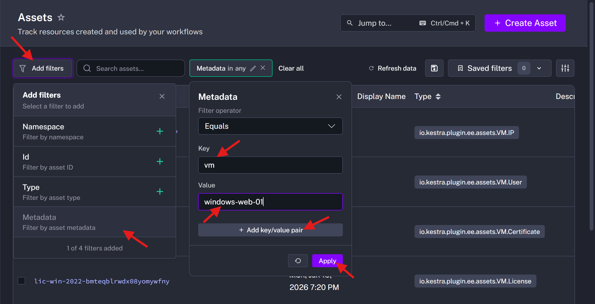
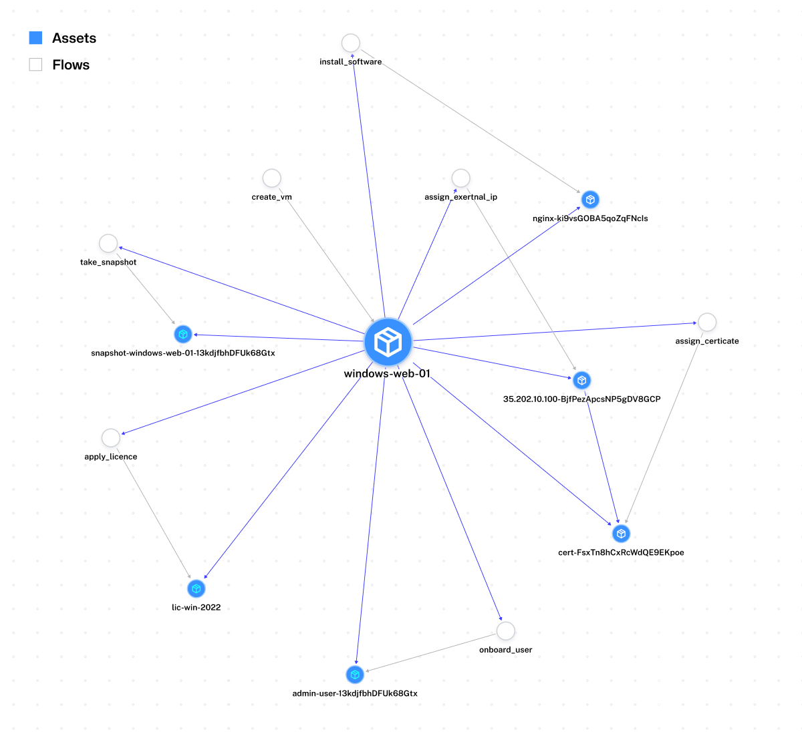

We are moving beyond simple "fire-and-forget" task execution. By leveraging **Kestra Assets**, we treat our infrastructure as a stateful inventory of resources, complete with lineage and metadata tracking. Instead of disparate scripts, we define a **chain of workflows** that build a dependency graph linking Day 1 provisioning (resource creation) to Day 2 operations (snapshots, patching, etc.). This approach yields a live catalog of all infrastructure components and their relationships, enabling full traceability and auditability.

In this guide, we outline a standard operating procedure for provisioning and maintaining Windows VMs on GCP using Kestra Assets. Each step in the lifecycle is implemented as a workflow that **registers assets** (like VMs, IPs, users, licenses) into Kestra's Asset Inventory. The result is an always-updated catalog of resources with lineage information, so you can answer questions such as *"Which VM has which IP and certificate?"* or *"When was this user added to the VM and by which process?"*.

## Architecture: Asset Lineage Overview

Kestra's Asset Inventory allows you to model relationships between infrastructure components. In our implementation, a Windows VM is a **root asset** that produces several child assets representing its associated resources. The high-level asset lineage looks like this:


**Asset: Windows VM** – The primary VM resource (e.g. **`windows-web-01`**). All other assets are linked to this VM as dependencies.
    - **Asset: Static IP** – A reserved external IP attached to the VM.
    - **Asset: Admin User** – An administrative user account created on the VM.
    - **Asset: Nginx Package** – An installed software component (ingress web server) on the VM.
    - **Asset: Windows License** – A license applied to the VM (e.g. Windows Server 2022 license).
    - **Asset: SSL Certificate** – A TLS certificate for the VM's external IP (for HTTPS). Notably, this is linked to both the VM and the Static IP, reflecting that the certificate is tied to that specific IP address.
    - **Asset: Snapshot Backup** – A VM snapshot for backup/recovery, created during Day 2 operations.

Each arrow in the asset dependency graph denotes an "outputs" relationship: the VM outputs (or is associated with) each of these child assets. Kestra automatically builds and maintains this dependency graph, providing a live view of how assets are interlinked. This means if the VM is deleted or changed, you can instantly identify which dependent assets (IP, cert, snapshots, etc.) might be orphaned or affected.

## Phase 1: Day 1 Provisioning (Creation)

*Objective:* Establish the base infrastructure and register the foundational (root) assets.

### 1. Base VM Provisioning

The first workflow, **`create_vm`**, initializes the VM and registers it as an asset. This flow provisions a new GCP Windows VM and outputs an asset of type **`io.kestra.plugin.ee.assets.VM`**. The asset captures metadata like OS version, region, status, and name. By declaring the VM as an output asset, we effectively mark the VM's creation in the Kestra catalog.

```yaml
id: create_vm
namespace: company.team

labels:
  - key: feature
    value: assets

inputs:
  - id: vm_name
    type: STRING
    defaults: "windows-web-01"

tasks:
  - id: gcp_create_instance
    type: io.kestra.plugin.core.log.Log
    message: "Provisionioning VM {{ inputs.vm_name }}"
    assets:
      outputs:
        - id: "{{ inputs.vm_name | slugify }}"
          type: io.kestra.plugin.ee.assets.VM
          metadata:
            os: "windows-server-2022"
            region: "us-central1"
            status: "running"
            name: "{{ inputs.vm_name }}"
            vm: "{{ inputs.vm_name}}"

```

In this YAML snippet, the **`gcp_create_instance`** task would normally call GCP to create the VM (here we just log a message for illustration). The important part is the **`assets.outputs`** section: it registers a new VM asset with an ID derived from the VM name (slugified to a safe format). We include relevant metadata about the VM (OS, region, status), which will be stored in Kestra's asset catalog. This **root asset** will serve as the anchor for all other related assets in our inventory.

### 2. Networking (Assign Static IP)

After the VM exists, we assign it a static external IP address. The **`assign_external_ip`** workflow consumes the VM asset as an input dependency and produces an **`io.kestra.plugin.ee.assets.VM.IP`** asset as output. This ensures the IP is tracked and linked to the VM in the asset graph.

```yaml
id: assign_external_ip
namespace: company.team
labels: 
  - key: feature
    value: assets
inputs:
  - id: target_vm
    type: STRING
    defaults: "windows-web-01" 
  - id: target_ip
    type: STRING
    defaults: "35.202.10.100" 

tasks:
  - id: reserve_ip
    type: io.kestra.plugin.core.log.Log
    message: "{{ inputs.target_vm }}-ip: {{inputs.target_ip}}"
    assets:
      inputs:
        - id: "{{ inputs.target_vm | slugify }}" # Dependency: Needs VM to exist
      outputs:
        - id: "{{ inputs.target_ip ~ '-' ~ execution.id }}" # Simulated Static IP
          type: io.kestra.plugin.ee.assets.VM.IP
          metadata:
            type: "static"
            attached_to: "{{ inputs.target_vm }}"
            vm: "{{ inputs.target_vm }}"

```

In this flow, the **`reserve_ip`** task would allocate the static IP (again simulated by a log). The **`assets.inputs`** declares a dependency on the VM asset (by its ID, e.g. **`windows-web-01`** from the previous step). The **`assets.outputs`** then registers a new IP asset, using a combination of the IP address and execution ID as a unique asset ID. We record the IP type ("static") and which VM it's attached to. Now our Kestra inventory knows that **`windows-web-01`** has an IP resource linked to it.

## Phase 2: Configuration & Compliance

*Objective:* Apply software, configuration, and governance controls to the base infrastructure, and track these as assets.

After provisioning the raw VM and network, we perform various Day 1 configuration steps (often considered part of "Day 2" in ops, but here they are immediate setup tasks). Each configuration workflow takes the base VM asset as an input and creates a new asset representing the outcome (license, user, software) in the inventory. By registering users and licenses as assets, for example, we can later query Kestra to answer questions like "Which VMs have an Admin user configured?" or "Which license does this VM use and when does it expire?"

The main configuration flows and the assets they create are summarized below:

| **Flow Name** | **Asset Created (Output)** | **Asset Type** | **Description** |
| --- | --- | --- | --- |
| **Apply License** | **`lic-win-2022-<execution-id>`** | **`io.kestra.plugin.ee.assets.VM.License`** | Tracks the OS license applied to the VM (e.g., Windows license with expiry). |
| **Onboard User** | **`admin-user-<execution-id>`** | **`io.kestra.plugin.ee.assets.VM.User`** | Tracks an admin user account created on the VM (with role and compliance info). |
| **Install Software** | **`nginx-<execution-id>`** | **`io.kestra.plugin.ee.assets.VM.Ingress`** | Tracks an installed software component (e.g., Nginx for web ingress) on the VM. |

Let's walk through each of these configuration workflows and their asset definitions:

### 1. Apply License to VM

The **`apply_license`** flow activates a Windows license on the VM and registers a License asset. This asset lets us catalog which license (and related metadata) is associated with the VM.

```yaml

id: apply_license
namespace: company.team

labels: 
  - key: feature
    value: assets
    
inputs:
  - id: target_vm
    type: STRING
    defaults: "windows-web-01"

tasks:
  - id: activate_license
    type: io.kestra.plugin.scripts.powershell.Script
    script: "Write-Output 'Activating Windows Enterprise License...'"
    assets:
      inputs:
        - id: "{{ inputs.target_vm | slugify }}"
      outputs:
        - id: "{{ ('LIC-WIN-2022-' ~ execution.id) | slugify }}"
          type: io.kestra.plugin.ee.assets.VM.License
          metadata:
            expiry: "2025-12-31"
            cost_center: "IT-Ops"
            vm: "{{ inputs.target_vm }}"

```

Here we simulate a PowerShell script that activates the license. We declare the VM as an input asset (dependency) and then output a new License asset. The asset ID is a combination of a license code and the execution ID (ensuring uniqueness). We store metadata like the license expiry date, cost center, and the VM it belongs to. Later, this allows auditing of license usage (e.g., finding all licenses expiring by end of 2025, or all licenses applied to a given VM).

### 2. Onboard Admin User

Next, the **`onboard_user`** flow creates an administrator user on the VM and registers a User asset. This captures who has access at the VM level and any compliance checks.

```yaml
id: onboard_user
namespace: company.team
labels: 
  - key: feature
    value: assets
inputs:
  - id: target_vm
    type: STRING
    defaults: "windows-web-01"
  - id: username
    type: STRING
    defaults: "admin_user"

tasks:
  - id: create_windows_user
    type: io.kestra.plugin.scripts.powershell.Script
    script: |
      # PowerShell logic to add user
      Write-Output "User {{ inputs.username }} added to {{ inputs.target_vm }}"
    assets:
      inputs:
        - id: "{{ inputs.target_vm | slugify }}"
      outputs:
        - id: "{{ (inputs.username ~ '-' ~ execution.id) | slugify }}"
          type: io.kestra.plugin.ee.assets.VM.User
          metadata:
            role: "admin"
            compliance_check: "passed"
            vm: "{{ inputs.target_vm }}"

```

This flow would run a PowerShell script on the VM to create a new user account (in practice). The assets section again links to the VM asset as input, and outputs a new User asset. The asset ID includes the username and execution ID. We record metadata such as the user's role (**`admin`**) and a compliance check status, along with the VM reference. With this in the catalog, we can later query all admin users across VMs or ensure compliance policies (like whether an admin user exists and has passed certain checks).

### 3. Install Software (Nginx)

Finally, the **`install_software`** flow installs an ingress software (e.g., Nginx) on the VM and creates an Ingress asset. This tracks software installed on the VM, which is useful for inventory and potential reuse.

```yaml
id: install_software
namespace: company.team
labels: 
  - key: feature
    value: assets
inputs:
  - id: target_vm
    type: STRING
    defaults: "windows-web-01"

tasks:
  - id: choco_install_nginx
    type: io.kestra.plugin.core.log.Log
    message: "choco install nginx -y"
    assets:
      inputs:
        - id: "{{ inputs.target_vm | slugify }}"
      outputs:
        - id: "{{ 'nginx-' ~ execution.id }}"
          type: io.kestra.plugin.ee.assets.VM.Ingress
          metadata:
            version: "1.24.0"
            installed_on: "{{ inputs.target_vm }}"
            vm: "{{ inputs.target_vm }}"
            type: nginx
```

This example uses a log task to represent a Chocolatey installation of Nginx on Windows. We mark the VM as an input asset (meaning the VM must exist), and then output an Ingress asset (a custom asset type representing something like a networking or web service component on the VM). Metadata includes the version installed, the VM it was installed on, and a type identifier (**`nginx`**). With this, anyone can query the asset inventory to see which VMs have Nginx (or any ingress software) installed, and what versions.

By the end of Phase 2, our VM has a license, an admin user, and Nginx installed, all of which are documented as assets linked to that VM in Kestra.

## Phase 3: Day 2 Operations (Maintenance)

*Objective:* Handle ongoing maintenance tasks like security updates and backups, while recording their effects in the asset inventory.

Now that the VM is running and configured, we consider routine Day 2 operations. These include things like provisioning SSL certificates for security and taking regular snapshots for disaster recovery. Each operation is implemented as a workflow that attaches new assets (Certificate or Snapshot) to the VM.

### 1. Assign SSL Certificate

In this workflow (**`assign_certificate`**), we provision an SSL/TLS certificate (for HTTPS) and associate it with the VM's external IP. This creates an asset of type **`io.kestra.plugin.ee.assets.VM.Certificate`**. Notably, this flow demonstrates how an asset can have multiple dependencies: the certificate is tied to both the VM and the Static IP assets.

```yaml
id: assign_certificate
namespace: company.team
labels: 
  - key: feature
    value: assets
inputs:
  - id: target_vm
    type: STRING
    defaults: "windows-web-01"

  - id: target_ip
    type: STRING
    defaults: "35.202.10.100" # References the IP Asset ID

  - id: ip_asset_id
    type: SELECT
    autoSelectFirst: true
    expression: "{{ [((assets(type='io.kestra.plugin.ee.assets.VM.IP') | jq('.[]  | select(.metadata.attached_to == \"' ~ inputs.target_vm ~ '\")')) | first).id] }}"
    dependsOn:
      inputs:
        - target_vm

tasks:
  - id: certbot_provision
    type: io.kestra.plugin.scripts.shell.Script
    script: "echo 'Provisioning Lets Encrypt Cert for {{ inputs.target_ip }}'"
    assets:
      inputs:
        - id: "{{ inputs.target_vm | slugify }}"
        - id: "{{ inputs.ip_asset_id }}"
      outputs:
        - id: "{{ 'cert-' ~ execution.id }}"
          type: io.kestra.plugin.ee.assets.VM.Certificate
          metadata:
            issuer: "LetsEncrypt"
            valid_until: "2024-05-01"
            vm: "{{ inputs.target_vm }}"

```

This flow uses a bit of Kestra magic: before provisioning the cert, it dynamically looks up the asset ID of the VM's IP (using the **`assets()`** function with a filter) and stores it in **`ip_asset_id`**. The **`certbot_provision`** task (simulated by an **`echo`** here) then lists two input assets: the VM and the IP (by their IDs). This means the certificate generation depends on both the VM existing and the IP being allocated to it. The output is a new Certificate asset with an auto-generated ID (**`cert-<execution-id>`**). In the metadata, we note the issuer (Let's Encrypt), an expiry date for the cert, and tie it back to the VM name. Because we also listed the IP as an input asset, Kestra will link the Certificate asset to *both* the VM and the IP in the lineage graph. This way, if the VM is replaced but the IP remains, the certificate can be traced via the IP asset as well.

### 2. Take VM Snapshot

Finally, the **`take_snapshot`** workflow creates a disk snapshot of the VM for backup purposes, registering an asset of type **`io.kestra.plugin.ee.assets.VM.Snapshot`**. Each execution of this flow produces a new Snapshot asset, building a history of backups for the VM.

```yaml
id: take_snapshot
namespace: company.team
labels: 
  - key: feature
    value: assets
inputs:
  - id: target_vm
    type: STRING
    defaults: "windows-web-01"

tasks:
  - id: gcp_snapshot
    type: io.kestra.plugin.core.log.Log
    message: "backup-{{ inputs.target_vm }}-{{ execution.startDate }}"
    assets:
      inputs:
        - id: "{{ inputs.target_vm | slugify }}"
      outputs:
        - id: "{{ ('snapshot-' ~ inputs.target_vm ~ '-' ~  execution.id) | slugify  }}"
          type: io.kestra.plugin.ee.assets.VM.Snapshot
          metadata:
            retention: "30days"
            trigger: "manual-backup"
            vm: "{{ inputs.target_vm }}"

```

The **`gcp_snapshot`** task would call the GCP API to snapshot the VM's disk (here just logging a name). We mark the VM as an input asset (so that the snapshot asset will be linked to it), and define an output asset for the new snapshot. The asset ID includes "snapshot-", the VM name, and the execution ID to ensure uniqueness (e.g., **`snapshot-windows-web-01-<id>`**). Metadata captures things like retention policy (30 days) and the trigger (manual backup vs. automated schedule), along with the VM reference. Over time, if this flow runs regularly, you'll accumulate multiple snapshot assets associated with the same VM asset, which provides a visual timeline of backups in the Kestra UI.

## Result: Live Asset Inventory

By running all the above workflows in order, Kestra's Asset Inventory is automatically populated with a rich set of assets and their linkages. We effectively have a live configuration management database (CMDB) or catalog of our VM and everything related to it. Below is an example of what the inventory might contain for our example (simplified for clarity):

| **Asset ID** | **Asset Type** | **Linked To (Dependency)** | **Key Metadata** |
| --- | --- | --- | --- |
| **`windows-web-01`** | **`io.kestra.plugin.ee.assets.VM`** | *(root asset)* | **`os: windows-server-2022`**, **`region: us-central1`**, **`status: running`** |
| **`35.202.10.100-...`**(e.g. **`35.202.10.100-abc123`**) | **`io.kestra.plugin.ee.assets.VM.IP`** | **`windows-web-01`** (VM) | **`type: static`**, **`attached_to: windows-web-01`** |
| **`lic-win-2022-...`** | **`io.kestra.plugin.ee.assets.VM.License`** | **`windows-web-01`** (VM) | **`expiry: 2025-12-31`**, **`cost_center: IT-Ops`** |
| **`admin-user-...`** | **`io.kestra.plugin.ee.assets.VM.User`** | **`windows-web-01`** (VM) | **`role: admin`**, **`compliance_check: passed`** |
| **`nginx-...`** | **`io.kestra.plugin.ee.assets.VM.Ingress`** | **`windows-web-01`** (VM) | **`version: 1.24.0`**, **`type: nginx`** |
| **`cert-...`** | **`io.kestra.plugin.ee.assets.VM.Certificate`** | **`windows-web-01`** (VM) **and** **`35.202.10.100-...`** (IP) | **`issuer: LetsEncrypt`**, **`valid_until: 2024-05-01`** |
| **`snapshot-windows-web-01-...`** | **`io.kestra.plugin.ee.assets.VM.Snapshot`** | **`windows-web-01`** (VM) | **`retention: 30days`**, **`trigger: manual-backup`** |

*(Note: Asset IDs with "..." include unique execution IDs in practice. The table shows simplified IDs for readability.)*

In the above inventory, **`windows-web-01`** is the main VM asset with no parent (root of this chain). All other assets link back to it:

- The static IP, license, user, software, and snapshots each have the VM listed as their dependency.
- The SSL certificate asset has two dependencies: the VM and the IP (since it was created with both as inputs).

This live inventory is queryable via Kestra's API or UI. For instance, you can filter assets by type or metadata to find all VMs in a certain region or all certificates expiring by a certain date. 

)

You can also drill down into the VM asset to see all its related assets (Kestra's UI would show a dependency graph or list of linked assets for **`windows-web-01`**). In our example, viewing the VM asset would reveal the IP, user, license, nginx, certificate, and snapshots in its **Dependencies** section. This gives you a complete picture of the infrastructure component and everything associated with it, at a glance.



## Key Benefits

Using Kestra Assets to build an infrastructure catalog with lineage provides several key benefits:

1. **Traceability and Impact Analysis:** You gain a complete lineage graph of your infrastructure. If the VM is deleted or changed, the asset graph immediately shows which resources (IP, certificate, snapshots, etc.) are affected or orphaned, so you know what to clean up or update. This is similar to how Kestra tracks data asset dependencies for impact analysis, but applied to infrastructure components.
2. **Audit Readiness:** Every asset has an audit trail. You can see exactly when and how a resource was created or modified, and by which workflow execution. For example, you can prove when the **`admin_user`** was added to the VM and by which automation run. This built-in audit log of changes helps with compliance and troubleshooting.
3. **Dynamic State Awareness:** Workflows can dynamically query the asset inventory at runtime. This means you can create maintenance or patching workflows that target resources based on their current state in the catalog. For instance, a patching flow could find all VM assets with **`os: windows-server-2022`** in metadata and then apply updates to each. The assets feature allows Kestra to act not just as an orchestrator but also as a real-time CMDB, enabling smarter automation decisions.

## Conclusion

By leveraging Kestra's Assets feature, we turned what would be isolated provisioning scripts into an integrated, stateful picture of our infrastructure. Each workflow not only performs an action (creating a VM, assigning an IP, installing software, etc.) but also records an asset with metadata and links to other assets. The end result is a living catalog of resources and their relationships that teams can explore and rely on for governance, auditing, and automation. This approach unifies orchestration with infrastructure tracking, ensuring that at any point, you can ask "*What is the full story of this VM?*" and get an answer backed by Kestra's live inventory.

→ [Schedule a Demo](https://kestra.io/demo) <br>
→ [Explore Enterprise Edition](https://kestra.io/enterprise)<br>
→ [Read the Documentation](https://kestra.io/docs/enterprise/governance/assets)<br>