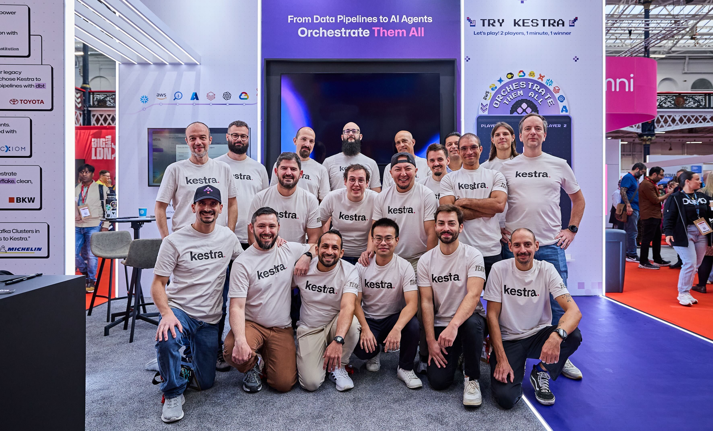

Nowadays it's easy to find the last news over LinkedIn and to keep updated through the last discussions on Reddit. But there's a place where the distribution of subject and people feels more realistic: a physical event.

Here I'm speaking about a big one: [Big Data London](https://bigdataldn.com). With over 180 exhibitors, it's one of the most important data community places to share best practices and meet data practitioners in person.

The following are my two cents on what the industry is heading for, what I learned attending such a big event and how Kestra fits into this landscape of colourful logos.

## Data People Finally Talking to Each Other

"What's ETL?"
I was not expecting this question in such an event. The thing is, I got this question asked many times.

That's the current reality: data practitioners are split across the different layers of the stack. A business analyst only works with a BI tool, sometimes a notebook and likely with Excel spreadsheets. Not with Spark, S3 buckets, or a Fivetran sync.

Still, such profiles want to schedule workflows and manage dependencies between them. That is why the orchestration layer matters to everyone, even people who don’t see themselves as “technical.”

It showed me one thing: the more the data world grows, the more fragmented it becomes. And the need for orchestration across these fragments is bigger than ever.

## Artificial Intelligence Was a Second-Order Thing

AI was everywhere. But not in the way I expected.

Most vendors were AI on the surface. Copywriting in the booth. Co-pilot demos. Fancy wording. But when we went down to the direct paper, nothing was really AI in a practical sense.

The data industry is still busy with ELT, pipelines, moving data from A to B. People are still doing crazy stuff with spreadsheets and scripts. Agentic AI adoption is not there yet.

What we saw was AI as a feature—assistants, copilots—helping with interfaces, not yet reshaping the workflows behind the scenes. This is where Kestra stands differently: we introduced the AI agent to embed AI into the orchestration logic itself, making it easier to schedule and run the workflows that people are already struggling with.

## Open Source Is the Way

What struck me most was the distribution of software types. A big chunk of closed-source vendors. And only a few open-source teams.

But the best discussions I had were with open-source people: these teams felt more vivid. They had sales, engineers, and product people all together. It was natural. Compare that with vendors where only sales were present, pushing me to sign something.

With the [dltHub team](https://dlthub.com/), we discussed how much we can deepen the current integration. I was able to tell the developer advocate that we just merged a specific dlt plugin.

With the [DuckDB team](https://duckdb.org/), we talked about the DuckLake integration and how some Kestra users are running deep Kubernetes integrations with DuckDB to build in-house data warehouses.

That’s the kind of exchange you can only have in a community-driven ecosystem.

And it matters. The [recent acquisitions in the ETL field](https://www.fivetran.com/press/fivetran-acquires-tobiko-data-to-power-the-next-generation-of-advanced-ai-ready-data-transformation) raise the stakes for open source. The Extract, the Transform, and the Load should all have open source integration. And the whole thing should be orchestrable the same way. That’s a key part of the next decade in data.

## Conversations on the Floor: ETL, Python, and GPT Everywhere

The most valuable part of Big Data London was meeting people face-to-face.

From big companies, the conversations always circled back to the same themes: ETL, ingestion, transformation. Everyone is using GPT somewhere. Everyone is writing a bit of Python.

And that confirmed something for me. Business logic is naturally complex—whether it’s written in SQL for queries, Spark for large-scale processing, or scripts for custom rules. It’s normal for teams to use a mix of these tools to handle the complexity of their business requirements.

But orchestration logic is not business logic. Orchestration should be simple. Declarative. That’s why YAML is a perfect interface for it.

This difference is fundamental:

- Business logic belongs in Python, Spark, SQL, or whatever language your team needs.
- Orchestration logic—dependencies, retries, scheduling, monitoring—belongs in a dedicated platform with a DSL like YAML.

Trying to solve orchestration with programming language framework is like building your own car. It works for a while, until it doesn’t. Then you realize you need a platform.

What I heard in London confirmed this. Everyone is reinventing something locally. Everyone struggles with dependencies and monitoring. Everyone mixes business rules with orchestration rules. That makes workflows fragile and teams slower.

## Closing: A Central Platform for a Fragmented World

Big Data London 2025 confirmed a lot of things for me.

Data practitioners are still split. Analysts, engineers, architects, platform teams—they all speak different languages. AI is visible, but still surface-level. The basics of ELT and orchestration are not solved in most companies. Open source creates the most meaningful conversations and integrations.

And across all this, the industry needs a central platform. One place where workflows can be defined declaratively. One place where orchestration logic is separated from business logic. One place where editing, executing, and monitoring workflows is simple.

This is what we build at Kestra. The data world is fragmented. AI is coming but not yet practical. Open source is alive and kicking. And the next big step is orchestration made simple, open, and central.

:::alert{type="info"}
If you have any questions, reach out via [Slack](/slack) or open [a GitHub issue](https://github.com/kestra-io/kestra).

If you like the project, give us [a GitHub star](https://github.com/kestra-io/kestra) and join [the community](/slack).
:::

