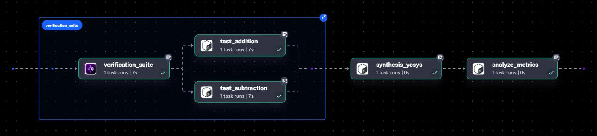

Designing custom silicon is a major engineering challenge. A single RTL bug that reaches manufacturing can cost millions and delay roadmaps by months.

Hardware teams use Electronic Design Automation (EDA) workflows to prevent this. Unlike typical CI/CD pipelines, these involve tens of thousands of simulations, expensive tool licenses (Synopsys, Cadence, Siemens), and compute-intensive synthesis for Power, Performance, and Area (PPA) estimates.

Standard CI tools struggle with demands for massive parallelism, complex artifact management, and long-running stateful processes.

This post covers how Kestra modernizes silicon design by orchestrating a verification and synthesis pipeline for a CPU ALU using **Verilator** and **Yosys**: parallel RTL verification, gate-level synthesis, and an automated PPA quality gate that fails the pipeline when a design exceeds its area budget.

## The scenario: the nightly regression

Take a hardware team designing a new RISC-V processor core. Every night, they need to ensure that the day's changes didn't break existing functionality or blow up the chip's area budget.

We need a pipeline that performs three critical steps:

1. Run parallel simulations to verify different opcodes (Addition, Subtraction) simultaneously.
2. Synthesize the Verilog code into gates to calculate the total silicon area.
3. Automatically fail the pipeline if the design is too large, preventing inefficient code from merging.

Here is how we built this implementation using Kestra.

## The pipeline architecture

We designed a Kestra flow that orchestrates Docker containers handling the heavy lifting. We use Kestra's [Namespace Files](/docs/concepts/namespace-files) to manage our Verilog source code (`rtl/`) and simulation scripts (`scripts/`) directly within the platform, so the infrastructure is version-controlled alongside the orchestration logic.



### Step 1: Parallel RTL verification with Verilator

In hardware, you don't run one test; you run thousands. Kestra's [`Parallel` task](/plugins/core/flow/io.kestra.plugin.core.flow.parallel) is built for this. It fans out verification jobs across multiple workers.

In our example, we spin up two separate containers running **Verilator** (a high-speed C++ simulator). One verifies addition logic, the other subtraction. In a production environment, this block would scale to hundreds of parallel tests across a Kubernetes cluster.

```yaml
- id: verification_suite
  type: io.kestra.plugin.core.flow.Parallel
  concurrent: 2
  tasks:
    - id: test_addition
      type: io.kestra.plugin.scripts.shell.Script
      containerImage: verilator/verilator:latest
      # ... commands to compile and run Verilator for ADD opcodes ...

    - id: test_subtraction
      type: io.kestra.plugin.scripts.shell.Script
      containerImage: verilator/verilator:latest
      # ... commands to compile and run Verilator for SUB opcodes ...
```

### Step 2: Synthesis and gate count extraction with Yosys

Once verification passes, we need to know the cost of our design. A task running **Yosys** synthesizes the Verilog, converting human-readable code into a netlist of logic gates (AND, OR, XOR).

We instruct Yosys to log the total gate count, then extract that number into a plain text file (`gate_count.txt`) which Kestra manages as an internal [output artifact](/docs/workflow-components/outputs).

```yaml
- id: synthesis_yosys
  type: io.kestra.plugin.scripts.shell.Script
  containerImage: hdlc/yosys:latest
  outputFiles:
    - gate_count.txt
  script: |
    ./scripts/synth_yosys.sh
    grep "Number of cells:" synth.log | awk '{print $NF}' > gate_count.txt
```

### Step 3: The automated PPA quality gate

This is where orchestration proves its value. The final task downloads the artifact from the synthesis step and compares it against a predefined budget.

In our first run, we set a strict budget of 500 gates. Our 32-bit ALU design synthesized to 903 gates, and Kestra failed the execution.

```
2026-01-14 23:57:16.782  Total Gate Count: 903
2026-01-14 23:57:16.782  ❌ Optimization Failed: Area (903) exceeds budget (500).
```

This automatic gatekeeping is vital. It stops unoptimized hardware from progressing further down the chain to even more expensive steps like Place and Route.

### Step 4: The engineering loop, optimizing the design

Faced with a failed pipeline, the hardware engineer can now act on the data.

To fix the budget issue, we optimized the architecture by reducing the ALU data path from 32-bit down to 8-bit. We modified the Verilog parameter in Kestra's Namespace Files:

```verilog
// rtl/alu.v
// Before: module alu #(parameter WIDTH = 32) (
module alu #(parameter WIDTH = 8) (
```

We re-ran the exact same Kestra flow. Verification passed (our testbench was updated to handle 8-bit overflow), synthesis ran on the new 8-bit code, and the new gate count came in at 230. The pipeline turned green.

```
2026-01-15 00:15:22.105  Total Gate Count: 230
2026-01-15 00:15:22.105  ✅ PPA Check Passed. Design is within budget.
```

## Why Kestra for hardware engineering?

This example shows how Kestra addresses a few problems specific to EDA:

- Simulation and regression tests scale horizontally with **native parallelism**, which brings runtime down from days to hours.
- Lightweight linting runs on standard cloud VMs while heavy synthesis jobs go to specialized, high-memory on-prem clusters using [Worker Groups](/docs/enterprise/scalability/worker-group).
- Waveforms, netlists, and PPA metrics move between tools in the chain as managed **artifacts**, with no fragile external storage scripts.
- [Retry mechanisms](/docs/workflow-components/retries) can queue tasks until floating EDA licenses (like Synopsys or Cadence) become available, so resource contention doesn't fail the pipeline outright.

Treating hardware workflows as code brings the velocity of modern software development to the rigorous world of silicon design.

## Full pipeline code

### Flow definition

```yaml
id: cpu_pipeline
namespace: company.team
description: "EDA Flow: Verilator Simulation and Yosys Synthesis"

tasks:
  # ---------------------------------------------------------
  # STAGE 1: Parallel Verification
  # ---------------------------------------------------------
  - id: verification_suite
    type: io.kestra.plugin.core.flow.Parallel
    concurrent: 2 # Run both ADD and SUB at the same time
    tasks:
      # Job 1: Verify ADD Operation
      - id: test_addition
        type: io.kestra.plugin.scripts.shell.Script
        containerImage: verilator/verilator:latest
        namespaceFiles:
          enabled: true
        warningOnStdErr: false
        script: |
          sed -i 's/\r$//' ./scripts/run_verilator.sh
          chmod +x ./scripts/run_verilator.sh
          # Pass '0' to test ADD opcodes
          ./scripts/run_verilator.sh 0

      # Job 2: Verify SUB Operation
      - id: test_subtraction
        type: io.kestra.plugin.scripts.shell.Script
        containerImage: verilator/verilator:latest
        namespaceFiles:
          enabled: true
        warningOnStdErr: false
        script: |
          sed -i 's/\r$//' ./scripts/run_verilator.sh
          chmod +x ./scripts/run_verilator.sh
          # Pass '1' to test SUB opcodes
          ./scripts/run_verilator.sh 1

  # ---------------------------------------------------------
  # STAGE 2: Synthesis (Produces the Gate Count)
  # ---------------------------------------------------------
  - id: synthesis_yosys
    type: io.kestra.plugin.scripts.shell.Script
    containerImage: hdlc/yosys:latest
    namespaceFiles:
      enabled: true
    warningOnStdErr: false
    # We capture the gate count file as an output artifact
    outputFiles:
      - gate_count.txt
    script: |
      sed -i 's/\r$//' ./scripts/synth_yosys.sh
      chmod +x ./scripts/synth_yosys.sh
      ./scripts/synth_yosys.sh

      # Extract the number to a plain text file so Kestra can
      # pass it to the next task.
      grep "Number of cells:" synth.log | awk '{print $NF}' > gate_count.txt
      cat gate_count.txt

  # ---------------------------------------------------------
  # STAGE 3: Metric Analysis (Reads the Gate Count)
  # ---------------------------------------------------------
  - id: analyze_metrics
    type: io.kestra.plugin.scripts.shell.Script
    containerImage: ubuntu:latest
    # We input the file from the previous task
    inputFiles:
      gate_count.txt: "{{ outputs.synthesis_yosys.outputFiles['gate_count.txt'] }}"
    script: |
      GATE_COUNT=$(cat gate_count.txt)

      echo "Total Gate Count: $GATE_COUNT"

      if [ "$GATE_COUNT" -gt 500 ]; then
        echo "❌ Optimization Failed: Area ($GATE_COUNT) exceeds budget (500)."
        exit 1
      else
        echo "✅ PPA Check Passed."
      fi
```

### `rtl/alu.v`

```verilog
module alu #(parameter WIDTH = 8) (
    input clk,
    input rst,
    input [WIDTH-1:0] a_in,
    input [WIDTH-1:0] b_in,
    input [2:0] op_in,
    output reg [WIDTH-1:0] result_out,
    output reg zero_flag
);

    always @(posedge clk or posedge rst) begin
        if (rst) begin
            result_out <= 0;
            zero_flag <= 0;
        end else begin
            case (op_in)
                3'b000: result_out <= a_in + b_in; // ADD
                3'b001: result_out <= a_in - b_in; // SUB
                3'b010: result_out <= a_in & b_in; // AND
                3'b011: result_out <= a_in | b_in; // OR
                3'b100: result_out <= a_in ^ b_in; // XOR
                default: result_out <= 0;
            endcase
            zero_flag <= (result_out == 0);
        end
    end
endmodule
```

### `scripts/run_verilator.sh`

```bash
#!/bin/bash

set -e

# Arguments: $1 = Opcode to test (0=Add, 1=Sub, etc)
TEST_OP=$1

echo "--- Building Verilator Model ---"
verilator -Wall --cc --exe --build -j 4 \
  -I./rtl \
  sim/alu_tb.cpp rtl/alu.v \
  -o alu_sim

echo "--- Running Simulation Binary ---"
./obj_dir/alu_sim $TEST_OP
```

### `scripts/synth_yosys.sh`

```bash
#!/bin/bash
echo "--- Running Synthesis ---"

# Create a Yosys script on the fly
cat <<EOT > synthesis.ys
read_verilog rtl/alu.v
hierarchy -check -top alu
proc; opt; fsm; opt; memory; opt
techmap; opt
abc -g AND,OR,XOR
stat
EOT

yosys synthesis.ys | tee synth.log

# Extract the generic gate count
COUNT=$(grep "Number of cells:" synth.log | awk '{print $NF}')
echo "::metrics::gate_count::$COUNT"
```

### `sim/alu_tb.cpp`

```cpp
#include "Valu.h"
#include "verilated.h"
#include <cstdlib>
#include <iostream>

vluint64_t main_time = 0;

int main(int argc, char** argv) {
    Verilated::commandArgs(argc, argv);
    Valu* top = new Valu;

    // Parse test mode from args (0=ADD, 1=SUB)
    int test_op = 0;
    if (argc > 1) test_op = atoi(argv[1]);

    std::cout << "Starting Simulation for OpCode: " << test_op << std::endl;

    // Reset sequence
    top->clk = 0; top->rst = 1; top->eval();
    top->clk = 1; top->rst = 1; top->eval();
    top->clk = 0; top->rst = 0; top->eval();

    // Run 100 random vectors
    for (int i = 0; i < 100; i++) {
        top->clk = !top->clk;
        if (top->clk) {
            top->a_in = rand() & 0xFF;
            top->b_in = rand() & 0xFF;
            top->op_in = test_op;
        }
        top->eval();

        // Check results on positive edge
        if (top->clk) {
            int expected = 0;
            if (test_op == 0) expected = (top->a_in + top->b_in) & 0xFF;
            if (test_op == 1) expected = (top->a_in - top->b_in) & 0xFF;

            // Mask to the 8-bit data path before comparing
            if ((top->result_out != expected) && i > 2) {
                std::cout << "ERROR: mismatch! A=" << top->a_in
                          << " B=" << top->b_in
                          << " Got=" << top->result_out
                          << " Exp=" << expected << std::endl;
                return 1; // Return Fail Code
            }
        }
    }

    std::cout << "SUCCESS: 100 Vectors Passed." << std::endl;
    delete top;
    return 0;
}
```

## FAQ

### Can you use Kestra to orchestrate EDA workflows?

Yes. Kestra orchestrates Electronic Design Automation (EDA) pipelines by running tools like Verilator and Yosys inside Docker containers, fanning out simulations in parallel, passing artifacts such as netlists and gate counts between tasks, and enforcing automated quality gates on PPA metrics. Flows are defined in YAML and version-controlled alongside RTL source code.

### How do you run Verilator simulations in parallel?

Use Kestra's `Parallel` task to fan out multiple Verilator jobs simultaneously, each in its own container running a different test scenario or opcode. Each simulation runs as an independent shell script task, and the same pattern scales from a handful of tests locally to hundreds of parallel regressions on a Kubernetes cluster.

### Can Kestra replace Jenkins for hardware CI/CD?

Kestra handles hardware verification workloads that strain general-purpose CI tools: massive fan-out parallelism, long-running stateful synthesis jobs, artifact passing between heterogeneous tools, and routing heavy jobs to specialized on-prem machines via Worker Groups, while lightweight tasks run on cloud VMs. Standard CI tools were designed around short software build-test cycles rather than nightly regressions with thousands of simulations.

### How do you automate PPA checks in a chip design pipeline?

Run synthesis with Yosys, extract the gate count from the synthesis log into an output artifact, then have a downstream task compare it against a predefined area budget. If the design exceeds the budget, the task exits with an error and Kestra fails the execution automatically, blocking unoptimized RTL from reaching expensive downstream stages like Place and Route.

### Does Kestra work with commercial EDA tools like Synopsys or Cadence?

Yes. Kestra is tool-agnostic: any EDA tool with a command-line interface can run inside a Kestra task, whether open-source (Verilator, Yosys) or commercial (Synopsys, Cadence, Siemens). Retry and queuing mechanisms also help manage contention on floating licenses shared across a team.

---

Ready to bring modern orchestration to your hardware workflows? [Get started with Kestra](/docs/quickstart) or explore more [use cases](/use-cases), and if you find Kestra useful, give us a star on [GitHub](https://github.com/kestra-io/kestra).
