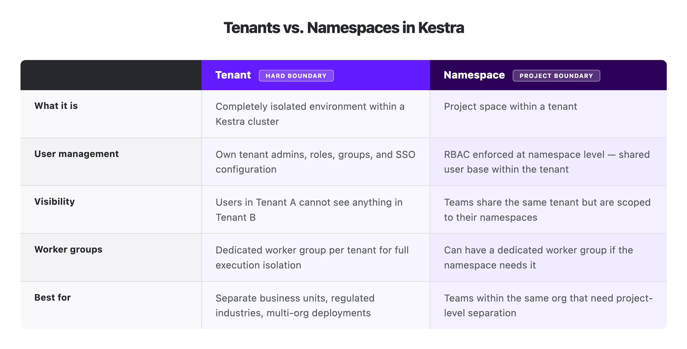

[Leroy Merlin](../2022-02-22-leroy-merlin-usage-kestra/index.md) runs 37 million workflow executions a month on Kestra. They started on Airflow. Flows ran 20x slower than expected, and one bad task could take down the entire cluster. Teams couldn't ship independently without risking the platform everyone else relied on.

What they built wasn't just a migration. It was a different architecture, one designed from the start to let teams operate independently at scale. Three layers, each solving a distinct problem: how do you scale execution, how do you isolate teams, and where does the work actually run?

AI workloads are adding GPU routing and data residency requirements that most orchestration tools weren't designed for. The architecture choices made at deployment time determine whether those requirements get met through configuration or through rebuilding.

I work with enterprise teams on Kestra architecture daily. The mental model I keep coming back to has three layers.

## Layer 1: scaling execution

Kestra is four components: a webserver, a scheduler, an executor, and workers.

The webserver is the front door, all UI traffic and API access flow through it. The scheduler is the trigger watchdog: it monitors everything that needs to be kicked off, whether that's a cron schedule, a webhook call, or a Kafka message arriving in a queue. The executor is the brain, it coordinates workflow execution across workers. Workers are where tasks actually run, the only components that touch external systems like databases, APIs, or cloud services.

All four components are active-active. You can run multiple instances of every component simultaneously. Two executors coordinate through the queue backend. Two workers each pick up different tasks. If any instance goes down, the others continue without interruption.

Most production clusters deploy on [Kubernetes](../../docs/02.installation/03.kubernetes/index.md), where each component is a pod. Kubernetes handles the failover and recovery mechanics; the component design gives you the scaling levers. Executors and workers are the ones you scale aggressively with load. Schedulers and webservers typically run at one or two replicas each. For very large deployments, the PostgreSQL backend can be upgraded to Kafka plus Elasticsearch, which handles higher sustained throughput without changing the component model.

## Layer 2: isolating teams

Horizontal scaling answers the performance question. It doesn't answer the organizational one: how do 200 engineers share a platform without stepping on each other?

Kestra handles this through two constructs: [namespaces](../../docs/07.enterprise/02.governance/07.namespace-management/index.md) and [tenants](../../docs/07.enterprise/02.governance/tenants/index.md).

**Namespaces** are project spaces within a cluster. Each one has its own workflows, scripts, secrets, and KV store for temporary values. [RBAC](../../docs/07.enterprise/03.auth/rbac/index.md) is enforced at the namespace level, so you can give one team full access to their namespace without exposing anything else. Namespaces are hierarchical, a root namespace like `company` can have children like `company.data` or `company.infra`, and child namespaces inherit configuration from their parents while being able to override it locally.

**Tenants** go further. A tenant is a completely isolated environment within the cluster: separate user management, separate roles, separate admin users. Someone logged into Tenant A has no visibility into Tenant B, even on shared infrastructure. Each tenant can have its own tenant admins who manage users, groups, and custom RBAC within that tenant independently.

The question that comes up in almost every enterprise deployment: when do you use tenants instead of namespaces?

It comes down to whether groups need separate user management. If different business units need their own user bases, their own admin control, and zero visibility into each other's work, tenants are the answer. If they're within the same organization and the requirement is project-level separation, different teams, different workflows, different access levels, namespaces are sufficient.

Think of it like a building: tenants are floors, namespaces are apartments on those floors. A floor has its own access system and its own admin, with no visibility into what's happening on other floors. An apartment divides space within a floor, each with its own locks and boundaries, but still under the same building management. Tenants create that floor-level separation. Namespaces organize the space within it.

Here's how tenants and namespaces relate to each other within a single Kestra cluster.

## Layer 3: controlling where work runs

For many teams, "on Kubernetes" is sufficient. For regulated industries, global deployments, and hybrid architectures, location is a real constraint. [Worker groups](../../docs/07.enterprise/04.scalability/worker-group/index.md) are how Kestra handles it.

A worker group is a named logical grouping of workers. You install Kestra workers wherever execution needs to happen, a different cloud region, a different cloud VPC, an on-premises cluster, assign them to a named group, and Kestra routes tasks to that group by name. Workers within the group can be scaled independently. If one worker goes down, another in the same group picks up the task. The workflow doesn't know or care which worker ran it.

In practice this unlocks three patterns: routing tasks to workers in specific cloud regions to satisfy data residency requirements, running workers on-premises while keeping the control plane in the cloud, and routing GPU-intensive ML tasks to workers on specialized hardware while standard tasks run on standard compute. For a detailed breakdown of how routing, failover, and replica counts work within worker groups, check out my other post on [the executor/worker split](../kestra-executor-worker-architecture/index.md).

Worker groups can be pinned to tenants or namespaces. A tenant can have a dedicated worker group so its workflows only run on its own workers. A namespace within a tenant can have its own group if it has different resource requirements. For regulated industries, the minimum viable pattern is one worker group per tenant: each tenant gets its own dedicated execution environment.

Kestra licenses worker groups, not individual workers. Scaling workers within an existing group to handle more throughput doesn't affect your licensing. Adding a new group does, because each group represents a distinct operational boundary.

## How the layers compose

The three layers answer independent questions, but they combine. A regulated industry deployment might look like this: a distributed Kubernetes cluster divided into two tenants for two business units, each tenant with its own dedicated worker group, workers in each group deployed in separate cloud regions to satisfy data residency requirements.

Leroy Merlin's 37 million monthly executions needed the infrastructure layer to hold. But raw scale wasn't what made the migration work. Namespace isolation is what let 200 engineers ship independently without any one team putting the platform at risk. The physical layer is what would let them extend to new regions or satisfy data residency requirements without rebuilding.

The layers are designed to be independent. A single-tenant, single-region deployment can still use dozens of namespaces. A multi-tenant, multi-region deployment can have a single namespace per tenant. When a compliance requirement adds a new region, you add a worker group. When a new business unit needs its own environment, you add a tenant. The work is configuration, not rebuilding.

Namespaces are there from the first workflow you write. [Get started in minutes](../../docs/02.installation/index.md) with the open source edition on Docker to see how they organize a project. Tenants and worker groups are what you add on top when a deployment needs hard isolation between business units or execution split across regions, if you're scoping that kind of deployment, [book a demo](/demo) and we can work through the design together.
