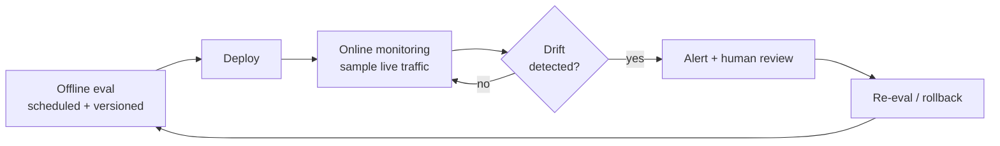

Your LLM application works on demo day. The answers are sharp, the stakeholders nod, and you ship it. Three weeks later a model provider updates a checkpoint, your retrieval corpus grows stale, and a prompt someone tweaked "just a little" degrades quality. Nobody notices, until a user does.

This is the defining failure mode of LLM applications in production: **quality drifts without a signal.** You cannot catch that with uptime monitoring. You catch it with evaluation and monitoring, run continuously.

If you're following the [DataTalks.Club LLM Zoomcamp](https://github.com/DataTalksClub/llm-zoomcamp), this maps to the evaluation and monitoring modules. And if you own an LLM product as a CTO or Head of AI, this is the part that decides whether it survives contact with real users. The thesis: most frameworks help you *build*; production demands a *continuous loop*, and Kestra orchestrates that loop, integrating the eval tools you already use rather than replacing them.

## Why LLM apps break between prototype and production

### The silent failure mode: quality drift

A traditional app throws a 500 and you know immediately. An LLM app returns fluent, confident answers that are simply worse, while every health check stays green. The causes are mundane: a model version change, a shifting knowledge base, a prompt edit, a new class of user question the prototype never saw. Without measurement, the first signal you get is churn.

### Where frameworks stop

Frameworks like LangChain and LlamaIndex are excellent for building: chaining calls, wiring retrieval, structuring prompts. That's the prototype phase. They are not designed to *operate* the result: scheduling a nightly regression suite, sampling live traffic for scoring, alerting when a metric crosses a threshold, or gating a deploy on eval results. That's the production phase, and it's an orchestration problem.

| Prototype concern | Production concern |
| --- | --- |
| Does it work on my examples? | Does it still work on every release? |
| One-off manual evaluation | Scheduled, versioned evaluation |
| Eyeballing outputs | Automated scoring + drift alerts |
| Local notebook | Audit trail, RBAC, governance |
| "Looks good" | Measured against a golden dataset |

## The LLM evaluation and monitoring loop

Production readiness is a loop, not a checkpoint you pass once:



<!-- SCREENSHOT: topology view of an evaluation flow in the Kestra UI, so the loop above is shown as a real, running workflow rather than just a concept diagram. -->

Each arrow in that loop is something to schedule, trigger, or alert on. That's orchestration, and it's what the rest of this article builds.

## Offline evaluation: scheduled and versioned

Offline evaluation runs your app against a fixed **golden dataset** (curated inputs with known-good expectations) and scores the outputs. The key to making it production-grade is that it's *scheduled* and *versioned*, not run by hand when someone remembers.

### Golden dataset + LLM-as-judge

A common, practical pattern is LLM-as-judge: a second model scores each output against the expected answer on dimensions like correctness, grounding, and relevance. In Kestra this is just orchestration around a `ChatCompletion` task. There's no magic "Eval" black box; you compose the scoring logic explicitly, which means you can see and version it.

```yaml
id: llm_offline_eval
namespace: company.ai

triggers:
  - id: nightly
    type: io.kestra.plugin.core.trigger.Schedule
    cron: "0 2 * * *"

tasks:
  - id: judge
    type: io.kestra.plugin.ai.completion.ChatCompletion
    provider:
      type: io.kestra.plugin.ai.provider.GoogleGemini
      modelName: gemini-2.0-flash
      apiKey: "{{ kv('GEMINI_API_KEY') }}"
    messages:
      - type: SYSTEM
        content: "You are an evaluation judge. Score the answer from 0 to 1 on correctness and grounding. Reply with JSON only."
      - type: USER
        content: "Question: {{ inputs.question }}\nExpected: {{ inputs.expected }}\nActual: {{ inputs.actual }}"
```

### Scheduling and CI/CD integration

Because the eval is a flow, you trigger it however production requires: nightly on a `Schedule`, or on every release as a gate in your CI/CD pipeline. A deploy that drops below a score threshold simply doesn't ship. That single move (turning evaluation into a deploy gate) is what separates teams that catch regressions before users from teams that find out after.

## Online evaluation and monitoring

Offline eval tells you about your golden set; online eval tells you about what users actually send.

### Trigger-based eval on real traffic

Using event or webhook triggers, you can score a sample of real production responses as they happen (or in scheduled batches) and track quality on the inputs your users actually send, including the ones your golden dataset never anticipated.

### Sampling, not scoring everything

You rarely need to score 100% of traffic. Sampling a representative slice keeps cost predictable while still surfacing drift. Orchestration is what makes sampling, batching, and scheduling trivial to express.

### Connecting the tools you already use

This is important, and it's where Kestra deliberately stays in its lane: **Kestra orchestrates your eval and observability tools (it doesn't replace them).** If your team runs MLflow, Langfuse, or LangSmith, Kestra schedules the runs, moves the data, applies the thresholds, and routes the alerts, while those tools keep doing the tracking and visualization they're good at. You don't rip anything out; you put a reliable orchestration layer around it.

<!-- SCREENSHOT: a Kestra no-code dashboard (1.1+) displaying eval metrics over time — score trend, pass rate, cost — to make the "live monitoring" claim concrete. -->

## Alerting on quality drift

Measurement without alerting is just a dashboard nobody checks. The point of the loop is that a drop in quality *reaches a human*.

```yaml
  - id: check_drift
    type: io.kestra.plugin.core.flow.If
    condition: "{{ outputs.judge.score < 0.8 }}"
    then:
      - id: alert
        type: io.kestra.plugin.notifications.slack.SlackIncomingWebhook
        url: "{{ secret('SLACK_EVAL_WEBHOOK') }}"
        payload: |
          {"text": "LLM eval score dropped to {{ outputs.judge.score }} — review required."}
```

For higher-stakes responses, pair the alert with a `Pause`: the workflow can hold a rollback or re-deploy until a human validates it, combining automated detection with human judgment.

## The exec view: governance, cost, and ROI

If you're a decision-maker rather than the person writing the YAML, here's the part that matters to you.

An unevaluated LLM feature is an unmanaged risk. Quality incidents erode trust, drive churn, and are expensive to diagnose after the fact because there's no record of what changed. A continuous eval-and-monitoring loop converts that risk into something measurable and governable: you get an **audit trail** of every evaluation, **RBAC** and tenant isolation so teams don't step on each other, and a clear cost line because sampling and scheduling are explicit rather than ad hoc. The return is concrete: catching a regression in a nightly run instead of in a customer escalation.

## Putting it together: the full LLMOps loop

Four orchestrated flows give you an end-to-end LLMOps platform on top of the tools you already run:

1. Offline eval, scheduled nightly and as a CI/CD deploy gate.
2. Online eval, trigger-based scoring of sampled production traffic.
3. Drift alerting, threshold checks that notify a human and can pause risky changes.
4. Dashboards, live metrics with history and audit built in.

<!-- BLUEPRINT_URL: full LLMOps loop — offline eval + online eval + drift alerting -->

## FAQ

**What's the best LLMOps platform?** It depends on whether you need a *tracking* tool (MLflow, Langfuse, LangSmith) or an *orchestration* layer to run evals and monitoring continuously. Kestra is the orchestration layer and integrates with the tracking tools.

**How do I monitor an LLM in production?** Sample live responses, score them on a schedule or on triggers, track the metrics over time, and alert when they cross a threshold.

**Offline vs. online evaluation: which do I need?** Both. Offline catches regressions against a fixed golden set before you ship; online catches drift on real, unanticipated traffic after you ship.

**Can I gate deployments on eval results?** Yes. Run the eval flow in CI/CD and fail the deploy if the score drops below your threshold.

## Conclusion

The gap between an LLM prototype and a production LLM app is a loop: offline eval before you ship, online monitoring after, drift alerts that reach a human, and an audit trail you can trust. Frameworks get you to the prototype; orchestrating that loop is what gets you to production.

This closes a three-part series: [orchestrate a RAG pipeline](https://kestra.io/blogs/orchestrate-rag-pipeline-kestra) to ground your app in data, [build production-ready AI agents](https://kestra.io/blogs/orchestrate-ai-agents-kestra) to make it act, and evaluate and monitor it to keep it trustworthy. RAG + agents + evaluation is the complete production LLM stack.
