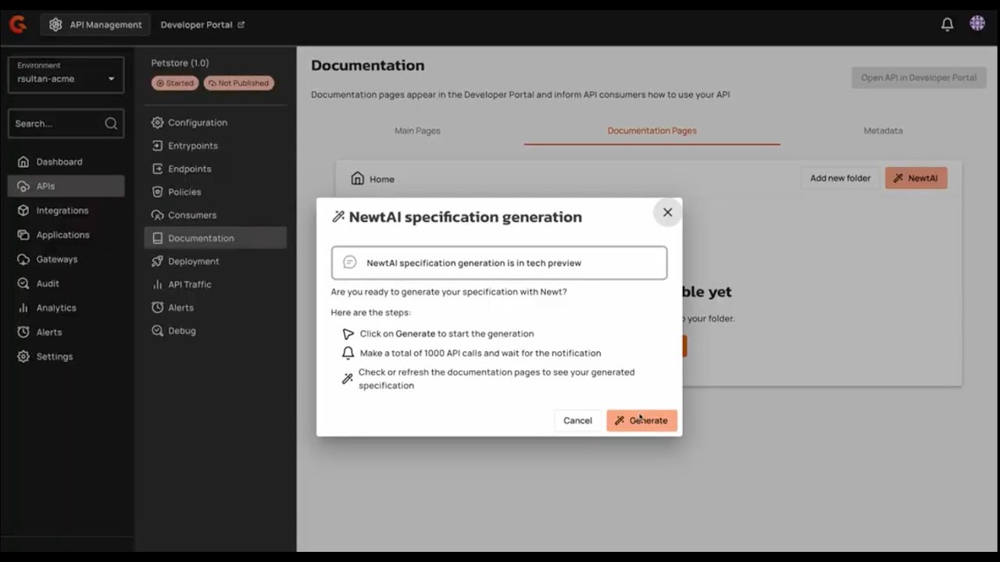

[Gravitee.io](https://www.gravitee.io/) started in 2015 with a simple idea: making APIs less complex. What began as a team of four developers has grown into a platform that powers API and event stream ecosystems for some of the world’s biggest companies. Recognized as a 2024 **Gartner Magic Quadrant™ Leader for API Management**, Gravitee helps enterprises like **Michelin, Roche,** and **Blue Yonder** take control of their APIs and event streams.

Their success has been driven by a focus on practical, reliable solutions and a clear understanding of what users need. Gravitee has become a trusted partner for teams looking for modern API management, delivering tools that simplify processes. The mission of Gravitee is straightforward: create effective solutions without overcomplicating things, because that's what makes a real difference for users.

By leveraging Kestra, they’ve managed to integrate orchestration and generative AI into their processes, offering a clever solution for a common yet challenging problem: documentation. Gravitee has introduced a way for its customers to generate API documentation, simplifying the process down to the clarity of a single button.

## Generating API Documentation

API documentation is a must-have. Without clear and accurate documentation, APIs become less accessible, limiting their adoption and usability. For Gravitee, the challenge was to automate the creation of documentation to keep pace with the rapid iteration of API creation of their customer. They needed a solution that could:

- **Adapt to complex workflows** without creating overhead.
- **Integrate easily with existing tools** like SQL and Python.
- **Enable dynamic documentation generation** using generative AI models.
- Scale alongside their growing API ecosystem.

## Why Gravitee.io Chose Kestra

Gravitee.io chose **Kestra** to power their documentation workflows. Kestra’s API-first architecture and extensive plugin ecosystem enabled integration with their existing stack, including **SQL databases, Docker containers, and Python scripts**. Generative AI capabilities added the final touch, allowing them to create developer-friendly documentation on demand.

> *“Kestra offered a modern stack and an amazing developer experience. It felt built for
> teams like ours.”* — Gravitee.io Engineering Team

## **How It Works: Automating API Documentation with Kestra**

Gravitee.io's workflow showcases the power of combining orchestration with generative AI. Here's how they use Kestra:

1. **Documentation at the Press of a Button**

    With Kestra handling the backend orchestration, customers only need to trigger a workflow with a single click. This initiates the generation of developer-friendly, up-to-date documentation for any newly created API.

2. **Triggering Workflows with SQL Polling**

Kestra begins by polling their SQL database to identify API updates or new specifications. This ensures that documentation stays in sync with the latest changes.

3. **Processing Data with Python and Docker**

Once triggered, Kestra orchestrates a series of Python scripts running in Docker containers. These scripts preprocess API specifications, cleaning and structuring the data to ensure compatibility with their AI models.

4. **Generating Documentation with Generative AI**

Using Kestra’s **http.Request** tasks, the API specifications are fed into a large language model (LLM). The LLM analyzes the specs and generates comprehensive, developer-friendly API documentation on demand.

5. **Error Handling and Notifications**

To maintain reliability, Kestra monitors the entire workflow. Any errors are immediately flagged, and Slack alerts are sent to the team.

## Fast and Reliable Documentation

With generative AI accelerating the process, documentation is produced faster than ever, reducing manual effort and saving developers time. Kestra’s modular design ensured the system could grow alongside their expanding API ecosystem, adding new workflows with ease. By automating repetitive tasks, developers are free to focus on building better APIs rather than managing documentation.

## Why It Matters for API Management

Gravitee.io’s experience reflects a broader shift in API management toward automation and intelligent tooling. Static documentation processes can’t match the speed of modern development cycles, making orchestration and AI essential for dynamic API ecosystems. Generative AI offers new capabilities, from transforming technical specs into clear documentation to enabling multilingual guides. Orchestration platforms like Kestra bridge the gap, ensuring these integrations are scalable and reliable.

## Lessons from Gravitee.io’s Approach

Their success offers insights for teams facing similar challenges. Automating repetitive tasks, such as documentation, allows developers to focus on more impactful work. Integrating modular tools, like those within Kestra’s plugin ecosystem, helps teams build complex workflows without custom development. Additionally, prioritizing user-friendly solutions made implementation efficient, as Gravitee achieved results with just two developers within six months.

## Final Thoughts

By blending orchestration with generative AI, Gravitee resolved a key developer pain point, empowering users to focus on building APIs rather than managing documentation. Their journey showcases how automation, thoughtful tooling, and developer-first design can transform API management for the future.

But it doesn’t stop there. Gravitee's experience with Kestra goes well beyond documentation. They’ve adopted Kestra to orchestrate the full lifecycle of their **SpecGen system**, which uses machine learning and generative AI to generate OpenAPI specs and augment them with clear, human-readable summaries. This includes champion/challenger model comparisons, real-world usage validation, and resilient automation strategies.

> "Kestra addressed all of these pain points effectively. It’s great to go with solutions that open-source their code—it builds confidence. Kestra is super easy to use, works with any code, and comes with tons of ready-made connectors.”
>

By choosing Kestra, Gravitee gained:

- A truly agnostic orchestration engine that doesn't lock users into specific tech stacks.
- Robust error-handling with replay capabilities for failure recovery.
- The flexibility to run long, data-heavy ML tasks like training, evaluation, and data transformation.
- Improved collaboration and reduced time spent on troubleshooting—unlocking a more scalable, resilient development pipeline.

If you're exploring orchestration solutions for AI, data workflows, or API tooling:

---

## 👉 Go Try Gravitee

Gravitee's integration of Kestra is live, real-world, and developer-friendly. Check out [Gravitee.io](https://www.gravitee.io/) to see how they're rethinking API management with automation and AI at the core.

:::alert{type="info"}
Have a similar challenge? Reach out via [Slack](/slack) or open [a GitHub issue](https://github.com/kestra-io/kestra).

If you like the project, give us [a GitHub star](https://github.com/kestra-io/kestra) and join [the community](/slack).
:::

